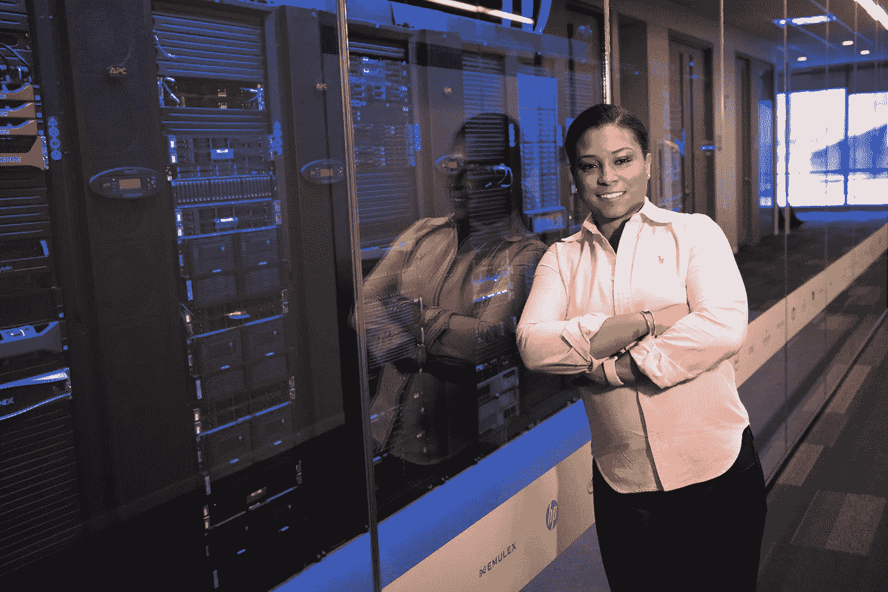

# 世界上最大的公司如何利用人工智能让系统变得智能

> 原文：<https://towardsdatascience.com/how-the-worlds-biggest-companies-use-artificial-intelligence-to-make-systems-smart-6ef6bec40751?source=collection_archive---------38----------------------->

## 用户体验很重要，所以公司比以往任何时候都更重视人工智能

照片由[克里斯蒂娜·莫里洛](https://www.pexels.com/ru-ru/@divinetechygirl?utm_content=attributionCopyText&utm_medium=referral&utm_source=pexels) : [派克斯](https://www.pexels.com/ru-ru/photo/1181338/?utm_content=attributionCopyText&utm_medium=referral&utm_source=pexels)拍摄

智能系统为我们提供了更好的生活体验，因此它们将在未来继续发展。从智能手机到智能家居，我们依赖它们。但是是什么让这些大脑驱动的产品有别于普通产品呢？AI 如何帮助改善你的生活？

当你想到人工智能时，你可能会想起[天网](https://en.wikipedia.org/wiki/Skynet_(Terminator))和机器统治地球的戏剧性终结者场景。但这不是我们现在拥有的。人工智能不是人类的威胁。

人工智能是一台聪明的机器，让你的生活变得更加简单和方便。所以你可能会为此感到高兴。

> “从阿里巴巴到亚马逊，世界上所有的科技巨头都在竞争成为人工智能的世界领导者。”——[福布斯](https://www.forbes.com/sites/bernardmarr/)[杂志的伯纳德·马尔](https://www.forbes.com/sites/bernardmarr/2019/12/09/the-10-best-examples-of-how-companies-use-artificial-intelligence-in-practice/?sh=762214779783)

让我们看看人工智能如何帮助科技巨头们想出更聪明的方法来做他们需要的一切。AI 帮助从业务优化开始，到客户支持辅助。

无论你是企业主还是不懂技术的消费者，这篇文章都将帮助你探索智能系统的好处。

# 机器学习基金会

你过去常常把人工智能与自动驾驶汽车或机器人等大项目联系在一起。所有这些智能产品的 AI 来源被称为[机器学习](https://www.ibm.com/cloud/learn/machine-learning) (ML)。

什么是机器学习？简单来说就是一套技术，不用显式编程，计算机也能学习。机器学习是一种使用数据进行推断的能力，这种推断没有被编入计算机程序。

例如，当你用智能手机去 Hotels.com 时，你可能会看到一个喜达屋酒店及度假村喜来登积分奖励计划的小广告出现在你的屏幕上。广告是由一个根据你的浏览历史投放广告的网络提供的。

> “这就是机器学习的价值，利用数据向客户提供个性化体验。”
> 
> —马修·科尔，喜来登奖励酒店的技术主管。

但是喜达屋是如何利用 AI 做到这一点的呢？这一切都是基于浏览历史来预测客户想要什么。如果你在纽约，这个程序会提供一种类型的广告，如果你在旧金山，它会提供另一种类型的广告。它跟踪你的交通模式，天气和其他数据。

人工智能的主要目标是根据你的个人数据创造独特的[用户体验](https://smallbiztrends.com/2019/04/using-ai-to-improve-user-experience.html)。

当你寻找特定的产品或服务时，搜索引擎会提供你输入的准确信息。之后搜索引擎会根据排名给你数据。但是你没有个人偏好。

在人工智能的帮助下，今天的搜索过程变得更加独特。AI 不会推荐不相关的产品，而是分析你的口味，并给出你真正想要的最佳选择。

公司知道他们能提供更好的用户体验，他们会得到更多的消费者。这就是为什么他们越来越多地使用 AI。

# 消费者数据改变游戏规则

消费者数据对于启动你的创业、发展你的业务或改进产品是极其重要的。今天，研究人员和 UX 设计师在分析用户行为方面做得很好，并使产品变得更好。

但如果 AI 可以替代开发后的产品更新，不断提升用户体验呢？这已经发生了。

人工智能让公司和消费者之间的力量平衡变得更好。结果是提高了速度和准确性，这对公司来说是一个巨大的游戏规则改变者。

这些改进让科技巨头能够为消费者提供更多定制化的产品。这是所有公司都想拥有的目标——人工智能驱动的用户体验。

人工智能的人性化还体现在它能够帮助公司完成[的客户旅程](https://www.logic2020.com/insight/ai-customer-journey-digital-experience)。此外，人工智能将展示客户如何思考、行动以及他们如何重视产品互动。公司对消费者了解得越多，它提供的产品就越好。

> 亚马逊使用人工智能的另一种创新方式是，在你考虑购买之前,[会把东西](https://www.smartdatacollective.com/amazon-wants-predictive-analytics-offer-anticipatory-shipping/)送到你手中。
> 
> — [福布斯](https://www.forbes.com/sites/bernardmarr/)[的伯纳德·马尔](https://www.forbes.com/sites/bernardmarr/2019/12/09/the-10-best-examples-of-how-companies-use-artificial-intelligence-in-practice/?sh=762214779783)

作为最好的快递巨头，[亚马逊的业务](http://Amazon's business is based on product sales)是基于产品销售。他们需要了解消费者及其偏好。这就是他们做的事情。

如果你在使用亚马逊，它会根据你的购买习惯收集你的数据。当你想买新东西时，应用程序会给你最好的选择。

人工智能根据你的购买偏好分析这些选项。把亚马逊想象成你的私人购物者，向你推荐你可能需要的东西。另一种思考亚马逊人工智能的方式是预测或预言。

当你开始浏览一个要购买的商品，不知道具体选什么的时候，亚马逊会帮你。

亚马逊的另一个独特的人工智能应用是亚马逊商店。我们过去常常挑选产品，将它们放入购物篮，结账，然后等待送货上门。

与传统的购物体验不同，Amazon Go 不需要[结账](https://techcrunch.com/2018/01/21/inside-amazons-surveillance-powered-no-checkout-convenience-store/)。你需要走进商店，选择你的产品，然后拿起它。

一旦你选择了一个项目，付款就会自动发生。因此，你可以拿起你需要的商品回家，而不是把时间花在结账上，这是一种快速、方便、独特的购物体验。

最初推出 Amazon Go 时，并没有多少人准备使用它。但 Amazon Go 变得广泛流行，因为人们了解它方便的用户体验和购物速度。亚马逊推出了一种新的[购物方式](https://www.forbes.com/sites/andriacheng/2019/01/13/why-amazon-go-may-soon-change-the-way-we-want-to-shop/?sh=5c3f7d4f6709)。

# 人工智能与心理学

人工智能越发达，人们创造的有趣产品就越多。如果语音助手，如 Alexa，是几年前的新事物，今天，它是你使用的常见产品。

当人们使用产品时，他们想要的不仅仅是搜索和智能预测。人们希望与人工智能交流。

一旦一家名为 Replica 的初创公司开发出他们的产品，这一切就变成了现实。这是你每天可以聊天的个人数字朋友。以前，我们有聊天机器人，人们试图和他们交谈。但是交流经历很糟糕。

现在，公司希望提供人工智能与人类交流的。这真的很棒。意思是 AI 被开发的这么强，可以代替一个人类，在没人在附近的时候支持你。

> “据[*well mind，*](https://www.verywellmind.com/tips-for-finding-your-purpose-in-life-4164689) 称，只有大约 25%的美国成年人认为，他们似乎对什么让他们的生活变得有意义有了明确的目标感，新的情感人工智能和技术可能会开始以我们从未想象过的方式提供可访问的个性化解决方案。”
> 
> ——[福布斯](https://www.forbes.com/sites/njgoldston/)[杂志](https://www.forbes.com/sites/njfalk/2021/01/21/how-to-find-your-purpose-in-life-using-emotional-ai/?sh=662762eb29d3)上的 NJ Falk

随着人工智能的进步，心理学家将能够更好地理解人类的思想和感情。这将允许创建个性化的治疗和对个体患者的更好理解。

如果你过去认为人工智能是聊天机器人或机器人，你仍然停留在过去。今天，人工智能甚至可以取代爱情。这已经是在[日本](https://mainichi.jp/english/articles/20200417/p2a/00m/0na/027000c)的真实体验了。

这个国家孤独的人比例很高。他们甚至还有一个[孤独部长](https://www.insider.com/japan-minister-of-loneliness-suicides-rise-pandemic-2021-2)。日本人需要爱情有一个虚拟的伴侣来应对孤独。日本的这项新服务叫做“全息男友”。

这些都是纯全息图，AI 给了没有人倾诉的日本人陪伴。这是应对孤独的好方法，你可以为你的数字伴侣选择一种性格类型。

人工智能将带领我们走向未来。这个未来将给人类一个选择他们的生活方式和与他人关系的选项。心理学家将能够观察到新环境下人们心理健康的变化。

AI 变得越来越好，但与此同时，它变得更像人类，因为我们不想让它取代我们，而是补充我们的生活。

# 最后的想法

人工智能对社会产生了难以置信的巨大影响，尤其是在我们各自的领域。亚马逊等公司使用人工智能来改善他们的搜索功能。复制品提供了独特的人类体验。

人工智能就是开发能够像人类一样思考和行动的机器。与神经科学以外的任何其他领域相比，这是一个相对较新的领域，它将人工智能引向了人类体验。

这正是人工智能有潜力做到的。人工智能已经在让机器比人更聪明，它的进步在这十年里只会加速。