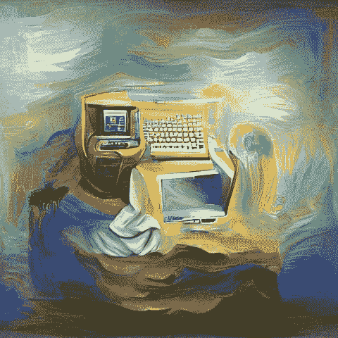

# 这个“人造梦”程序是如何工作的，以及你如何用它创造你自己的艺术作品

> 原文：<https://towardsdatascience.com/how-this-artificial-dreaming-program-works-and-how-you-can-create-your-own-artwork-with-it-387e5fb369d9?source=collection_archive---------19----------------------->

此工具从提示“计算机”和“绘画”中画出的“艺术品”。作者 Luciano Abriata 图。

## 你不需要知道任何编程-只要有一个谷歌帐户。这里有一篇直截了当的文章，**回顾了关于这个主题的几个关键故事和学术论文**。

我收到了一些电子邮件和一些评论，询问如何/在哪里运行我用来创建这些[快照](https://medium.com/snap-shots)故事中的图片的神经网络程序:

 [## (屏幕)由“做梦”“人工智能”程序生成的艺术照片——第一部分

### 什么能被认为是艺术的界限在哪里？这个程序自己画了画。它按照预定义的规则运行…

medium.com](https://medium.com/snap-shots/screen-shots-of-art-generated-by-a-dreaming-artificial-intelligence-program-72c5e9eb0876)  [## (屏幕)由“做梦”“人工智能”程序生成的艺术照片——第二部分

### 什么能被认为是艺术的界限在哪里？这个程序自己画了画。它按照预定义的规则运行…

medium.com](https://medium.com/snap-shots/screen-shots-of-art-generated-by-a-dreaming-artificial-intelligence-program-part-2-8ffbc1c2ff53) 

以下是答案。虽然已经有一些关于这方面的文章，但我在这里着重于(I)回顾它是如何工作的，链接到基础论文和其他人的故事中的一些很好的解释，以及(ii)关于如何调整程序生成的输出的实用技巧，再次链接到除我自己之外的其他人的故事。

# **首先，这一切是如何运作的？**

简单来说，这是两种神经网络架构的结合:VQGAN 和 CLIP。VQGAN 网络从输入数字生成图像，CLIP 测量输入文本和输入图像之间的相似性。更准确地说，VQGAN 是 arXiv 预印本中描述的[类型的生成性对抗网络，两个竞争网络进行无监督学习。它的主要描述在这个](https://arxiv.org/abs/1406.2661) [arXiv 预印本](https://arxiv.org/abs/2012.09841)中，也由其作者(P. Esser，R. Rombach，B. Ommer) [在这个 blo](https://compvis.github.io/taming-transformers/) g 中呈现。同时，CLIP 以一种受自然语言监督和多模态学习网络启发的方式将文本转换为图像。它的主要描述可以在[这个 arXiv 预印本](https://arxiv.org/abs/2103.00020)和[这个博客](https://openai.com/blog/clip/)中找到。其作者(a .拉德福德、J.W .金、c .哈勒西、a .拉梅什、g .高、s .阿加瓦尔、g .萨斯特里、a .阿斯克尔、p .米什金、j .克拉克、g .克鲁格、I .苏茨基弗)发现，将字幕与图像匹配的简单训练是一种高效且可扩展的学习图像表示的方法，这样自然语言就可以用来引用所学的视觉概念。

这个令人惊叹的“艺术梦想”工具的开发者( [K. Crowson](https://github.com/crowsonkb) 和 [R. Murdoch](https://rynmurdock.github.io/) )以这样一种方式耦合了两个网络，即 CLIP 引导搜索 VQGAN 的输入，试图匹配文本提示。这个过程以你在我(和许多其他人)的帖子上看到的“艺术”方式慢慢混合了对应于输入单词的图像。而且由于过程中涉及到随机数，所以不同运行的结果是不一样的。

# 人类艺术家可以如何以及在多大程度上调整程序的输出？

作为使用此工具的艺术家，您可以通过以下方式控制网络输出:

*   调整输入单词，你甚至可以指定比例(例如，如果你想让*足球*、*银河*、*吉他*的比例为 2:1:2，以强调*足球*和*吉他*超过*银河*，那么你可以输入“足球足球银河吉他”。
*   选择网络运行时将从中撤回目标的图像库。
*   当你看到结果足够好或不变时，停止做梦过程(网络运行涉及迭代，原则上可以是无限的，但通常在几百个周期后开始收敛)。
*   是继续做一个梦，还是因为你不喜欢正在制作的东西而停止它——然后重新开始，可能还会改变一些参数。

正如 Hannah Johnston 在她的[伟大故事](https://medium.com/@hannahj/the-future-of-art-with-machine-learning-6f839575481)中所说，从这些工具中获得你喜欢的东西远不只是选择单词和点击运行。您需要进行一些实验性的参数调整，当然还需要多次运行，才能得到您所期望的结果。有时候你永远不会满足。正如她所说，这就是为什么你会对最终结果产生某种依恋感，并把它视为带有实质性个人成分的东西。我在自己的快照故事中也说过同样的话。

# **现在，你如何以及在哪里可以自己运行这个网络来创作你自己的艺术作品？**

**这些网络的基本运行**是**极其容易的**，你甚至不需要懂任何编程。你可以简单地打开许多实现它的 Colab 笔记本中的一个，调整你想要使用的参数(至少是提示梦境的关键字)并点击 Run，然后等着看会产生什么。

如果我没看错的话，Colab 笔记本原版西班牙语是这个:[https://Colab . research . Google . com/drive/1g o6 ywmfe 5 MX 6 XM 9 TV-cnqistu 50n 9 eet](https://colab.research.google.com/drive/1go6YwMFe5MX6XM9tv-cnQiSTU50N9EeT)

但是已经翻译成英文:[https://colab . research . Google . com/drive/1 _ 4j l0 a 7 wijeqy 5 ltjpjfzowmzopg 5 c-W？usp =共享](https://colab.research.google.com/drive/1_4Jl0a7WIJeqy5LTjPJfZOwMZopG5C-W?usp=sharing)

> 需要注意的是，无论你用什么语言运行 Colab 笔记本，输入的单词都必须是英文的！

# 我建议你去玩笔记本。但是如果你想要更多的细节…

下面是安格斯·拉塞尔的一步一步的精彩指导。他的方法 1 是使用谷歌的 Colab 笔记本:

 [## 如何使用 VQGAN+CLIP 从文本提示生成图像—一个完整的、非技术性的教程。

### 了解如何使用最先进的人工智能来生成令人难以置信的艺术品。不需要技术知识或编码。

medium.com](https://medium.com/nightcafe-creator/vqgan-clip-tutorial-a411402cf3ad) 

# 回顾进一步的相关阅读材料+额外的链接

*   详细的手册(西班牙文):

 [## ayuda:general imágenes con VQGAN+CLIP

### 这是一个红色的世代。这是一个很好的例子

tuscriaturas.miraheze.org](https://tuscriaturas.miraheze.org/wiki/Ayuda:Generar_im%C3%A1genes_con_VQGAN%2BCLIP) 

→这里谷歌翻译的英文版本:[https://translate.google.com/translate?hl=&sl = es&TL = en&u = https % 3A % 2F % 2ft uscriaturas . miraheze . org % 2f wiki % 2f ayuda % 3 generar _ im % C3 % a1 genes _ con _ VQGAN % 2b clip](https://translate.google.com/translate?hl=&sl=es&tl=en&u=https%3A%2F%2Ftuscriaturas.miraheze.org%2Fwiki%2FAyuda%3AGenerar_im%C3%A1genes_con_VQGAN%2BCLIP)

*   网络如何共同产生艺术，作者 [Alexa Steinbrück](https://medium.com/u/8e980e537c2b?source=post_page-----387e5fb369d9--------------------------------) ，比我上面的解释更深入，但比完整的 arXiv 预印本更简单:

 [## VQGAN+CLIP —它是如何工作的？

### 合成图像(“甘艺术”)现场最近看到了一种生产力的爆炸:一种新的神经…

alexasteinbruck.medium.com](https://alexasteinbruck.medium.com/vqgan-clip-how-does-it-work-210a5dca5e52) 

*   关于机器学习艺术的未来的非常有趣的想法，作者[汉娜·约翰斯顿](https://medium.com/u/fc47b458c57d?source=post_page-----387e5fb369d9--------------------------------):

 [## 机器学习下的艺术未来

### 利用 VQGAN + CLIP Colab 生成图像

medium.com](https://medium.com/@hannahj/the-future-of-art-with-machine-learning-6f839575481) 

*   关于 VQGAN 的学术论文:

 [## 从自然语言监督中学习可转移的视觉模型

### 最先进的计算机视觉系统被训练来预测一组固定的预定对象类别。这个…

arxiv.org](https://arxiv.org/abs/2103.00020) 

*   关于 CLIP 的学术论文:

 [## 用于高分辨率图像合成的驯服变压器

### 旨在学习顺序数据的远程交互，变压器继续显示最先进的结果…

arxiv.org](https://arxiv.org/abs/2012.09841) 

喜欢这篇文章，想给我提示？[[**Paypal**](https://www.paypal.me/LAbriata)]-谢谢！

*我是一个自然、科学、技术、编程、DIY 爱好者。生物技术专家和化学家，在潮湿的实验室和计算机里。我写我广泛兴趣范围内的一切。查看我的* [*列表*](https://lucianosphere.medium.com/lists) *了解更多故事。* [*成为媒介会员*](https://lucianosphere.medium.com/membership) *访问我和其他作家的所有故事，* [*订阅通过邮件获取我的新故事*](https://lucianosphere.medium.com/subscribe) *(平台原创附属链接)。*