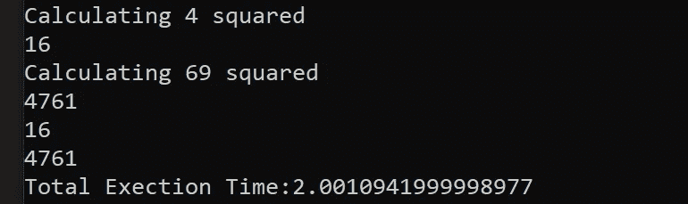

# 如何加速昂贵的算法

> 原文：<https://towardsdatascience.com/how-to-accelerate-expensive-algorithms-aa497631abbd?source=collection_archive---------29----------------------->

## 通过记忆提高递归函数的性能

作者:[爱德华·克鲁格](https://www.linkedin.com/in/edkrueger/)和[道格拉斯·富兰克林](https://www.linkedin.com/in/dougaf/)。

照片由 Florian Krumm 在 Unsplash 上拍摄

# 什么是记忆化？

**记忆化**是一种缓存类型，用于存储确定性函数的结果。更具体地说，记忆化是一种优化技术，用于通过存储函数调用的结果并在出现冗余输入时返回缓存的结果来加速程序。

换句话说，记忆防止程序两次运行相同的计算。

让我们用一个人为缓慢的 Python 函数来看看这种行为。

慢速 _ 函数. py

当我们运行`slow_func.py`时，我们得到以下输出:

请注意，有两个多余的计算；每增加一秒我们的执行时间。现在让我们编写这个函数的新版本来说明记忆化。

memoized_slow_func.py

在第三行，我们添加了一个空字典作为缓存。现在，在第 7–8 行，我们检查缓存以查看`slow_func`之前是否已经看到它的当前输入，如果存在则返回结果。第 13 行存储任何新的数字，它在缓存中是平方。

现在，当我们运行`memoized_slow_func.py`时，我们的输出如下所示:

注意，对于两个冗余输入，计算步骤已经被跳过，有效地将我们的运行时间减少了一半。现在你已经理解了记忆化的目的，让我们继续看一些更复杂的例子。

# 什么是斐波那契数列？

**Paul Milasan 和 Aaron Burden 在 Unsplash 上拍摄的照片**

斐波那契数列是一系列数字:

0, 1, 1, 2, 3, 5, 8, 13, 21, 34, …

下一个数字是通过将它前面的两个数字相加得到的。

> **f(n) = f(n-1) + f(n-2)**

该序列的一个重要特征是，序列中任何一个数字与前一个数字之间的比率都趋向于一个明确定义的值:1.618……这就是黄金分割率或黄金分割率φ (Phi)，它经常自然出现。

观察植物、花或果实的几何形状，很容易识别重复结构和形式的存在。例如，斐波那契数列在叶序中起着至关重要的作用，叶序研究植物中叶子、树枝、花或种子的排列。

就我们的目的而言，斐波那契数列非常重要，因为它可以递归计算。随着输入大小的增加，递归函数的计算开销会变得非常大。

## Python 中的斐波那契

斐波纳契数可以通过迭代计算**:**

迭代计算

或者**递归**:

递归计算

迭代计算将从斐波那契数列的开头开始，向上计数，直到到达输入索引。

递归计算模仿数学符号，这样做时，递归地调用自身。这意味着对于传递给`fibo_rec`的每个值，都要调用两次函数。这些调用还会产生更多对该函数的调用。因此，这是一个**昂贵的**计算。

让我们看看在有记忆和没有记忆的情况下，迭代和递归函数是如何执行的。

# 比较计算速度

*我们在本节中使用的计时和跟踪装饰器(@tracefunc 和@timefunc)可以在本文中找到。*

</a-deeper-dive-into-decoration-ca4334ca5cf8>  

在我们深入研究每个函数的性能之前，让我们回顾一下与渐近时间复杂性相关的语言。

## 渐近复杂性

渐近计算复杂性是使用渐近分析来估计算法和计算问题的计算复杂性，通常与“big-O”符号相关联。

换句话说，使用渐近分析，我们可以根据输入大小了解算法的性能。在这样做的时候，我们应该找到运行时间和输入大小之间的关系，用“O”表示。

我们的斐波纳契计算是 O(n)和 O(2^n).

渐近复杂性或 Big-O 符号

## 递归斐波那契

回想一下，这是我们的昂贵计算。它的渐近复杂性是 O(2^n).

这里有一个`traced_fibo_rec(8)`的痕迹。注意有多少冗余输入，以及必须完成多少次函数调用才能返回一个输出。O(2^n)指的是 2⁸或 256 个打给`fibo_rec`的电话。

跟踪 fibo _ rec→大量计算

通话`fibo_rec(8)`计算在千分之一秒多一点。

## 递归函数的问题:回忆深度

当你给 Python 中的递归函数提供大的输入时，你会得到一个错误。这是为了避免堆栈溢出。Python 解释器限制了递归限制，从而避免了无限递归。

值得一提的是，您可以用`sys`模块改变最大递归深度限制。

## 记忆递归斐波那契

现在让我们将记忆应用到我们昂贵的计算中。

这里是`cached_fibo_rec(8)`的轨迹。

更少计算

注意对函数的调用减少了多少！这导致了更快的执行时间。

有了缓存，递归 Fibonacci 计算的速度提高了 133 倍。这是因为我们的函数只需要计算每个输出值一次。当出现冗余输入时，该函数从缓存中提取输出，而不是生成另一个深度递归堆栈！

通过给这个函数添加记忆化，我们把它的 big-O 符号从 O(2^n)改成了 O(n)。这是算法性能的巨大提高。

## 迭代斐波那契

这个函数 O(n)的渐近复杂度。这是因为它在斐波纳契数列中从 0 到 n 循环。

我们可以看到，调用`fibo_iter(8)`的计算时间不到万分之一秒。这个函数的运行速度与我们记忆化的递归版本基本相同，因为它们具有相同的渐近复杂度。

值得注意的是，由于前面提到的最大递归深度限制，迭代 Fibonacci 算法可以计算比递归算法更大的序列号。

## 记忆迭代斐波那契

最后，让我们将记忆化应用到迭代函数中，看看性能是否有变化。

对于这个算法，无论有没有缓存，我们看到的执行时间基本上是相同的。这表明记忆化对于快速函数(具有更好的 O 符号的函数)可能是无用的。也许对于这样的函数，计算输出的计算成本与访问缓存值的计算成本相同。对于非常快的函数，缓存访问甚至比计算冗余值还要慢！

# 结论

内存化是一种有用的缓存方法，可以优化具有冗余输入的昂贵函数调用的性能。在某些情况下，记忆化可以提高算法的渐近复杂性，这在递归或动态编程算法中很常见。例如，当我们将记忆化应用于具有 O(2^n 复杂度的递归算法时，我们看到了巨大的性能提升。在这种情况下，访问缓存比重复计算要快得多。

记忆化允许我们使用递归斐波那契算法。不过迭代计算还是比较优越的。