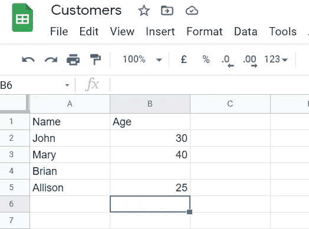
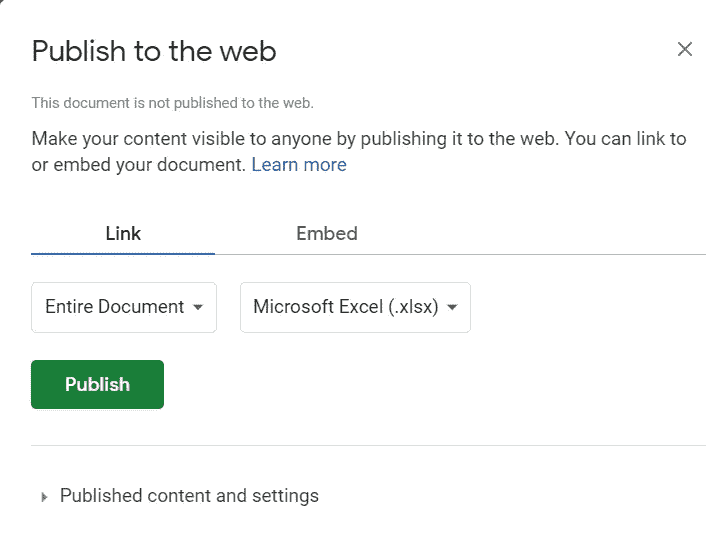
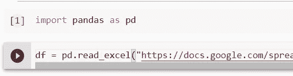
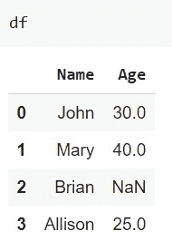

# 如何使用 Pandas 从 Python 访问 Google Sheets

> 原文：<https://towardsdatascience.com/how-to-access-google-sheets-from-python-using-pandas-fe7669b73986?source=collection_archive---------11----------------------->

## 让我们看看如何在不使用奇怪的集成的情况下从 Python 访问 Google Sheets

作者图片

Google Sheets 是一个非常强大的(免费的)创建电子表格的工具。我几乎已经用工作表取代了 LibreOffice Calc，因为它使用起来非常舒适。有时，数据科学家不得不将一些数据从 Google 工作表中提取到 Python 笔记本中。在这篇文章中，我将向你展示如何用熊猫来做这件事。

首先要做的是创建一个 Google Sheet。对于本例，它将只包含 2 列，其中一列(年龄)缺少一个值。

这是我们将要使用的数据集。

现在我们必须让它在互联网上可见。为此，我们只需进入文件->发布到 web。

让我们选择“Microsoft Excel(。xlsx)”并使窗口看起来像这样:

当我们点击“发布”时，我们将能够复制如下所示的 URL:

这是 Google Sheet 创建的 URL，使我们的工作表可以以 Excel 格式下载。

我们现在可以转移到像 Google Colaboratory 这样的 Python 终端，并使用 Pandas 库来获取工作表的内容。我们可以简单地使用 URL 作为 Pandas 的 *read_excel* 函数的第一个参数的值。

这就是结果

如您所见，数据已经正确地注入到我们的数据框架中。我们还有一个与丢失值相关的 NaN。我们不需要担心数据类型，因为它们是直接从 excel 格式中读取的。

有了特定的论点，我们可以阅读特定的表，跳过一些行和其他东西。

通过这种简单的方式，我们可以直接从 Python 连接到 Google Sheet，而无需使用特定的 API 集成。很明显，Google Sheet 生成的 URL 将工作表公开，所以当你把它给任何人时都要小心。