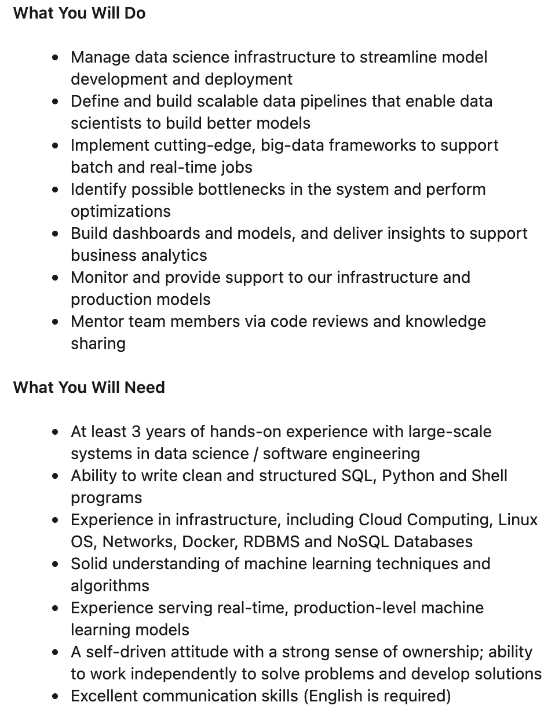

# 如何赢得 ML 工程师带回家的面试练习

> 原文：<https://towardsdatascience.com/how-to-ace-the-ml-engineer-take-home-interview-exercise-daf5ba590de4?source=collection_archive---------9----------------------->

## [办公时间](https://towardsdatascience.com/tagged/office-hours)

## 每个 ML 工程师都应该完成的最重要的第一轮

JESHOOTS.COM 在 [Unsplash](https://unsplash.com?utm_source=medium&utm_medium=referral) 上[的照片](https://unsplash.com/@jeshoots?utm_source=medium&utm_medium=referral)

这篇文章的灵感来自 [Tessa Xie](https://medium.com/u/dadb1d33c05a?source=post_page-----daf5ba590de4--------------------------------) ，她最近写了一篇关于**数据科学(DS)** 带回家练习的文章，她在文章中分享了 DS 带回家练习的*为什么*和*如何*以及应该如何进行。

在过去几个月的面试中，我最近获得了一份在<https://dictionary.cambridge.org/dictionary/english/decacorn>*十日学校担任 ML 工程师的工作，我认为分享我在做 **ML 工程**课后练习时学到并应用的东西是有益的。*

## *首先，简单介绍一下我自己…*

*   *在新加坡出生、长大和工作*
*   *2017 年毕业，经济学和金融学学士，加入一家日本投行*
*   *边磨边 2020 年初转行 AI/ML(此处 [*了解更多*](/i-had-no-idea-how-to-write-code-two-years-ago-now-im-an-ai-engineer-13c530ab8227) ！)*
*   *在月底的*十月*转换到一个新的 ML 工程职位*

## *接下来，快速免责声明…*

*我并不自称是这方面的专家，但我想分享一下过去几个月我做这些工作时对我有用的东西。此外，根据你所申请职位的资历，这些收入可能会有所不同。*

## *我们开始吧！*

*在过去的几个月里，我申请了(大部分)职位名称为“ML 工程师”的初级-中级职位(下面的*示例职位描述截图*)。*

**

*典型机器学习工程师的示例 JD*

*当然，有些公司没有任何带回家的评估(在我看来，这已经被证明是这些公司的一个危险信号！)而那些提供这些信息的公司通常会在第一轮面试前提供这些信息。这些回合的典型结构如下:*

*招聘人员/人力资源电话筛选→带回家的评估→技术筛选(1 到 3 轮)→行为筛选(即适合/酒吧老板类型的面试)*

*在我做过的这些带回家的评估中，它们有许多共同点，通常有以下要求:*

1.  *🗺探索性数据分析*
2.  *🧑🏼‍💻系统模型化*
3.  *🤖API 服务*
4.  *🪵伐木公司*
5.  *🧪单元和集成测试*
6.  *🐳集装箱化*
7.  *📙证明文件*

*在我分解之前💡外卖和⚠️抓住了上述 7 项要求，在处理自己的带回家评估时，记住以下几点**非常重要**。*

*   ***留出时间集中评估**。这些带回家的申请通常会给你一到两周的时间来完成，但是申请通常是在滚动的基础上完成的(*，也就是说，你完成得越快，你的面试就能进行得越快*)。记住，你也在和很多其他候选人竞争！力争在 **48 小时**内完成评估，这样你几乎可以保证进入下一轮(假设提交的材料很好),你也给面试官留下了一个好印象，因为这表明你熟悉这些要求。*
*   ***优先**！对评估中陈述的要求保持*高度警觉*。有些评估甚至可能不包括所有的服务器需求，而有些评估可能更多地关注某些需求，而较少关注其他需求。48 小时是完成所有七项要求的非常短的时间——根据您收到的评估中所述的*重点*对它们进行优先排序。*
*   ***保持简单，笨蛋**(吻)。带回家的评估应该在很短的时间内完成，因为面试官不想浪费应聘者太多的时间。不要把它当成一个机会，在一个简单的玩具问题上炫耀你过于复杂的技术。过度工程是绝对不允许的。*
*   ***像工程师一样编码**。你在“ML 工程师”里看到“工程师”这个词了吗？是的，你应该很好地编写代码，并遵循最佳实践。这意味着没有死代码，良好的代码格式，模块化的代码，遵守相应的语言风格指南(例如 *PEP8* )等等。*是的*，这里也需要好的文件夹结构。*

*记住这一点，让我来分解这 7 项要求。*

## *探索性数据分析*

*每个数据集都有自己的细微差别。理解所提供的数据集背后的细微差别将允许您选择正确的模型来解决问题。此外，面试官“修改”数据集是很常见的，因为他们想看看你是否能找到他们有意注入到数据集中的“错误”。*

*需要注意的常见事项(非详尽):*

*   *缺失数据(选择插补方法或删除数据)*
*   *离群值(以及如何处理它们)*
*   *相关特征*
*   *完全没有意义的数据*

***💡要点**:理解并整理你正在处理的数据集。始终对重要的决策选择提供清晰的解释(例如，放弃还是指责)。从单变量图开始，然后转移到双变量和多变量图，同时提供清晰的**洞察力**。*

*⚠️ **明白了**:避开自动化 EDA/绘图工具。它*一般*不会给评审者留下好印象。*

## *系统模型化*

*建模对于 ML 工程师来说不太重要，因为创建和调整这些模型通常是 DS 的工作。无论你选择哪种型号，都要确保你了解它是如何工作的。*

***💡要点**:选择一个适合问题陈述的模型。线性模型通常就足够了(除非需求中另有说明)。*

*⚠️ **明白了**:不要选择你不了解或者过于复杂的模型(*即需要很长时间训练*)。*

## *API 服务*

*每个 ML 工程师的面包和黄油。随着模型越来越普遍地被部署为 API 微服务，知道如何为端点提供服务是至关重要的。*

*构建 API 端点时需要注意和理解的事项:*

*   *模型加载/重新加载*
*   *每个端点的延迟要求*
*   *方法类型*
*   *RESTful API*
*   *每个路由器的文件夹结构*

***💡要点**:在设计 API 端点时使用最佳实践——确保您理解何时应该使用路径或查询参数。必要时使用*模式*定义响应和*数据库模型*。独立的输入处理和端点逻辑。**永远**测试你的端点！*

*⚠️ **明白了**:请记住，API 服务通常会在带回家的评估中进行测试，但它不是唯一的微服务架构。消息传递也非常常用(但很难作为带回家的东西包括在内)。在这里阅读更多。*

## ***测井***

*这个要求起初可能看起来不太重要，但它将初学者与业余爱好者和专家区分开来。在生产环境中，日志记录是至关重要的，因为它通知维护人员代码在哪个点被执行，以及随之而来的严重程度。本质上，这些消息应该通知您应用程序的健康状况。*

***💡要点**:包括登录你的模块。如此简单却经常被忽视的需求。*

## *单元和集成测试*

*测试经常被新手程序员忽视，因为他们可能没有足够的经验来了解测试的真正价值。通过编写有效的测试，您可以向评审者证明您理解它的重要性以及测试如何适应软件生命周期。*

## *集装箱化*

*随着微服务架构成为规范， **Docker** 也成为了容器的同义词。您可能会期望使用 Docker 来封装您的应用程序。*

***💡外卖**:在封装你的应用程序时展示[最佳实践](https://docs.docker.com/develop/develop-images/dockerfile_best-practices/)。根据经验，总是创建一个尽可能短暂的容器。记住— **少即是多**。*

## *证明文件*

*总是要有好的函数和模块文档。此外，记得在`README`中或者使用文档生成器(例如 [Sphinx](https://www.sphinx-doc.org/en/master/usage/quickstart.html) )记录其他高层决策。这包括以下内容:*

*   *回购为何以某种方式构建*
*   *模块使用*
*   *代码的设置和运行*
*   *为什么选择某些模型(算法)*
*   *模型评估指标*
*   *模型结果可解释性*
*   *需要更多时间才能实现的改进*

***💡要点**:你的代码大部分应该是自文档化的。专注于记录你的代码没有解释的设计选择。*

# *恭喜你晋级下一轮！现在怎么办？*

*为后续技术回合做准备与第一回合一样重要。这些后续回合通常会询问与带回家评估相关的后续问题，例如:*

*   *解决您可能忽略/遗漏的一些需求*
*   *可用于解决问题的替代模型(及其利弊)*
*   *如何纵向扩展 API 服务(例如横向和纵向扩展)*
*   *如何提高 API 服务的效率(例如，内存缓存、数据库索引、使用消息队列等)*
*   *设计选择的替代方案*

## *结束语*

*ML 工程师带回家的评估可以采取多种形式，但我发现以上是典型的“ML 工程师”的反映。如果你的带回家的评估更倾向于 EDA 和建模，你的角色可能更倾向于数据科学家的职位。在这种情况下，我建议看看这篇文章。*

*再次感谢您阅读我的文章。如果你对 ML 工程带回家练习有任何想法，请留下你的评论！:)*

****支持我！*** —如果你喜欢我的内容并且*没有*订阅 Medium，请考虑支持我并通过我在这里的推荐链接[订阅](https://davidcjw.medium.com/membership) ( *注意:你的一部分会员费将作为推荐费*分摊给我)。*