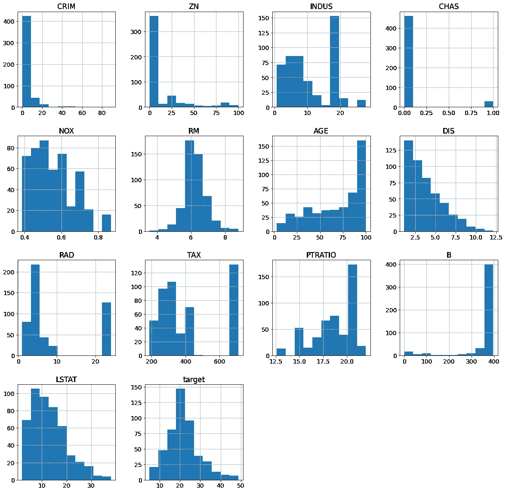
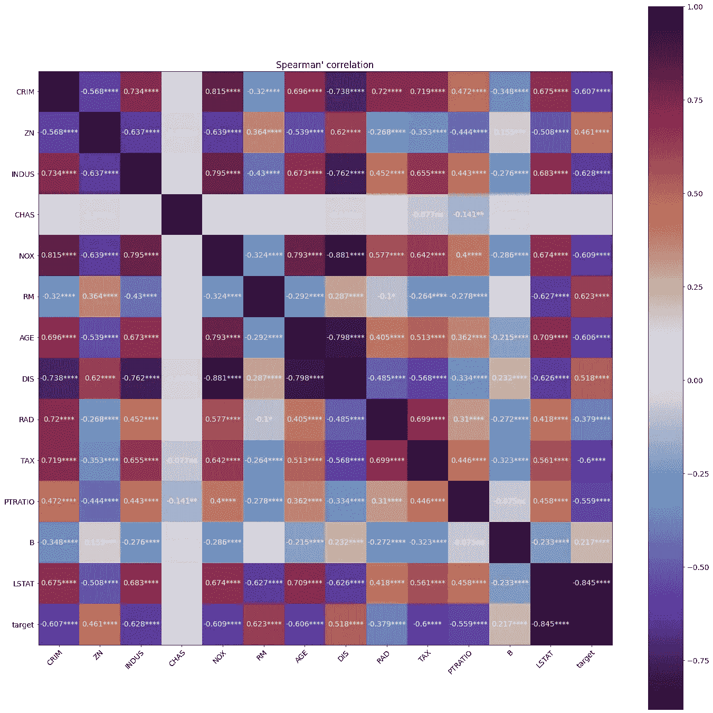
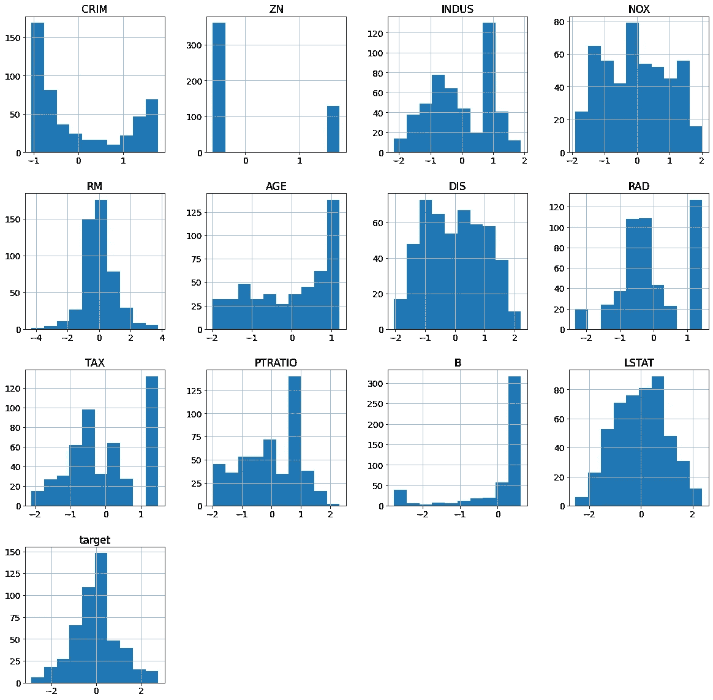

# 如何用“旧的、新的、借来的”赢得下一次数据科学面试

> 原文：<https://towardsdatascience.com/how-to-ace-your-next-data-science-interview-with-something-old-something-new-something-borrowed-ba1e84d2cf22?source=collection_archive---------30----------------------->

## 在数据科学评估中，当面试官或招聘人员要求你对一个众所周知的玩具数据集“给出一些见解”时，该怎么办


伊恩·施耐德在 [Unsplash](https://unsplash.com?utm_source=medium&utm_medium=referral) 上拍摄的照片

[事业就像婚姻](https://www.forbes.com/sites/stevedenning/2016/07/18/how-many-careers-do-you-get-in-a-lifetime/)——我们在 20 多岁的时候探索我们的选择，然后在 30 多岁的时候和我们爱的人稳定下来(理想状态下)。接近 30 岁时，我终于意识到作为一名数据科学家从事自由职业将是我的长期职业。我将向你们展示我是如何在第一次面试中胜出的。

今年早些时候，当我申请一个数据科学家的职位时，我被要求“使用假设检验来对波士顿房价数据集给出一些见解”。我只花了几个小时就完成了，我的面试官说我的数据科学评估是他迄今为止看到的最好的评估，他确实学到了一些新东西。

我是怎么做到的？我将从三个方面来阐述我的投稿:[旧的东西](#2ec4)、[新的东西](#775a)、[借的东西](#df3d)。我提交的全部内容也可以在这里找到。

# 旧的东西

你可能会想，既然每个候选人都在同一个数据集上工作，你必须立刻从人群中脱颖而出。但是请记住，面试官或招聘人员想要雇用的人可以做数据科学家的日常工作，这些工作几乎总是由简单的数据清理和简单的统计组成。你的提交应该表明你拥有这样的技能。

## 描述性统计和数据清理

总是从数据清理开始——即使它是一个肯定结构良好的玩具数据集。你做这一步是为了向你的面试官或招聘人员证明，一旦你进入公司，你可以对实际数据这样做。在我的提交中，我只是检查是否有任何数据丢失:

```
df.isna().sum()
```

然后你可以计算描述性统计:平均值、标准差、四分位数、众数、最小值和最大值等。

```
df.describe() df.mode()
```

我没有太多的数据清理工作要做，没有一个值是空的，并且大多数特征实际上没有显示任何异常的最小值或最大值。但我很快注意到房价有一个不正常的最高值——最高价为 5 万美元，而平均值和上四分位数都不到 3 万美元。所以我很快查了一下房价频率表:

```
df.target.value_counts()
```

我看到 506 个样本中有 16 个样本的房价都是 50.0 英镑(以 1000 美元计)，这似乎是在没有数据的情况下的虚拟值。所以我决定筛选出那些样本。

```
df = df[df.target < 50]
print('No. of samples left:', len(df))
```

两行代码筛选掉不需要的样本，并检查剩余的样本数。在继续之前，一定要确保仔细检查，以确保您的代码完全符合您的要求。

从描述性统计数字中，我看到“住宅用地的地段比例”和“非零售商业的比例”都主要为零。“人均犯罪率”也有一个平均值等于它的上四分位数。所以我们已经可以预期他们有正偏态分布。我们必须充分了解我们的统计数据，甚至在绘制数据之前就知道会发生什么。

最后但同样重要的是，我绘制了所有特征的直方图:

```
hist = df.hist(figsize=(20,20))
```



数据集中所有要素的直方图(按作者分类的图像)

大多数分布都不是正态分布。我决定记下这一点，以后再讨论这个问题。

## 相关性分析和数据可视化

如果您的要素和目标是数值型的，那么您必须首先执行相关性分析，以了解数据的双变量属性。最常用的方法应该是[皮尔逊相关](https://pandas.pydata.org/docs/reference/api/pandas.DataFrame.corr.html)。然而，我决定用相关性分析对*做点新的*，这将在下面的[中进一步讨论。](#97b0)

值得一提的是，我花了相当多的时间来弄清楚如何最好地可视化 14x14 的互相关矩阵。显示 196 个没有任何注释的数字会让我的观众非常困惑。我最终决定使用热图来可视化相关系数:

```
*# plot heatmap of correlation coefficients*
fig, ax = plt.subplots(figsize=(20,20))
im = ax.imshow(corr.correlation, cmap='twilight_shifted')

ax.set_xticks(np.arange(nf+1))
ax.set_yticks(np.arange(nf+1))
*# ... and label them with the respective list entries*
ax.set_xticklabels(df.columns)
ax.set_yticklabels(df.columns)

*# Rotate the tick labels and set their alignment.*
plt.setp(ax.get_xticklabels(), rotation=45, ha='right',rotation_mode='anchor')

*# annotate correlations on top of figure*
idx = 0
for i **in** range(nf+1):
    for j **in** range(nf+1):
        if i!=j: *# omit diagonal*
            text = ax.text(j, i, str(corr.correlation[i, j].round(3))+''+str(p_sig[idx]), ha='center', va='center', color='w') *#rounding to 3 decimals*
        idx += 1
ax.set_title('Spearman\'s correlation')
fig.tight_layout()
fig.colorbar(im)
plt.show()
```



互相关矩阵的可视化(图片由作者提供)

一定要解释你的图形的含义和每种颜色的定义。此外，评论你能看到的任何模式，并尝试给出一些解释。

## 特征选择

为了测试每个变量的单独影响，我使用[一个线性模型，将每个变量作为回归变量](https://scikit-learn.org/stable/modules/generated/sklearn.feature_selection.f_regression.html)，并按照 p 值的降序将输出很好地格式化到一个表格中以供查看:

```
f_regr = sklearn.feature_selection.f_regression(X, y, center=True)
f_regr_df = pd.DataFrame()
f_regr_df['Feature'] = data['feature_names']
f_regr_df['F score'] = f_regr[0]
f_regr_df['p value'] = f_regr[1]
f_regr_df.sort_values(by='p value')
```

我还进行了基于 L1 的[特征选择](https://scikit-learn.org/stable/modules/feature_selection.html#l1-based-feature-selection)以及[递归特征消除](https://scikit-learn.org/stable/modules/generated/sklearn.feature_selection.RFE.html)。

有许多功能选择方法可供选择。数据科学评估的关键是给出基本原理，并为您选择的方法提供支持。面试官希望看到你的数据科学沟通技能，而不是在不现实的玩具数据集上的最佳特征选择方法。

## 线性模型

线性模型应该是大多数数据科学任务的首选工具。如果线性模型对您的数据表现良好，那么您可能没有必要探索需要更多[超参数调整](/hyperparameter-tuning-c5619e7e6624)和计算资源的非线性模型。

在我的提交中，我从最基本的线性回归开始作为我的基线模型。然后我应用了[正则化技术](https://scikit-learn.org/stable/modules/linear_model.html#ridge-regression-and-classification)来看看它们是否能提高模型的性能。我确保在提交的材料中解释了每种正则化方法的效果。

# 新的东西

假设你已经做了其他候选人可能会做的所有事情，那么是时候*坚持一英里*了。想想你能做些什么不同寻常的事情。考虑可以替代更流行技术的技术。也就是说，重要的是确保你提供了这样做的基本原理，并且你选择的技术有益于模型。

## 选择斯皮尔曼相关性而不是皮尔逊相关性

我做的第一件*新*事是使用斯皮尔曼相关，而不是更常见的皮尔森相关。Spearman 相关性更广为人知的可能是应用于[顺序变量](https://web.ma.utexas.edu/users/mks/statmistakes/ordinal.html)，但它也有很大的优势应用于连续的数字数据，因为[对它们的分布](https://www.statisticssolutions.com/free-resources/directory-of-statistical-analyses/correlation-pearson-kendall-spearman/)没有任何假设。相反，皮尔逊相关系数假设两个变量都是正态分布的，它们之间的关系是线性的。

我的数据集中的变量既是有序的又是连续的，直方图告诉我它们并不都是正态分布的。基于这些观察，我使用了 Spearman 的相关性，并在我的提交材料中解释了我的选择以及这一选择带来的优势。

## Yeo-Johnson 电力变换

我在上面提到过，我记下了我的大部分变量不是正态分布的事实。经过一番研究，我找到了一个解决方案，我想把它展示给我的面试官，那就是 [Yeo-Johnson 权力转换](https://scikit-learn.org/stable/modules/generated/sklearn.preprocessing.PowerTransformer.html)。

由于这可能是我的面试官从未听说过的事情，我额外努力解释了我们为什么需要 power transform — *因为许多常见的模型都假设变量是正态分布的*。我还通过重新绘制所有直方图来可视化转换的结果:



Yeo-Johnson 幂变换后的直方图(图片由作者提供)

直方图显示并非所有的转换都是成功的。但是我们可以看到一些变量变得更加正常了。然后，我将根据原始数据训练的一些模型重新应用到新转换的数据上，以查看模型性能是否有任何变化。

## 展示你更高级的机器学习技能，即使数据集可能不需要它

在我的报告接近尾声时，我展示了一些更高级的机器学习技巧，通过交叉验证应用了随机森林回归器

```
rf = RandomForestRegressor(random_state=1)

random_grid = {
    'bootstrap': [True, False],
    'max_depth': [10, 20, 30, 40, 50, 60, 70, 80, 90, 100, None],
    'max_features': ['auto', 'sqrt'],
    'min_samples_leaf': [1, 2, 4],
    'min_samples_split': [2, 5, 10],
    'n_estimators': [200, 400, 600, 800, 1000, 1200, 1400, 1600, 1800, 2000]
}

rf_random = RandomizedSearchCV(estimator = rf, param_distributions = random_grid, n_iter = 100, cv = 3, verbose=2, random_state=1, n_jobs = -1)
*# Fit the random search model*
rf_random.fit(train_X, train_y.ravel())
rf_random.best_params_
```

以及[支持向量回归(SVR)与 RBF 核](https://scikit-learn.org/stable/modules/generated/sklearn.svm.SVR.html)。

```
svr = SVR()

random_grid = {
    'C': [0.1, 1, 10, 100],
    'gamma': ['scale', 'auto']
}

svr_random = RandomizedSearchCV(estimator = svr, param_distributions = random_grid, cv = 3, verbose=2, random_state=1, n_jobs = -1)
*# Fit the random search model*
svr_random.fit(train_X, train_y.ravel())
svr_random.best_params_
```

我也趁机解释了为什么没有用更复杂的深度学习方法:

> 该数据集的样本量很小。因此，许多深度学习方法可能不适用，或者我们可能会冒过度拟合数据的风险。

最后，我让面试官知道如果给我更多的时间，我还能做些什么:

> 理想情况下，我们希望迭代每个模型的不同特征选择方法。由于时间限制，这里没有这样做，所以许多模型只是使用一种基于直觉的特征选择方法。

# 借来的东西

首先，不要抄袭。尽管称之为“借用”，但我并不意味着你应该只是看看其他人对相同数据集做了什么，然后把它放到你的提交中。

当你接到任务，只有 XX 个小时来完成时，你可能很想马上开始，一头扎进数据集。尽管查看数据集和任务的描述是一个好主意，但还是要花时间进行研究。以下是一些你可以遵循的基本步骤:

1.  确定您的任务是分类、回归还是其他非结构化/无监督的任务。
2.  转到你最喜欢的软件包，在我的例子中是 [*scikit-learn*](https://scikit-learn.org/stable/index.html) ，并检查他们为你的任务提供的可用功能，例如[这个关于监督学习的页面](https://scikit-learn.org/stable/supervised_learning.html#supervised-learning)。你可能知道很多其他的软件包或算法，但坚持使用最常用的可以确保你的面试官或招聘人员可以复制你的结果，你不需要重新发明轮子。
3.  转到 [Kaggle Notebooks](https://www.kaggle.com/code) ，在精确的数据集上搜索笔记本(如果您的数据集是众所周知的)，或者搜索与您的数据集相关的关键词，例如“[预测房价](https://www.kaggle.com/code?searchQuery=predict+house+price)”。不要抄袭别人的代码，但是要浏览足够多的笔记本来了解你的提交中必须包含的内容。这将是你的“旧东西”。
4.  此时，您可能可以开始编程了。从描述性统计和一些初步分析开始，您可能会发现数据集的特殊属性。(在我的例子中，非正态分布。)记下你的数据集的这些特征，因为这些将是你的“*新事物*的基础。
5.  为你的“新事物”做研究。设计一个好问题，这样简单的谷歌搜索就能给你想要的结果。在我的例子中，我搜索“如何转换非正常数据 sklearn ”,第二个结果是我需要的 Scikit-Learn 文档上的[教程页面。](https://scikit-learn.org/stable/auto_examples/preprocessing/plot_map_data_to_normal.html)

# 外卖食品

每个数据科学练习都不同。在这种情况下，我被要求做一个简单的回归任务，而你可能被要求做一个分类或自然语言处理(NLP)任务。这篇文章的关键不是技术细节，而是你可以应用到自己的评估中脱颖而出的整体结构。

除了向你的招聘人员或面试官展示你知道所有的*旧*东西，确保你给他们*一些新*东西，这样他们就知道你与所有其他候选人不同。最后但同样重要的是，在开始评估之前，研究一下其他人的工作是值得的。借用他们的知识，而不是他们的工作。

祝你下次求职面试成功。或者我应该说，祝你好运，找到一份你想在余生从事的职业。

*关于作者:我是一名自由数据科学家和 ML 工程师。我为贵公司的数据科学和机器学习需求提供定制解决方案。更多信息请访问*[*www.CathieSo.com*](https://www.cathieso.com/)*。*