# 实际预测新冠肺炎

> 原文：<https://towardsdatascience.com/how-to-actually-forecast-covid-19-778cce27b9d6?source=collection_archive---------4----------------------->

## 一个关于预测新冠肺炎的完整教程，包含 Python 代码

作者图片

这是一个关于预测新冠肺炎的全面而现实的教程，用 Python 代码来实现你自己的。

为什么要听我说的话？嗯，我是这篇论文的作者:[多病毒株的流行病建模:新型冠状病毒 B.1.1.7 在莫斯科的案例研究](https://arxiv.org/abs/2106.08048)。这个任务的复杂性让我头疼了几个月，现在我想帮你省去这个麻烦。

Jupyter [笔记本](https://github.com/btseytlin/covid_peak_sir_modelling/blob/main/habr_code.ipynb)附带教程代码。

# 另一个新冠肺炎预测教程？

有大量预测新冠肺炎的材料。在 2021 年 1 月的头几天，我听说了英国的冠状病毒株，以及美国第四波的[预测。我很好奇:这是否会在我的城市莫斯科引发新的浪潮？于是我踏上了新冠肺炎模特之旅。我期望它在两周内完成。新冠肺炎肯定是目前研究最多的东西，肯定有人开发了一个我可以使用的模型，对吗？](https://thezvi.wordpress.com/2021/01/06/fourth-wave-covid-toy-modeling/)

不对。旅程花了三个月。事实证明，几乎没有任何关于建立流行病学模型的充分信息。大多数教程和论文都忽略了重要的细节，比如:

*   为什么要选择特定的型号？
*   参数究竟是如何优化的？
*   如何测试模型？它的预测效果好吗，还是仅仅符合训练数据？
*   该模型与基线相比如何？比仅仅预测前一天的情况更好吗？
*   模型是否推广到多个流行病波？不同地区？

最热门的发现:大多数关于模拟新冠肺炎的顶级出版物的作者没有使用训练测试分割。也就是说，他们从来没有检查模型是否真的预测，他们只是检查产生的曲线看起来很像历史数据。

我花了好几个星期试图找出有效的方法，并想:“希望有人能写清楚这一点！”。那会节省我几周的时间。这篇教程是我试图成为那个人，并节省你几个星期的修补。

***注来自《走向数据科学》的编辑:*** *虽然我们允许独立作者根据我们的* [*规则和指导方针*](/questions-96667b06af5) *发表文章，但我们不认可每个作者的贡献。你不应该在没有寻求专业建议的情况下依赖一个作者的作品。详见我们的* [*读者术语*](/readers-terms-b5d780a700a4) *。*

# 在莫斯科为新冠肺炎做模特

首先，我们需要关于感染、死亡和康复的历史数据。莫斯科的数据可以在本页免费获得。我使用了 2020 年 3 月 10 日至 2021 年 3 月 23 日的时间框架。

初始数据集覆盖了整个俄罗斯，但流行病模型最适合封闭人群，所以我们只选择莫斯科的数据。

数据的输入通常有一些滞后，所以让我们添加所有列的移动平均平滑版本，以便以后使用。

因此，我们的数据集包含以下各列及其平滑版本:

*   每天感染病例数—给定日期的新确诊病例数，
*   recovered_per_day —给定日期的新康复患者，
*   每天死亡人数—给定日期的死亡人数(因感染),
*   total_infected —确诊病例总数，每天累计的感染总数。
*   total _ dead 死亡总数，每天死亡的累计总数。
*   total_recovered —已恢复的患者总数，每天已恢复的累计总数。

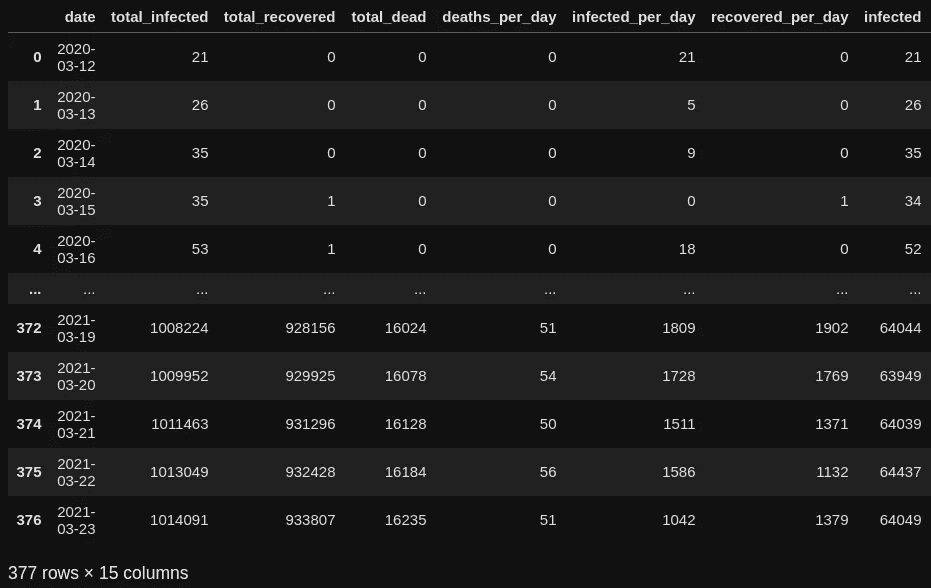

数据集预览，按作者分类的图像

# 基本模型:SEIR

让我们从流行病模型之父开始吧，先生。 [SIR](https://en.wikipedia.org/wiki/Compartmental_models_in_epidemiology) 是一个模拟疫情在时间上发展的简单模型。它将人群分为三组:易感人群、感染人群和未感染人群。

爵士的想法解释得很简单:

*   有一个封闭的人群和一个初始的感染人数。
*   每一天，每个感染者都有一定的概率感染易感人群中的某个人。
*   感染组中的某个人在疾病期结束后康复，并转移到恢复组。
*   这种算法会持续很多天。

SIR 没有对潜伏期和死亡进行建模，这意味着我们应该直接跳到扩展部分，SEIRD。塞德的工作方式和爵士一样；但是，它增加了两个组:

*   暴露——受感染的人正在经历潜伏期。他们不会传播病毒。
*   死者——死于病毒的人。

为什么选择 SEIRD 作为基础型号？不是最强的机器学习模型，其实很简单。应该使用 SEIRD 的原因有三个。首先，它不是一个黑匣子:SEIRD **的参数仅仅是疾病**的特征。我们可以根据新冠肺炎作为一种疾病的医学研究来估计它们。第二，该模型很容易修改，这就是我们很快将通过增加隔离措施、不完全统计和第二个菌株来做的事情。值得一提的是，尽管 SEIRD 有缺点，但迄今为止最好的新冠肺炎预测模型是一个[改进的 SEIR 模型](https://covid19-projections.com/about/#about-the-model)。对于一些高中水平的微分方程来说很酷，对吧？

让我们更深入地了解塞德。以下微分方程定义了人口组每天的变化:

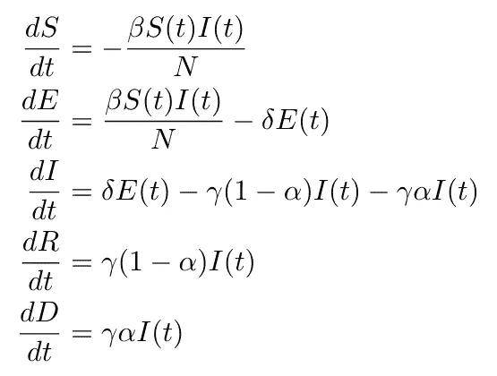

作者图片

看起来很吓人，但是请原谅我:这是高中的算术。

以第三个等式为例。它描述了 ***I*** 组每天的变化。第一项意味着来自组 ***E*** 的每个人以概率 ***δ*** 完成他们的潜伏期并移动到组**I，因此****【δE(t)****被添加到 ***I*** 。其他术语描述了每天有多少人离开被感染的群体。组 ***I*** 的每个人恢复或死亡一个概率 ***γ*** 并移动到组 ***R*** 或 ***D*** 。参数 ***α、*** 即[感染致死率](https://en.wikipedia.org/wiki/Case_fatality_rate) ***、*** 决定一个人是否死亡并转到组 ***、*、**或恢复并转到组**

***总而言之，随着人们离开潜伏期，受感染的人数每天都在增加，同时，康复的和死亡的个体也离开了受感染的群体。***

***模型的参数:***

******α*** —病死率。***

*****β*** —每天一个病人感染的人数。**

*****△***—1 除以潜伏期的平均持续时间。**

*****y*** — 1 除以平均病程。**

*****R0 = β/y*** —基本复制数。在疾病的整个持续时间内被一个病人感染的人数。**

# **经典 SEIRD 的实现**

**要实现 SEIRD，我们只需将微分方程转换成代码。这是实现，我们马上会详细介绍它的细节:**

**代码太多了，让我们看看这里发生了什么。**

**方法 *get_fit_params* 初始化参数。我们为此使用了优化库 lmfit，但是我们还没有优化参数。现在，我们使用结构 *lmfit。参数*作为高级字典。我用了一个[新冠肺炎特性的元分析](https://www.frontiersin.org/articles/10.3389/fpubh.2020.598547/full)来预定义参数的范围，这对优化帮助很大。**

**参数*epidemic _ started _ days _ ago*允许设置第一个感染者出现的日期。据我推测，这件事发生在 2020 年 3 月 2 日。**

**方法*步骤*是模型的核心，它包含了模型的微分方程。它实现了一天组的更新。作为输入，它接收天数 *t* 和所有组的初始大小作为元组 *initial_conditions* 。它返回所有组中的更改。**

**方法 *predict* 接收初始值和数组 *t_range* 作为输入数据。它所做的就是使用我们的方法步骤应用 [scipy.integrate.odeint](https://docs.scipy.org/doc/scipy/reference/generated/scipy.integrate.odeint.html) 。它对 *t_range* 中的天数的微分方程进行积分，并输出所有天数的组大小。本质上，它是运行我们模型的方法。**

**最后，方法 *get_initial_conditions* 从第一个感染病例在*epidemic _ started _ days _ ago*天出现开始建模，并返回初始组大小。**

**让我们运行我们的模型，并将它的预测与现实进行比较:**

**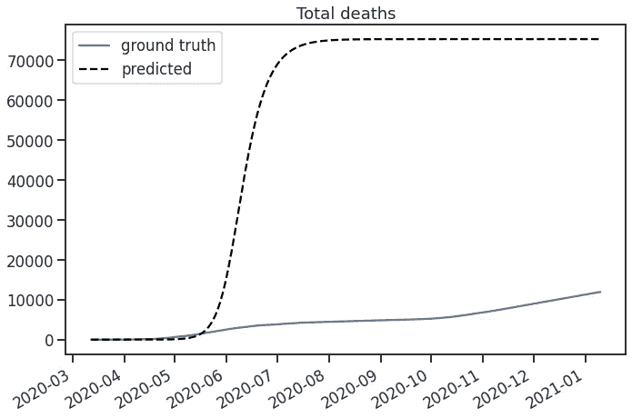**

**由经典 SEIRD 模型预测的累积死亡人数(图片由作者提供)**

**Woops，模型预测大家都死了或者痊愈了，疫情就已经结束了。结果非常糟糕，但并不出人意料:我们没有优化任何参数，而且这个模型对新冠肺炎来说太简单了。**

**为了验证后一种说法，我们来看看所有赛德尔集团的动态:**

**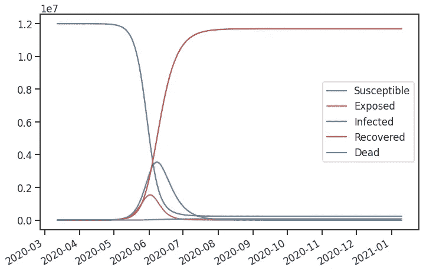**

**SEIRD 模型的完整输出(图片由作者提供)**

**模型描述的只是一次感染波，之后几乎所有人都康复，获得群体免疫，疫情告一段落。即使我们选择了最好的参数，这个模型也不是为了描述多重感染波而设计的。我们应该改变方程组以获得更好的结果。**

# **添加隔离措施**

**出现新浪潮的原因之一是检疫措施。假设措施日*减少*【R0】*的病乘*的百分之。因此，可以计算在某种检疫措施作用下的繁殖数:***Rt = R0—R0 * q(t)***每天。从中我们可以计算出 ***β(t) = Rt * y*** 并在方程中使用。****

**最后要考虑的是函数 ***q(t)*** 。在我的研究中，我使用了一个基本的阶跃函数。我们将整个日期范围分成 60 天的间隔。对于每个时间间隔，我们都在给定的时间间隔内设置了一定级别的隔离措施。从一个间隔到另一个间隔的过渡应该是平滑的(例如，通过使用 sigmoid 函数)。否则，函数将不会平滑，我们将无法优化参数。**

**这是一个带有 sigmoid 转换的逐步函数的实现，带有一个玩具示例:**

**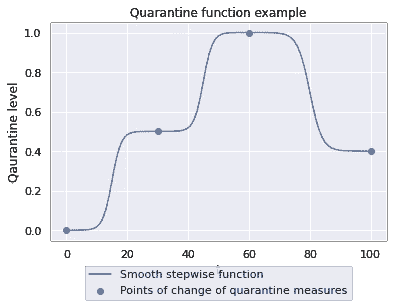**

**平滑逐步隔离级别函数的玩具示例(图片由作者提供)**

**要将此添加到我们的 SEIRD 模型中，我们应该采取以下步骤:**

1.  **将检疫乘数添加到 *get_fit_params* 中。最初，隔离级别为零；但是，它在其他区间的级别由优化定义。此外，我们添加了一个新的超参数，它设置了时间间隔的长度: *stepwise_size* ，默认值为 60 天。**
2.  **添加[一个新方法](https://github.com/btseytlin/covid_peak_sir_modelling/blob/637ef78331c7f83fc2a43343e0c68b7542d72cff/sir_models/models.py#L70) *get_step_rt_beta* ，该方法使用一个阶跃函数计算***【t】***和 ***Rt*** 。**
3.  **在方法步骤中使用 *get_step_rt_beta* 。**

**这样，我们的模型就能够考虑隔离措施了。但这就够了吗？不完全是。**

# **不完整的统计数据**

**众所周知，并非所有的感染病例都记录在官方统计中。许多人没有住院，其他人携带疾病却没有症状。我们必须在我们的模型中考虑这些事实，因为经典的 SEIRD 模型从表面上看数据集，并不期望它是不完整的。**

**让我们改变模型的分组，将案例分为统计数据中记录的案例和我们看不见的案例:**

*   *****【Iv(t)***—传播病毒，在统计中有记录。**
*   *****I(t)*** —传播病毒，不在统计记录中。**
*   ***—从病毒中恢复，记录在统计中。***
*   ******【t】***—从病毒中恢复，未记录在统计中。***
*   *****【Dv(t)***—死亡，统计中有记录。**
*   *****D(t)*** —死了，统计中没有记载。**

**其他组， ***S*** 和 ***E*** 保持不变。**

**此外，我们添加了两个新参数:**

*   *****pi*** —被感染病例被统计记录的概率。基本上概率能进 ***Iv*** 组。**
*   *****pd*** —统计中记录死亡的概率，即使感染病例没有被记录。来自组 ***Iv*** 的被感染个体总是去组 ***Dv*** 。**

**最后，我们有下面的模型方案，其中图的顶点是组，箭头决定人们如何在组之间移动:**

**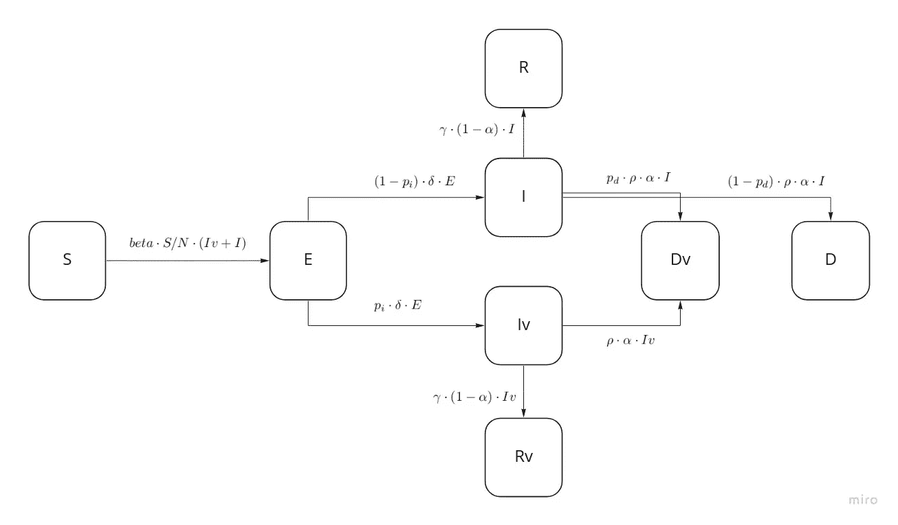**

**SEIRD-H 原理图。有点像太空船，这很好。(图片由作者提供)**

**该模型被命名为 SEIRD-H: SEIRD with hidden states。更详细的实现在[这里](https://github.com/btseytlin/covid_peak_sir_modelling/blob/637ef78331c7f83fc2a43343e0c68b7542d72cff/sir_models/models.py#L143)给出。**

# **参数优化**

**模型准备好了。剩下的唯一事情是找到参数的最佳值，以便通过使用最小二乘优化的方法，由模型生成的 Iv(t)、Rv(t)和 Dv(t)对应于真实数据。**

**让我们使用 [lmfit.minimize](https://lmfit.github.io/lmfit-py/fitting.html#lmfit.minimizer.minimize) 。此函数接收一个可调用的作为输入，它返回一个残差列表并选择参数以最小化它们的总和。默认算法 Levenberg-Marquardt 方法非常适合该任务，但必须知道不能优化离散参数。例如，它不能为我们选择 *stepwise_size* 。这就是我们必须平滑隔离功能的原因。**

**让我们看一下代码:**

**主旨很简单。在间隔 *t_vals* 中的每一天，我们都会收到预测的感染病例、死亡病例和康复病例。此外，计算并存储预测值与真实值的偏差。**

**之后，我们需要一些技巧。首先，新感染病例和新死亡病例的范围不同。在某一天看到一千个新病例，而同一时间只有一个人死亡，这是司空见惯的事。因此，如果我们只使用绝对残差，优化将只由感染病例的残差来定义。让我们使用函数 smape_resid_transform 将所有残差转换为相对误差，从而将它们重新调整到[0，1]范围。**

**其次，有理由认为死亡统计数据比感染和康复病例数据更可信。为了将这个假设添加到优化中，让我们用*自身权重*中的值来加权残差。在我们的情况下，死亡残差为 0.5，其他为 0.25 似乎效果最好。**

# **模特培训**

**现在有了隔离措施和隐藏状态，我们都准备好了！让我们在平滑的系列上训练 SEIRD-H 模型。**

**获得的参数:**

**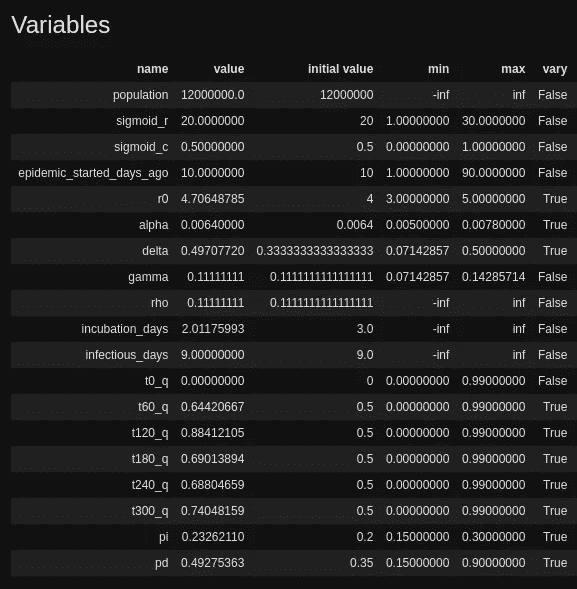**

**获得的模型参数(图片由作者提供)**

**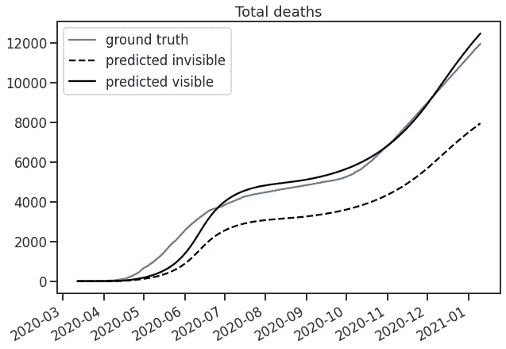**

**通过第三代 H 模型对训练数据的累积死亡预测(图片由作者提供)**

**比早先获得的经典 SEIR 结果好得多！参数表明，根据我们的优化，几乎一半的死亡没有在统计中登记。对于感染病例，只有大约五分之一的病例有记录。**

**这是学习的隔离功能:**

**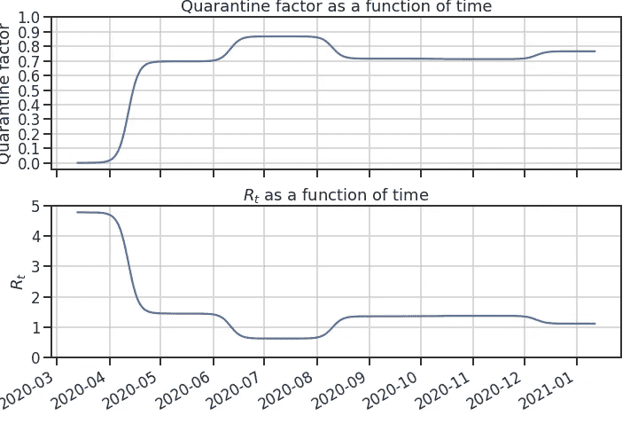**

**模型学习的隔离功能，以及它如何影响 Rt(图片由作者提供)**

**人们应该小心 SIR 模型:一个模型可以显示关于死亡的真实预测，同时预测比现实多十倍的恢复病例，或者以其他方式作弊。查看模型的所有预测组件是有帮助的:每天的死亡、康复和感染病例。**

**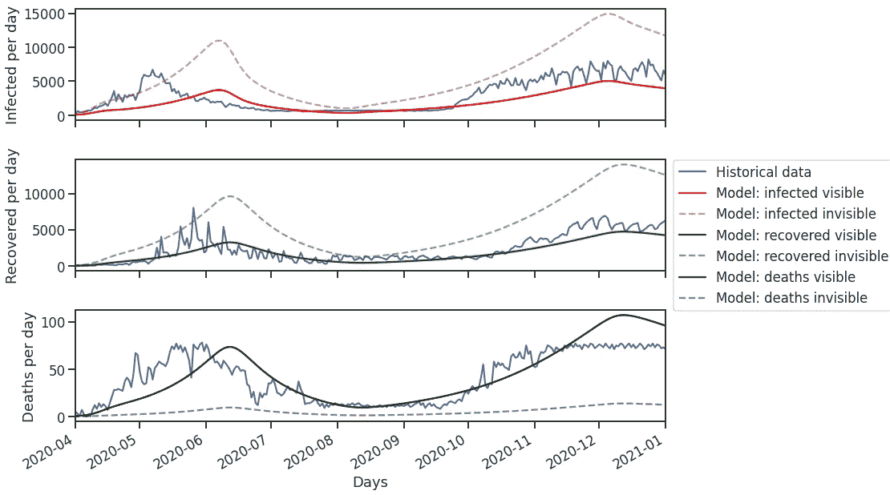**

**SEIRD-H 在训练数据上的完整输出(图片由作者提供)**

**完美，一切看起来都很好。模型当然会出错。重要的是，它似乎抓住了主要趋势。**

# **交叉验证的模型验证**

**训练数据上的好数字没有告诉我们任何关于真实数据上的预测。我们必须验证这个模型的预测能力。在关于模拟新冠肺炎的出版物中，模型质量是通过预测累计死亡人数来评估的，所以我们也使用它。**

**我们将使用时间感知交叉验证。验证过程是这样的。从训练数据中选择几个日期，例如，每 20 天，对于每个日期:**

*   **使用给定日期之前的所有数据来训练模型。**
*   **预测未来 30 天的累计死亡人数。**
*   **计算预测误差。**

**最后，计算模型的平均误差，并与基线持续性模型进行比较，基线持续性模型只是预测最后一个训练日。**

**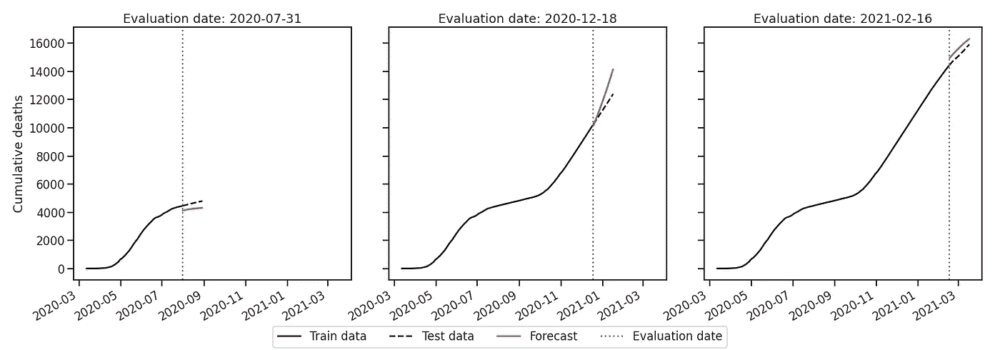**

**时间感知交叉验证的例子(图片由作者提供)**

**结果:**

*   **基线平均绝对误差:714。**
*   **模型平均绝对误差:550。**
*   **模型对称平均绝对百分比误差:4.6%**

**模型击败基线，误差在 5%左右。**

# **最后的话**

**这就是了。我们实现了经典的 SEIR 模型，我们通过添加隔离措施和隐藏组来处理不完整的数据，我们优化了参数。并使用时间感知交叉验证来验证最终模型。准确度没那么令人印象深刻，但是问题真的很难。从这一点出发，我们可以通过改进模型、重新运行评估过程和检查错误来进行迭代。一个很酷的特点是，该模型不是特定于数据集的:它可以用于其他地区和其他疾病。**

**感谢您的阅读，我希望您发现本教程有用！**

# **放弃**

**这里表达的想法和观点仅是我个人的，不代表任何机构的观点。本出版物具有教育性质，不应被视为医疗建议。**