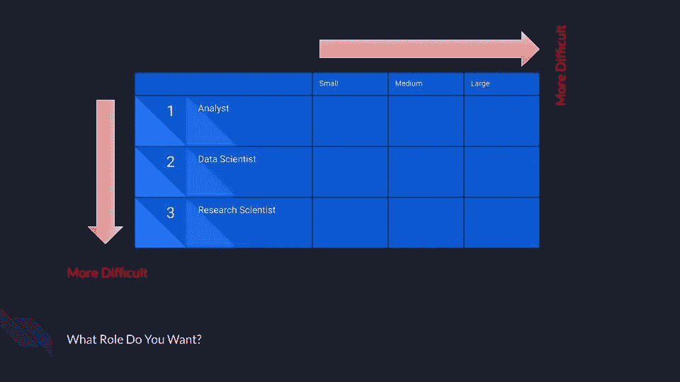

# 如何找到一份数据科学的工作

> 原文：<https://towardsdatascience.com/how-to-actually-land-a-data-science-job-b43e8f4187b2?source=collection_archive---------20----------------------->

## [办公时间](https://towardsdatascience.com/tagged/office-hours)

## 最大化你成功机会的 5 个步骤

在 [Unsplash](https://unsplash.com?utm_source=medium&utm_medium=referral) 上由[Christina @ wocintechchat.com](https://unsplash.com/@wocintechchat?utm_source=medium&utm_medium=referral)拍摄的照片

我收到的最常见的问题是*我如何真正进入数据科学领域*？很多人想在数据科学领域开始职业生涯，但很难迈出第一步。

而且我不会说谎，这是一个**难**步。

你在与公司和招聘者竞争，他们总是想要有经验的候选人，而你却在寻找开始积累行业经验的机会。那么——你打算怎么办？

虽然我不能保证你成功，但我可以给你一个可以遵循的过程，尝试并最大化你获得第一份数据科学工作的机会。当我第一次进入这个领域时，我自己也使用了这个过程，它也包含了我发现其他人用来迈出第一步的重要步骤。我希望这 5 个步骤至少可以帮助你感觉到自己正在取得真正的进步，朝着获得第一份数据科学工作的目标前进。

# 你想要什么样的角色？

作者图片

数据科学面临的挑战之一是，它实际上不是一个领域，而是一个由许多不同类型的工作组成的领域。在开始工作时，考虑你喜欢什么样的角色以及在什么样的公司工作是很重要的。我看到了 3 个非常常见的角色:

*   *分析师* —通常专注于从数据中创建可操作的情报。这通常可以通过仪表板、报告、统计和数据挖掘来实现。
*   *数据科学家* —通常创建能为公司创造价值的预测模型。例如，数据科学家可以创建一个模型来预测哪些客户会流失。
*   *研究科学家* —专注于推动最先进技术的发展。通常是做研究和在会议上发表论文。

花些时间对这些角色以及您在数据科学领域看到的其他潜在角色进行更深入的研究。如果你能缩小你想从事的职业范围，找工作会变得容易得多。例如，如果你决定要成为一名研究科学家，你需要的技能和经验与分析师有很大不同。

此外，不同的角色可能更难获得。我倾向于发现分析师角色是最容易的，然后是数据科学，最后是研究科学家角色。这主要是因为对这些角色的需求。如今，几乎每个公司都以某种形式雇佣分析师，但没有多少公司雇佣真正的研究科学家。

在考虑了角色的类型之后，现在考虑你想去的公司的类型。你可以在很多轴上思考公司。例如，规模、行业和地理位置等等。公司的类型很重要，因为不同类型的公司雇佣不同的数据角色。大公司往往有一个非常严格的流程，大多数候选人都必须通过，而在小公司，通常主要根据推荐或关系进行招聘。

你的第一个任务是考虑你想在什么类型的公司工作。在这上面花点时间，写下你的想法。保持密切联系，因为它会影响所有后续步骤。

# 开始建立你的人际网络

在 [Unsplash](https://unsplash.com?utm_source=medium&utm_medium=referral) 上 [veeterzy](https://unsplash.com/@veeterzy?utm_source=medium&utm_medium=referral) 拍摄的照片

既然你已经知道自己想要什么样的角色，在什么样的公司工作，你就需要开始建立关系网了。

你听过这句谚语吗？

> "**种树的最佳时间**是 20 年前。第二个**最好的时机**就是现在。”

同样的原则也适用于网络。

最糟糕的时候是你需要的时候。到了那个时候，可能就太晚了，但是如果你发现自己处于那种情况，你所能做的就是立即开始建立关系网。但是要意识到，就像一棵新栽的树，一个新发展的网络是脆弱的，不要指望它能结出多少果实。相反，集中精力尽你所能发展和滋养你的人际网络，当它更加稳固的时候，期待它结出果实。

但是你到底是如何发展一个网络的呢？

我最好的建议是开始和你遇到的每个人交往。与人交往的最好方式是真正有兴趣去了解他们。下次你在商店的时候，问你的收银员，“你一天中最美好的时光是什么？”这是一个引发人们思考和回应的问题。然后这种反应可能会导致更深入的对话，也可能不会。没关系。你正在做的是学习如何与人交往，并更多地了解你周围的人。

把这个想法延伸到 LinkedIn。下次你在帖子上看到有趣的对话时，去参与吧！

将这个想法延伸到你参加的下一次聚会或会议。与你周围的人交往，多了解他们。

你会发现你开始认识很多人！许多这样的联系会在第一次谈话后结束，但其中一些会找到更深的根源，保持并继续发展成友谊。继续滋养他们。偶尔联系一下，看看他们过得怎么样，有什么新鲜事，有没有你能帮忙的。

我能给出的关于人际关系的最大建议是**专注于给予**。帮助别人不仅感觉很棒，而且还能建立一个强大的基础，所以当你需要帮助的时候，你的关系网会在那里等着你。而且不会觉得别扭！你不会向陌生人寻求工作，而是向想帮忙的朋友寻求帮助。

建立这种类型的网络需要时间，所以现在就开始吧！**今天就想办法和新的人交往吧！**

# 更好地理解你的目标

好的——现在是时候收集一些数据了，这样你就可以更好地理解你面前的道路。

你的第一站是求职栏。对公司发布你在第一步中确定的职位类型的前三个网站做一些研究。这可以像 LinkedIn 或 Glassdoor 这样的大网站一样简单，也可以是 YC 就业委员会这样的小众网站。我还建议你去看看你梦想中的公司的求职页面。

研究这些招聘信息，并开始将你发现的数据制成表格。

他们有没有提到 Python，R，SQL，或者 Spark？

深度学习或者强化学习怎么样？

可能会出现一些工程原则，如单元测试或持续部署。

你的目标是开始了解你梦想角色的核心技能是什么。根据你对你想要的角色的理解程度，这个过程可能只是确认你已经知道的东西。但你也可能会发现令你惊讶的共同主题。

下一步——在 LinkedIn 上搜索已经得到你想要的工作的人。

他们似乎有什么技能？他们的背景和经历如何？

将你学到的知识添加到你从招聘信息中收集的数据中。此时，你应该有一个电子表格，上面有一长串技能和经验，每个技能和经验旁边都有一个数字，说明它在你的研究中出现的频率。将你的表格分类，让最常用的技能放在最上面。拥有这份经过排序的技能列表至关重要，因为数据科学是一个非常大的领域。基本不可能对每一个可能的面试科目都做好准备。我们将在下一步中使用您的列表来集中我们的努力。

# 夯实你的基础

由[拍摄的科尔顿鲟鱼](https://unsplash.com/@coltonsturgeon?utm_source=medium&utm_medium=referral)在 [Unsplash](https://unsplash.com?utm_source=medium&utm_medium=referral)

现在——在你的清单上选出 5 项最重要的技能。这些都是你需要尽可能扎实掌握的技能。

这也是你需要对自己诚实的地方，你的时间线是什么。如果你发现你对所需的 5 大技能知之甚少，但你现在需要一份工作，你应该把你目前的努力重新集中在一份更容易实现的工作上，花时间为你梦想的角色做准备。

但同时，也不要对自己所处的位置过于悲观。如果你正在努力衡量自己的技能，看看你是否能接触到你不断发展的人际网络中与你职位相似的人，给你一些关于你的优点和缺点的反馈。

写下你的前 5 条，花些时间让自己对这些主题感到舒服。

以下是常见数据科学主题领域的一些资源:

*   *机器学习*:使用 Scikit-Learn 和 TensorFlow 进行动手机器学习
*   *线性代数*:吉尔伯特·斯特朗
*   *统计*:做贝叶斯数据分析；统计学习介绍，思考统计
*   *分析*:用于数据分析的 Python

一旦你对这 5 项技能有了足够的了解，在你的清单上选择下一个 5 项技能，确保你至少对这些领域有一个基本的了解。

在这一点上，你应该觉得你已经为你想要的工作所需的核心技能打下了坚实的基础。这个基础会在你开始面试时给你巨大的帮助。

但是，不幸的是，有时成为一名优秀的数据科学家并不意味着你会通过面试。你需要专门为面试问题做准备。

使用谷歌帮助您准备:

*   “如何赢得数据科学面试”
*   “常见数据科学面试问题”

这些搜索会给你大量的资源来练习实际的面试问题。每天练习提问，尽量把注意力集中在你认为与你已经确定的顶级技能最相关的问题上。

# 到处适用

招聘过程是相当不完整的，所以不要相信它总能做对。你不能控制一个公司是否有不好的流程，但你可以控制你申请了多少工作。所以一定要申请好一切。

我认为重要的是要有这样一种心态，即在申请前筛选自己并不是你的工作。很明显，如果你根本不能胜任一个职位，你就不应该申请。但是如果你在边缘，那就去做吧！尤其是如果你认为自己非常适合这份工作，但可能比这份工作“要求”的经验少几年。公司在这个过程中了解到他们的一些要求过于严格，最终根据他们收到的申请人的情况有所放松，这种情况并不少见。

如果你没有得到面试机会，这里有一些建议:

*   向你的人际网络寻求推荐。
*   优化简历！确保使用通用的简历格式，便于招聘人员浏览。此外，具体来说，提及招聘信息中要求的技能，以确保机器人不会将你过滤掉。突出你与工作最相关的工作经历。
*   让朋友或同事审阅你的简历，并给你重要的反馈。

这是你工作漏斗的开始，所以一定要花时间优化它。如果你不得不申请数百份工作，却只有几次面试机会，你会很快耗尽申请的工作或继续申请的精力。

我建议一开始申请 20 份工作，然后等一等，看看你的回复率如何。如果你发现它真的很低，对你的简历做一些调整，并尝试另一个 20。不断迭代，希望能提高你的接受率。

你有它！我的 5 个步骤有望帮助你找到一份数据科学的工作。这肯定是一个过程，而且不是特别容易。所以——坚持下去，努力在工作漏斗中的每一步都不断进步。

想要更多关于获得数据科学工作的建议吗？看看这个[免费课程](https://learn.learningwithdata.com/how-to-actually-land-a-data-science-job)。