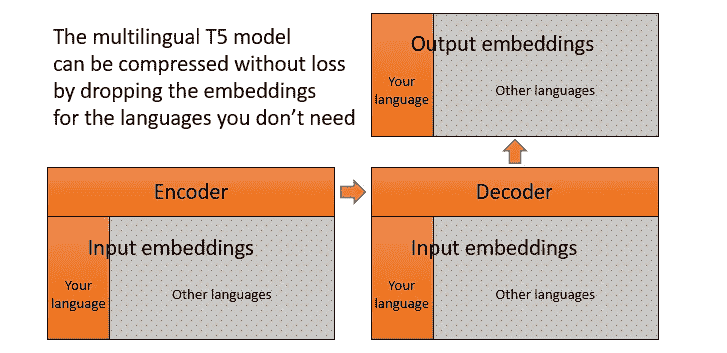

# 如何为单一语言调整多语言 T5 模型

> 原文：<https://towardsdatascience.com/how-to-adapt-a-multilingual-t5-model-for-a-single-language-b9f94f3d9c90?source=collection_archive---------12----------------------->

## [实践教程](https://towardsdatascience.com/tagged/hands-on-tutorials)

## 仅为您的语言的标记加载嵌入，以减少模型大小

[T5](https://arxiv.org/abs/1910.10683) 是谷歌的一个编码器-解码器转换器，曾经是几个 NLU 和 NLG 问题的 SOTA，现在仍然是 seq2seq 任务(如文本摘要)的基础。第一个 T5 型号是仅用于英语的，然后是大规模的[多语言版本](https://huggingface.co/google/mt5-base)。这个模型涵盖了 101 种语言，规模确实很大。

这篇文章展示了如何通过修剪冗余的嵌入从多语言模型中提取出单一语言模型。这将参数数量减少了两倍以上，而质量没有显著损失。对于俄语，我们的结果是[，但是你可以用 mT5 的 101 种语言中的任何一种来尝试。](https://huggingface.co/cointegrated/rut5-base)



三分之二的 MT5 参数是嵌入的，我们可以去掉不用的。图片由作者提供。

## 选择词汇

这个想法类似于论文[Load What your Need:多语言 BERT](https://arxiv.org/abs/2010.05609) 的一个小版本。我们使用原始记号赋予器来处理俄语语料库，统计不同记号的频率，并且仅保留足够频繁使用的记号，修剪所有其他记号。

我们还在模型中保留了少量的英语标记，使其成为双语的。我们需要这一点来使模型能够将知识从英语转移到俄语下游任务，还因为英语单词和短语经常出现在现代俄语文本中。

我们首先加载现有的多语言模型。

```
import torch
from transformers import T5ForConditionalGeneration, T5Tokenizer
tokenizer = T5Tokenizer.from_pretrained("google/mt5-base")
model = T5ForConditionalGeneration.from_pretrained('google/mt5-base')
```

该模型主要由嵌入组成:其 33%的参数是输入嵌入(在其编码器和解码器之间共享)，33%是输出嵌入。

```
def msize(m):
    return sum(p.numel() for p in m.parameters())print(msize(model.shared) / msize(model))   # 0.3298
print(msize(model.lm_head) / msize(model))  # 0.3298
```

为了估计不同标记的频率，我们从[莱比锡语料库](https://wortschatz.uni-leipzig.de/en/download/Russian)中提取了一个俄语和一个英语句子语料库。我们使用这两种语言是因为我们希望我们的模型最终是双语的。

```
import pandas as pd
import csv
from collections import Counter
from tqdm.auto import tqdm, trangedf_ru = pd.read_csv('rus-ru_web-public_2019_1M-sentences.txt', sep='\t', header=None, quoting=csv.QUOTE_NONE)
df_ru.columns = ['idx', 'text']
cnt_ru = Counter()
for text in tqdm(df_ru.text):
    cnt_ru.update(tokenizer.encode(text))
print(len(cnt_ru), len(cnt_ru)/tokenizer.vocab_size)  
# 58438 0.2336
```

在统计了俄语语料库中的标记后，我们发现只有 23%的模型词汇被使用。此外，前 20K 个标记构成了俄语语料库的 99%以上。对于英语来说，统计数据是相似的。

```
for top in 10_000, 20_000, 30_000:
    print(top, sum(v for k, v in cnt_ru.most_common(top)) / sum(cnt_ru.values()))
# 10000 0.9645
# 20000 0.9940
# 30000 0.9982
```

我们决定使用下列词汇:

*   原始令牌化器的 1K 个顶级令牌(以防万一)
*   英语词汇中的顶级 10K
*   俄语词汇前 20K 名
*   T5 使用的 100 个特殊令牌

这给了我们 30K 令牌的词汇表，是多语言版本中 250K 令牌的 12%。

```
new_tokens = set(range(1000))
for i, (k, v) in enumerate(cnt_en.most_common(10_000)):
    if k not in new_tokens:
        new_tokens.add(k)
for i, (k, v) in enumerate(cnt_ru.most_common(25_000)):
    if len(new_tokens) == 29_900:
        print(i, 'Russan tokens are included')
        break
    if k not in new_tokens:
        new_tokens.add(k)for t in range(tokenizer.vocab_size - 100, tokenizer.vocab_size):
    new_tokens.add(t)print(len(new_tokens))
kept_ids = sorted(new_tokens)
```

## 更新模型

更新神经网络很容易:只需替换其输入和输出嵌入的参数。这将模型大小减少了 58%(从 2.2GB 减少到 0.9GB)。

```
new_size = len(kept_ids)
new_emb = torch.nn.Embedding(new_size, model.shared.embedding_dim)
new_head = torch.nn.Linear(in_features=model.lm_head.in_features, out_features=new_size, bias=False)
for new_id, old_id in enumerate(kept_ids):
    new_emb.weight.data[new_id] = model.shared.weight.data[old_id]
    new_head.weight.data[new_id] = model.lm_head.weight.data[old_id]
model.shared.weight = new_emb.weight
model.lm_head.weight = new_head.weightmodel.config.__dict__['vocab_size'] = new_size
model.config.__dict__['_name_or_path'] = 'cointegrated/rut5-base'
```

更新记号赋予器出人意料地更加棘手。T5 使用 Sentencepiece tokenizer，用 C 实现，对 Python 是不透明的。幸运的是，我们可以下载它的模型，并使用它的 Protobuf 表示将其部署到 Python 中。

```
! wget [https://raw.githubusercontent.com/google/sentencepiece/master/src/sentencepiece_model.proto](https://raw.githubusercontent.com/google/sentencepiece/master/src/sentencepiece_model.proto)
! protoc --python_out=. sentencepiece_model.protoimport sentencepiece_model_pb2 as spmp
smp = tokenizer.sp_model.serialized_model_proto()
m = spmp.ModelProto()
m.ParseFromString(smp)print('the loaded model has pieces:', len(m.pieces))
new_pieces = [m.pieces[idx] for idx in kept_ids]
print('the new pieces:', len(new_pieces))# replace the content of the first 30K pieces
for i, p in enumerate(new_pieces):
    m.pieces[i].piece = p.piece
    m.pieces[i].score = p.score
    m.pieces[i].type = p.type# drop the remaining pieces
n = len(new_pieces)
for i in trange(len(m.pieces) - n):
    m.pieces.pop(len(m.pieces) - 1)print(len(m.pieces))
with open('new_sp.model', 'wb') as f:
    f.write(m.SerializeToString())new_tokenizer = T5Tokenizer('new_sp.model', extra_ids=0)
```

现在我们可以保存新的模型和新的记号赋予器。

```
new_tokenizer.save_pretrained('rut5-base')
model.save_pretrained('rut5-base')
```

到目前为止，创建模型的所有代码都可以在 Github 的[上获得。俄罗斯 T5 型号在](https://gist.github.com/avidale/44cd35bfcdaf8bedf51d97c468cc8001)[的 Huggingface 仓库](https://huggingface.co/cointegrated/rut5-base)有售。

坦率地说，这个模型本身是非常无用的，因为 mT5 只在预测缺失单词的无人监督的任务上受过训练。然而，这个模型可以针对许多其他任务进行微调:文本摘要、翻译、对话响应生成、释义等。在下一篇文章中，我们将展示如何进行这样的微调。订阅敬请关注！

这篇文章是由大卫·戴尔([https://daviddale.ru/en](https://daviddale.ru/en))写的，他是 NLP 的研究科学家和聊天机器人的开发者。