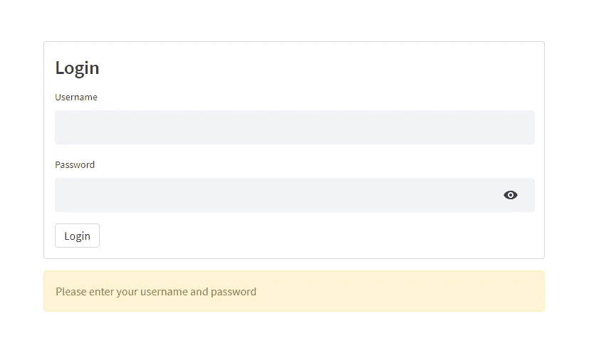
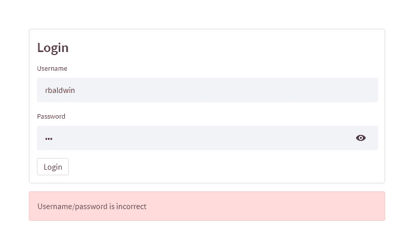
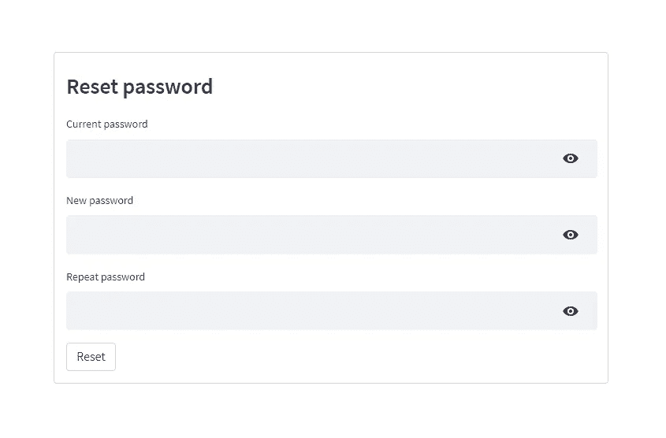
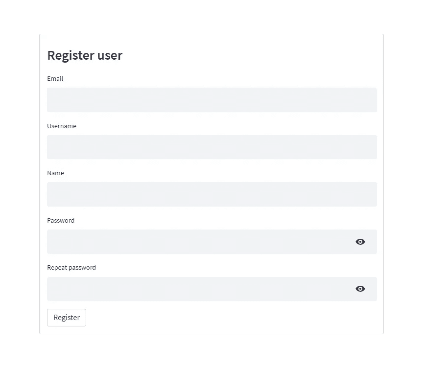
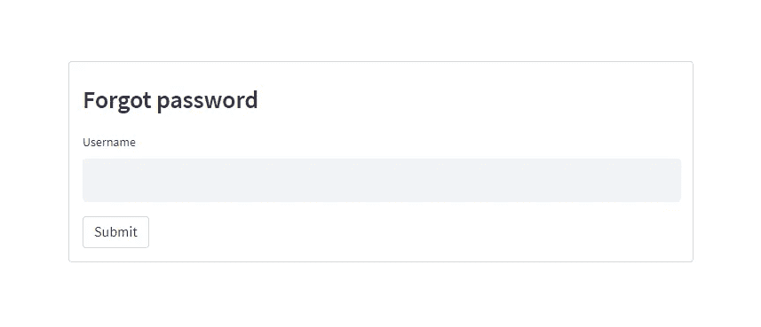
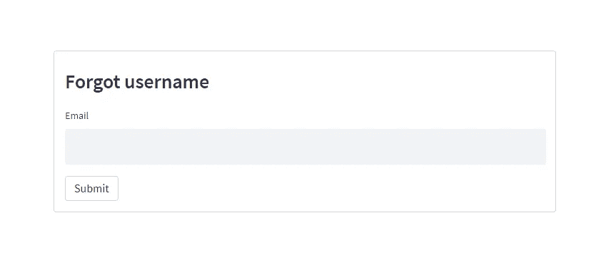
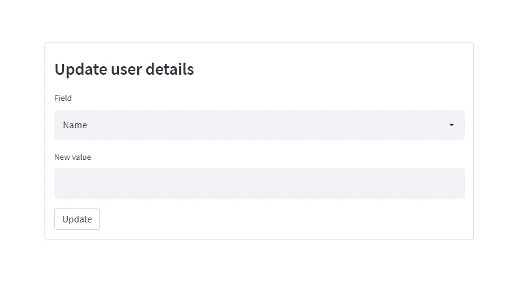

# 如何在 Streamlit 中添加用户认证服务

> 原文：<https://towardsdatascience.com/how-to-add-a-user-authentication-service-in-streamlit-a8b93bf02031?source=collection_archive---------1----------------------->

## 使用 Streamlit-Authenticator 开发安全登录表单


照片由[弗兰克](https://unsplash.com/@franckinjapan?utm_source=medium&utm_medium=referral)在 [Unsplash](https://unsplash.com?utm_source=medium&utm_medium=referral) 上拍摄

# 细流

[Streamlit](https://www.streamlit.io/) 自 2019 年 10 月成立以来，已经走过了极其漫长的道路。它增强了软件开发社区的能力，并有效地使我们开发和部署应用程序到云的方式民主化。然而，与所有新工具一样，还有一段路要走，尽管 Streamlit 团队不懈地努力部署新功能并解决来自社区的请求，但我们开发人员可以自行交付特定功能。

Streamlit 目前缺乏的一项功能是为其应用程序实施安全登录和身份验证服务的能力，但 Streamlit Cloud 除外，它提供身份验证作为一项高级功能。在当前的形式下，没有无缝的方法来为我们的自部署应用程序实现登录表单。虽然对许多开发人员来说，这不是问题，但对其他人来说，这可能是一个问题。想象一下，如果你试图开发一个应用程序，其中包含受限或敏感的内容，这些内容可能只提供给你的一部分受众。在这种情况下，缺少安全的身份验证模块会使 Streamlit 成为一个不合适的框架。幸运的是，有了[Streamlit-Authenticator](https://github.com/mkhorasani/Streamlit-Authenticator),您就可以随心所欲了。

# 履行

对于本教程，我们将生成一个简单的登录表单，该表单将对一组预定义的用户进行身份验证，以访问我们的 web 应用程序上的内容，还将演示用于重置密码、更新用户详细信息、注册新用户的小部件，并为用户提供找回忘记的用户名和/或密码的方法。如果您还没有这样做，请启动 Anaconda 或您选择的任何其他 Python IDE，并安装 [Streamlit-Authenticator](https://github.com/mkhorasani/Streamlit-Authenticator) :

```
pip install streamlit-authenticator
```

然后继续将以下包导入到脚本中:

```
import streamlit as st
import streamlit_authenticator as stauth
```

## 1.哈希密码

最初创建一个 YAML 配置文件，并定义您的用户凭证(名称、用户名和明文密码)。此外，输入将存储在客户端浏览器上的 JWT cookie 的名称、随机密钥和过期天数，以启用无密码重新身份验证。如果不需要重新认证，可以将过期天数设置为 0。最后，定义预授权用户的电子邮件列表，这些用户可以使用 *register_user* 小部件注册并将其凭证添加到配置文件中。

```
credentials:
  usernames:
    jsmith:
      email: jsmith@gmail.com
      name: John Smith
      password: abc # To be replaced with hashed password
    rbriggs:
      email: rbriggs@gmail.com
      name: Rebecca Briggs
      password: def # To be replaced with hashed password
cookie:
  expiry_days: 30
  key: some_signature_key # Must be string
  name: some_cookie_name
preauthorized:
  emails:
  - melsby@gmail.com
```

然后使用哈希模块将明文密码转换为哈希密码。

```
hashed_passwords = stauth.Hasher(['abc', 'def']).generate()
```

最后，用哈希密码替换配置文件中的纯文本密码。

## 2.创建登录小部件

随后，将配置文件导入到您的脚本中，并创建一个身份验证对象。

```
from yaml.loader import SafeLoaderwith open('../config.yaml') as file:
    config = yaml.load(file, Loader=SafeLoader)

authenticator = stauth.Authenticate(
    config['credentials'],
    config['cookie']['name'],
    config['cookie']['key'],
    config['cookie']['expiry_days'],
    config['preauthorized']
)
```

最后，如下所示呈现登录小部件。在这里，您需要为登录表单提供一个名称，并指定表单的位置，即主体或侧栏(默认为主体)。

```
name, authentication_status, username = authenticator.login('Login', 'main')
```



[Streamlit-Authenticator](https://github.com/mkhorasani/Streamlit-Authenticator) 登录表单。图片作者。

## 3.认证用户

然后，您可以使用返回的名称和身份验证状态来允许经过验证的用户访问任何受限制的内容。此外，您可以在您的主体或侧边栏的任何位置添加一个可选的注销按钮(默认为主体)。

```
if authentication_status:
    authenticator.logout('Logout', 'main')
    st.write(f'Welcome *{name}*')
    st.title('Some content')
elif authentication_status is False:
    st.error('Username/password is incorrect')
elif authentication_status is None:
    st.warning('Please enter your username and password')
```

如果您需要访问持久名称、验证状态和用户名变量，您可以使用 *st.session_state["name"]* 、*ST . session _ state[" authentic ation _ status "]*和*ST . session _ state[" username "]*通过 Streamlit 的会话状态检索它们。这样，您可以使用 Streamlit-Authenticator 跨多个页面对用户进行身份验证。

```
if st.session_state["authentication_status"]:
    authenticator.logout('Logout', 'main')
    st.write(f'Welcome *{st.session_state["name"]}*')
    st.title('Some content')
elif st.session_state["authentication_status"] is False:
    st.error('Username/password is incorrect')
elif st.session_state["authentication_status"] is None:
    st.warning('Please enter your username and password')
```


[Streamlit-Authenticator](https://github.com/mkhorasani/Streamlit-Authenticator)认证内容。图片作者。

或者提示未经验证的用户输入正确的用户名和密码。



[Streamlit-Authenticator](https://github.com/mkhorasani/Streamlit-Authenticator)未经验证的登录尝试。图片作者。

请注意，注销会将认证状态恢复为*无*，并且还会删除相关的重新认证 cookie。

## 4.创建密码重置小部件

您可以使用 reset_password 小部件来允许登录用户修改他们的密码，如下所示。

```
if authentication_status:
    try:
        if authenticator.reset_password(username, 'Reset password'):
            st.success('Password modified successfully')
    except Exception as e:
        st.error(e)
```



[Streamlit-Authenticator](https://github.com/mkhorasani/Streamlit-Authenticator)reset _ password 小工具。图片作者。

## 5.创建新的用户注册小部件

您可以使用 *register_user* 小部件来允许用户注册您的应用程序，如下所示。如果您需要对用户进行预授权，请将*预授权*参数设置为 True，并将他们的电子邮件添加到配置文件中的*预授权*列表中。一旦他们注册，他们的电子邮件将自动从配置文件的*预授权*列表中删除。或者，为了允许任何人注册，将*预授权*参数设置为 False。

```
try:
    if authenticator.register_user('Register user', preauthorization=False):
        st.success('User registered successfully')
except Exception as e:
    st.error(e)
```



[Streamlit-Authenticator](https://github.com/mkhorasani/Streamlit-Authenticator)register _ user _ widget。图片作者。

## 6.创建忘记密码小部件

您可以使用 *forgot_password* 小部件让用户生成一个新的随机密码。该密码将被自动散列并保存在配置文件中。该小工具将返回用户名，电子邮件和新的随机密码的用户，然后应该转移到他们的安全。

```
try:
    username_forgot_pw, email_forgot_password, random_password = authenticator.forgot_password('Forgot password')
    if username_forgot_pw:
        st.success('New password sent securely')
        # Random password to be transferred to user securely
    else:
        st.error('Username not found')
except Exception as e:
    st.error(e)
```



[Streamlit-Authenticator](https://github.com/mkhorasani/Streamlit-Authenticator)forgot _ password 小工具。图片作者。

## 7.创建忘记用户名小部件

您可以使用 *forgot_username* 小部件让用户找回他们忘记的用户名。该部件将返回用户名和电子邮件的用户，然后应该转移到他们的安全。

```
try:
    username_forgot_username, email_forgot_username = authenticator.forgot_username('Forgot username')
    if username_forgot_username:
        st.success('Username sent securely')
        # Username to be transferred to user securely
    else:
        st.error('Email not found')
except Exception as e:
    st.error(e)
```



[Streamlit-Authenticator](https://github.com/mkhorasani/Streamlit-Authenticator)forget _ username 小部件。图片作者。

## 8.创建更新用户详细信息微件

您可以使用 *update_user_details* 小部件来允许登录用户更新他们的姓名和/或电子邮件。小部件将自动在配置文件和重新认证 cookie 中保存更新的详细信息。

```
if authentication_status:
    try:
        if authenticator.update_user_details(username, 'Update user details'):
            st.success('Entries updated successfully')
    except Exception as e:
        st.error(e)
```



[Streamlit-Authenticator](https://github.com/mkhorasani/Streamlit-Authenticator)update _ user _ details 小工具。图片作者。

## 9.更新配置文件

请确保在更新凭证或使用*重置 _ 密码*、*注册 _ 用户*、*忘记 _ 密码*或*更新 _ 用户 _ 详细信息*小工具时，重新保存配置文件。

```
with open('../config.yaml', 'w') as file:
    yaml.dump(config, file, default_flow_style=False)
```

# 结论

既然您已经看到了在 Streamlit 中使用哈希和 JWT cookie 创建和使用安全的用户认证服务是多么简单，那么就放心地在您自己的应用程序中尝试吧。

## 使用 Streamlit 开发 Web 应用程序:

<https://www.amazon.com/Web-Application-Development-Streamlit-Applications/dp/1484281101?&linkCode=ll1&tag=mkhorasani09-20&linkId=a0cb2bc17df598006fd9029c58792a6b&language=en_US&ref_=as_li_ss_tl>  

## GitHub 资源库:

<https://github.com/mkhorasani/Streamlit-Authenticator>  

如果您想了解更多关于数据可视化和 Python 的知识，请随时查看以下(附属链接)课程:

## 使用 Streamlit 和 Python 构建数据科学 Web 应用程序:

<https://www.coursera.org/projects/data-science-streamlit-python?irclickid=xgMQ4KWb%3AxyIWO7Uo7Vva0OcUkGQgTzrEwvr1c0&irgwc=1&utm_medium=partners&utm_source=impact&utm_campaign=3308031&utm_content=b2c>  

## 面向所有人的 Python 专业化:

<https://www.coursera.org/specializations/python?irclickid=xgMQ4KWb%3AxyIWO7Uo7Vva0OcUkGQgW16Ewvr1c0&irgwc=1&utm_medium=partners&utm_source=impact&utm_campaign=3308031&utm_content=b2c>  

## 使用 Python 实现数据可视化:

<https://www.coursera.org/learn/python-for-data-visualization?irclickid=xgMQ4KWb%3AxyIWO7Uo7Vva0OcUkGQgW2aEwvr1c0&irgwc=1&utm_medium=partners&utm_source=impact&utm_campaign=3308031&utm_content=b2c>  

# 新到中？您可以在此订阅和解锁无限文章[。](https://khorasani.medium.com/membership)