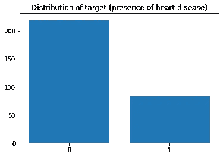
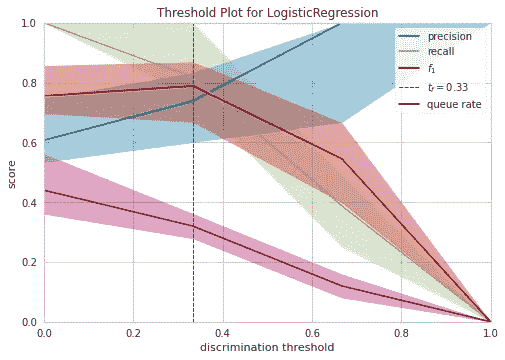

# 如何将决策阈值调整添加到您的端到端 ML 管道中

> 原文：<https://towardsdatascience.com/how-to-add-decision-threshold-tuning-to-your-end-to-end-ml-pipelines-7077b82b71a?source=collection_archive---------11----------------------->

在本文中，我将向您介绍我在处理不平衡数据时使用的两个包( *imblearn* ，虽然我也经常使用，但不在其中)。一个将帮助您调整模型的决策阈值，第二个将使您的模型在部署时使用选定的阈值。

# 你为什么要在乎？

首先，作为一名每天与客户打交道的数据科学家，我解决的**绝大多数问题都是不平衡二进制分类问题**。如果你想一想，如果你对你的顾客、病人、机器等有疑问。这很可能是一个“是/否”的问题。如果你对这个问题感兴趣，也很可能是因为两个答案中的一个不太常见，但对你来说更重要:*“我的顾客会购买什么吗？”*或*“我的机器在接下来的 X 小时内需要维护吗？”。*

对于不平衡的问题，有许多奇特的技术:多数类的随机欠采样、少数类的随机过采样、 [SMOTE](https://arxiv.org/pdf/1106.1813.pdf) 、 [ADASYN](https://ieeexplore.ieee.org/document/4633969) …以及许多优秀的中等文章，以学习掌握它们。这篇文章是关于一个简单得多，但在我看来，**不平衡环境中更普遍的问题:** **调整决策阈值，并将其“嵌入”到您的模型中。**

在接下来的几节中，我将使用 [**scikit-lego**](https://scikit-lego.netlify.app/) ，这是一套非常棒的 sklearn 扩展(只要你认为“我希望 sklearn 可以这样做……”就可以检查这个包)和<https://www.scikit-yb.org/en/latest/>**，这是一个用于机器学习可视化的包。它们都可以很好地与 sklearn 一起工作，所以你可以混合和匹配函数和类。**

**在我们开始之前的一些免责声明:首先，我假设你对 sklearn 有一些熟悉，所以不会深入每一行代码的细节。此外，我在这里的目标只是获得一些工作管道作为示例，因此**我有意跳过数据科学过程的基本步骤**，包括检查共线性、特征选择等。**

# **构建初始 sklearn 管道**

*****TL；DR:在这一节中，我将提醒您为什么管道会摇摆，并在样本数据集上创建一个管道。如果您是管道专家，请跳到下一部分！*****

**当您构建和部署机器学习模型时，通常最佳做法是尝试使它们“尽可能端到端”。换句话说，试着将大多数与模型相关的数据转换组合成一个单独的对象，我们称之为模型。而在 sklearn 的世界里，你是通过管道来做到这一点的。**

**我开始使用 sklearn 管道作为数据科学的最佳实践。如果你不使用它们，你绝对应该阅读来自[的这篇文章](https://medium.com/u/2dd5609d8196?source=post_page-----7077b82b71a--------------------------------):其中一节解释了如果你不使用它们会出现什么问题，特别是数据泄露。随着我越来越多地使用它们，我意识到**通过使用管道，您还可以将更多的东西抽象成您所谓的“您的模型”，**，这对于部署来说非常棒。**

> ****通过使用管道，你还可以将更多的东西抽象成你所谓的“你的模型”****

**为了更具体地说明这一点，让我们在一个样本数据集上构建一个管道。我将使用 sklego 附带的关于心脏病的样本数据集。**

**这个数据集非常简单:9 个数值型(为了简单起见，我将有序的类别如 *cp* 保留为数值)，3 个二元型( *sex，fbs，exang* )，1 个分类型( *thal* )。目标是二元的，不平衡的:只有 27%的样本有阳性标记。**

****

**我们不平衡的目标(图片来自 [sklego 文档](https://scikit-lego.netlify.app/datasets.html)**

**我构建了一个由两个管道组成的快速管道，一个管道用于数值(为了简单起见，我将二进制和有序分类特征视为数值)，另一个管道用于分类值。在训练数据中没有缺失值，但是为了防止它们在生产中出现，我加入了一些简单的插补。我注意到 *thal* 特性的一些类别似乎是错误的，所以我手动将我想要的类别提供给一个热编码，这样 sklearn 就不会对它们进行编码。**

**在下面的代码中，我实际上已经在使用 sklego 了。通常，我会为数字和分类特性编写不同的管道，然后定义要应用它们的特性列表，并使用 [ColumnTransformer](https://scikit-learn.org/stable/modules/generated/sklearn.compose.ColumnTransformer.html) 将所有东西放在一起。有了 sklego，就简单多了:**有一个**[**PandasTypeSelector**](https://scikit-lego.netlify.app/api/preprocessing.html?highlight=pandastypeselector#sklego.preprocessing.PandasTypeSelector)**类，可以根据它们的熊猫类型选择列。我简单地把一个放在我的两个管道的开始，然后用一个 [FeatureUnion](https://scikit-learn.org/stable/modules/generated/sklearn.pipeline.FeatureUnion.html) 合并两个管道。****

**现在我们已经完成了预处理部分，我们需要做的就是添加模型。这是一个小数据集和一个简单的问题，因此我将建立一个简单的逻辑回归。我将使用网格搜索来调整正则化参数 C，并将其他参数保留为默认值(再次，跳过模型构建的重要部分，不要在家复制！).**

**好了，我们现在有一个训练有素的管道与几个步骤，包括一个简单的模型。请注意，现在，我们还没有对不平衡做任何事情，但我们已经准备好了有趣的部分！**

# **调整决策阈值**

**让我们透过混淆矩阵的镜头来看看模型预测。请注意，因为我们要做一些额外的调优，所以我们在训练集上这样做(在一个真实的项目中，我可能会分成训练、测试和验证来正确地做事情)。这里我们开始使用 yellowbrick，因为尽管使用 matplotlib 制作这种图表很容易，但是正如你所看到的，使用 [ConfusionMatrix](https://www.scikit-yb.org/en/latest/api/classifier/confusion_matrix.html) 类代码要简单得多。**

****

**我们的混淆矩阵显示，我们有更多的假阴性比假阳性**

**首先，我们可以看到这个样本模型做得很好(交叉验证的[平均精度](https://scikit-learn.org/stable/modules/generated/sklearn.metrics.average_precision_score.html)是 0.78):精度(当我们预测 1 时，我们有多少次是正确的？)是 0.8，而回忆(我们预测了多少真 1？)是 0.67。现在，我们问自己:这是精确和召回之间的正确平衡吗？我们喜欢低估还是高估我们的目标？在现实生活中，这是您将数据科学问题与真正的底层业务问题联系起来的时候。**

> **现在，我们问自己:这是精确和召回之间的正确平衡吗？我们喜欢低估还是高估我们的目标？在现实生活中，这是您将数据科学问题与真正的底层业务问题联系起来的时候。**

**为了做出这个决定，我们看一个不同的图表，这就是 yellowbrick 真正强大的地方，它为我们提供了 [DiscriminationThreshold](https://www.scikit-yb.org/en/latest/api/classifier/threshold.html) 类。任何二元模型通常会输出一个概率或一个可用作概率代理的分数，您得到的最终输出(0 或 1)是通过对该分数应用阈值而获得的。我们能做的是定义依赖于该阈值的不同量，然后不断移动阈值，以观察这些量如何增加或减少。通常，随着阈值的增加，精度会增加，而回忆会减少:例如，如果将阈值设置为 0.9，则只有当 1 的可能性比 0 大得多时，模型才会预测 1，因此，预测的 1 会更少，但正确的机会会更多。**

****

**由 DiscriminationThreshold 类生成的图表**

**这张图表上有很多信息。首先，蓝、绿、红线对应的是非常常见的指标。我们已经讨论过精度和召回率，f1 是两者的调和平均值。我们可以看到，当第二个函数减小时，第一个函数增大，并且存在一个最佳点，在该点 f1 最大，即在精确度和召回率之间的平衡是理想的。Yellowbrick 通过在理想阈值处绘制一条虚线来帮助我们。**

**紫色数量指的是一个不同的数量，在学习数据科学时，您不一定要了解这个数量，但在现实世界的数据科学用例中，这个数量非常重要。yellowbrick 文档很好地描述了这一指标:**

> ****排队率**:“队列”是垃圾邮件文件夹或欺诈调查台的收件箱。此度量描述必须审查的实例的百分比。如果审查成本很高(如防止欺诈)，则必须根据业务要求尽量降低成本。如果没有(如垃圾邮件过滤器)，这可以优化，以确保收件箱保持干净。**

**最后，误差带向我们展示了这些量的不确定性:正如您在上面的代码片段中看到的，yellowbrick 为我们重新拟合了模型一定次数(默认为 50 次)，我们在这里看到的是中位数和对应于四分位数范围(我手动设置)的带。**

**在我们的例子中，我们可以遵循 yellowbrick 的默认行为，即选择最佳 f1 分数(可以使用`DiscriminationThreshold`的`argmax`参数进行更改)，这意味着对于这个特定的问题，我们希望在精确度和召回率之间取得良好的平衡。**

**最后要注意的是，当我们执行网格搜索时，我们使用`average_precision`选择了最佳模型，这很重要。例如，如果我们使用 f1 分数，那么我们将只依赖默认阈值，因此可能会错过在不同阈值下产生更好 f1 分数的超参数组合。因此，**我确保使用与阈值无关的度量来选择模型，然后才调整阈值。****

# **改变我们模型的决策阈值**

**在最后一部分，我们回到“端到端”的讨论。在您当前的不平衡模型中，您可能已经执行了决策阈值调优。但是接下来会发生什么呢？现在，您有了一个预测概率或分数的模型和一个二元预测，并且您知道不要相信该二元预测，因为您想要覆盖默认阈值。**

**但是，你究竟如何越过这个门槛呢？嗯，这个问题困扰我很久了。在我投入生产的一系列模型中，我们会将理想的阈值存储在某个地方，例如在部署环境中的环境变量中，然后调用模型的`predict_proba()`方法，并应用该阈值。维护起来比看起来要困难得多，因为你必须担心两件事:模型和它的门槛。每当你重新部署一个新版本的模型时，你都需要确保与它保持一致……疯狂的是，在 sklearn 存储库上已经有[一个问题](https://github.com/scikit-learn/scikit-learn/issues/4813)公开了 5 年多了！**

**嗯，正如我在本文开头提到的，每当你想到“我希望 sklearn 那样做……”的时候，就去 sklego 看看吧！**

**上面的代码片段有点难读，但是真的很有用！首先，我们从 yellowbrick visualizer 中提取最佳阈值，方法是访问我们选择的度量标准的底层 cv 分数数组(这里，`visualizer.argmax`等于`f1`)并获取它的`argmax()`。这为我们提供了最佳阈值在`visualizer.thresholds_`数组中的位置。据我所知(如果有更好的办法请掉个评论！)这是获得 yellowbrick 之前打印的最佳阈值(虚线)的唯一方法。**

**一旦我们有了这个，我们就创建了我们的最终管道，通过简单地将`best_model`包装在一个 [Thresholder](https://scikit-lego.readthedocs.io/en/latest/meta.html#Thresholder) 对象中，当我们调用`.predict()`而不是默认的 0.5 值时，这个包装器负责应用指定的阈值。因为我们在创建 Thresholder 时传递了`refit=False`，所以`.fit()`调用不会重新调整包装的模型(请随意检查[源代码](https://scikit-lego.netlify.app/_modules/sklego/meta/thresholder.html#Thresholder.fit)以查看该调用中发生了什么)。**

**而且，就是这样！我们现在有一个完整的管道，不仅可以进行所有的预处理(因为访问您的模型的人不应该知道您正在进行缩放或一个热编码)，使用您的业务问题的最佳阈值(因为我们不想低估或过度预测我们的目标)，并将该阈值直接嵌入到模型中，实现更端到端模型的承诺！**

# **编辑-2023 对此博客帖子的编辑**

**在本教程的原始版本中，最后一个代码片段稍微复杂一些(我重新定义了一个新的管道，并且只包装了估计器，即带有阈值的管道的最后一步)。从那时起，Sklego 团队实际上使事情变得简单了一点，如上所示，这要感谢[这个 PR](https://github.com/koaning/scikit-lego/pull/507) 。此外，正如他们在相关的[问题](https://github.com/koaning/scikit-lego/issues/490)中提到的，通过利用`refit`参数，可以更进一步，在调整其他超参数时(在 GridSearchCV 期间)直接执行阈值调整。为了保持文章的主要结构，我将阈值调整作为一个单独的步骤使用 yellowbrick(这也有其他好处),但两个选项都工作得很好！**