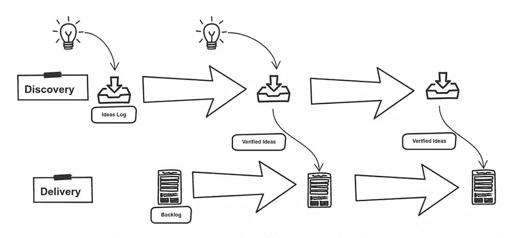

# 如何在分析中添加发现阶段并创建双轨敏捷

> 原文：<https://towardsdatascience.com/how-to-add-discovery-phase-and-create-dual-track-agile-in-analytics-527b090d4fab?source=collection_archive---------68----------------------->

## 在用看板构建 BI 解决方案中实施设计思维方法

在管理[数据质量控制面板](/data-quality-dashboard-9c60f72b245c)的五年时间里，我们从集中式的老式 BI 工具转变为以用户为中心的现代平台，支持自助分析。使命保持不变—通过显示相关指标和仪表板来帮助提高数据质量。

[@钳工](https://unsplash.com/@benchaccounting)在 [Unsplash](https://unsplash.com/s/photos/dashboard?utm_source=unsplash&utm_medium=referral&utm_content=creditCopyText) 上的照片

除了工具本身的形状，开发过程也经历了漫长的旅程。结合设计思维，精益和敏捷是目前交付过程的基础。

为什么这很重要:

1.更好的产品—最终用户更好的验证

只有经过验证的功能才会交付给客户。它最小化了发布一个很少使用的特性的机会

2 效率—减少浪费，降低成本

*   将流程分成两部分意味着更有可能在第一次就做对，而不是通过几次迭代来校准产品，这导致了更快的开发和发布周期
*   因为产品 backlog 中只允许有效的特性，所以浪费的资源会更少。

我们从敏捷和开发开始，让用户清楚地定义他们需要的功能需求。该产品以正确的方式响应并动态调整客户需求。随着成熟和技能的增长，我们有一种感觉，通过在数据质量方面更加主动，我们可以做得更多。

我们的目标是交付超出现成需求的特性，并开始创建一个分析解决方案，从而带来更多的价值，并使用数据分析。我们的专业知识和技能在增长，但我们仍然不能完全满足客户的需求。

这是设计 101 工作坊开始的时候。

关键的学习是与我们的用户感同身受，让他们谈论问题，而不只是等待他们提供需求。我们开始利用我们的经验来发现和解决问题，而不仅仅是开发软件。

我们的方法发生了变化，我们正在创建向我们的利益相关者展示的微型产品(小型 MVP 或我们如何称之为最小可行仪表板)，然后我们跟进最初的反馈，要么继续开发，要么只是减少损失。

概念是设计思维、精益创业和敏捷开发的结合，它包含两个共存的轨道——发现和开发。看板系统中的两条轨道并行工作，但是有不同的范围和目标。

作者图片

**交付**是以正确的方式生产产品。使用敏捷，我们可以动态响应，并允许我们的团队快速适应客户的需求。

**发现**是关于使用以下方式制造合适的产品:

*   **同理心:**抓住真实的用户问题，建立对目标用户/顾客的同理心。这是关于研究和寻找机会。主要工具是访谈、调查和分析
*   构思、创新和解决问题:产生尽可能多的想法和潜在的解决方案。
*   **原型和测试:**为产生的想法建立低保真度的原型，准备在真实的或有代表性的用户身上进行测试。它允许在提交构建想法之前创建有效的想法。

探索路线应回答 3 个问题，外加一个额外问题:

*   用户会用吗？(值)
*   用户能用吗？(可用性)
*   我们能建造它吗？(努力)

这 3 个是标准的，但是我们为功能特性增加了一个

*   我们能重用它吗(可重用性)

因此，如果我们设法为重复数据删除或错误数据警报等功能创建一个有用的统计算法，那么另一个内容控制面板应该考虑的潜在价值。在许多情况下，这可能会扭转局势。

为了分散和更加敏捷，我们将产品(现在更多的是一个解决方案或平台)拆分为不同所有者和客户的较小产品，这样我们就可以轻松地执行设计阶段，因为应用程序应该服务于非常不同的用户组

**技术变革至关重要。**

开始时，整个应用程序是自定义开发的后端数据库级别加上记分卡的 C#网页。在某个时候，我们开始使用 PowerBI，这是一个游戏改变者，因为我们可以用快速切片和骰子来调整报告，而不是用 sprint planning 来处理每个小变化。

我们也有了第一批超级用户，我们能够使用我们准备的干净数据集创建他们的报告。

由于团队由开发人员和分析师组成，我们试图避免在两个轨道之间设置界限，并试图让每个人都参与进来，但开发人员将更多地参与数据库级别的后端开发和一些应用程序，而分析师则更多地专注于设计轨道，拥有一些额外的权力 bi 报告创建，但这只是纸上谈兵，实际上有很多合作。

双轨允许团队将精力投入到正确的功能上，并推出能够带来价值的产品。订阅并关注我，不要错过我们团队如何实现这一目标的下一部分。