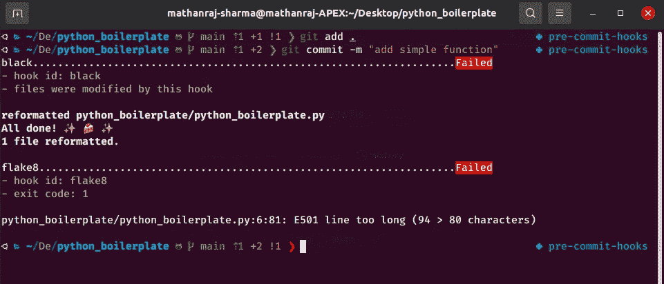
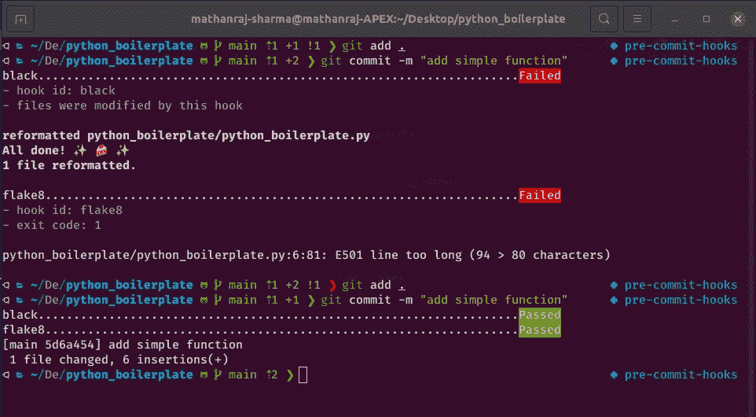
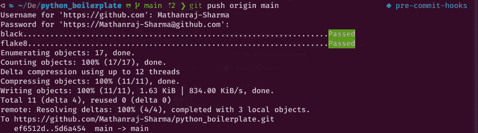

# 如何使用预提交框架为您的 python 项目添加 git 挂钩

> 原文：<https://towardsdatascience.com/how-to-add-git-hooks-for-your-python-projects-using-the-pre-commit-framework-773acc3b28a7?source=collection_archive---------8----------------------->


PC:维基媒体(【https://commons.wikimedia.org/wiki/File:Fish-hook.JPG】T2

## 为什么我们需要饭桶挂钩？

作为开发人员，我们需要确保我们正在编写的程序的可读性、可写性和可靠性。如果我们采取 git repo，多个贡献者每天编写或修改数百行代码，新的贡献者进来，很少人出去。所以为了使代码库一致，我们必须遵循一定的标准。例如，某些代码格式样式(黑色)或林挺样式(flake8)等。通常，这些健全性检查发生在提交(提交)代码以供审查之前，也可能有提交之后需要完成的操作，比如维护内部日志。

在深潜之前，让我告诉你我们今天要看什么，

1.  什么是 Git 钩子？
2.  什么是预提交框架？
3.  如何在 python 项目中使用预提交框架？

## 什么是 Git 钩子？

正如我在上面提到的，当开发工作流中发生事件时，我们需要执行某些动作(任务)，这就是所谓的钩子。

*Git 挂钩是每当 Git 存储库中发生特定事件时自动运行的脚本。*

例如，在每次提交之前运行黑色格式化和薄片 8 林挺。实际上，我们可以在 git 事件的不同阶段添加钩子。

*   预提交:-在提交前运行特定的钩子，如果失败，则中止提交
*   预合并-提交:-在合并前运行某个钩子，如果失败，中止合并
*   预推送:-在推送至远程存储库之前运行某个挂钩，如果失败，则中止推送
*   提交后:-在成功提交后立即运行钩子
*   结帐后:-从一个分支结帐后立即运行挂钩
*   合并后:-在成功合并后立即运行挂钩
*   等等

当我们做`git init`时，它将最常用的 git 钩子添加到`.git/hooks/`，[中，我们可以使用最常用的脚本语言编写自己的钩子。](https://git-scm.com/book/en/v2/Customizing-Git-Git-Hooks)但今天我们将看到一个旨在简化这一过程的框架。

## 什么是预提交框架？

这是一个管理和维护多语言 git 挂钩的框架。你可能会有一个问题，为什么我们需要一个钩子的框架。

随着我们创建更多的库和项目，我们可能会发现跨项目共享我们的预提交钩子是痛苦的。我们不得不从一个项目到另一个项目复制和粘贴笨拙的 bash 脚本，并且不得不手动改变钩子以适应不同的项目结构。有时我们需要的一些好的 linters 或其他测试工具，可能不是用我们项目中使用的语言编写的。

预提交是一个用于预提交挂钩的多语言包管理器。我们可以简单地指定我们想要的钩子列表，预提交管理任何用任何语言编写的钩子的安装和执行，而不需要任何 root 权限。

## 如何在 python 项目中使用预提交框架？

1.  安装提交前框架

```
pip install pre-commitorconda install -c conda-forge pre-commit
```

将`.pre-commit-config.yaml`添加到项目的根文件夹中。在这个例子中，我将展示如何为每次提交和推送添加黑色格式和林挺。

让我们在这里分解每个组件，

*   default_stages:-钩子的 stages 属性的配置级默认值。这只会覆盖不设置阶段的单个挂钩。
*   default_language_version:-如果没有为各个挂钩设置 language_version，则应该使用的默认语言版本。
*   仓库:-仓库映射列表
*   repo:-git clone 的存储库 URL，钩子的代码将从这里获取。
*   版本:-需要使用哪个版本的回购(标签)
*   钩子:-钩子映射的列表，钩子映射允许用户从 repo 中选择需要使用哪个钩子，并允许定制。
*   id:回购中的挂钩名称。
*   args:需要为该钩子传递命令行参数。
*   exclude:- regex 表示要为该挂钩排除的文件/文件夹名称。
*   类型:-该钩子要考虑的文件类型。

[还有很多组件，可以自定义钩子。](https://pre-commit.com/#pre-commit-configyaml---repos)

2.添加配置文件后，运行下面的命令来安装钩子

```
pre-commit install --hook-type pre-commit hook-type pre-post
```

这将安装应该在提交和推送之前运行的挂钩。

3.修改项目中的任何文件，并尝试提交它们



失败的预提交(PC:作者)

这里，由于一些代码重新格式化和 lint 错误，我的钩子失败了。注意，如果任何挂钩失败，那么提交将被中止。解决问题并重新提交。



成功的预提交(PC:作者)

如果您已经配置了任何预推挂钩，这将是相同的。



成功的预推送(PC:作者)

你可以在这里找到完整的源代码，[https://github.com/Mathanraj-Sharma/python_boilerplate](https://github.com/Mathanraj-Sharma/python_boilerplate)

总之，git 钩子就是我们希望在 git 事件发生时触发的任何脚本。它有助于自动化重复性工作，以保持所编写代码的一致性。在早期阶段，它可能看起来不太有效，但是随着项目的增长和更多贡献者的加入，我们可以感受到 git 挂钩的好处。

编码快乐！！！