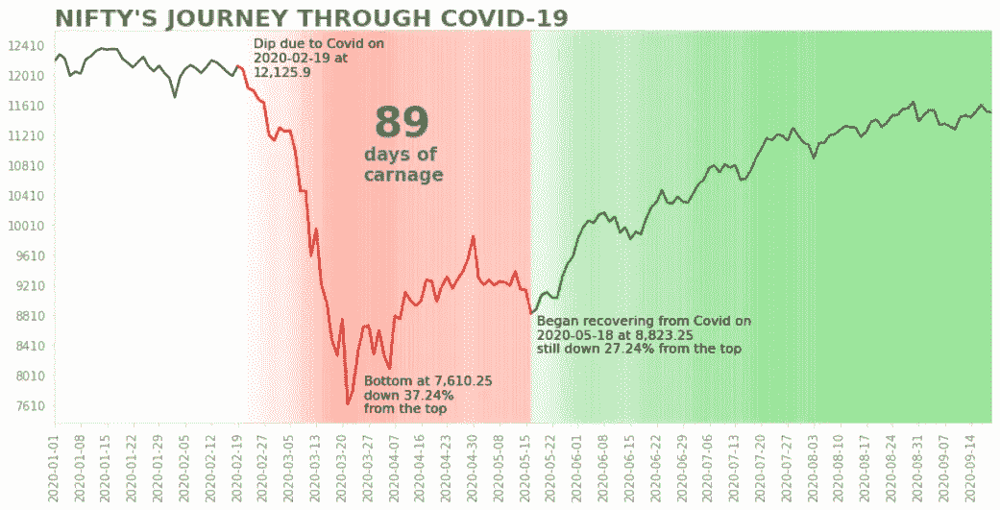
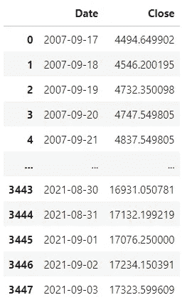
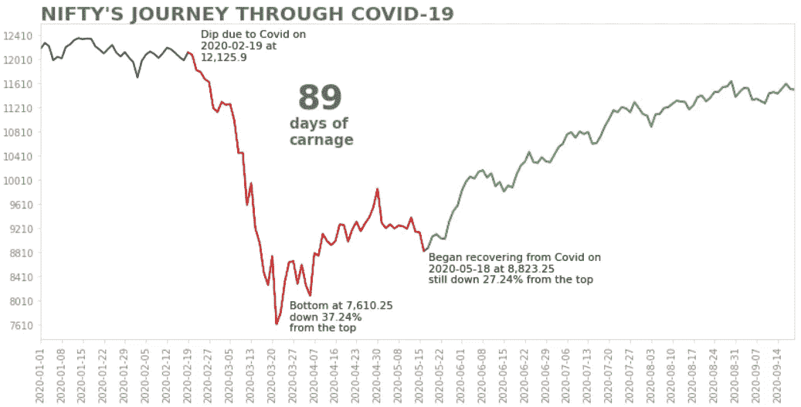

# 如何向 Python 绘图添加渐变背景

> 原文：<https://towardsdatascience.com/how-to-add-gradient-background-to-python-plots-9beda811ea19?source=collection_archive---------14----------------------->

## 本文讨论了一种在 Python 中向绘图添加渐变背景的简单方法

作者图片

我们有时可能需要给绘图添加多色背景，以突出绘图的几个部分。例如，我们可以分别用红色和绿色突出显示衰退和复苏的时期。在本文中，我们将讨论在 Python 中实现这一点的简单而有效的方法。对于 Tableau 用户，这类似于添加参考波段。

我们将讲述 Nifty(印度股票市场的基准指数)在新冠肺炎期间的表现。我们将分别用红色和绿色突出显示低迷期和恢复期，并使用渐变背景来描述波动性。

在上面的代码片段中，变量 ***nifty*** 存储 nifty 从 2020 年 1 月 1 日到 2020 年 9 月 18 日的收盘值。变量 ***slump*** 存储了 Nifty 从 2020 年 2 月 19 日到 2020 年 5 月 18 日的收盘值，这是 Nifty 因新冠肺炎而崩盘的时期。变量 ***recovery*** 存储 Nifty 从 2020 年 5 月 18 日到 2020 年 9 月 18 日的收盘值，这是 Nifty 开始从新冠肺炎复苏的时期。下面是 ***俏皮的*** 数据框的快照。

漂亮的数据框(图片由作者提供)

为了理解情节中的内容，我们将绘制没有任何背景颜色的时间序列，并讲述 Nifty 在新冠肺炎的旅程。

作者图片

在上面的图中，衰退和复苏的时期分别用红色和绿色突出显示。有一些注释突出了主要事件。还有一个更大字体的注释，强调了屠杀的天数。如果我们需要描述萧条和复苏时期的波动性，那该怎么办？我们可以通过使用渐变背景来做到这一点。虽然这种方法可能计算量很大，但使用它可以给故事增加一个新的维度。我们将看看代码添加渐变背景到上面的情节。

作者图片

## 渐变背景是怎么添加的？

1.  我们计算了低迷期和恢复期数值的 3 天移动平均值。
2.  移动平均值在 0.15 到 1 的范围内进行归一化，作为红色和绿色垂直线(axvline)的 alpha 值，绘制为图的背景。对于红线，标准化移动平均值越高，线就越亮。对于绿色线条，标准化移动平均值越高，线条越暗。
3.  每个标准化值重复 10 次，因为垂直线将被绘制成 x 刻度递增 0.1，即每个单个 x 刻度有 10 条垂直线。
4.  归一化移动平均值的最后一个值重复 20 次，以确保值的数量与原始时间序列的数量相同，因为移动平均值计算将导致时间序列中值的数量减少。
5.  垂直线作为绘图的背景，x 刻度以 0.1 为增量。

在上面的图中，我们可以看到在复苏的初始阶段交替出现的亮绿色和暗绿色条带，表明复苏的初始阶段比后期阶段更加不稳定。我们还可以看到一条较暗的红色带，Nifty 在 7610.25 点触底。

本文到此结束。我们已经讨论了如何使用多种颜色向 Python 绘图添加渐变背景。这种技术可以用来突出商业周期。保持垂直线的 alpha 值不变将产生多色背景，而不是渐变背景。