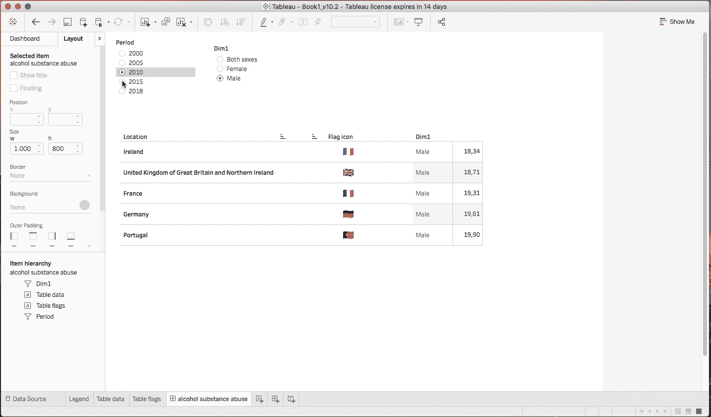
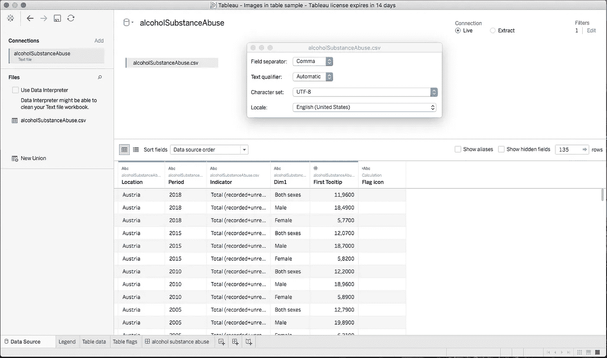
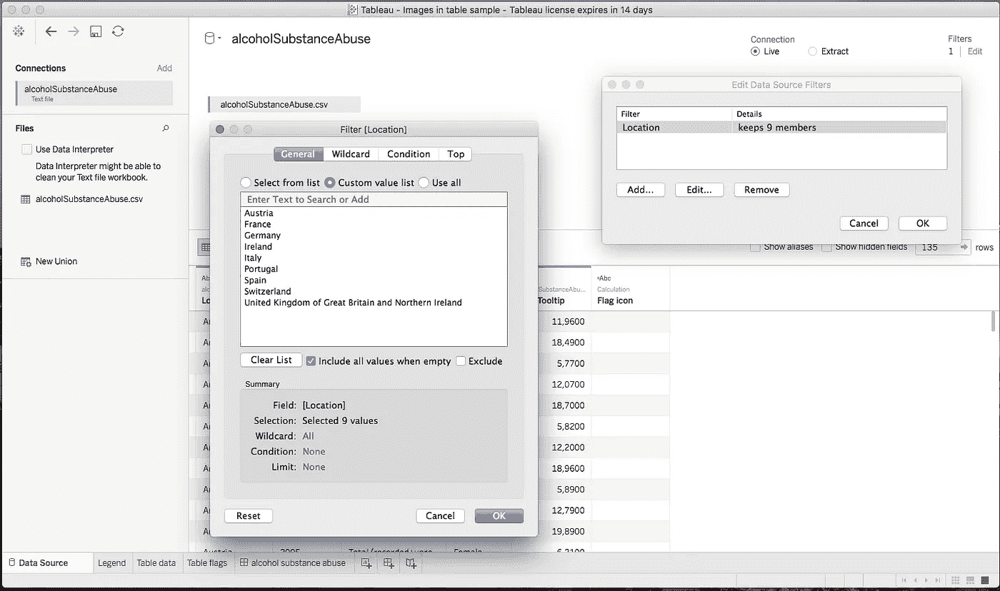
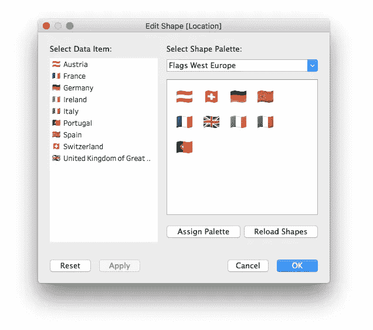
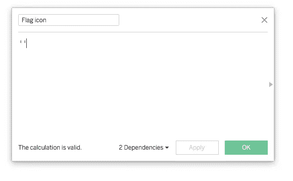
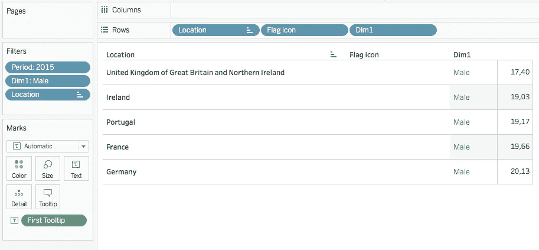
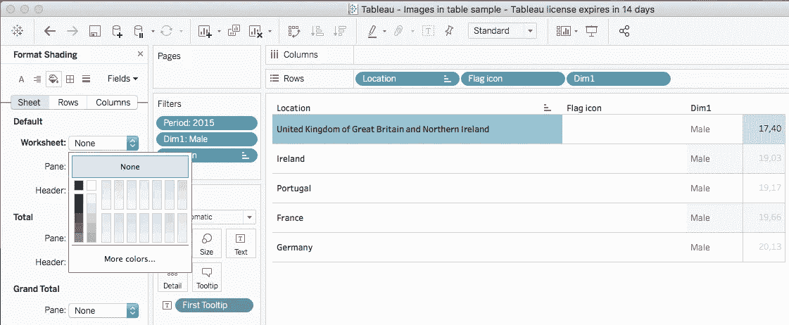
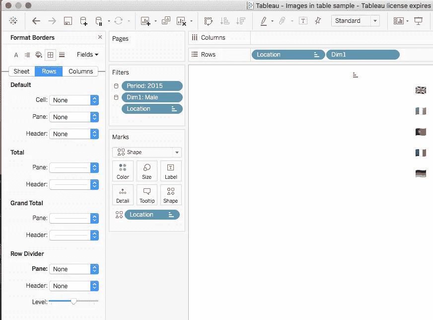
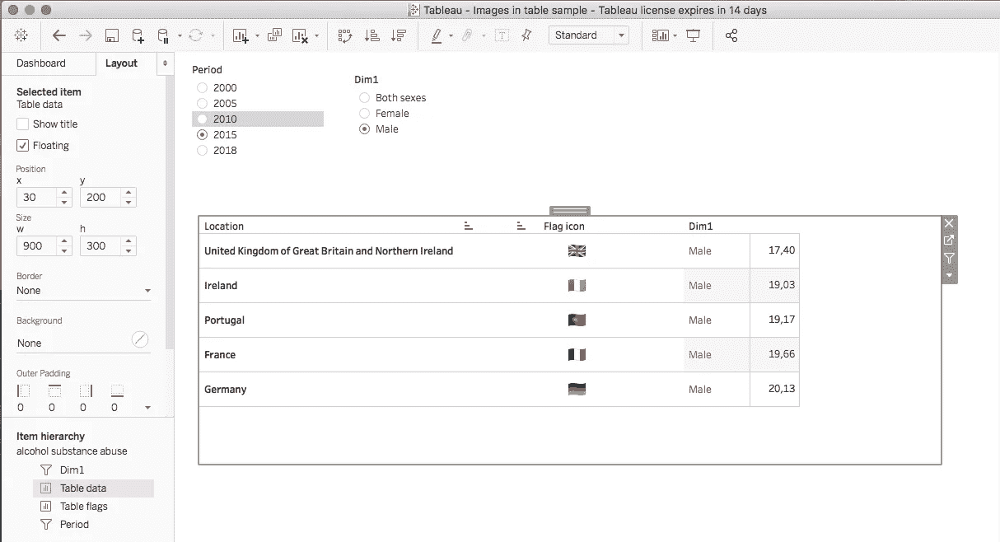
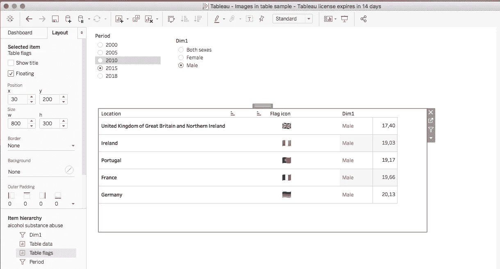

# 如何将图像作为尺寸添加到 Tableau 表格中

> 原文：<https://towardsdatascience.com/how-to-add-images-as-dimensions-in-a-tableau-table-draft-219e65b7eced?source=collection_archive---------7----------------------->

## 在本教程中，我们将了解如何在一个简单的 Tableau 表格的一列或多列中使用图像。

作者图片

**你可以从** [**这个链接**](https://www.simboli.eu/resources.html#search=columns%20of%20table.zip) **下载一个包含本教程所有内容的 zip 文件。**在 zip 存档中，您可以找到我们将在本教程中制作的 Tableau 工作簿，或者您也可以按照说明自己制作。

在这个故事中，我将使用 macOS 系统的 Tableau Desktop 2018.3(试用版)。

## 准备工作环境

首先，我们必须[准备一个**自定义调色板形状**](https://www.tableau.com/drive/custom-shapes) ，这听起来可能很难，但却非常简单，我们唯一要做的就是将“*西欧旗帜*”文件夹复制到以下文件夹之一，这取决于你使用的是 Mac 还是 Windows 系统。

> **Mac**
> 
> */用户/ <用户>/文档/我的 Tableau 资源库*
> 
> **视窗**
> 
> *C:\Users\ <用户> \Documents\My Tableau 资源库*

Flags PNG 文件由 [Flagpedia 网站](https://flagpedia.net/download/icons)提供。

## 资料组

我们将使用世界卫生组织(世卫组织)制作的文件“世界卫生 2020”数据集，特别是“*alcoholsubstanceabuse . CSV*”文件。CSV 文件包含在上面描述的 zip 存档中，但是您可以通过点击[链接到相关的 Kaggle 页面](https://www.kaggle.com/utkarshxy/who-worldhealth-statistics-2020-complete?select=roadTrafficDeaths.csv)来找到整个数据集。

## 我们走吧

因为我们是数据分析师，而不是魔术师，所以没有理由对我们在 Tableau 表的列中包含图像的工作区保密。**解决方法基本上包括制作两个具有相同上下文**<https://anthonysmoak.com/2020/10/06/understanding-tableau-context-filters/>****的表格，并使用透明背景将它们重叠。**将自定义图像包含到 Tableau 表格中的最佳(也可能是唯一)方法是创建一个自定义形状调色板，并在标记区域中使用它，这允许用户通过直接在表格中添加尺寸相关的图像来自定义表格，但不允许完全控制图像的位置，因为您只能决定将它们包含到标记区域中。**

**以下说明将伴随您完成制作此解决方法的工作示例的所有步骤。**

****

**作者图片**

**像往常一样，我们必须将 Tableau 桌面工作簿连接到我们的数据源。在“*数据源*”选项卡中，我们在“位置”字段中插入了一个数据源过滤器，因此我们将只处理西欧国家，特别是:**

*   **奥地利**
*   **法国**
*   **德国**
*   **爱尔兰**
*   **意大利**
*   **葡萄牙**
*   **西班牙**
*   **瑞士**
*   **大不列颠及北爱尔兰联合王国**

****

**作者图片**

**现在是时候转到“*工作表 1”*并遵循以下步骤:**

1.  **将*表 1* 重命名为*图例*；**
2.  **在标记菜单中，从下拉列表中选择*形状*；**
3.  **将尺寸列表中的*位置*药丸拖放到标记菜单中的*形状*图标上；**

**4.点击*形状的*图标；**

**5.点击“*重新加载形状*”按钮，这将加载我们全新的自定义形状调色板和国家的国旗；**

**6.从下拉调色板中选择“*标志西欧*”；**

**7.映射每个项目(国家)及其标志，然后单击“确定”；**

****

**作者图片**

**8.新建一个工作表，重命名为“*表格数据*”；**

**9.在分析菜单中取消选中“*聚合措施*”；**

**10.拖拽*位置*和 *Dim1* 药丸到成排区域；**

**11.将第一个*工具提示*药丸拖放到标记区域；**

**12.将“*周期*”拖放到过滤器区域；**

**13.在常规选项卡中，勾选“*全部使用*”；**

**14.在行区域，右键点击*位置*，选择“显示过滤器”；**

**15.点击右边栏的*位置*滤波控制器上的向下箭头，将其设置为*单值(列表)*；**

**16.再次点击，进入*自定义*，取消勾选*显示所有值*；**

**17.在过滤器区，右键点击“*周期*”药丸，点击“显示过滤器”；**

**18.点击右边栏中“*周期*滤波控制器”上的向下箭头，将其设置为“*单值(列表)*”；**

**19.再次点击，进入*自定义*，取消勾选*显示所有值*；**

**20.右键点击行区域中的*位置*药丸，选择*滤镜*；**

**21.转到“ *Top* ”选项卡，按字段“ *First Tooltip* ”选择前 5 名；**

**22.右键点击行区域中的*位置*药丸，选择*排序*；**

**23.按“*第一个提示信息*升序排列；**

**24.创建一个名为“*标志图标*的计算字段，并将其设置为空；**

****

**作者图片**

**25.拖动*标志图标*药丸，放在*位置*和 *Dim1* 之间的行区域；**

**26.将行高设置为实际高度的两倍；**

****

**作者图片**

**27.进入*格式底纹*菜单，设置*无*为默认，工作表；**

****

**作者图片**

**28.复制工作表“*表数据*”，重命名为“*表标志*”；**

**29.转到“*表格标志*”工作表；**

**30.在标记区从下拉列表中选择*形状*；**

**31.拖动*位置*药丸，放在形状图标上；**

**32.从标记区删除第一个*提示*药丸；**

**33.右击“*位置*标签，选择“*格式…*”；**

**34.在默认字体窗口中设置白色。**

**35.右键点击“*葡萄牙*”(任何其他国家)，选择“*格式…*”；**

**36.对“ *Dim1* ”值做同样的操作；**

**37.转到格式菜单中的"*边框*"选项卡，将"*无*"放入列分隔线和行分隔线；**

****

**作者图片**

**38.创建一个新仪表板，并将其重命名为“*酒精物质滥用*”；**

**39.将“*表格数据*”和“*表格标志*”拖放到仪表板中；**

**40.将表格设置为浮动，并删除任何图例或过滤器控制器；**

**41.点击“*表格数据*区域的向下箭头，选择过滤器，“*期间*”；**

**42.点击“*周期*滤波控制器”中的向下箭头，选择“*单值(列表)*”；**

**43.点击“*周期*过滤控制器”中的向下箭头，取消勾选自定义，“*显示所有值*”；**

**44.点击“*期间*过滤控制器”中的向下箭头，勾选应用到工作表，“*全部使用此数据源*”；**

**45.对“ *Dim1* ”过滤器进行同样的操作；**

**46.点击“*表标志*区的向下箭头，选择浮动订单，“*送至后台*”；**

**47.点击“*表格标志*区域的向下箭头，取消选择“*标题*”；**

**48.点击“*表数据*区的向下箭头，选择浮动订单，“*前置*”；**

**49.点击“*表格数据*区域的向下箭头，取消选择“*标题*”；**

**50.在布局页签中，对“*表格数据*”和“*表格标志*”的 *x* 、 *y* 、 *w、 *z* 设置相同的值；***

**51.选择“*表格数据*，在布局面板中设置“*无*”为背景；**

**51.手动调整列宽，使图标出现在*标志图标*标签下；**

****

**作者图片**

****

**作者图片**

## **结论**

**在这一长串步骤的最后，您可能已经开发了自己的 Tableau 工作簿，其中第二列中有各国国旗。如果您遇到任何问题[，您可以下载完成 Tableau 工作簿的 zip 文件](https://www.simboli.eu/resources.html#search=columns%20of%20table.zip)。如果你发现了任何快速的解决方案，请在下面的评论区分享，当然，也可以通过下面我的推荐联系我。**