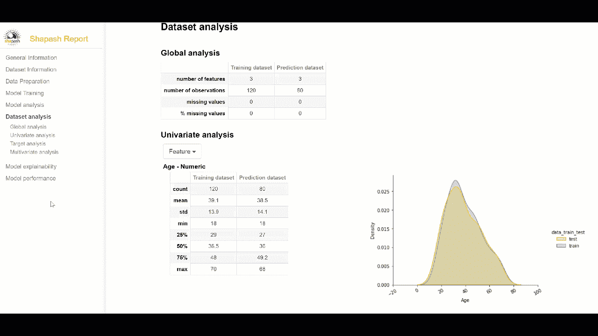

# 如何在不到 5 分钟的时间内增加交互式模型的可解释性

> 原文：<https://towardsdatascience.com/how-to-add-interactive-model-explainability-in-less-than-5-minutes-af4f3379f30f?source=collection_archive---------29----------------------->

## 让 shapash python 包为您完成这项工作


作者 gif

## 不要在没有准备好的情况下参加下一次演示

理解你的模型在做什么是非常重要的。评估模型的信息越多，对模型的调整就越好。即使你对算法的内部运作有深刻的理解，你的商业伙伴也不了解。你需要能够生动有趣地展示你的发现。

有时，业务合作伙伴有更多的主题专业知识，可能有助于提供特性上下文。如果他们真的理解你传达的内容，他们可以帮助你进一步调整模型。

我听到的最常见的问题之一是，“什么数据进入模型？”哪个翻译成"*哪个特性最重要？*”。你需要准备好以他们能理解的方式回答这个问题。Shapash 提供了一些有趣的输出，可能有助于您通知您的受众。

## 为什么要尝试 shapash？

我总是在寻找有趣的包来用于我的日常工作，我遇到了 shapash。如果你了解我，你知道我不喜欢争论。该软件包必须易于使用，否则它没有机会快速验证概念。仅仅几行代码就为您的模型脚本增加了交互式和类似报告的可解释性。

我认为这是完全值得你花时间去看看这个包和它的产品。设置很简单(记住，我不太喜欢麻烦)。我在下面详述了这些步骤。

## 装置

一如既往，建议您创建一个新的虚拟环境。我在下面的参考资料部分包含了安装过程的链接。对于这个例子，我使用的是 Jupyter，所以我只需要安装 ipywidgets(并启用)和 shapash。

## **添加这个简单的代码块。**

在训练完模型(在本例中为“回归器”)之后，添加一个简单的代码块来编译和执行 SmartExplainer。本文后面附有完整的示例代码。

```
from shapash.explainer.smart_explainer import SmartExplainer
# shapash Step 1: Declare SmartExplainer Object
xpl = SmartExplainer()# shapash Step 2: Compile Model, Dataset, Encoders
xpl.compile(    x=Xtest,    
                model=regressor,    
                preprocessing=encoder, #optional
                y_pred=y_pred) # shapash Step 3: Display interactive output
app = xpl.run_app()
```

## **运行代码**

您应该从数据获取、特征工程和模型训练到模型评分来运行您的代码。接下来，当您执行 run_app()时，将显示一个应用程序链接。


作者截图

只需单击该链接，打开一个带有您的输出的浏览器窗口。您将能够浏览各种可视化效果。


shapash app —作者 gif

## 奖励—生成 HTML 报告的代码片段

当您想要与同事共享发现时，您可以生成 HTML 报告来共享。

```
# Step 4: Generate the Shapash Report
xpl.generate_report(
        output_file='medium_spending_scores_report2.html',
        project_info_file='shapash_project_info.yml',
        x_train=Xtrain,
        y_train=ytrain,
        y_test=ytest,
        title_story="Spending Scores Report",
        title_description="""This is just an easy sample.
            It was generated using the Shapash library.""",
        metrics=[
            {
                'path': 'sklearn.metrics.mean_absolute_error',
                'name': 'Mean absolute error',
            }])
```



HTML 报告——非常好。作者 gif

## **完整示例代码**

Jupyter 笔记本和文件:

<https://github.com/dmoyer22/simple_shapash_example>  

。py 版本:

## **参考文献**

<https://github.com/MAIF/shapash>  <https://shapash.readthedocs.io/en/latest/installation-instructions/index.html>  

## 结论

我认为 shapash 在模型可解释性工具箱中有一席之地。如果你不能向非技术同事解释你的工作，你的结果可能会被忽视。没有人希望这种情况发生。

我看到的在工作场所推进其数据科学职业生涯的人，是那些演讲精彩并直接面向特定受众的人。所以，照吧！