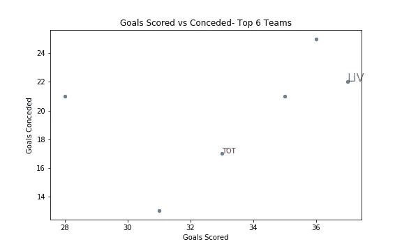

# 如何在 Python 中向散点图添加文本标签(Matplotlib/Seaborn)

> 原文：<https://towardsdatascience.com/how-to-add-text-labels-to-scatterplot-in-matplotlib-seaborn-ec5df6afed7a?source=collection_archive---------0----------------------->

## 使用 seaborn 或 matplotlib 库时，如何在 python 中向散点图添加文本标签的分步指南

Python 非常适合数据可视化！Matplotlib 非常快速和健壮，但是缺乏美感。基于 matplotlib 构建的 Seaborn 库极大地提高了美观性，并提供了非常复杂的情节。然而，当涉及散点图时，这些 python 库没有任何直接的选项来显示数据点的标签。在 Tableau 和 Power BI 等其他数据可视化工具中也有这个特性，只需点击几下或者将指针悬停在数据点上。

在本文中，我将解释如何向 seaborn 或任何其他基于 matplotlib 框架构建的库制作的散点图添加文本标签。

## 数据


数据集是英超积分榜。我们感兴趣的有三列:
*一、*队:队名
*二。* G:进球得分
*iii。* GA:失球

## 散点图:进球数与失球数

可以绘制一个简单的散点图，其中进球得分在 x 轴上，失球在 y 轴上，如下所示。

```
plt.figure(figsize=(8,5))
sns.scatterplot(data=df,x=’G’,y=’GA’)plt.title(“Goals Scored vs Conceded- Top 6 Teams”) #title
plt.xlabel(“Goals Scored”) #x label
plt.ylabel(“Goals Conceded”) #y label
plt.show()
```


基本散点图

## 标记特定项目

最常见的散点图可能包含大量的数据点，我们可能会对某些特定项目相对于其他项目的表现感兴趣。标注所有的数据点可能会使你的绘图过于笨拙，难以理解。例如，如果我们正在检查美国的社会经济统计数据，在散点图中显示所有国家的标签是没有意义的。如果美国和其他选定的竞争对手的数据被标记出来，这将是有用的，这样我们就可以了解这些国家相对于彼此和世界其他地区的表现如何。
来到我们的数据集，我是托特纳姆热刺队的球迷，我只对托特纳姆热刺队对阵其他球队的表现感兴趣。
我可以使用 *plt.text()* 添加标签

```
*Syntax: 
plt.text(x=x coordinate, y=y coordinate, s=string to be displayed)*
```

He *x* 和 y 分别是 TOT 的进球数和失球数。要显示的字符串是*“TOT”*。
x、y 和 s 是位置自变量，如果遵循它们的顺序，则不需要明确提及。

```
plt.text(df.G[df.Team=='TOT'],df.GA[df.Team=='TOT'],"TOT", color='red')
```

像*颜色*、*大小*、*阿尔法*(透明性)等附加参数。可用于更改文本格式。它也可以在 *fontdict* 中分组，使你的代码易于阅读和理解。

```
plt.text(df.G[df.Team==’LIV’],df.GA[df.Team==’LIV’],”LIV”, 
 fontdict=dict(color=’black’, alpha=0.5, size=16))
```



带有特定标签的散点图(图片由作者提供)

## 添加背景框

bbox 参数可用于突出显示文本。

```
sns.scatterplot(data=df,x=’G’,y=’GA’)
plt.text(x=df.G[df.Team==’TOT’]+0.3,
         y=df.GA[df.Team==’TOT’]+0.3,
         s=”TOT”,
         fontdict=dict(color=’red’,size=10),
         bbox=dict(facecolor=’yellow’,alpha=0.5))
```

请注意，x 和 y 坐标上添加了 0.3 的缩进，以便文本和背景框不会与数据点重叠。
这是可选的，但可以提高图表的美观性。


带文本框的散点图(图片由作者提供)

## 标记所有点

有些情况需要标记散点图中的所有数据点，尤其是当数据点很少时。
这可以通过使用一个简单的 for 循环遍历数据集并添加 x 坐标、y 坐标和每行的字符串来完成。

```
sns.scatterplot(data=df,x=’G’,y=’GA’)for i in range(df.shape[0]):
 plt.text(x=df.G[i]+0.3,y=df.GA[i]+0.3,s=df.Team[i], 
          fontdict=dict(color=’red’,size=10),
          bbox=dict(facecolor=’yellow’,alpha=0.5))
```


带所有标签的散点图(图片由作者提供)

## 最后一击

我们已经完成了标签散点图的构建。但是，我们可以观察到一些文本框突出在图形区域之外。如果文本能够被包裹在情节的画布中，将会更具美感。这可以通过改变位置、大小等来实现。的文本。
我通常通过使用 matplotlib 中的 *xlim()* 和 *ylim()* 函数来增加绘图区域来实现这一点。
在下面的代码中，你可以看到我是如何在设置 x 和 y 限制时，在绘图周围应用 1 个单位的填充的。

```
plt.figure(figsize=(8,5))
sns.scatterplot(data=df,x=’G’,y=’GA’)for i in range(df.shape[0]):
 plt.text(x=df.G[i]+0.3,y=df.GA[i]+0.3,s=df.Team[i], 
          fontdict=dict(color=’red’,size=10),
          bbox=dict(facecolor=’yellow’,alpha=0.5))plt.xlim(df.G.min()-1,df.G.max()+1)                #set x limit
plt.ylim(df.GA.min()-1,df.GA.max()+1)              #set y limit plt.title(“Goals Scored vs Conceded- Top 6 Teams”) #title
plt.xlabel(“Goals Scored”) #x label
plt.ylabel(“Goals Conceded”) #y label

plt.show()
```


带标签的填充散点图(图片由作者提供)

如果你知道任何更好的方法来包装画布区域内的元素，请在评论中告诉我。

## 资源:

[你可以在 GitHub](https://github.com/abhijith-git/Publications/blob/main/Medium/How%20to%20Add%20Text%20Labels%20to%20Scatterplot.ipynb) 查看这篇文章的笔记本。

## 成为会员

我希望你喜欢这篇文章，我强烈推荐 [**注册*中级会员***](https://abhijithchandradas.medium.com/membership) 来阅读更多我写的文章或成千上万其他作者写的各种主题的故事。
[你的会员费直接支持我和你看的其他作家。你也可以在媒体上看到所有的故事。](https://abhijithchandradas.medium.com/membership)

## 这里有一些你可能感兴趣的其他故事。

</how-to-extract-key-from-python-dictionary-using-value-2b2f8dd2a995>  </covid-19-bar-race-chart-using-flourish-89136de75db3>  

迈克尔·泽兹奇在 [Unsplash](https://unsplash.com?utm_source=medium&utm_medium=referral) 上拍摄的照片