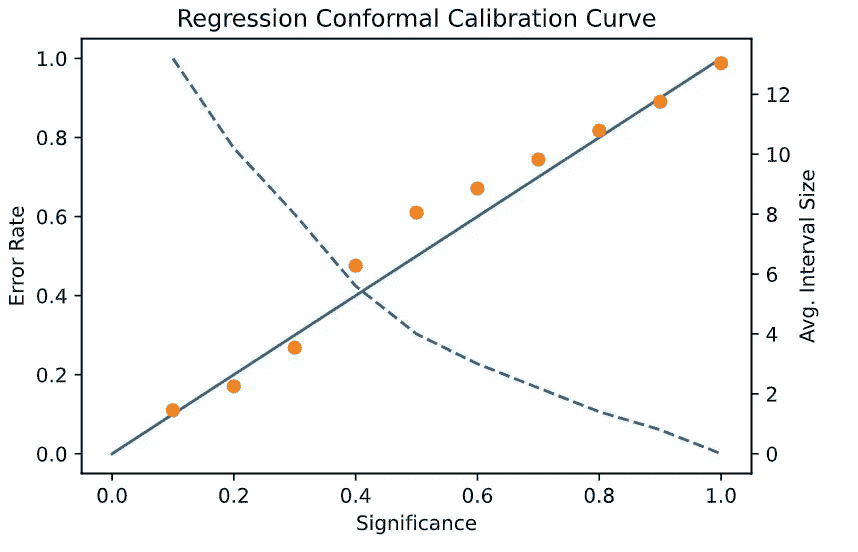
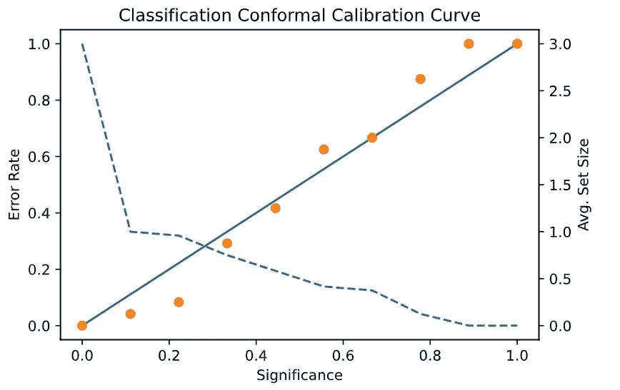

# 如何使用共形预测将不确定性估计添加到模型中

> 原文：<https://towardsdatascience.com/how-to-add-uncertainty-estimation-to-your-models-with-conformal-prediction-a5acdb86ea05?source=collection_archive---------5----------------------->

## 为什么不确定性估计的共形预测可以改善您的预测


[扎克·萨维纳尔](https://unsplash.com/@zachsavinar?utm_source=medium&utm_medium=referral)在[号航天飞机](https://unsplash.com?utm_source=medium&utm_medium=referral)上的照片

预测建模在社会中的流行正在增加，并且这些算法在我们的社会中的角色正在改变。许多人关心对这些算法的信任程度。**欧洲引入 GDPR 等政策变化**表明，人们想知道这些对我们生活有如此大影响的算法是如何工作的。

点预测对回归问题意味着什么？在训练过程中对数据的微小改变会对输出产生很大的影响吗？**您有多确定点估计是您试图预测的实际值？**

同样，对于分类，在二元问题中，预测是 0 还是 1 是什么意思？你的模型能预测相反的等级吗？还是它如此确信实际值是您可以确定的 1 类？

对于任何一个有监督的问题，输出只是整体解决方案的一部分。了解不确定性在预测建模中是如何工作的，这就引出了本文的主题，共形预测。

*我在这篇文章中加入了共形预测的背景信息。所以对于那些寻找复制粘贴代码的人来说，向下滚动并复制。*

# **保形预测**

共形预测是一种模型不可知的方法，用于计算监督问题的不确定性估计。本文将在归纳共形预测(ICP)的背景下讨论共形预测，但我们知道还有另一种形式，即转导共形预测(TCP)。

**由于模型不可知，任何模型都可以包含共形预测**。因此，无论您有复杂的深度学习分类器还是具有 1000 个估计量的随机森林，共形预测都可以包含在模型中。这一方面使得共形预测模型不可知。

无论问题是回归问题还是分类问题，不确定性估计都有不同的形式。

对于回归问题，共形预测会将点预测更改为预测间隔。这些间隔围绕着您的模型所做的点估计，间隔的**大小直接与您想要的模型确定程度相关联。**

对于分类问题，保形预测将单类预测变为集合预测。这些集合可以包括您试图预测的每个可能的类。**当存在多个类别时，这表明您的模型对预测**不太确定。而且，集合也可以是空的。如果是这种情况，那么您的模型确实不确定要预测什么类。当您希望您的预测更有把握时，更多的类将出现在您的预测集中。

在问题的回归和分类版本中，输出的大小由用户控制。这个影响输出的参数被称为重要性。

保形预测在统计上是有效的。例如，如果将显著性设置为 0.1，则集合和区间将在 90%的时间内包含实际类或真值。这个属性意味着一个测试实例的真实值在 90%的时间内将会落在您的区间内，或者测试实例的真实值将会在预测中。

计算这些区间和集合的方法遵循三个步骤。对于 ICP，数据分为三组:训练、校准和测试。具体做什么的细节将在下面讨论。

# **缺点和顾虑**

听起来不错。好吧，这些统计保证有两大警告。第一个是保形预测是在可交换性假设下定义的。这种假设意味着保形预测假设您用来训练数据、验证和测试数据的数据是可交换的。这有一个详细的数学公式，但本质上，这就是它的意思。

为训练模型而选择的数据可以放入测试集中。或者考虑您用于校准的数据。同样，这些数据可以用于训练或测试。

**每个记录都可以与另一个记录交换。**

但是可交换性有更强的含义。对于可交换的数据，整个数据集必须来自同一分布。虽然对于许多数据集和将来的实例来说，这一方面是已知的，但是对于其他数据集来说，数据分布会随着时间而变化。在这些情况下，保形预测仍然可以提供一些不确定性估计，但理论上的保证不再可靠。

第二个警告是不确定性估计有一个权衡。例如，假设您希望 90%地保证您的预测区间包含真实值。在这种情况下，你会有更大的间隔。但是如果你只想有 50%的把握，那么你的间隔时间会长很多。

分类类似。更多的信心，更大的集合。信心更少，套数更少。

然而，这些集合和间隔大小并不简单地线性缩放。相反，它们与您的模型的性能直接相关。所以显著性为 0.5 的区间可能比显著性为 0.1 的区间小很多。


戴维·罗蒂米在 [Unsplash](https://unsplash.com?utm_source=medium&utm_medium=referral) 上的照片

# **符合与不符合**

保形预测的中心思想是围绕着一致性的概念。或者反过来说，不合规。这个概念是预测区间和预测集的核心。但它到底是什么？

**不一致分数衡量每条记录与其余数据不一致的程度。**

对于回归，非一致性分数通常被测量为模型预测和校准实例的真实值之间的差异。

不一致分数是二元分类的校准数据上与您的分类器相反类别的预测概率。

注意这里校准数据集的使用。首先，根据一组数据训练模型，然后根据校准集计算不合格分数。接下来，根据这些校准分数和用户指定的显著性水平，保形预测构建区间或调整如何将类添加到分类集中。

使用显著性水平以及一组不一致性分数来确定预测区间。基于用户重要性，通过取分数的第 n 个百分点来粗略计算区间。因为回归的不一致性分数是预测校准和真实校准之间的差异，所以一致性分数是误差。

对于分类，事情的安排略有不同。不一致性分数代表每个类别的预测概率。如果对于用户指定的显著性水平，预测的概率与该显著性一致，则每个类别被包括在该集合中。此处的细节根据所使用的确切不合格分数而有所不同。然而，选择在集合中保留哪些类的过程仍然是相同的。

# **测试和校准**

执行校准后，模型可以预测不确定性。

但是剩下的工作是测试保形预测器是否正常工作。比如预测类集中是否存在真实类？真值存在于预测区间吗？

为了回答这两个问题，共形预测器具有它们的校准曲线形式，因为估计的不确定性取决于显著性水平，模型的性能随着该显著性而变化。

在不同的显著性水平上评估性能，以确保具有不确定性的预测在多个显著性水平上是一致的。



校准曲线(作者照片)

根据设计，显著性水平为 0.1 的共形预测值应该在 90%的时间里包含实际值。因此，通过用 0 和 1 之间的值改变显著性来评估性能**应该与从 0 到 1 的线性线对齐。**

通常情况下，情况并非如此。然而，对于越来越大的数据集(完全代表其分布的数据集)和性能良好的模型，校准曲线接近完美的线性。

当校准曲线不完全一致时，这意味着一些事情。数据可能不是来自同一个分布。如果数据是真正可交换的，那么根据保形预测的定义，你应该看到校准。

除了具有校准良好的共形预测器之外，另一个方面值得评估— **区间的大小和集合的大小。**

当一个模型在统计上保证了分类和回归的不确定性估计时，这是很好的，但是大小很重要。例如，如果每个预测集包含所有类，则该模型没有帮助。类似地，对于回归，如果每个区间都是巨大的，那么，当然，真实值会落在其中的某个地方。

由于这些原因，通常显示保形预测器的区间大小和预测集的平均大小。

此处未显示但值得查看的一些其他度量是共形分类器的单线数和共形预测器的 p 值分布。

当你的分类器非常确定时，单态的数量给你一个概念。

并且 p 值的分布类似于校准曲线。因此，当一个图被完美校准时，p 值的分布应该是均匀的。

# **应用保形预测**

对于这篇文章，我将使用库‘nonconformist ’,它实现了保形预测的几种算法。此外，我添加了一些扩展来展示保形预测的一些属性。

注意，在撰写本文时，nonconformist 的基本安装是建立在旧版本的 sklearn 上的。有些模块导入 sklearn.cross_validation，需要修改为导入 sklearn.model_selection。您可以在您的环境中的“site-packages”下找到该包。

这第一部分代码有一些通用的导入和用于校准图的函数。

```
import numpy as np
import matplotlib.pyplot as plt
from sklearn.datasets import load_iris, load_boston
from sklearn.tree import DecisionTreeClassifier, DecisionTreeRegressor
from nonconformist.icp import IcpClassifier, IcpRegressor
from nonconformist.nc import ClassifierNc, MarginErrFunc, ClassifierAdapter, RegressorNc, AbsErrorErrFunc
from sklearn.model_selection import train_test_splitdef regression_calibration_curve(estimator, X, y, alphas=np.linspace(0.1,1,10, endpoint=True)):
    errors = []
    interval_sizes = []
    for a in alphas:
        pred = estimator.predict(X, significance=a)
        interval_sizes.append(np.mean([y-x for x, y in pred]))
        errors.append( 1 — np.mean([x <= z and z <= y for (x,y), z in zip(pred, y)]))
    return errors, interval_sizesdef regression_calibration_plot(estimator, X, y, alphas=np.linspace(0.1,1,10, endpoint=True)):
    errors, interval_sizes = regression_calibration_curve(estimator,X,y,alphas)
    fig, ax1 = plt.subplots()
    ax2 = ax1.twinx()
    ax1.plot([0,1], [0,1])
    ax1.plot(alphas, errors, ‘o’)
    ax2.plot(alphas, interval_sizes, ‘ — ‘)
    ax1.set_xlabel(‘Significance’)
    ax1.set_ylabel(‘Error Rate’)
    ax2.set_ylabel(‘Avg. Interval Size’)
    plt.title(‘Regression Conformal Calibration Curve’)
    plt.show()def classifier_calibration_curve(estimator, X, y, alphas =np.linspace(0,1,10, endpoint=True)):
    errors = []
    set_sizes = []
    for a in alphas:
        pred = estimator.predict(X, significance=a)
        set_sizes.append(np.mean([np.sum(set) for set in pred]))
        errors.append(1 — np.mean([set[t] for set, t in zip(pred, y)]))
    return errors, set_sizesdef classification_calibration_plot(estimator, X, y, alphas=np.linspace(0,1,10, endpoint=True)):
    errors, sizes = classifier_calibration_curve(estimator,X,y,alphas)
    fig, ax1 = plt.subplots()
    ax2 = ax1.twinx()
    ax1.plot([0,1], [0,1])
    ax1.plot(alphas, errors, ‘o’)
    ax2.plot(alphas, sizes, ‘ — ‘)
    ax1.set_xlabel(‘Significance’)
    ax1.set_ylabel(‘Error Rate’)
    ax2.set_ylabel(‘Avg. Set Size’)
    plt.title(‘Classification Conformal Calibration Curve’)
    plt.show()
```

这里我使用不同的领域进行回归和分类。当库的重要性设置为 0 时，预测间隔似乎有问题。

以下示例使用 iris 数据集进行分类，使用 Boston housing 数据集进行回归。使用的基本模型是决策树，但是 nonconformist 允许任何 sklearn 模型。目前，该包不支持 TensorFlow。

# 回归

对于回归，校准图显示在间隔大小的旁边。对于波士顿住房数据集，目标变量的标准偏差约为 9。因此，在这种情况下，这些间隔并不太大。您还可以在这里看到，这个模型经过了很好的校准。

**此处使用的不合格度量是绝对误差。**

```
data = load_boston()
y = data.target
X = data.data
X_train, X_test, y_train, y_test = train_test_split(X, y, test_size=0.4, random_state=42)
X_calibration, X_test, y_calibration, y_test = train_test_split(X_test, y_test, test_size=0.4, random_state=42)estimator = DecisionTreeRegressor(random_state=10)
icp = IcpRegressor( RegressorNc(estimator, AbsErrorErrFunc()))
icp.fit(X_train, y_train)
icp.calibrate(X_calibration, y_calibration)
regression_calibration_plot(icp, X_test, y_test)
```


回归模型的校准曲线(作者照片)

# 分类

这里，校准图包括平均器械包大小。对于虹膜数据集，有三个类别。如你所见，随着重要性的增加，集合的大小会减小。在这种情况下，该模型相当好，集合大小迅速下降到 1 左右。但是，您可以看到这些集合大小开始下降。这种下降是因为，在不同的显著性水平上，模型对预测任何类别都没有信心。这种模式随着所选显著性的增加而增加。无论如何，你可以看到这个模型是相对校准良好的。

**此处使用的不合格指标是误差。**

```
data = load_iris()
y = data.target
X = data.data
X_train, X_test, y_train, y_test = train_test_split(X, y, test_size=0.4, random_state=2)
X_calibration, X_test, y_calibration, y_test = train_test_split(X_test, y_test, test_size=0.4, random_state=2)estimator = DecisionTreeClassifier(random_state=10)
icp = IcpClassifier(ClassifierNc(ClassifierAdapter(estimator), MarginErrFunc()))
icp.fit(X_train, y_train)
icp.calibrate(X_calibration, y_calibration)
prediction = icp.predict(X_test, 0.1)
classification_calibration_plot(icp, X_test, y_test)
```



分类模型的校准曲线(作者提供照片)

# **结论**

保形预测的好处是所做的预测有统计置信度支持。您可以为分类器和回归器提供不确定性估计值。

这个框架是一般化的，因此不管你的监督模型如何，你都可以将你的模型转换成一个共形预测器。

这篇文章简要介绍了共形预测。训练和校准的方法有许多变体。例如，一些变体减小了预测区间和集合的大小。所使用的符合性和不符合性分数也有许多变体。有些分数甚至包含了预测的难度。

总体保形预测是一个相当简单的过程。但这正是它如此有效的原因。它产生的预测具有可控的不确定性。最重要的是，预测集和区间在统计上是有效的。

*如果你有兴趣阅读关于新颖的数据科学工具和理解机器学习算法的文章，可以考虑在 Medium 上关注我。*

如果你对我的写作感兴趣，想直接支持我，请通过以下链接订阅。这个链接确保我会收到你的会员费的一部分。

[](https://zjwarnes.medium.com/membership) [## 通过我的推荐链接加入 Medium-Zachary Warnes

### 阅读扎卡里·沃恩斯(以及媒体上成千上万的其他作家)的每一个故事。您的会员费直接支持…

zjwarnes.medium.com](https://zjwarnes.medium.com/membership)