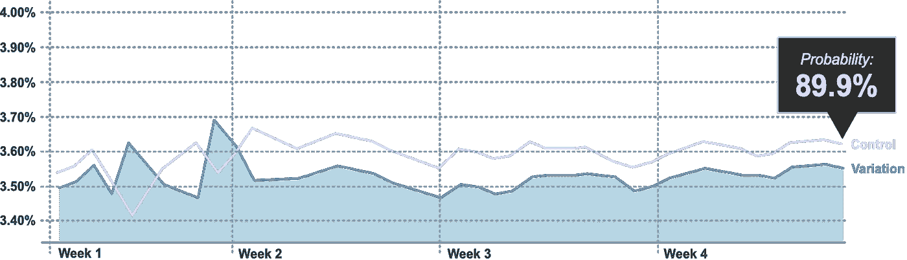
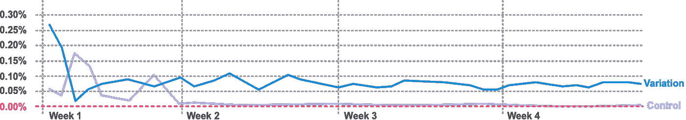
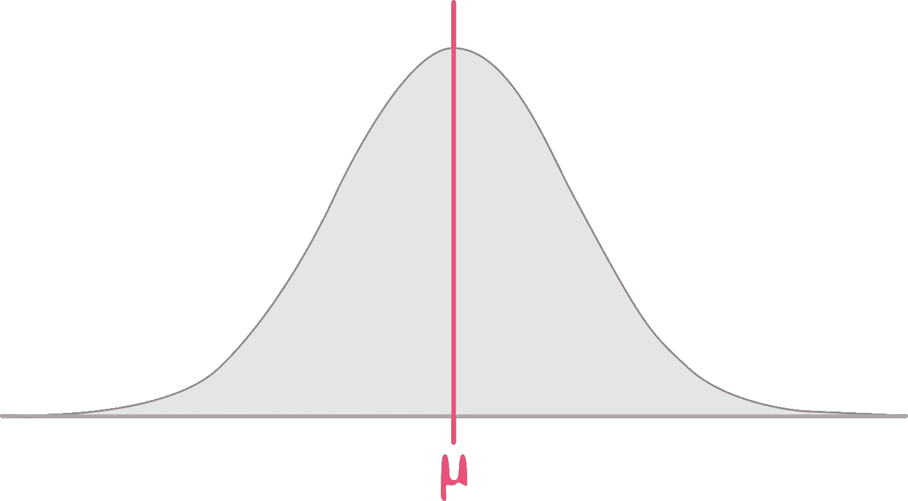
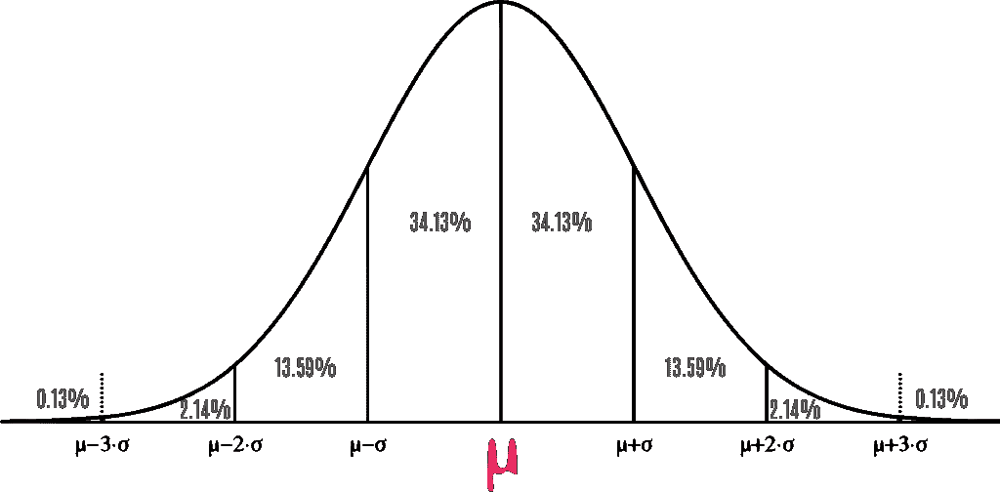
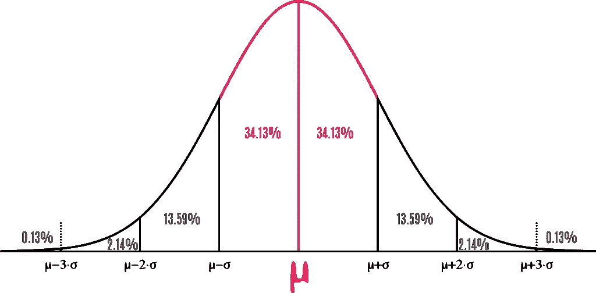
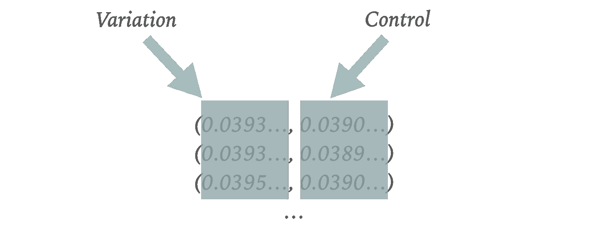
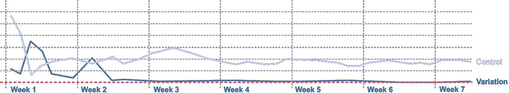

# 如何用贝叶斯“期望损失”分析 A/B 实验

> 原文：<https://towardsdatascience.com/how-to-analyse-a-b-experiments-using-bayesian-expected-loss-b959e21a77ce?source=collection_archive---------10----------------------->

## 如何为你的实验计算贝叶斯预期损失指南


图片由[皮克斯拜](https://pixabay.com/?utm_source=link-attribution&utm_medium=referral&utm_campaign=image&utm_content=2860753)的[大卫·施瓦森伯格](https://pixabay.com/users/6689062-6689062/?utm_source=link-attribution&utm_medium=referral&utm_campaign=image&utm_content=2860753)拍摄

让我们想象一下，我们已经进行了 **A/B 实验**四周了。我们现在要做一个决定:变异是赢家还是输家？我们对这个决定有多大把握？

为了帮助回答这个问题，下面是我们假想实验的结果。它比较了一段时间内累积跟踪的两个变异组的转换率:



图片作者。奖励的故事。随时间绘制的累积“转换率”。越高越好。

上面的线形图显示了我们两个变量的累积转换率。对照组的转化率稍高。这是过去三周的情况。

这个结果的总体 ***贝叶斯概率*** 为 *89.9%。*这刚好低于我们公司通常接受的阈值(~90%)。如果你用频率主义者的术语来说，你可以认为这是统计学意义的水平。

实验本身的一些背景:我们使用这个测试来**降低一个重要特性**发布的风险。这里的“赢”是可取的，但不是必要的。同时，一个“平坦”的结果是可以接受的。“损失”是我们最想避免的。

总的来说，基于以上观点，我们可以看出这个实验有*可能*会“失败”，但我们不能完全确定。

这是许多实验中常见的情况。需要做一个决定，但是结果还不清楚，所以要满怀信心地去做。在这种情况下通常会发生的是，实验继续运行，希望通过更多的流量获得更大的确定性。

所有这一切的发生是因为上面的视图是我们实验的一个不完整的图片。上面的视图代表运行这个测试的**奖励**(或者在这个例子中没有奖励)。这里缺少的是帮助我们做决定的**风险**的观点。

我在之前的一篇文章中写过[预期损失。由](/what-comics-can-teach-us-a-b-experiment-analysis-c1ba70e50d0c) [**克里斯·斯图基奥**](https://vwo.com/downloads/VWO_SmartStats_technical_whitepaper.pdf) **为 VWO 开发的预期损失**代表了选择一个实验变量而非另一个的风险。你可以在他的白皮书中找到更多相关信息。

但本质上，风险越低越好。如果我们绘制选择一个变量而不是另一个变量的累积预期损失，我们的实验看起来像这样:



图片作者。风险的故事。随着时间的推移绘制的累积“预期损失”。越低越好。

我们可以看到，选择变体的相对“成本”是 0.75%。这在财务上意味着什么取决于被测试的流量和段。这也将因公司而异。

*例如，0.75%对于一些高流量的大公司来说可能是一个决定性因素。*

现在回顾这个线图，我们可以看到这些线看起来足够稳定，可以接受这个“风险”的观点。所以现在，出现了一个商业决策:推出这个特性的需要是否超过了风险？

我们已经给了决策者足够的信息来做决定。我们也可以根据紧急程度在第三周做出这个决定。在显示**风险**的同时显示**回报**是讲述我们实验的数据故事的一种非常强大的方式。

# 计算预期损失

那么，我们如何计算预期损失呢？让我们更深入地看看，使用一个可信赖的 [Jupyter 笔记本](https://jupyter.org/)并测试我们的 [Python 3](https://www.python.org/) 技能！

## 我们将使用什么

如果您想继续学习，我假设您已经安装了 Jupyter Notebook 和 Python 3。

另外，我们将使用 [numpy](https://pypi.org/project/numpy/) 和 [scipy](https://pypi.org/project/scipy/) ，所以你也需要安装它们。我们应该已经有了 [functools](https://pymotw.com/2/functools/) ，因为我们使用的是 Python 3。

我们笔记本中的第一个单元格看起来像这样:

```
**import** **numpy** **as** **np**
**from** **scipy.stats** **import** beta
**from** **functools** **import** reduce
```

这将加载我们需要的所有库。

## 加载一些示例数据

接下来，我们添加数据。这意味着增加每个变体的访问量(或用户数，如果你喜欢的话)以及转化率。

```
**visits_control** =  5625348
**orders_control** =  219197**visits_variation** = 5613277
**orders_variation** = 221100
```

*我只是编造了这些数字，但如果真的这么做，我们将从我们选择的分析工具中获得这些数据。*

## 计算转化率

我们需要知道每个变体的转换率是多少。

```
conversion_control = orders_control / visits_control
conversion_variation = orders_variation / visits_variationprint("Control:", conversion_control)
print("Variation:", conversion_variation)
```

这个的输出:

```
Control: 0.0389659448624334
Variation: 0.03938875633609387
```

*小数点后两位分别为 3.90%和 3.94%。*

## 正态分布的随机样本

让我们进入一些基本的统计概念。我们可以假设转换率为*正态分布*，因此根据[中心极限定理](https://en.wikipedia.org/wiki/Central_limit_theorem)为每个转换率创建一条[正态分布曲线](https://www.simplypsychology.org/normal-distribution.html)。

下面是正态分布曲线的样子:



图片作者。正态分布曲线。

*横轴*定义转化率，粉线是我们“观察到的”转化率。所以，对于对照组，这是 0.038965 或 3.90%。对于变化，这是 0.039389 或 3.94%。

这些值就是我们的或我们每条分布曲线的“平均值”。

*垂直*轴*轴*定义了“观察”的体积。曲线下的形状是这些观测值的概率分布。离我们的左边或者右边越远，我们的“观察”就越少。

我们可以为标准差 **σ** 画一些线:



图片作者。有标准偏差的正态分布曲线

想象一下，我们从对照组样本中随机抽取一些样本。这些随机样本的转换率是多少？嗯，有一个 ***68.26%*** 我们的随机样本会来自上面的粉色阴影区域(34.13% + 34.13%):



图片作者。正态分布曲线突出显示-平均值的 1/+1 标准偏差

离平均值越远，意味着这些值出现的几率越小。

如果这还不清楚，不要担心。随着我们继续下去，事情有希望变得更加清楚。让我们继续使用 python 的魔力从我们的正态分布曲线中抽取一些随机样本。

编辑:更正一下，我们实际上是要从 **beta** 发行版中抽取样本。

首先，我们定义需要多少个随机样本:

```
**N_MC** = 10
```

尽管我们通常会使用类似于 *10，000* 或 *100，000* 这样的数字，但使用一个更小的数字来演示要容易得多。

为了获得随机样本，我们需要将“成功”和“失败”传递到 python 函数中。这个函数调用如下所示:

```
beta.rvs(successes, failures, size=N_MC)
```

我们使用这些值来生成随机样本:

```
control_successes = orders_control
control_failures = visits_control-orders_controlcontrol_sample = beta.rvs(control_successes, control_failures, size=N_MC)
```

如果我们打印出`control_sample`的值，我们会得到:

```
[0.03903641 0.0389794  0.03905511 0.0390165  0.03891369 0.03899223
 0.03884811 0.03901279 0.03884893 0.03901625]
```

基于我们观察到的“平均值”的十个样本转换率列表。它们看起来非常接近我们的控制转换率 **0.038965。这正是我们所期待的。**

我们需要为变体组做同样的事情:

```
var_successes = orders_variation
var_failures = visits_variation-orders_variationvariation_sample = beta.rvs(var_successes, var_failures, size=N_MC)
```

`variation_sample`的打印输出:

```
[0.0393568  0.03934686 0.03950938 0.03935167 0.03929198 0.0393716
 0.03940077 0.03934958 0.03939534 0.03936369]
```

它们看起来非常接近我们的变异转换率 **0.039389。这也是我们所期待的。**

## 计算预期损失

所以，现在我们有了:

1.  **control_sample:** 根据我们观察到的*对照组*的转化率，列出 10 个随机转化率
2.  **变异 _ 样本:**基于我们对*变异组*观察到的转化率的 10 个随机转化率列表

现在我们要比较两组样本。如果我们将它们压缩成一个由*元组组成的列表，就很容易做到——*元组是由两个值组成的列表。所以，如果我们这样做…

```
samples = list(zip(variation_sample, control_sample))
```

…并打印`samples`的输出，我们将得到:

```
[(0.03935680021728885, 0.03903640775019114), (0.039346863185651795, 0.03897940249438995), , (0.039351671006072196, 0.0390165049777375), (0.03929198308373445, 0.03891368745047992), (0.03937159635366056, 0.038992234526441655), (0.03940077430481381, 0.0388481084116417), (0.03934958290885752, 0.039012789327513016), (0.039395339750152525, 0.03884893384273168), (0.039363691751648874, 0.03901625035958206)]
```

这是对此的另一种观点:



图片作者。可视化元组列表

拥有一个元组列表可以更容易地比较我们的两个值。为了计算出对照组的预期损失，我们需要对列表中的每个样本执行以下操作:

1.  `variation_sample - control_sample`
2.  将任何负的结果基线到`0` *(因为预期损失要么是 0 要么是正数，永远不会是负值)*
3.  返回列表的平均值

为了在 python 中做到这一点，我们创建了一个差异列表，如`diff_list`:

```
diff_list = map(**lambda** sample: np.max([sample[0]-sample[1], 0]), samples)
```

将`diff_list`中的每一项相加…

```
sum_diff = reduce(**lambda** x,y:x+y, diff_list)
```

..然后返回百分比形式的平均值。

```
EL_CONTROL = sum_diff/N_MC * 100.
```

对照组的最终预期损失为:

```
0.04018252880723959
```

换句话说，如果我们选择对照组，我们预计损失为 0.04018%。

现在，我们需要为变体组做同样的事情:

```
diff_list = map(**lambda** sample: np.max([sample[1]-sample[0], 0]), samples)
sum_diff = reduce(**lambda** x,y:x+y, diff_list)EL_VAR = sum_diff/N_MC * 100.
```

印刷`EL_VAR`给了我们:

```
0.0
```

换句话说，我们期望通过选择变化不会损失什么( **0%** )。所以，总的来说，变异组的风险最小。

需要注意的是，我们在这里使用了 10 个样本。如果我们真的这样做，我们会使用更多的样本。但本质上是相同的过程。简单吧？

现在，这些对预期损失的计算可能有用，也可能没用。我们还需要知道这个结果是否“显著”。

为此，我们需要绘制一段时间内的累积结果。你可以将预期的损失数字输入 Excel，并在那里绘制图表，或者你可以创建一个 Jupyter 笔记本。

最终的视图类似于这样:



图片作者。预期损失示例。

我们可以应用一些规则来验证一个测试是否足够稳定。我在与我合作过的团队中使用的规则是:

1.  七天没有预期损失线交叉
2.  预期损失线的一致性
3.  最好的概率应该是 90%或更高

*注意:概率最好使用转换率，而不是预期损失，因为我们删除了低于 0 的值。*

尽管示例折线图有几周的数据，但您可以更早地读取数据(可能在第 3 周)。这个想法是企业在决定测试结果之前就意识到了风险。

以这种方式利用预期损失视图有助于减少我运行的许多实验的运行时间，尤其是那些主要目标是对某个功能或首次展示进行风险评估的实验。

我真的相信从**风险**和**回报**的双重视角来看待实验是非常强大的。不仅仅是在分析实验时，在与利益相关者交流结果时也是如此，因为这会使决策变得更加容易。

很想听听你的想法。有没有其他视图可以让最终用户更清楚地了解实验结果？

# 关于我

我是**伊克巴尔·阿里**，[漫画作家](https://iqbala.com/) ，前 Trainline 优化主管。

我通过培训、建立流程和讲述实验的数据故事来帮助公司开展实验项目！

这是我的 [**LinkedIn**](https://www.linkedin.com/in/iqbalhussainali/) 如果你想联系。或者跟随我来到这里。