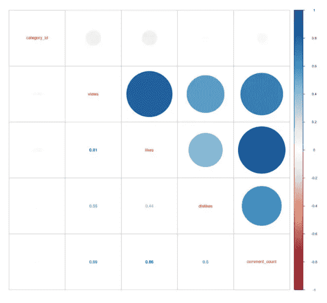
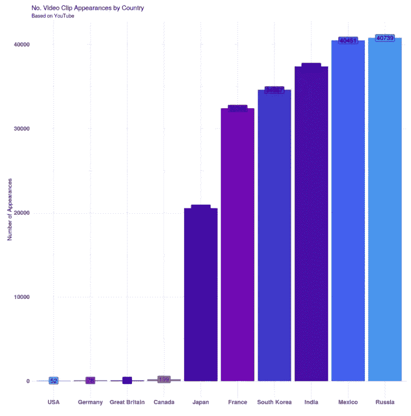
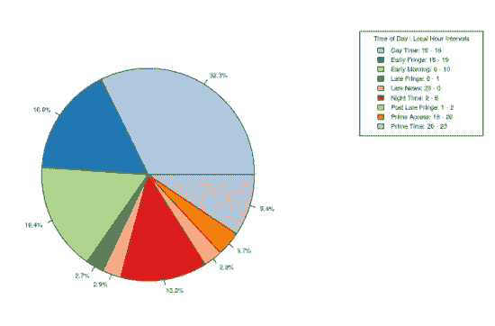
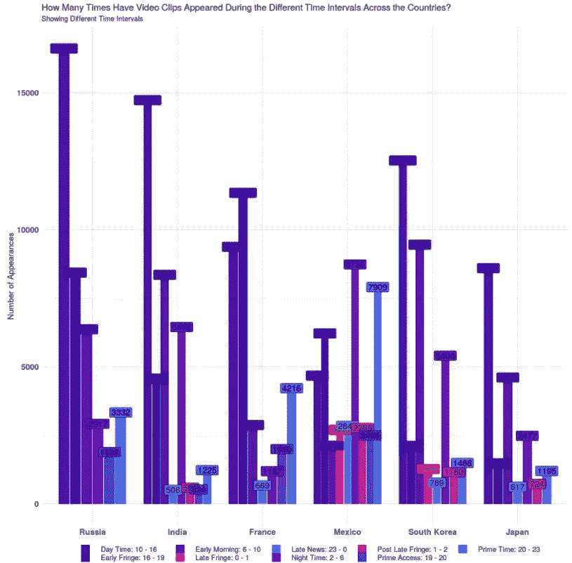
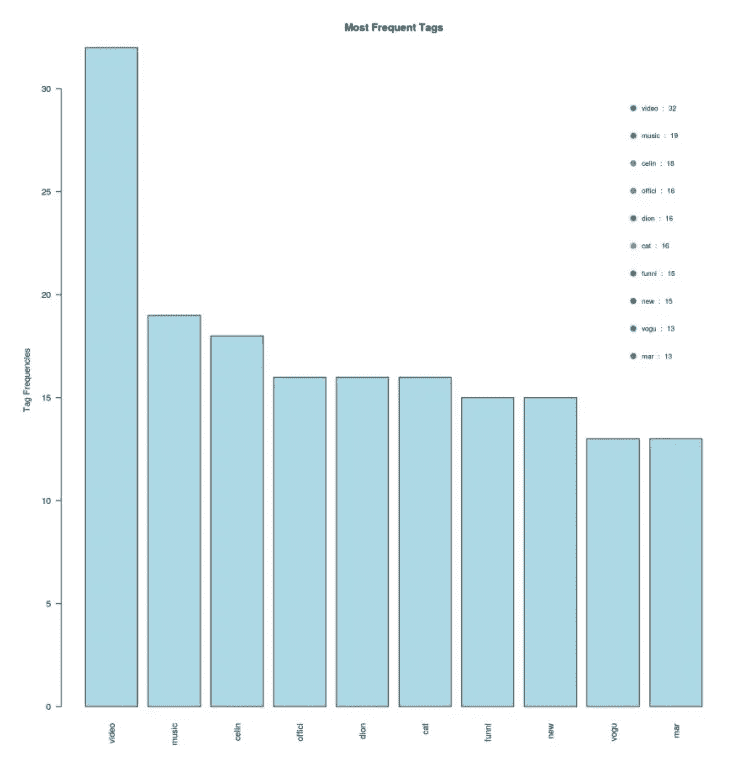

# 如何用 R 分析视频相关数据？

> 原文：<https://towardsdatascience.com/how-to-analyse-video-related-data-with-r-375700278c6a?source=collection_archive---------22----------------------->

## 趋势 YouTube 视频统计

## 来自 Kaggle 的热门 YouTube 视频的每日统计

克里斯蒂安·威迪格在 [Unsplash](https://unsplash.com/s/photos/youtube?utm_source=unsplash&utm_medium=referral&utm_content=creditCopyText) 上拍摄的照片

r 编程语言在分析和快速可视化数据方面非常强大。使用 RStudio 可以轻松做到这一点。我探索了 YouTube 视频的每日趋势统计，你可以从[这个链接](https://www.kaggle.com/datasnaek/youtube-new)找到这个数据集。而且，你也可以从[这个链接](https://www.kaggle.com/efebuyuk/trending-youtube-video-statistics)找到我关于这个作品的 Kaggle 笔记本。

我要回答的问题如下:

*   这些属性之间有什么关联:**类别 id** 、**视图**、**喜欢**、**不喜欢**和**评论数**？
*   按国家划分，视频剪辑出现的情况有哪些？
*   基于一天中的时间，**喜欢**的百分比是多少？
*   在不同的时间间隔内，视频剪辑在各国出现了多少次？
*   英国数据集中最常见的标签是什么？

这些属性之间有什么关联:**类别 id** 、**观点**、**喜欢**、**不喜欢**、**评论数**？

从上图我们可以看到，最相关的数据点是**喜欢**和**评论数**，那个相关性是 **0.86** 。一个视频的**点赞**越多，它的**评论**就越多。之后我们看到第二高的相关性是 **0.81** ，这个相关性来自于**视图**和**喜欢**的属性。

按国家划分，视频剪辑出现的情况有哪些？

当我们按国家检查出场次数时，很明显俄罗斯的视频出场次数最多，其次是墨西哥和印度。

基于一天中的时间，**喜欢**的百分比是多少？

一天中的时间在广播中非常重要，在当今的视频流中也是如此。这就是为什么检查视频何时出现是至关重要的。上图显示了基于一天中不同时间的**喜欢**的百分比。据此，白天(10:00-16:00)的比例最高 **32.3%** 。

在不同的时间间隔内，视频剪辑在各国出现了多少次？

墨西哥、韩国和日本在不同时间段的出现次数略低。

英国数据集中最常见的标签是什么？

使用最多的标签分别是**视频**和**音乐**、 **32** 和 **19** 次。在这个图表中，我只检查了英国的数据集，所以英语标签已经被处理和可视化。重要的是要知道，如果你正在处理其他语言，那么你需要小心编码。否则，您无法处理数据。

如果你想检查我的 R 代码，那么你可以看到我的 Kaggle 笔记本上的这项工作。这里是[的链接](https://www.kaggle.com/efebuyuk/trending-youtube-video-statistics)。