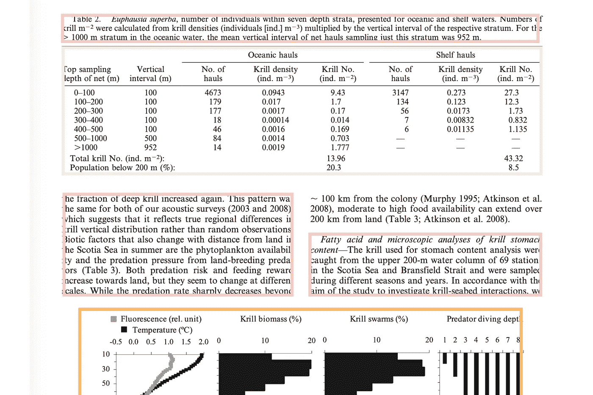
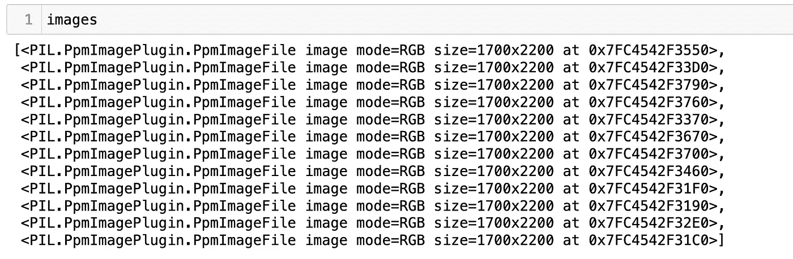

# 如何用布局解析器包分析 PDF？

> 原文：<https://towardsdatascience.com/how-to-analyze-a-pdf-with-the-layout-parser-package-177b1c1600f2?source=collection_archive---------12----------------------->



我最近参与了一个项目，该项目需要解析 PDF，以便识别页面的区域并从这些区域返回文本。然后，文本区域将被馈送到 Q/A 模型( [farm-haystack](https://pypi.org/project/farm-haystack/) )，并从 PDF 返回提取的数据。本质上，我们希望计算机为我们读取 PDF 文件，并告诉我们它找到了什么。目前，有一些流行的模块以不同的效率执行这项任务，即 [pdfminer](https://pypi.org/project/pdfminer/) 和 [py2pdf](https://pypi.org/project/py2pdf/) 。问题是表数据很难解析/检测。解决办法？取出表格和图表，只返回文本块。

## 下载[布局解析器](https://layout-parser.github.io/)。

```
pip install layoutparser
```

## 将. pdf 转换为图像。

我们需要将 PDF 的每一页转换成图像，以便对其执行 [OCR](https://en.wikipedia.org/wiki/Optical_character_recognition) 并提取文本块。有许多不同的方法可以做到这一点。您可以转换 PDF 并在本地机器上保存图像。但是出于我们的目的，我们希望将 pdf 页面的图像临时保存在内存中- >提取文本- >丢弃图像，因为在我们执行 OCR 之后，我们不再需要该图像(我们仍然拥有原始的 PDF 文件)。为了解决这个问题，我们将使用 [pdf2image](https://pypi.org/project/pdf2image/) 包:

```
pip install pdf2image 
```

这个软件包将允许我们输入一个 PDF 文件，并输出一个图像的每一页。我们可以选择将图像保存在存储介质上，或者暂时将 PDF 作为 PIL 图像列表进行处理，然后在完成后将其丢弃。

```
images = convert_from_bytes(open('FILE PATH', 'rb').read())
```

现在，您将拥有一个可以循环浏览的图像列表。



为了让布局解析器包能够读取这些图像，您需要将它们转换成像素值的数组，这可以通过 numpy 轻松实现。

```
image = np.array(image)
```

## 实例化您的 OCR 工具并提取文本。

目前，有两个 OCR 工具，你可以用这个包:谷歌云视觉(GCV)和宇宙魔方。我们将使用宇宙魔方。为了检测页面的区域，存在可用于各种用例(表格、杂志出版物、学术期刊)的预先训练的深度学习模型。我们将使用专门用于学术期刊的名为 PubLayNet 的模型。[请记住，有多种方法可以为您的特定用例训练定制模型](https://github.com/Layout-Parser/layout-model-training)。

```
model = lp.Detectron2LayoutModel(
            config_path ='lp://PubLayNet/mask_rcnn_X_101_32x8d_FPN_3x/config', # In model catalog
            label_map   = {0: "Text", 1: "Title", 2: "List", 3:"Table", 4:"Figure"}, # In model`label_map`
            extra_config=["MODEL.ROI_HEADS.SCORE_THRESH_TEST", 0.8] # Optional
        )#loop through each page
for image in images:
    ocr_agent = lp.ocr.TesseractAgent()

    image = np.array(image)

    layout = model.detect(image)text_blocks = lp.Layout([b for b in layout if b.type == 'Text']) #loop through each text box on page.

    for block in text_blocks:
        segment_image = (block
                        .pad(left=5, right=5, top=5, bottom=5)
                        .crop_image(image))
        text = ocr_agent.detect(segment_image)
        block.set(text=text, inplace=True)

    for i, txt in enumerate(text_blocks.get_texts()):
            my_file = open("OUTPUT FILE PATH/FILENAME.TXT","a+")
            my_file.write(txt)
```

运行上述代码后，您可以使用以下语法挑选出每个页面中您感兴趣的区域:

```
text_blocks = lp.Layout([b for b in layout if b.type == 'Text'])title_blocks = lp.Layout([b for b in layout if b.type == 'Title'])list_blocks = lp.Layout([b for b in layout if b.type == 'List'])table_blocks = lp.Layout([b for b in layout if b.type == 'Table'])figure_blocks = lp.Layout([b for b in layout if b.type == 'Figure'])
```

现在，你可以从你感兴趣的部分提取文本，忽略你不需要的部分。

## 结论

到目前为止，布局解析器包已经被证明是分析页面结构的最可靠和最简单的工具。在这个简短的教程中，我们重点介绍了如何获取一个完整的(多页)PDF，并提取页面中机器可读的部分，然后输入到 NLP 模型中进行分析。有关更多信息，请参考文档！