# 如何使用 Python 数据科学包分析血糖数据

> 原文：<https://towardsdatascience.com/how-to-analyze-blood-glucose-data-with-python-data-science-packages-4f160f9564be?source=collection_archive---------8----------------------->

## 使用 Pandas、NumPy、Matplotlib、Seaborn、Plotly 等工具从血糖监测仪数据中提取信息。

塞内卡之死，曼努埃尔·多明格斯·桑切斯，1871 年。

1 型糖尿病糟透了。将血糖水平始终保持在目标范围内对于预防和/或延迟严重健康问题的发生非常重要，如心脏病、视力丧失、肾病、神经损伤以及其他一系列不好的事情[。不过，我不是来这里哀叹这有多糟糕的。我在这里演示如何分析血糖数据，以改善您和/或您所爱的人的整体血糖控制。](https://www.hopkinsallchildrens.org/Patients-Families/Health-Library/HealthDocNew/Diabetes-Control-Why-It-s-Important)

**这篇文章的目标是:**

*   **为了深入分析我的血糖(BG)随时间的变化情况，**
*   **根据这些数据确定可行的措施来改善我的血糖控制，以及**
*   **为希望这样做的人提供一个教育模板和工具包。**

下面的可视化和分析对那些与 T1 糖尿病作斗争的人来说非常有价值。我希望这篇文章能给那些人必要的知识和技能来进行他们自己的分析，并最终改善他们的生活。这里讨论的所有代码都是我写的，是免费的，可以在本文末尾下载。

> “最重要的不是你承受了什么，而是你如何承受。”——塞内加，罗马斯多葛派哲学家，论普罗维登斯

我使用了发表在*糖尿病技术&治疗学*杂志上的[论文](https://www.ncbi.nlm.nih.gov/pmc/articles/PMC2903980/)来确定哪些统计方法和图形表示是相关的，并为希望分析血糖监测器数据的人提供最大价值。以下是这类分析最重要的统计工具:

*   **平均血糖值** (mg/dL)，总体血糖控制的通用描述符。
*   **血糖值的四分位数范围**，适用于非对称分布。
*   **BG 变化率的标准偏差，**代表葡萄糖转换的扩散和范围，或葡萄糖波动稳定性的度量。
*   **花费在预定值之内、之下和之上的时间百分比。**由[糖尿病控制和并发症试验](https://pubmed.ncbi.nlm.nih.gov/8366922/)建议的三个临床上明显不同的血糖区域是:**低血糖** (BG < 70 mg/dL)、**目标范围** ( 70 < BG < 180)、以及**高血糖** (BG > 180)。
*   **叠加总葡萄糖轨迹的葡萄糖轨迹，**直观展示血糖值高于或低于相关阈值的时间。
*   **庞加莱图(滞后图)，**方便直观显示总体血糖控制和快速血糖波动。
*   **控制可变性网格分析**，一种用于确定血糖控制趋势的可视化工具。

以下部分将演示如何计算或创建相关的价值或可视化，解释它为什么重要，并举例分析我自己的数据。

# 数据预处理

第一步是拉数据。在我的情况下，我使用 Dexcom 连续血糖监测仪(CGM)。通过 Dexcom Clarity 可以轻松访问您的数据，这些数据可以作为 CSV 文件下载。我将提取 30 天的数据。输出如下所示:

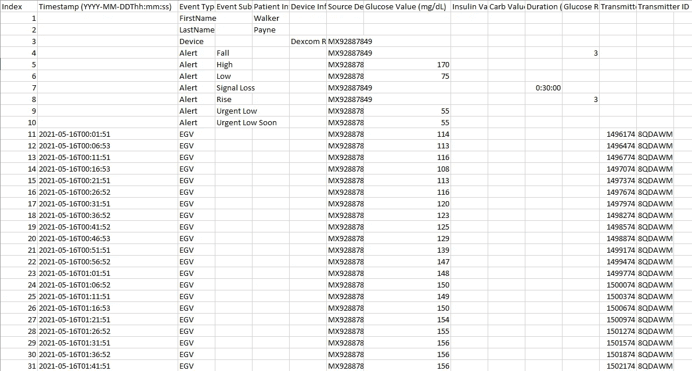

**图一。**将 Dexcom Clarity 数据截图为 CSV 文件。(图片由作者提供)

我们要查看的重要数据是*时间戳*和*葡萄糖值(mg/dL)* 列。每 5 分钟，CGM 获取一个数据点，存储它，并显示给用户。

接下来，我们需要导入所有相关的库。今天我们将使用 Pandas、NumPy、Matplotlib、Seaborn 和 Plotly。

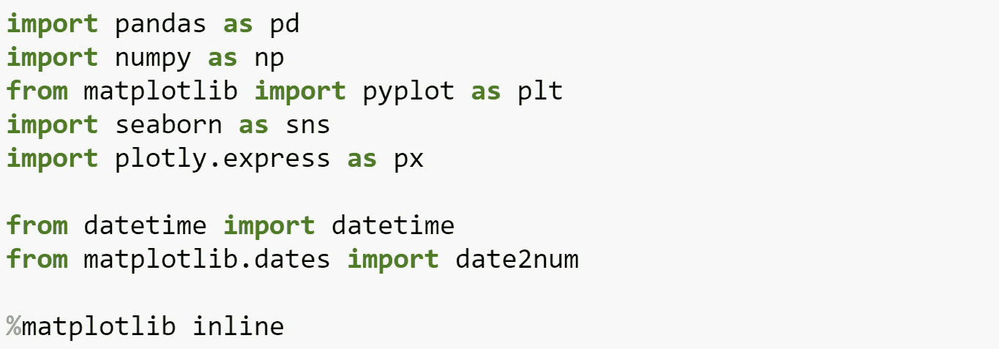

我们需要的唯一相关列是*时间戳*和*葡萄糖值(mg/dL)。*我们还可以删除数据帧的前几行，重置索引，并清除列名:

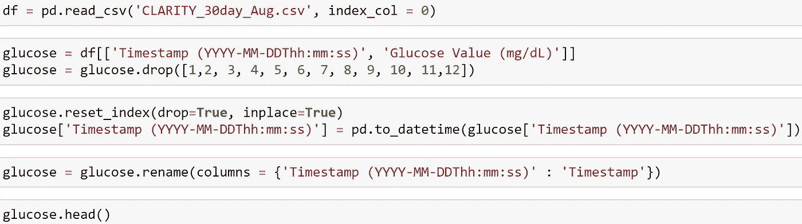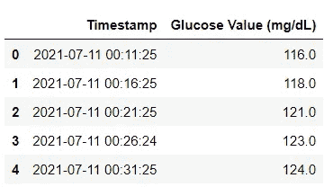

现在，有了一个清晰的数据框架，我们就可以开始分析了。

# 平均葡萄糖值

给定期间的平均葡萄糖值是总体血糖控制的简单描述**。糖尿病患者的目标范围在 70 和 180 mg/dL 之间，正常(非糖尿病)平均葡萄糖在 90 和 110 mg/dL 之间。**

**熊猫们。describe()(描述)函数为我们提供了值的总数和一些描述性统计数据，包括平均值:**

******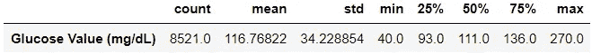**

****我在这 30 天内的平均葡萄糖值为 117 毫克/分升**，相当不错。我应该指出，我没有胰岛素泵，而是每天至少注射 4 次胰岛素来维持目标水平，每次注射的量主要取决于碳水化合物的消耗量(以及许多其他因素)。**

> ****注意** : **上面显示的标准差(STD)值可能会产生误导**，因为血糖测量范围高度不对称——低血糖范围(40–70mg/dL)在数值上比高血糖范围(180–400+mg/dL)窄。因此，葡萄糖值的分布高度倾斜，STD 主要受高血糖波动的影响，而对低血糖不敏感[1]。出于这个原因，四分位距(IQR)是一个更适合非对称分布的衡量标准。**

# **血糖值的四分位数范围**

**可以使用 Seaborn 创建一个盒须图来演示我们在上一节中计算的 IQR:**

**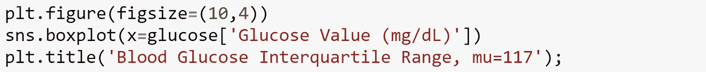****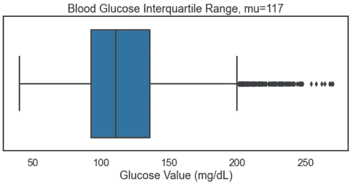**

****图二。**血糖四分位距。(图片由作者提供)**

**上面的图是我的 IQR 的视觉表现。值的范围从~ 40(CGM 可检测的最小值)到 200，超过 200 的点被归类为异常值，由 IQR 确定。**

**我们可以根据一周中的某一天来划分图表，以尝试识别任何趋势:**

**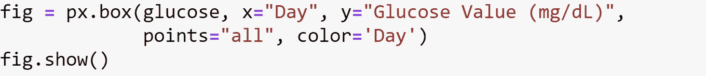****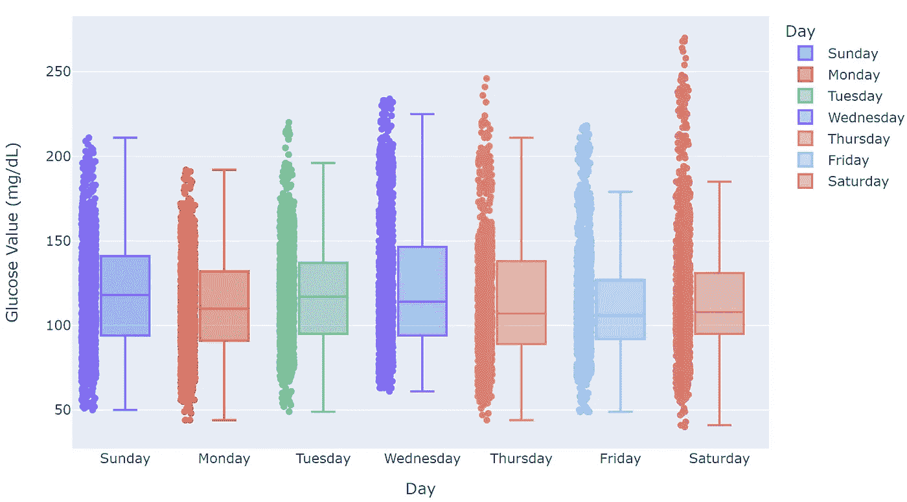**

****图三。**用 Plotly 生成的盒须图在一周中的某一天拆分。(图片由作者提供)**

****上面的图 3** 揭示了一些有趣的见解。让我们特别来看看星期六。注意位于顶部“须状物”之外的点——这些是异常值，或者在数值上远离其余数据的观察值。虽然周六的 IQR(盒子)相当小，但看起来我有一次不寻常的高血糖水平之旅。由于周末通常对我来说在饮食和锻炼习惯方面不太结构化，这是有意义的。饮酒、非正常饮食(例如在餐馆就餐)以及潜在的缺乏锻炼都是我在周六更频繁发生的事情，都可能导致血糖控制较差。**

**从这个分析中可以得出一个可行的见解，那就是我需要更加注意我的周末习惯，并且在这些时间里更加重视血糖控制。**

**下面是同样的 GIF 格式的图表，展示了 Plotly 的一个有趣的好处:它是交互式的！将鼠标悬停在图形的不同区域上可以很容易地比较数值。**

**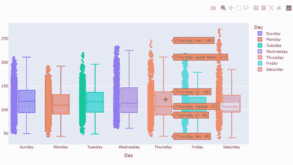**

****图 4。**盒须图 GIF，展示 Plotly 的交互性。(图片由作者提供)**

# **血糖变化率的标准偏差**

**如平均葡萄糖值一节所述，不建议*而非*计算简单葡萄糖值随时间变化的标准差(SD)。重申原因:**

1.  **“血糖测量范围高度不对称，**
2.  **低血糖范围在数值上比高血糖范围窄，并且**
3.  **个体的葡萄糖值的分布通常是相当偏斜的。"[1]**

**相反，我们可以计算血糖值随时间的*变化率*，这通常是对称的，并计算其标准偏差。所得值在统计上是准确的，并可作为血糖稳定性的指标。**较高的血糖变化率标准差表明血糖变异性增加，因此控制较差。****

**为了计算变化率，我们使用以下公式:**

**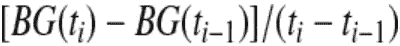**

**其中变化率以(毫克/分升)/分钟为单位。因为我们的读数是每 5 分钟读取一次，所以分母就是 5。在 Python 中，它看起来像这样:**

**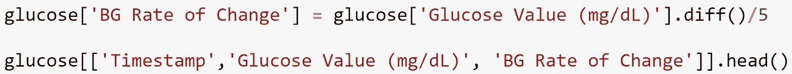****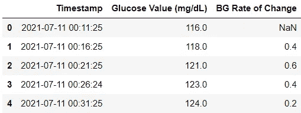**

**为了对此进行可视化，我们将使用 Seaborn 直方图和一些有趣的 f 字符串格式，用变化率的平均值和标准偏差值自动填充标题:**

**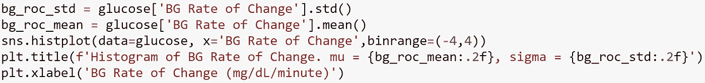****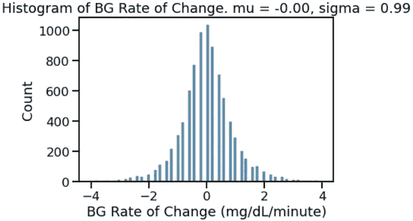**

****图五。**血糖变化率图。(图片由作者提供)**

**价值本身并不十分直观。我的血糖值的标准差是 0.99，这意味着我的大部分时间(~68%)是在血糖变化率在-1 和+1 之间的情况下度过的。如果标准差是 5，这意味着我的血糖水平波动更大更快，这不是一个理想的状况。**

**为了使该分析最具影响力，它将被用作治疗变化之间的**比较工具**。你可以计算一个 30 天的标准偏差，然后实施一些改变(胰岛素与碳水化合物的比率，日常锻炼，不同类型的锻炼，饮食的改变，等等。)并在接下来的 30 天内再次计算。希望第二个数据集的标准差更小，您可以量化这种变化对您整体血糖控制的影响。**

# **在范围内的时间百分比(TIR)**

**了解各种范围内的时间百分比作为 CGM 变化的一般行为的指示是有用的。如本研究前面所述，相关范围如下:**

*   ****低血糖**(血糖< 70 毫克/分升)**
*   ****目标范围** ( 70 毫克/分升<血糖< 180 毫克/分升)**
*   ****高血糖**(血糖> 180 毫克/分升)**

**这个值的计算对我来说有点棘手，涉及到 Pandas 方法，如 ***。grouper()，。解散堆叠()和。菲尔娜()。*** 参见下面的代码和相应的输出:**

**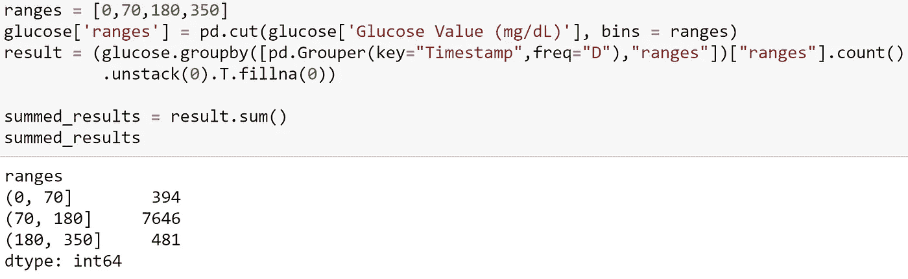**

**我们可以通过计算每个离散时间段的简单百分比来总结这些结果。在本例中，我使用 f-string 格式创建了一个间距很小的表格输出:**

**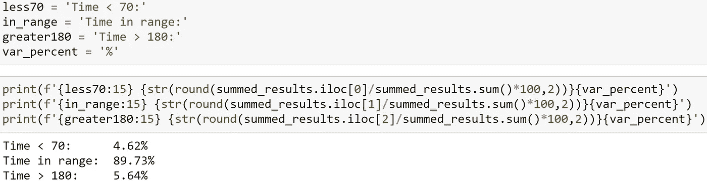**

**在这 30 天的时间里，**我的 BG 值在大约 90%的时间范围内**。我希望这个数字更高，但它永远不会是完美的。**最终，较高的 TIR 与较低的微血管并发症风险相关****【2】**。TIR 应与实验室得出的 A1C 值结合起来考虑，以准确评估您自己的日常血糖变化。**

**我只能找到一些 TIR 目标的例子。Diabetes.org 规定的目标是至少 70%的 TIR，但我个人认为这太低了。可以说，TIR 越高越好。**

# **葡萄糖痕迹**

**葡萄糖轨迹图仅仅是 BG 值的时间序列。可视化血糖水平随时间的波动很有用，可以确定一天中是否有任何趋势。**

**我编写了下面的代码来创建一个有按钮来改变显示区域的交互式图形。例如，单击“1d”会将窗口更改为仅显示一天的数据。类似地，“1m”会将视图更改为包含一个月的数据。从那里，您可以来回拖动以查看血糖值如何随时间波动:**

**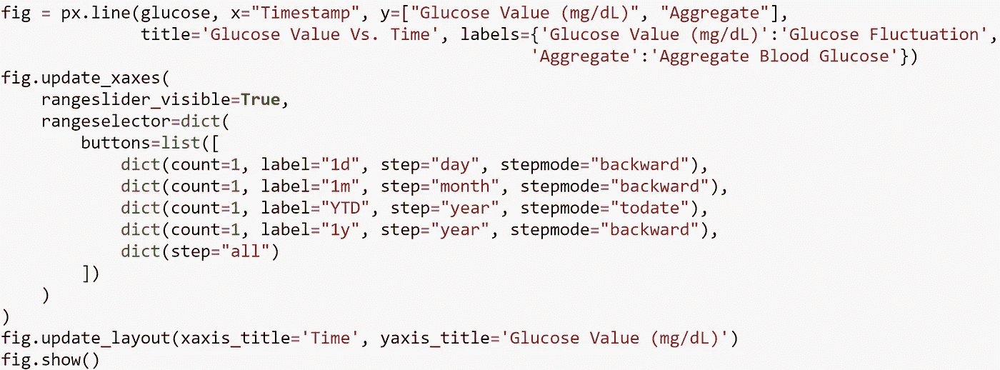****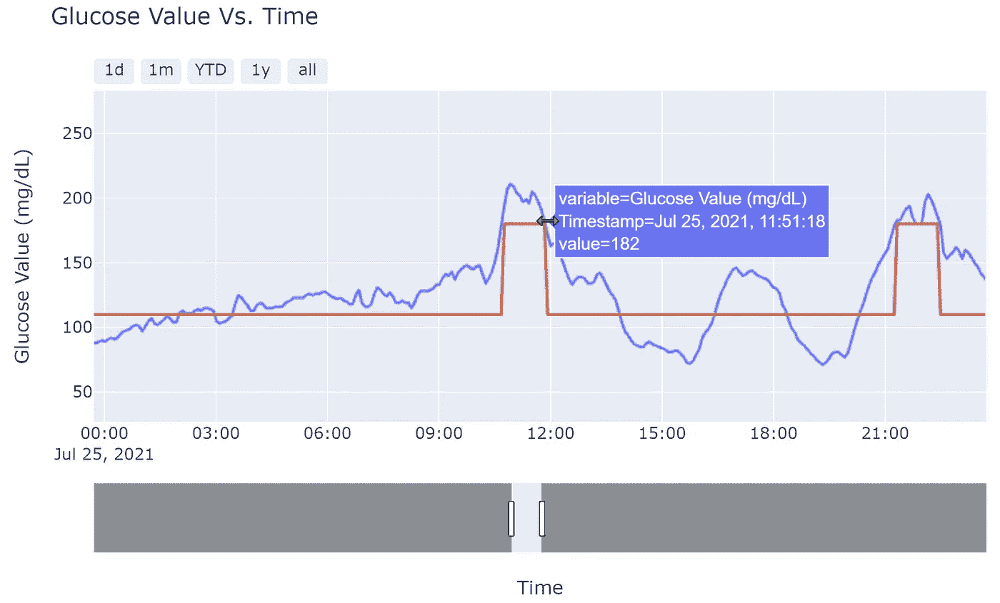**

****图六。**葡萄糖值对时间，叠加总葡萄糖值。(图片由作者提供)**

****上图 6** 是我 2021 年 7 月 25 日的 BG。10 点 30 分左右，我的血糖超过高血糖阈值，直到 12 点。红线清楚显示了偏移的持续时间，这被称为*聚集葡萄糖轨迹*。没有这条线，很难快速知道血糖值是否在可接受的范围内。例如，从 1500 年到 1900 年，血糖水平明显上升，随后下降。虽然直观上这可能表明在此期间缺乏控制，但叠加的聚集葡萄糖迹线(红线)显示 BG 值从未越过高血糖或低血糖阈值，表明血糖控制令人满意。**

**为了计算总的葡萄糖轨迹，我使用简单的 if/else 逻辑在 DataFrame 中创建了一个新列:**

**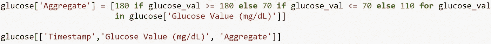****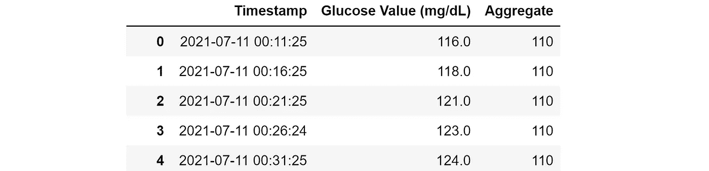**

# ****庞加莱图****

**庞加莱图传统上在物理学中用于可视化系统的动态行为。在这个用例中，“*一个更小、更集中的图表示系统(患者)的稳定性，而一个更分散的庞加莱图表示系统(患者)的不规则性，在我们的情况下反映出较差的葡萄糖控制和快速的葡萄糖偏移*。”[1]**

**图中每个点的坐标 BG(t-1)在 x 轴上，BG(t)在 y 轴上。每个点的坐标(y-x)之差代表血糖变化率。为了计算这个，我简单地在 DataFrame 中创建了一个名为“Lag”的新列，并使用了熊猫*。shift()* 函数获取(t-1):**

**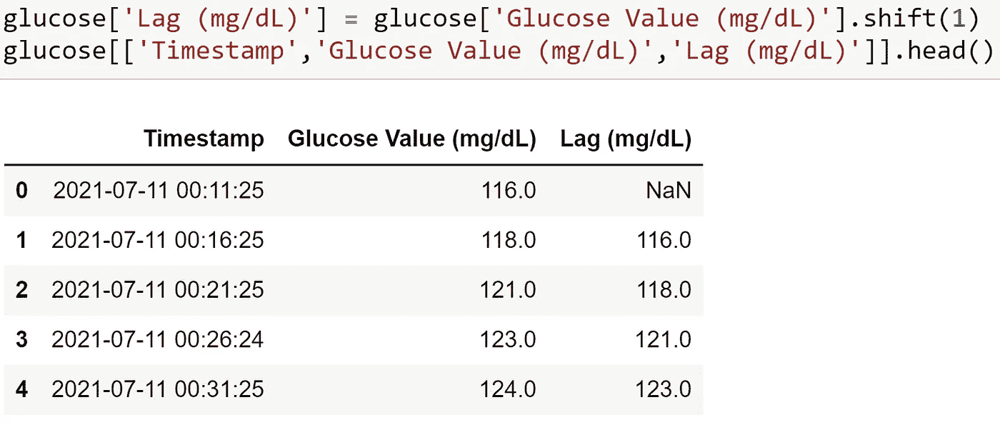**

**该图是可视化治疗变化的**效果的理想对比工具。**例如，可以收集 30 天期间的血糖“控制”数据，对治疗进行一些改变(例如，调整碳水化合物比率、调整基础剂量、定期锻炼、改变饮食等。)30 天，并收集血糖数据，然后将这两个时间段相邻绘制，并比较其分布。更集中的第二个 30 天时期将指示有益的治疗。**

**由于我没有任何可以比较的治疗变化，我决定用 3 个独立的时间框架展示庞加莱图——一个“好的一天”,一个“坏的一天”,以及总共 30 天的时间段:**

**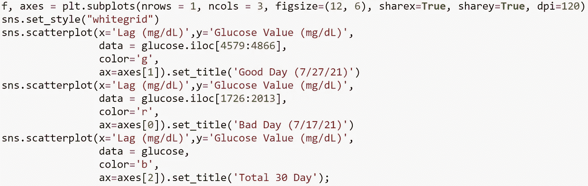****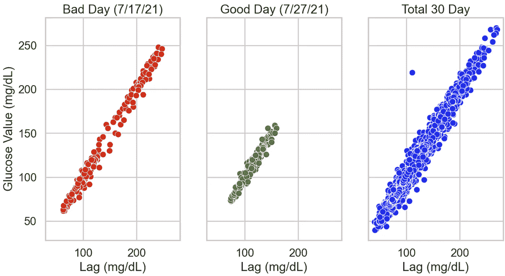**

****图七。**比较三个不同时期血糖控制的庞加莱图。(图片由作者提供)**

**从上面的**图 7** 可以清楚地看到，最左边的图确实是“糟糕”的一天，点数分布越大，表明血糖变化越大。**

**“30 天总计”图表上有一个异常点，这是我的 CGM 在两个小时内无法获取数据的结果。在此期间，我的血糖变化了 108 mg/dL，导致两个相邻时间戳之间存在显著差异。**

**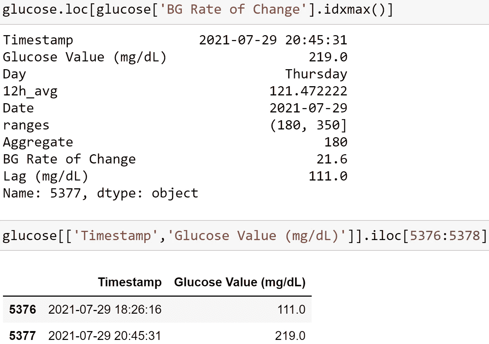**

# **控制可变性网格分析(CVGA)**

**把最好的留到最后，对我来说，CVGA 是整个项目中最具洞察力的一幅图。CVGA 是另一个可视化整体血糖控制的工具。在我们看了图表之后，我会解释它是什么:**

**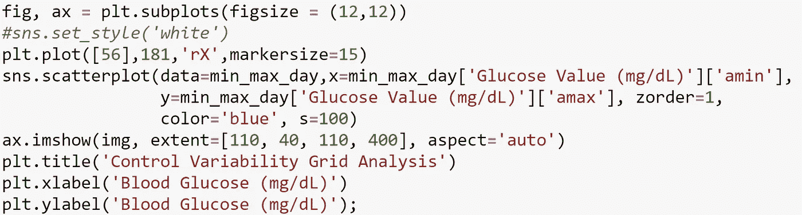****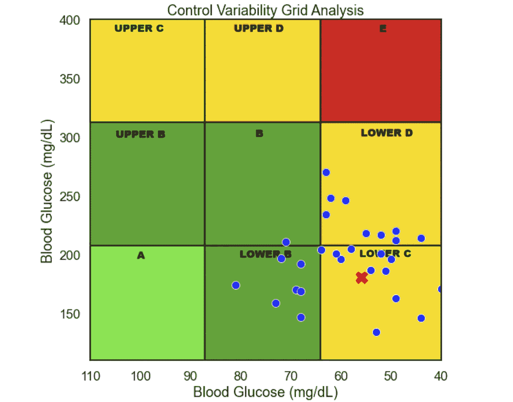**

****图 8。**控制可变性网格分析。(图片由作者提供)**

**图 8**上的每个点**代表这 30 天期间的一天**。每个点的 x 坐标是该 24 小时内的最小*血糖值*，y 坐标是该 24 小时内的最大*血糖值*。(注意 x 轴的反方向。)我通过创建一个按天聚合的新数据框架并使用 NumPy 的 min 和 max 聚合函数来计算这些值:****

**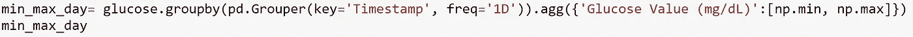****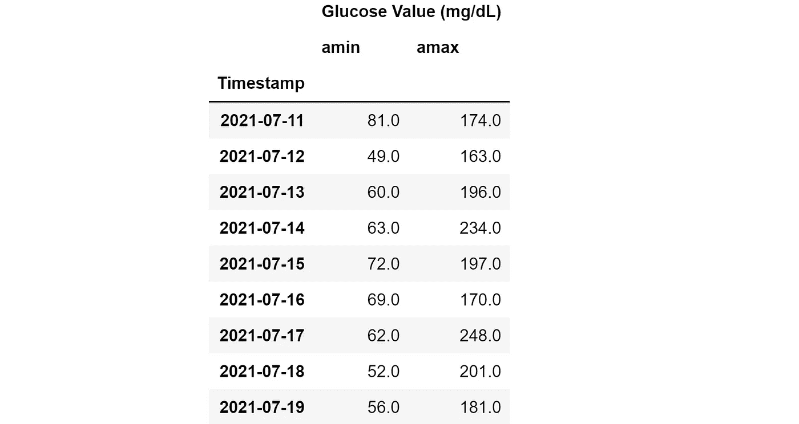**

**为了解释该图，让我们来看一个例子点，图 8 中的红色“X”，其坐标为(56，181)。从我们之前显示每日最小值和最大值的 DataFrame 输出中，我们可以看到该坐标对应于 2021 年 7 月 19 日。这一天，我的最低血糖值为 56，最高血糖值为 181，这一数据点位于图表的“较低 C”部分。理想的一天会落在图表的绿色区域，完美的一天在“A”部分。“A”天的最低温度在 90 度到 110 度之间，最高温度低于 180 度。各区域[1]的定义见下面的**表 1** :**

**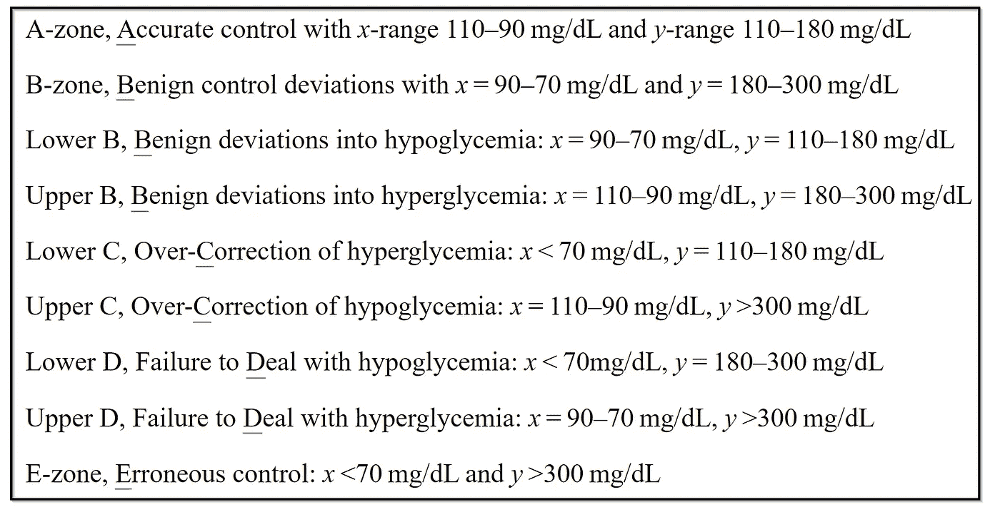**

****表 1** CVGA 区定义。[来源](https://www.ncbi.nlm.nih.gov/pmc/articles/PMC2903980/)**

**CVGA 表明我的血糖趋势低于正常水平。具体来说，它表明**我倾向于对高点**进行过度修正。我显然需要重新评估我的高血糖校正率，并更加重视减少我经历的低血糖次数。**

**我在 CVGA 的结果看起来相当差，但我们必须记住，他们没有考虑低或高的持续时间，只是绝对的最小值和最大值。我很快纠正了低血糖(基于“在范围内的时间百分比”一节中讨论的结果)，但这些低血糖症仍然对整体健康有害，必须加以解决。将这些分析结合起来考虑，对你自己的血糖控制有一个整体的了解是很重要的。**

# **结论——自己试试！**

**非常感谢你的阅读。如果你或你认识的人是 T1 糖尿病患者，希望你在这篇文章中发现了价值。你可以用你自己的数据创建我在这里展示的所有相同的图表——只需从[我的 GitHub repo](https://github.com/walkerpayne/Glucose-Analysis) 下载 Jupyter 笔记本。如果你有任何问题，我很乐意帮忙。欢迎在下面或 GitHub 上发表评论。**

> **医疗建议免责声明:本文中包含的信息，包括但不限于文本、图形、图像和其他材料，仅供参考。本文中的任何材料都不能替代专业的医疗建议、诊断或治疗。在开始新的医疗保健方案之前，如果您对医疗状况或治疗有任何疑问，请务必向您的医生或合格的医疗保健提供者寻求建议，切勿因为您在此阅读或了解的内容而忽视专业医疗建议或延迟寻求建议。**

**参考资料:**

**[1]https://www.ncbi.nlm.nih.gov/pmc/articles/PMC2903980/**

**[2][https://clinical.diabetesjournals.org/content/38/5/439](https://clinical.diabetesjournals.org/content/38/5/439)**