# 如何分析两组连续数据

> 原文：<https://towardsdatascience.com/how-to-analyze-continuous-data-from-two-groups-8d101510790f?source=collection_archive---------22----------------------->

## 数据可视化

## 统计假设检验 SciPy 和 Seaborn 的视觉效果

大多数数据科学从业者不理解传统统计学。传统的统计学家不使用许多现代数字。让我们弥合这一差距。

想象一个任务。你有几十或几百个特征可以用来预测结果。假设这个结果是电子商务网页的点击量。假设你在电子商务网页上有很多数据:所有者、URL、托管服务、更新频率、东道国等等。你的模型可以预测点击次数，而且预测的准确度令人印象深刻。但是你的老板问你，“来自美国的网页和来自欧盟的网页在点击量上有区别吗？”你能通过假设检验和视觉支持来回答这个问题吗？如果你的答案从“一点也没有”到“可能”，继续读下去。

前面的例子代表了一个典型的数据科学问题。为了大大简化分析，让我们放在一起一个玩具数据集。玩具组代表了从更类似于上面的大数据中提取的内容。

我们想评估一个体育活动项目的有效性。这个项目旨在鼓励参与者更频繁地锻炼。这项研究有两个独立的组:控制组和干预组。这个项目进行了两周，研究者记录了每个参与者报告的每日锻炼时间。这些数据构成了下面的熊猫数据框架。完整源代码[此处](https://github.com/katewall/medium_tutorials/blob/main/210630_Medium_Exercise_Visualization.ipynb)。让我们探讨以下问题:

对照组和干预组之间的每日锻炼率(每天分钟数)有差异吗？

```
**from** **scipy** **import** stats
**import** **pandas** **as** **pd**
**import** **numpy** **as** **np**
**import** **matplotlib.pyplot** **as** **plt**
**import** **seaborn** **as** **sns**
%matplotlib inlineexercise_group = ['control']*38+['intervention']*42
exercise_rates = [25, 20, 75, 0, 50, 0, 40, 0, 0, 0, 0, 0, 25,
                 75, 0, 0, 20, 0, 0, 0, 0, 20, 20, 0, 25, 0,
                 40, 20, 40, 50, 25, 30, 25, 20, 25, 50, 30,
                 40, 20, 30, 25, 50, 0, 40, 75, 10, 15, 3, 15,
                 95, 25, 50, 40, 8, 20, 25, 50, 5, 5, 12, 30,
                 40, 10, 0, 10, 20, 20, 25, 10, 0, 50, 20, 20,
                 5, 15, 30, 10, 25, 20, 15]
exercise = pd.DataFrame({'group': exercise_group,
                         'rates': exercise_rates})
exercise
```

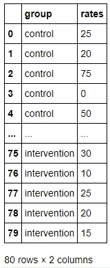

实践数据

我们可以用表格来显示这些数据。首先从 group 列中获取组。

```
consolidated_unique_strings = []
**for** unique_string, sub_df **in** exercise.groupby('group'):  
  consolidated_unique_strings.append(unique_string)
print(consolidated_unique_strings)>>>['control', 'intervention']
```

然后应用于聚集的子数据框架结果。我们看到了干预组和对照组在每组中的观察次数、平均值、相似的标准差和相同的中位数。

```
consolidated = pd.DataFrame(unique_string.describe().rename(
    columns={'score':sub_df}).squeeze()
    **for** sub_df, unique_string 
    **in** exercise.groupby('group'))consolidated.index = consolidated_unique_strings *#replace row names*
print(consolidated.round(1)) *#round results to one decimal*
```

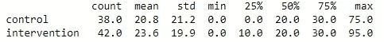

按组汇总的数据摘要

查看这些数据的传统方式是通过 [Tukey 箱线图](https://mathworld.wolfram.com/Box-and-WhiskerPlot.html)。箱线图的盒子有三个主要部分，25%四分位数的底线，中间线或 50%四分位数，以及 75%四分位数的上边界。对于蓝色控制盒，这些值将是 0、20、30，如下所示。盒子上的“胡须”代表异常阈值。晶须的端点出现在 1.5 倍的四分位间距(IQR)。对于下面的橙色干预框，IQR 将是第 75 个百分点减去第 25 个百分点，即第 3 个四分位数减去第 1 个四分位数，或 30–10 = 20。对于橙色干预组，中位数，即第 50 个百分位数，与第 2 个四分位数相同，出现在 20。50 岁时的晶须为(中位数+ 1.5*IQR) = 20+30。0 处的晶须为(中值-1.5 * IQR)= 20–30 =-10。然而，晶须不会超出数据的[范围，在本例中为 0。因此，我们发现较低的晶须底部为 0。](https://matplotlib.org/stable/api/_as_gen/matplotlib.pyplot.boxplot.html)

我们在橙色一侧的顶须上方看到的两个点是干预组中的异常值。除非这些异常点有已知的数据质量问题，否则它们必须始终包含在分析中。请注意数据科学行话不一致性#10，000，321:离群值在 matplotlib 文档中被称为“飞行者”，seaborn 就是建立在这个基础之上的。

```
sns.boxplot(x='group', y='rates', data=exercise)
```

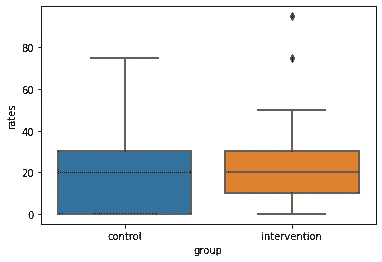

默认箱线图

就我个人而言，可能和你们中的许多人一样，不喜欢 seaborn 的默认调色板。因此，使用来自[十六进制图表](https://htmlcolorcodes.com/)的两种漂亮的颜色，我将手动改变下一个数字的调色板，就像这样。

```
sns.set_theme(style='darkgrid')
sns.set_palette(['#299EF0','#40E0D0'])
```

下面是没有原始观测值和有原始观测值的箱线图的两个并排演示。对于大多数应用程序，如果可能的话，我建议将原始观测值添加到箱线图中。通过添加下面的点，我们可以在 y 轴上看到观察的频率。该信息在历史上被归入直方图；然而，我们现在可以选择将这两种类型的信息放在一个图上。在对照组中，我们看到很大一部分参与者的假装日常锻炼率保持为零。然而，我们可以看到，干预，锻炼计划，似乎减少了 0 的观察次数，并可能与更高的比率有关。

```
f, axes = plt.subplots(1, 2, figsize=(7, 7)) 
sns.boxplot(x=’group’, y=’rates’,data=exercise,ax=axes[0]
            ).set_title(‘Traditional Boxplot’) 
sns.boxplot(x=’group’, y=’rates’, data=exercise,ax=axes[1]
            ).set_title(‘Boxplot Overlaid with Observations’) 
sns.swarmplot(x=’group’, y=’rates’, data=exercise, color=’0.25',
              ax=axes[1]) 
plt.show()
```

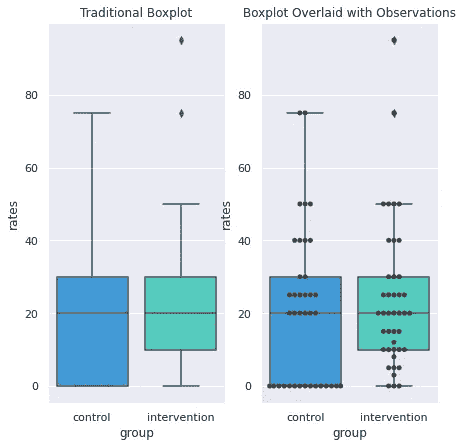

或者，我们可以使用小提琴图来添加水平趋势线，以更具装饰性的方式表示混合箱线图-直方图。

```
h = sns.catplot(x='group', y='rates', kind='violin', inner=**None**, 
                data=exercise)
sns.swarmplot(x='group', y='rates', color='k', size=3, 
                data=exercise, ax=h.ax)
h.ax.set_title('Violin Plot')
```

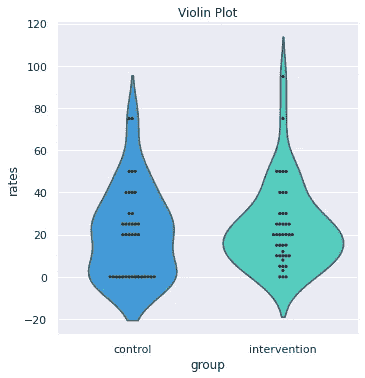

有时，我们只是想展示要点，而没有干扰、干扰或推断。在这种情况下，catplot 是一个很好的选择。如果你没有兴趣告诉某人任何事情，这就是给他们的阴谋类型。

```
g = sns.catplot(x=’group’, y=’rates’, kind=’swarm’, data=exercise) g.ax.set_title(‘Raw Observations’)
```

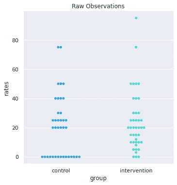

boxenplot 函数是一个[字母值图](https://vita.had.co.nz/papers/letter-value-plot.html)的 seaborn 实现。这种类型的绘图对于大型数据集特别有用。更多细节可以在这篇[伟大的文章](/letter-value-plot-the-easy-to-understand-boxplot-for-large-datasets-12d6c1279c97)中找到。

```
i = sns.boxenplot(x=’group’, y=’rates’, 
                  data=exercise,showfliers=**False**) 
i = sns.stripplot(x=’group’, y=’rates’, 
                  data=exercise,size=4,color=’0.25') 
i.set_title(‘Boxenplot with Points’)
```

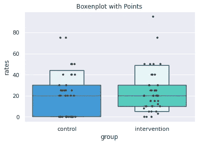

最后，通过显示平滑的表示，如 KDE 图，可以优化对屡试不爽的直方图的解释。由于视觉上的简单性，内核密度视图非常强大。通过选择平滑参数，数据被用于拟合平滑的高斯核，产生连续的概率密度函数估计。如果基础数据是有界的或不平滑的，这种估计会引入失真。例如，查看新的 x 轴，它现在从-20 扩展到 120，而原始数据范围是 0 到 95。然而，即使有这样的限制，KDE 的观点阐明了对照组的双峰行为。由于有两个明显的峰值，这种行为在其他图中也有显示，但没有突出显示。

```
g = sns.displot(exercise, x='rates', hue='group',bins=9)
g.ax.set_title('Overlaid Histograms')

h = sns.displot(exercise, x='rates', hue='group',kind='kde',bw_adjust=.75)
h.ax.set_title('Kernel Density View')
plt.show()
```

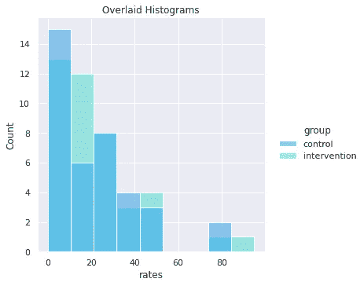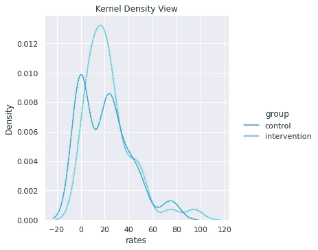

现在这类数据的可视化分析已经彻底穷尽，我们可以回到最初的问题。对照组和干预组之间的每日锻炼率(每天分钟数)有差异吗？我们的视觉分析表明也许。使用 SciPy 包，我们还可以进行统计假设检验。这里合适的检验是两个*独立*组的双边 t 检验。

这里重要的关键是独立。小组参与之间没有交叉，我们假设这些小组是随机选择的。如果每组的基线运动率存在差异，那么独立性要求就没有得到满足，我们就不能使用 t 检验。

> 假设检验将得出以下结论:
> 
> 零假设(Ho):各组之间的运动率没有差异。
> 
> 替代假设(Ha):锻炼率和群体成员之间存在关联。

由于每组的标准差相似(对照组和干预组分别为 21.2 和 19.8)，我们可以使用假设方差相等的 t 统计公式。最终的 t 检验统计值为-0.62。使用 0.05 的显著性水平α，这对应于 0.54 的 p 值，其不显著。因此，我们无法拒绝零假设，因为缺乏证据表明这些组之间的比率存在差异。相应地，我们认为锻炼计划是无效的。

这是大多数分析得出结果的方式。然而，还有更多。现在我们必须记住，这些结果可能包含设计误差。在统计学中，有第一类和第二类错误。

*   第一类错误是当实际上没有差异时，得出结论说两组之间有差异。
*   第二类错误是得出结论，认为两组之间没有差别，而实际上是有差别的。

t 检验旨在查看来自两个来源的 1D 数据，并计算聚合值或统计数据，以确定数据是否与下图相似，是否有明显的峰分离。将统计数据映射到其假设的分布，并计算 p 值，即尾部下的面积。如果 p 值小于 0.05，则表明数据可能看起来与这个[借用数字](https://www.real-statistics.com/sampling-distributions/statistical-power-sample/)相似。

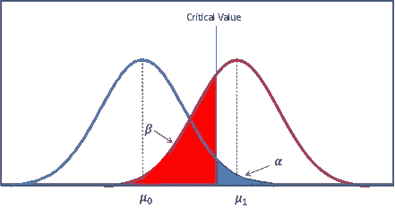

一般 t 检验的可视化

然而，我的数据与图表不符。让我们将其与我们的实际数据进行比较。在下图中，左边的绿色区域类似于右边的蓝色区域。p 值 0.54 是获得至少与观察结果一样极端的结果的概率。换句话说，对照组均值和干预组均值接近的几率很高。在这种情况下，这种可能性超过 50%。因此，我们得出结论，峰没有很好地分开，没有区别。

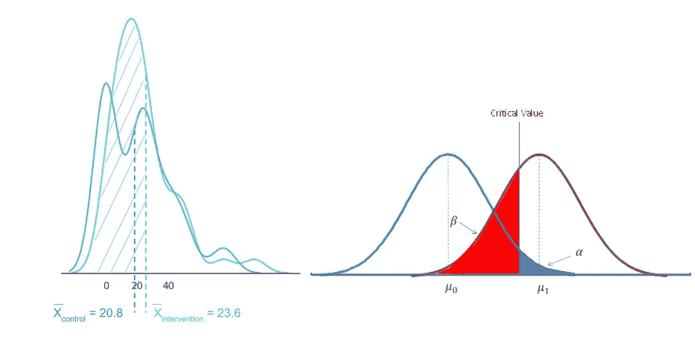

(左)此 t 检验的可视化。(右)常规 t 检验的可视化

然而，考虑到该数据中的高水平变化，尤其是在对照组中，检测 3 分钟/天的样本均值差异的能力较低。为了用 80%的功效或 20%的机会来检测这种差异，我们将需要数据集中至少 1804 个观察值。参见下面由[这个自由功效计算器](https://clincalc.com/stats/samplesize.aspx)生成的计算结果，使用平均值的差异(20.8 +/- 21.2 对照和 23.6 干预)，干预与对照的比率为 1.1，显著性水平为 0.05，功效为 0.8，该试验应该包括 859+946 = 1804 名参与者，而不是 80 名。就目前情况而言，传导测试的功效约为 10%,因此我们有 90%的机会在 t 测试中犯下 II 型错误。换句话说，由于 80 名参与者的小样本量，有 90%的可能性我们得出结论没有差异。

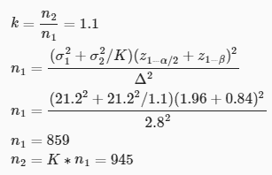

t 检验的功效计算

尽管独立组间双边 t 检验的假设检验结果不显著，但该检验不足以进行检测。因此，对于希望限制错误率的从业者来说，假设检验结果仍然是不确定的。虽然假设检验不提供信息，但对分布的视觉分析产生了边缘证据，表明各组之间的参与者行为可能存在差异。

将这些工具整合到您自己的分析中。在这里找到[源笔记本](https://github.com/katewall/medium_tutorials/blob/main/210630_Medium_Exercise_Visualization.ipynb)。