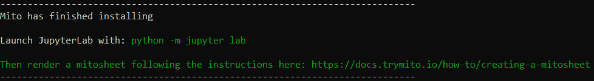
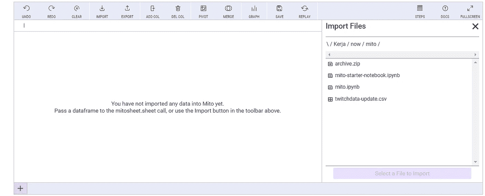
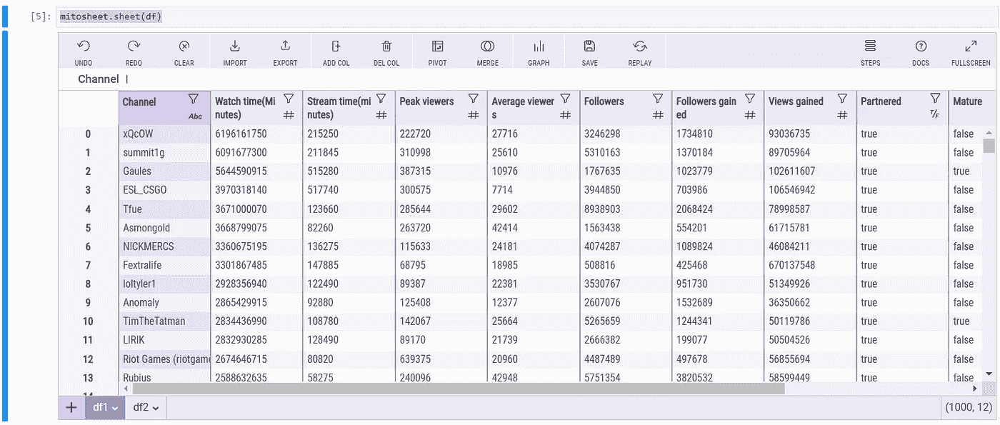
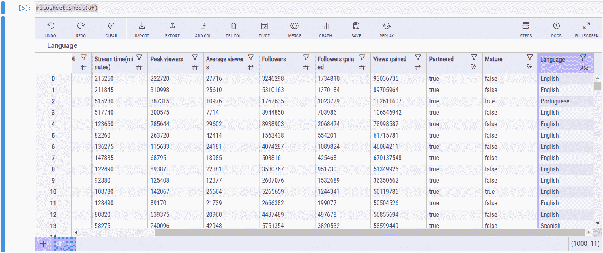
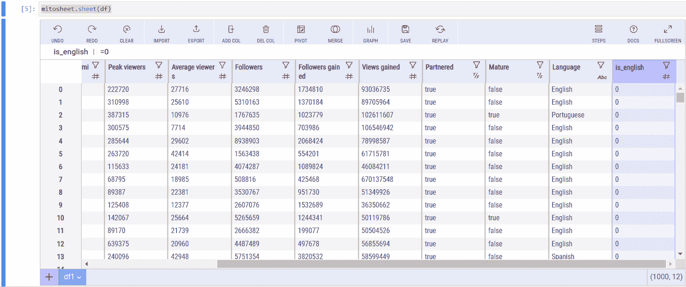
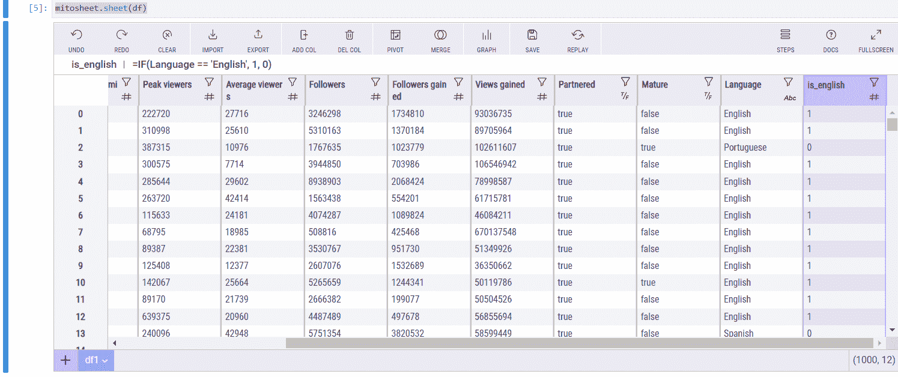
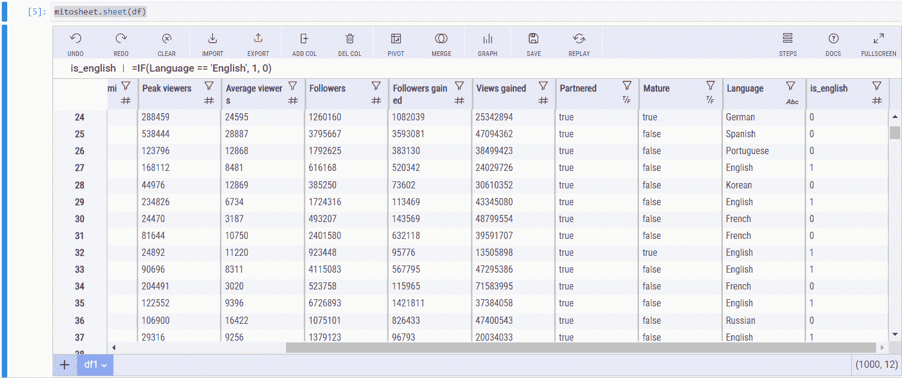
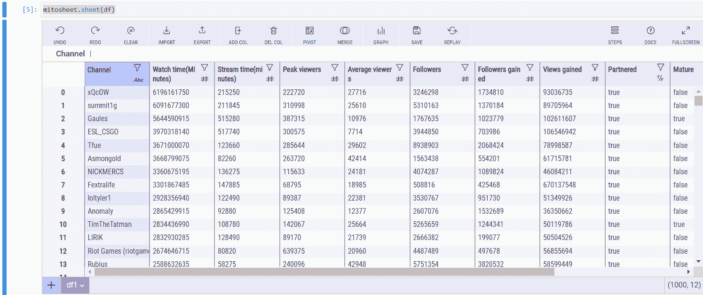
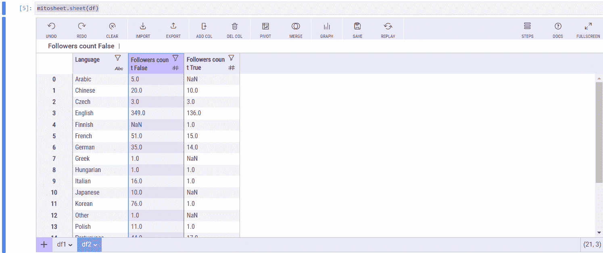
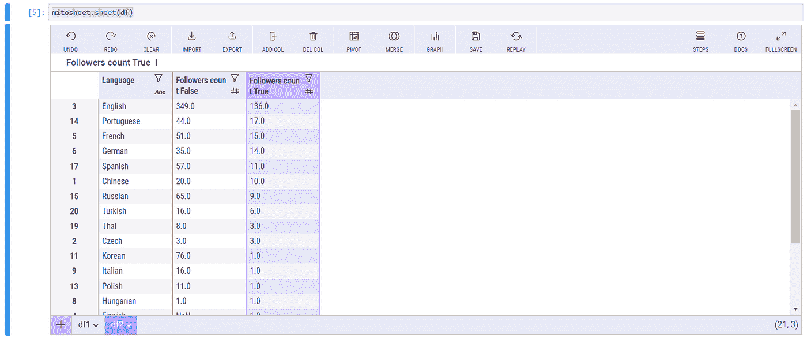

# 如何在 Python 中使用米托分析数据

> 原文：<https://towardsdatascience.com/how-to-analyze-data-using-mito-in-python-4bf817092367?source=collection_archive---------17----------------------->

## Jupyter 笔记本上的电子表格和编程，为什么不呢？


[蒂姆·约翰逊](https://unsplash.com/@mangofantasy?utm_source=unsplash&utm_medium=referral&utm_content=creditCopyText)在 [Unsplash](https://unsplash.com/s/photos/data-analysis?utm_source=unsplash&utm_medium=referral&utm_content=creditCopyText) 上拍照

# 介绍

数据包含如此多有意义的见解。数据分析是获得这些见解的途径。有时，我们对选择我们想要使用的工具感到困惑，不管是使用像 Excel 这样的电子表格软件。或者我们可以使用 Python 这样的编程语言。

对于一些人来说，他们更喜欢使用电子表格工具。其中一个原因是因为他们还不会编程。

对于大数据，不建议使用电子表格工具。所以，我们需要分析大数据的编程。但是谢天谢地，有一个工具可以把两者联系起来。它叫米托。

米托是一个具有分析数据能力的库。与熊猫图书馆不同，米托有一个类似电子表格软件的界面。因此，我们可以在不干扰代码的情况下探索和处理数据。

在本文中，我将向您展示如何使用米托分析数据。此外，我将向您展示该工具中包含的功能。没有进一步，让我们开始吧！

# 履行

## 安装并加载库

在我们可以使用这个库之前，我们需要先安装它。我们需要安装 mitoinstaller 库，以便用“pip”命令安装米托。下面是执行该操作的命令:

```
**python -m pip install mitoinstaller**
```

之后，您可以使用以下命令行安装米托:

```
**python -m mitoinstaller install**
```

如果安装完成，它将显示如下文本:



截图为作者截图。

现在我们可以在笔记本上加载库了。

> 请记住，您只能在 JupyterLab 中使用米托。直到现在，你还不能用普通的 Jupyter 笔记本来访问它。

现在让我们初始化米托表。为此，请复制以下代码行:

```
**import mitosheet
mitosheet.sheet()**
```

下面是运行代码的结果:



截图为作者截图。

如果能看到笔记本上的界面，说明现在可以用了。

## 数据源

对于数据源，我们将使用来自 Kaggle 的数据集，名为 Twitch 上的 Top Streamers。基本上，该数据集包含 2020 年前 1000 条飘带的信息。

数据集中包含的信息是观众数量、关注者、语言名称、频道名称等。您可以在这里 访问数据集 [**。**](https://www.kaggle.com/aayushmishra1512/twitchdata)

> 免责声明:
> 数据集在公共领域。它还包含“CC0:公共领域”许可证。更多详情，可以看一下 [**这里**](https://creativecommons.org/publicdomain/zero/1.0/) 。

## 打开数据集

要打开数据集，我们需要从中创建一个 dataframe 对象。我们可以利用熊猫图书馆来做这件事。让我们为此编写以下代码行:

```
**import pandas as pd
df = pd.read_csv('twitchdata-update.csv')**
```

在我们得到数据帧之后，下一步是将它加载到我们的米托表中。为此，添加以下代码行:

```
**mitosheet.sheet(df)**
```

下面是运行代码的结果:



截图为作者截图。

从上面可以看到，数据已经加载完毕。现在让我们探索米托能做什么。

## 创建新列

有了米托，我们可以像在电子表格上一样探索和定制数据集。我想向您展示的第一个功能是向数据集中添加一列。

假设我们想要添加一个列，其中有一个布尔值来确定频道是否为英语。我们称这个栏目为“是英语”栏目。

要添加列，请看这个 GIF:



GIF 是作者捕获的。

# 写公式

因为米托就像一个电子表格工具，我们可以在笔记本上使用，所以我们可以像电子表格软件一样使用公式来定制列。

让我们回忆一下 is_english 专栏。如果语言是英语，我们希望将布尔值设置为 1。在电子表格软件中，我们可以使用这样的公式:

```
**IF(language == 'English', 1, 0)**
```

让我们把这个公式应用到米托身上。以下是该过程的 GIF:



GIF 是作者捕获的。

## 过滤数据

设置完列的值后，让我们根据“is_english”列过滤数据。我们将获取包含值 1 的行。

在米托，我们可以很容易地做到这一点。我们只需要给出进行过滤过程的参数。看看这张 GIF:



GIF 是作者捕获的。

## 可视化图表

我们可以做的下一个功能是可视化数据。有了米托，我们可以更容易地显示图表，而不是花时间编写代码和查看助手的网站来获取特定问题的语法。我们可以可视化图表，如箱线图、直方图、散点图和条形图。



GIF 是作者捕获的。

## 创建数据透视表

我想向您展示的下一个功能是创建数据透视表。就像以前的特性一样，我们只需要给出完成某项任务的参数。

为了创建数据透视表，我们可以设置哪一列作为行、列和值。从该表中，我们可以看到基于特定列的值。在这种情况下，我们希望根据成熟度和语言来合计关注者的数量。

请看这张 GIF 图片，了解如何创建数据透视表:



GIF 是作者捕获的。

## 对数据进行排序

让我们看看我们的数据透视表。如您所见，该表包含了基于成熟度和语言的追随者数量。但是我们仍然没有得到洞见。我们先把数据整理一下。

有了米托，整理数据变得简单了。为此，我们只需点击几个按钮。请看这张 GIF:



GIF 是作者捕获的。

如果对没有成熟内容的栏目进行排序，可以看到英语是最多的语言。然后是韩语、俄语、西班牙语等等。

但是如果你看到更多的细节，非成熟内容的关注人数和成熟内容的关注人数是不一样的。让我们对成熟栏中的数据进行排序。这是这样做的结果:



截图为作者截图。

如你所见，韩国人不在第二位。大部分是欧洲语言。韩国语在汉语和泰语之下。

## 代码生成

这是米托能做的最后一件事。它会生成代码。当我们对数据进行一些处理时，它会根据这些数据自动生成代码。在我的例子中，这是米托生成的代码:

正如你所看到的，它看起来像我们使用的熊猫指令。有了米托，我们可以像电子表格软件一样进行处理，并基于它生成代码。

# 结束语

干得好！现在，您已经学习了如何在 Python 中使用米托分析数据。对于那些刚接触编程和数据分析的人，我希望它能帮助你入门。

如果你对这篇文章感兴趣，请关注我的媒体以获得更多类似的文章。我将谈论大量的数据科学，从教程到许多领域的应用。

如果您有任何问题或想讨论，可以通过 [**LinkedIn**](https://www.linkedin.com/in/alghaniirfan/) 或电子邮件(【khaliddotdev@gmail.com】T4)联系我。

谢谢你看我的文章！