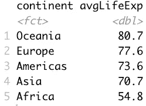

# 如何用 R 分析数据:dplyr 初学者完全指南

> 原文：<https://towardsdatascience.com/how-to-analyze-data-with-r-a-complete-beginner-guide-to-dplyr-4a3c26fe4371?source=collection_archive---------32----------------------->

## 在 10 分钟或更短时间内学会基本的数据分析

由[absolute vision](https://unsplash.com/@freegraphictoday?utm_source=medium&utm_medium=referral)在 [Unsplash](https://unsplash.com?utm_source=medium&utm_medium=referral) 上拍摄

数据集通常需要很多工作时间才能完全理解。r 通过`dplyr`包使这个过程尽可能简单——这是基于代码的数据分析的最简单的解决方案。今天你将学会如何使用它。

您将在整篇文章中使用 [Gapminder 数据集](https://cran.r-project.org/web/packages/gapminder/index.html)。它可以通过 CRAN 获得，所以一定要安装它。下面是如何加载所有必需的包:

下面是 Gapminder 数据集的前几行:

图片 1 — Gapminder 数据集标题(图片由作者提供)

这就是你开始分析所需要的。

今天，您将了解:

*   列选择
*   数据过滤
*   数据排序
*   创建派生列
*   计算汇总统计数据
*   分组

# 列选择

通常情况下，您不需要所有的数据集列来进行分析。r 的`dplyr`提供了几种选择感兴趣的列的方法。第一个更明显——在`select()`函数中传递列名。

下面是如何使用该语法来选择几列:

结果如下:

图 2 —列选择方法 1(作者图片)

但是，如果您有几十个列，并且想选择除了少数几个以外的所有列，该怎么办呢？有一种更好的方法—用减号(-)作为前缀来指定不需要的列:

结果如下:

图 3 —列选择方法 2(作者图片)

如您所见，*洲*列是唯一没有显示的列。这就是你应该知道的关于列选择的全部内容。让我们继续进行数据过滤。

# 数据过滤

过滤数据集是工作中最常见的操作之一。并非所有数据在给定时间都是相关的。有时，您需要特定产品的值或其在 Q1 的销售额。或者两者都有。这就是`filter()`功能派上用场的地方。

以下是如何显示 2007 年的结果:

结果如下所示:

图 4 —数据过滤示例—年份= 2007(作者提供的图片)

您可以在一个`filter()`函数中嵌套多个过滤条件。请确保用逗号分隔条件。以下是如何选择 2007 年波兰的一项记录:

结果如下:

图 5 —数据过滤示例—年份= 2007，国家=波兰(图片由作者提供)

但是如果您想要多个国家的结果呢？您可以为任务使用`%in%`关键字。以下片段显示了波兰和克罗地亚 2007 年的记录:

结果如下:

图片 6 —数据过滤示例—年份= 2007，国家=(波兰，克罗地亚)(图片由作者提供)

如果你理解了这些例子，你就理解了数据过滤。让我们继续数据排序。

# 数据排序

有时您希望数据按特定的列值排序。例如，您可能希望按年龄对用户进行排序，或按分数对学生进行排序，可以是升序也可以是降序。您可以使用`dplyr`及其内置的`arrange()`函数轻松实现这一行为。

以下是如何按预期寿命排列结果:

结果如下所示:

图 7 —数据排序示例 1(作者图片)

如您所见，数据是按照 *lifeExp* 列升序排列的。大多数情况下需要降序排列。以下是实现它的方法:

结果如下:

图 8 —数据排序示例 2(作者提供的图片)

有时您只想返回几行。`top_n()`功能让您指定应该显示多少行。这里有一个例子:

结果如下图所示:

图 9 —数据排序示例 9(作者图片)

这就是关于排序的问题。接下来—派生列。

# 创建派生列

通过`dplyr`，您可以使用`mutate()`功能创建新属性。新的属性名放在等号的左边，内容放在右边——就像你要声明一个变量一样。

下面的示例将 GDP 计算为人口和人均 GDP 的乘积，并将其存储在专用列中。在此过程中还会发生其他一些变化:

结果如下:

图 10-将 GDP 计算为(人口*人均 GDP)(图片由作者提供)

也可以用`transmute()`代替`mutate()`。有一个严重的区别—`transmute()`只保留派生列。让我们在上面的例子中使用它:

结果如下所示:

图 11-使用 transmute()计算 GDP 所有其他列被删除(图片由作者提供)

你会更经常地使用`mutate()`，但是知道额外的功能不会有坏处。

# 计算汇总统计数据

汇总统计不需要任何介绍。在许多情况下，您需要计算一列的简单平均值。以下是如何计算整个数据集的平均预期寿命:

结果如下:

图 12-计算整个数据集的平均预期寿命(图片由作者提供)

正如您所想象的，您可以链接其他函数来只计算子集的汇总统计信息。以下是如何计算 2007 年欧洲人的平均寿命:

结果如下图所示:

图 13 —计算 2007 年欧洲的平均预期寿命(图片由作者提供)

您可以使用汇总统计做更多的事情，但是这需要一些分组知识。让我们接下来讨论这个问题。

# 分组

汇总统计在与分组结合使用时变得更加强大。例如，您可以使用`group_by()`函数来计算各大洲的平均预期寿命。方法如下:

结果如下:

图 14 —计算各大洲的平均预期寿命(图片由作者提供)

您还可以使用前面讨论过的排序函数来按平均预期寿命排列数据集。下面是如何以递减的方式实现这一点:

结果如下所示:

图 15-按各大洲平均预期寿命排序的数据集(图片由作者提供)

另一个强大的功能是`if_else()`。您可以在创建其值取决于某些条件的新列时使用它。

例如，下面是如何创建一个名为 *over75* 的列，如果一个大陆的平均预期寿命超过 75 岁，该列的值为 *Y* ，否则为 *N* :

结果如下图所示:

图 16 —在属性创建时使用 if_else()(图片由作者提供)

这就是你应该知道的所有关于分组的知识！接下来让我们总结一下。

# 结论

今天你已经学会了如何用 R 的`dplyr`分析数据。这是对开发者最友好的包之一，比 Python 的竞争对手熊猫简单多了。

阅读完本文后，您应该能够分析和准备任何类型的数据集。当然，你可以做更高级的事情，但通常这些只是你今天学到的东西的组合。

*喜欢这篇文章吗？成为* [*中等会员*](https://medium.com/@radecicdario/membership) *继续无限制学习。如果你使用下面的链接，我会收到你的一部分会员费，不需要你额外付费。*

 [## 通过我的推荐链接加入 Medium-Dario rade ci

### 作为一个媒体会员，你的会员费的一部分会给你阅读的作家，你可以完全接触到每一个故事…

medium.com](https://medium.com/@radecicdario/membership) 

## [加入我的私人邮件列表，获取更多有用的见解。](https://mailchi.mp/46a3d2989d9b/bdssubscribe)

*原载于 2021 年 1 月 5 日 https://appsilon.com**的* [*。*](https://appsilon.com/r-dplyr-tutorial/)