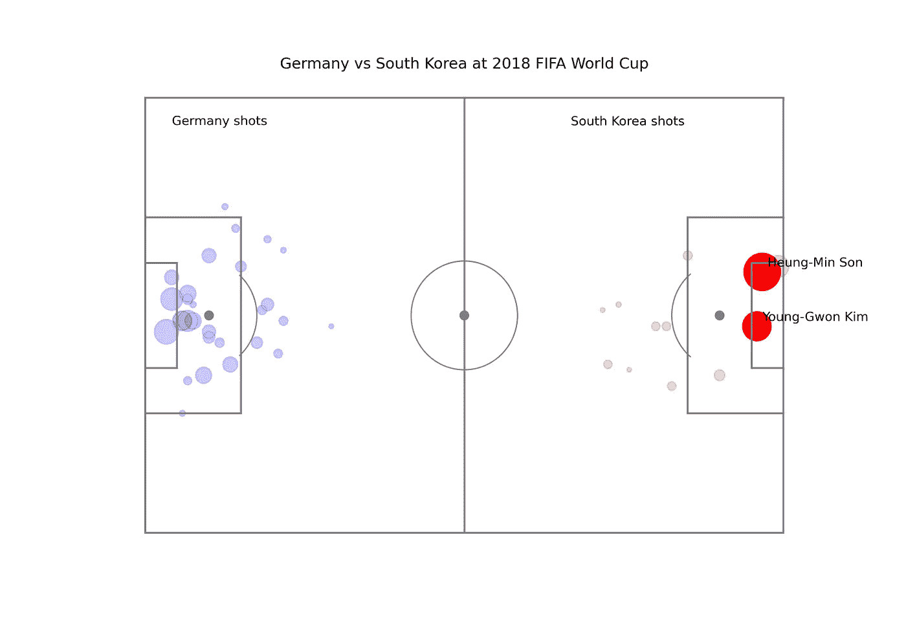

# 如何使用 Python 分析足球赛事数据

> 原文：<https://towardsdatascience.com/how-to-analyze-football-event-data-using-python-2f4070d551ff?source=collection_archive---------4----------------------->

## 我们来分析一下 2018 年 FIFA 世界杯韩国和德国的比赛

由[福赞·萨里](https://unsplash.com/@fznsr_?utm_source=unsplash&utm_medium=referral&utm_content=creditCopyText)在 [Unsplash](https://unsplash.com/s/photos/world-cup?utm_source=unsplash&utm_medium=referral&utm_content=creditCopyText) 上拍摄的照片

# 介绍

数据科学是从数据中获取洞察力的一种方式。数据科学正在影响许多领域，包括足球。

足球包含了太多的数据，从个人到团队。有了数据，我们可以用更有意义的方式去理解游戏。

此外，对于团队来说，这些数据可以产生有助于决策的洞察力。因此，团队可以找到赢得比赛的策略。

在本文中，我将带您了解如何使用 Python 分析足球赛事数据。既然如此，我们就来分析一下 2018 年 FIFA 世界杯德国和韩国的比赛。没有进一步，让我们开始吧！

# 履行

## 获取数据

对于数据，我们将使用来自 StatsBomb 的数据。StatsBomb 是一家专门研究足球领域的分析公司。他们提供了大量的足球数据，尤其是赛事数据。

对于那些想学习足球分析的人来说，谢天谢地，StatsBomb 已经公布了公开数据。数据由已经结束的足球联赛组成。您可以在这里 访问数据 [**。**](https://github.com/statsbomb/open-data)

> 注意:在获取数据时，请保持耐心，因为数据量非常大。

## 探索数据

下载完数据后，下一步是探索它。数据的文件夹结构如下所示:

还有像事件、阵容和比赛这样的文件夹。

*   events 文件夹包含以 JSON 格式概括比赛的文件。
*   “阵容”文件夹包含每场比赛中每支球队的阵容。
*   matches 文件夹包含每个比赛的匹配项。它也被分成几个比赛的不同季节。

那么，当数据中有很多文件时，我们如何检索特定的匹配呢？正如我之前提到的，我们将分析德国和韩国之间的世界杯比赛。在下一节中，我将向您展示如何检索数据。

## 检索事件数据

可以通过这些步骤检索事件数据。首先，我们打开 competitions.json 文件。该文件是访问 StatsBomb 数据的第一道关口。这样做的原因是因为我们需要比赛和赛季 ID 来访问比赛列表。

为了处理 JSON 文件，pandas 库提供了使用 read_json 函数将 JSON 文件作为数据帧读取的功能。下面是实现这一点的代码:

现在您可以看到包含 StatsBomb 提供的所有比赛信息的行。

综上所述，纳入该数据的比赛有西甲(西班牙联赛)、欧锦赛、世界杯(男女)和欧冠。

现在，我们希望将包含 FIFA 世界杯信息的行放入其中。让我们使用这行代码过滤数据集:

从上面可以看到，FIFA 世界杯的比赛和赛季 ID 分别是 43 和 3。现在让我们访问包含 ID 的文件夹。

对于每个竞赛，文件夹都以竞赛 ID 命名。每个文件夹都包含 JSON 文件。每个文件都附有季节 ID 作为名称。

现在，让我们使用以下几行代码来访问该文件:

哇，数据太多了，读起来很混乱。先用循环整理一下吧。在每次迭代中，我们获取比赛 ID、球队名称和分数。让我们写这几行代码:

现在比以前整洁多了。让我们来看看德国对韩国的比赛。最终比分是 2 比 0，韩国队获胜。你可能不知道，德国和韩国的比赛非常精彩。

这一结果也使得德国队在小组赛中被淘汰出局。这是德国自 1938 年以来首次在首轮被淘汰。

回到正题，德国对韩国的比赛 ID 是 7567。让我们使用下面几行代码来访问该文件:

这比上一个多得多。为了简化我们的分析，pandas 库提供了 json_normalize 函数。这个函数如此强大是因为它可以处理嵌套的 JSON。现在让我们写这几行代码:

给你。比以前更易读。现在让我们从数据中创建一些可视化。

## 创建拍摄地图

我们可以创建的可视化之一是拍摄地图。在这张地图上，我们想看看每个队投了多少球。同时，我们想知道进球的机会有多大。我们称这个机会为预期目标。

为了创建可视化，我们需要首先获取事件数据。然后，根据事件名称过滤数据。在这种情况下，我们需要记录镜头的数据。让我们写下这行代码:

获得数据后，现在让我们编写这些代码行来生成镜头图:

我先解释一下代码。基本上，我们想首先创建一个足球场。然后，我们还创建了一个与已拍摄的镜头相对应的点的集合。为了创建这个音高，我们可以使用 FCPython 文件中的 createPitch 函数。

对于 FCPython 文件，可以查看我的 GitHub 库 [**这里**](https://github.com/Friends-of-Tracking-Data-FoTD/SoccermaticsForPython/blob/master/FCPython.py) 。感谢创造代码的追踪团队之友。

为了生成点，我们设置了循环来迭代数据帧中的行。对于每次迭代:

*   我们带着坐标和预期目标(xG)值。
*   然后，我们根据前面的参数生成一个圆。xG 值将用作圆大小的值。我们也为不是目标的镜头设置透明度。

如果您正确编写代码，它应该会生成如下所示的可视化效果:

该图由作者生成。

现在我们可以从数据中获得洞察力。正如我们从上面看到的，我们知道德国抓住了很多机会。但是他们不能从中得分。

此外，他们有几个镜头有很大的 xG 值。xG 值越大，进球几率越大。但遗憾的是，德国人无法将其转换为目标。

在韩国方面，我们可以看到他们没有太多的机会。他们不像德国人那样对每次投篮都有很高的预期目标。

但是，在比赛结束时，德国队犯了一些错误，导致了尴尬的结果。孙兴民和金英权是韩国的英雄。

但遗憾的是，韩国和德国不得不退出竞争。

# 结论

这是你可以创造的形象之一。我们可以做很多数据可视化。

我的建议是为每个球员创建一个传球热图，一个通往进球的控球链，或者一个传球图。

正如我之前说过的，足球赛事数据中有很多真知灼见。因此，这有助于球队和足球爱好者更好地理解这项运动。

干得好！现在，您已经学习了如何使用 Python 分析来自 StatsBomb 的足球赛事数据。我希望它能启发你开始使用 Python 分析体育数据，尤其是足球。

如果你喜欢我的文章，想看更多，可以关注我，订阅我的媒介账号。如果你想在 LinkedIn 上和我联系，你也可以这样做。您可以在这里 **访问我的 LinkedIn 个人资料 [**。**](https://www.linkedin.com/in/alghaniirfan/)**

谢谢你看我的文章！

> 如果你需要 jupyter 笔记本和 FCPython 文件，可以在这里 **访问我的 GitHub 库 [**。**](https://github.com/khalidmeister/football_analytics)**
> 
> **免责声明:**
> StatsBomb 已给予使用和分析数据的权利。你可以在这里 阅读关于数据 [**使用权的许可。**](https://github.com/statsbomb/open-data/blob/master/LICENSE.pdf)

## **参考文献**

[1]德国在输给韩国后退出了比赛。BBC。[https://www.bbc.com/sport/football/44439270](https://www.bbc.com/sport/football/44439270)
【2】stats bomb:公开数据。[https://github.com/statsbomb/open-data](https://github.com/statsbomb/open-data)