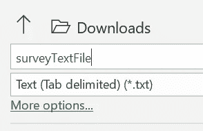

# 如何用 Python 分析调查数据

> 原文：<https://towardsdatascience.com/how-to-analyze-survey-data-in-python-c131764ea02e?source=collection_archive---------14----------------------->


Jac Alexandru 在 [Unsplash](https://unsplash.com?utm_source=medium&utm_medium=referral) 上的照片

# 以下是一些使用 Python 清理、分析和可视化调查数据的技巧和代码。

在我们开始之前，如果你还没有开始你的调查，[这里](/how-to-use-data-and-psychology-to-get-more-data-1749996ea704)是我的一些建议，告诉你如何利用数据和心理洞察力获得最多的受访者。没有好的(或足够的)数据，你建立的任何模型，或者你提取的推论，都将是无用的。

众所周知，调查数据是一种痛苦，主要是因为人们在回答调查时很懒，会做一些奇怪的事情。调查软件也很烦人。本指南将着眼于这两个问题，并提供信息和代码，以帮助您快速修复这些问题，并进入更有趣的东西，如分析或构建模型。

我将首先展示一个快速的 excel 技巧，它将为你节省大量的清理时间。然后，我将向您展示大量 Python 代码，以帮助您健壮、高效地清理和探索您的数据。我会将所有代码公开存储在我的 [GitHub](https://github.com/jasher4994?tab=repositories) 中，所以你可以随意使用它并将其应用到你的工作中。

# 正确导出和导入数据

首先，确保你使用正确的文件类型/编码器。我怎么强调都不为过。如果你一开始就做这一步，你会节省很多时间。我不能说这是所有调查软件的情况，但它适用于绝大多数。

大多数调查公司将输出 UTF-8 编码的 CSV。Excel 不太喜欢这样，当您使用特殊字符时，偶尔会在文本前吐出奇怪的符号，例如:


幸运的是，有一种快速的方法可以解决这个问题。首先，将您的调查结果保存为一个新文件，但要做成文本文件。



然后打开一个新的工作簿，点击数据>获取数据>从文件>从文本/CSV。选择您的文本文件，然后更改它，


敬这个。


因此，我们很容易从看起来像这样的数据。


我生成的一些丑陋的假调查数据

敬这个。


我生成的一些非常干净的假调查数据

我们已经从被乱码包围、实际上无法使用的数据发展到(相对)干净、易于阅读和组织的数据。

# 清洁

拥有这些数据对我们来说没有多大用处，除非我们知道如何利用它们。在下一节中，我将带您了解一些快速处理和清理调查数据的方法。根据你的知识，其中一些可能是显而易见的，所以如果是这样，我很抱歉，但希望你能从中找到一些东西。

## 删除冗余列

首先，调查往往会有很多你不关心的栏目——直接把它们去掉就行了。幸运的是，他们中的大多数都在调查的开始阶段，所以你可以快速地将他们根除。我们可以使用下面的 iloc(整数位置)根据需要删除前 n 列。

iloc 一行程序删除数据帧的前 n 列。将“n”更改为您希望在新数据框架中出现的第一列的列号。

## 生成二进制

根据您要对调查数据做什么，通常需要将字符串变量转换成二进制。大多数机器学习模型都不喜欢字符串。你可以用多种方式重新编码/替换数据，但这只是我不久前写的，还没有任何问题。它只接受一个数据帧，并返回一个相同的数据帧，其中的字符串变量被重新编码为 1 和 0。如果观察值存在，它输出 1，如果是 0 或 NaN，它输出 0。您可以相应地调整它，或者在数据帧的特定列上将它的大块与“映射”或“应用”结合使用。for 循环中的代码行是您真正需要构建的。

将字符串列转换为二进制列的函数

## 将连续变量分组为分类变量

分类变量各有利弊，有时有用，有时没用。不幸的是，我们不能把分类变量变成连续变量——但是我们可以反过来做。现在，我将向您展示几个快速实现这一点的方法。首先，如果你想要同等规模的群体，使用熊猫的“切割”方法是相当容易的。它将一个分类变量分成你指定的任意多个组，甚至可以提供标签。这完全取决于您的项目是否应该使用标签，但选项是存在的。

创建一个熊猫系列/组数据框架，将连续变量转化为类别

我们还可以手写函数，以便针对更具体、更恰当的分析来定制这些条块。年龄段是常用的，所以这里有一个使用年龄段作为分类框的例子。

将连续变量分组到特定组的函数示例。

## 一键编码

一种热编码经常用于机器学习和日常数据分析。简而言之，它为分类变量中的每个类别创建一个“二元”虚拟变量。下面是一个例子，关于这个主题的更多信息可以在这里找到[。](https://medium.com/@michaeldelsole/what-is-one-hot-encoding-and-how-to-do-it-f0ae272f1179)


[https://medium . com/@ michaeldelsole/what-one-hot-encoding-and-how-do-it-f0ae 272 f 1179](https://medium.com/@michaeldelsole/what-is-one-hot-encoding-and-how-to-do-it-f0ae272f1179)

有些调查会自动完成，有些不会。有些调查软件会在你不想让他们做的时候做，有些则不会。所以基本上我们需要学会如何在两者之间随意切换。熊猫和 Scikit learn 都有自己不同的版本，分别在这里[和](https://pandas.pydata.org/docs/reference/api/pandas.get_dummies.html)[这里](https://scikit-learn.org/stable/modules/generated/sklearn.preprocessing.OneHotEncoder.html)看到。两者都非常简单。

# 探测

有成千上万不同的教程告诉你如何探索你的数据。然而，他们中的大多数人关注的是连续数据。因此，我不会浪费你(或我)的任何时间，我将坚持强调在调查数据中特别有用的方法和工具。

## 描述(数字版本)

有几个内置的功能可以帮助您更快地了解您的。Describe 是数据科学家经常使用的一个非常常用的工具，但这只适用于数字和连续变量。如果导入 NumPy 并在 describe 中包含一个参数，还可以查看分类变量。这点可以从下面看出来。根据您是否有一个热编码变量，计数的输出将有不同的含义，但通过快速查看您的数据，这将很容易弄清楚。

描述的 Numpy 适应值-用于分类变量。

一些调查软件会以一种热门的格式输出问题。所以，你不想为了能看一眼就把它改回来。您仍然可以使用如上所述的 describe 来获得计数，但是它不输出百分比，这可能非常有用。

## 分组依据交叉表和热图

查看数据的子组可能非常重要，尤其是在调查数据中。比较不同人群的答案非常重要，不能不做。如果男人和女人的答案完全不同怎么办？老年人和年轻人完全不同意怎么办。这是可能的，也是常见的。这里，我们可以看三种方法:分组法、交叉列表法和热图法。所有这些都有着内在的联系，实际上是同一事物的变体。

**分组依据**

我不会深究 groupby 是如何工作的，但如果你想知道更多，这里有详细的解释[。](/how-to-use-the-split-apply-combine-strategy-in-pandas-groupby-29e0eb44b62e)顾名思义，该方法根据分类变量对数据进行分组，然后您可以对这些单独的组应用方法和聚合函数。如下图所示。


[https://towards data science . com/how-to-use-the-split-apply-combine-strategy-in-pandas-group by-29 E0 EB 44 b 62 e](/how-to-use-the-split-apply-combine-strategy-in-pandas-groupby-29e0eb44b62e)

所以用我们的数据，我们可以做出这样的东西。输出也是 panda 的数据帧，所以如果你愿意，可以给它指定一个名称并进一步操作。

熊猫分组的一个例子


**交叉表**

我们在这里生成的是一个交叉表，虽然很简单，但 pandas 有一个函数可以使它变得更快——它被恰当地命名为交叉表。这对于选择题和必答题非常有用。比如一道有年龄段的必修年龄题。

我们可以通过原始计数或百分比来实现这一点，如代码所示。

然而，通常在调查数据中，人们被允许对一个问题选择不止一个答案。比如说；“你喜欢读什么类型的书:请勾选所有适用的选项”。有些人可能不选择类别，有些人可能选择七个类别。因此，数据开始变得令人烦恼的复杂。调查输出通常通过为每个选项设置一列来处理这一问题，即一个热编码列。因此，交叉表和 groupby 方法需要为此进行调整。下面是我常用的一个函数。

该函数将完整的数据帧、要分组的列以及感兴趣的数据中的特定列作为输入。这与 pandas crosstab 函数非常相似，但它被设计为处理一个热编码列(不一定是 1 或 0，可以是“苹果”或 0)。

这将给出与前面的交叉表完全相同的百分比输出，但可以用于一次性编码的列，以便同时查看它们。

**热图**

这些交叉表很棒，但有时可能有点复杂，难以阅读。这就是热图的用武之地。他们获取交叉表并添加一些颜色，其中颜色的深浅与计数或百分比的大小成比例。因此，我们可以在交叉表中使用下面的代码，让它们变得生动起来。获取前面讨论过的交叉表输出，并将它们传递给下面的热图函数。


以百分比显示虚假调查数据的热图

## 摘要

当然，这并不是一个关于如何分析调查数据的完全详尽的过程。然而，这是我在进入模型或其他统计测试之前所做的 90%的清理和探索。如前所述，我已经将所有代码保存在我的 Github 帐户[这里](https://github.com/jasher4994/surveyFunctions)，我真的希望这将使你在未来处理繁琐的调查数据时更加轻松。

感谢阅读。如果你喜欢这篇文章，下面是我更多的文章。

干杯，

詹姆斯

```
If I’ve inspired you to join medium I would be really grateful if you did it through this [link](https://jamesasher4994.medium.com/membership) — it will help to support me to write better content in the future.If you want to learn more about data science, become a certified data scientist, or land a job in data science, then checkout [365 data science](https://365datascience.pxf.io/c/3458822/791349/11148) through my [affiliate link.](https://365datascience.pxf.io/c/3458822/791349/11148)
```

[如何利用数据(和心理学)获得更多的数据。](/how-to-use-data-and-psychology-to-get-more-data-1749996ea704)

[如何在你的网站上动态显示 Matplotlib 图和熊猫数据框](/how-to-easily-show-your-matplotlib-plots-and-pandas-dataframes-dynamically-on-your-website-a9613eff7ae3)

[我如何利用数据科学进入梦幻足球的前 1%](https://medium.com/the-sports-scientist/how-i-used-data-science-to-get-into-the-top-1-on-the-return-to-fantasy-premier-league-98829d4f65e5)