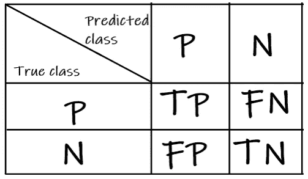
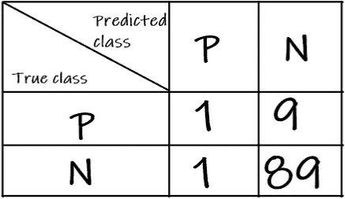

# 如何分析你的分类器的性能

> 原文：<https://towardsdatascience.com/how-to-analyze-the-performance-of-your-classifier-4567f66318a7?source=collection_archive---------27----------------------->

## 知道使用哪些指标并不总是简单明了的

Firmbee.com 在 [Unsplash](https://unsplash.com?utm_source=medium&utm_medium=referral) 上[拍照](https://unsplash.com/@firmbee?utm_source=medium&utm_medium=referral)

随着深度学习的蓬勃发展，越来越多的人正在学习如何训练他们的第一个分类器。但是一旦你完成了训练，接下来的分析是至关重要的。知道使用哪些指标并不总是简单明了的。在本文中，我将讨论准确度、精确度、召回率、f1 分数和混淆矩阵来衡量分类器的性能。

# 真与假，正与负

在开始度量之前，让我们看一些术语，我们将用来定义这些度量[1]。

我们将做出如下定义:

1.  肿瘤阳性类别
2.  无肿瘤——阴性类别

所以积极和消极是我们定义的阶级。True 意味着预测和实际的类匹配。False 表示预测和实际类不匹配。

现在我们可以看看以下四个术语:

1.  **真阳性(TP)** :这意味着**预测为阳性类别**且**实际类别也为阳性**。
2.  **假阳性(FP)** :这意味着**预测为阳性类别**，而**实际类别为阴性类别**。
3.  **真阴性(TN)** :这意味着**预测是阴性类别**，而**实际类别也是阴性。**
4.  **假阴性(FN)** :这意味着**预测为阴性类别**，而**实际类别为阳性类别**。

# 准确(性)

这是一个非常流行的指标，它告诉你在所有的预测中有多少是正确的。

`Accuracy = Total correct predictions / Total predictions` [2]

或者

`Accuracy = (TP + TN) / (TP + FP + TN + FN)`

注:`Total predictions = TP + FP + TN + FN`和`Total correct predictions = TP + TN.`

这是一个非常简单的性能衡量标准。然而，对于类别高度不平衡的数据集，这可能会产生误导。假设我们有 100 个样本，其中 10 个是肿瘤，90 个不是肿瘤。分类器正确地分类了 89 个非肿瘤，但只有一个是真正的肿瘤。

对于这个例子:TP: 1，FP: 1，TN: 89，FN: 9

我们将获得 90%的准确率。看起来这个模型表现得很好。然而，在现实中，它在肿瘤类中表现很差。医疗应用中的假阴性可能会导致死亡。然而，准确性给人一种表现出色的错觉。我们接下来要看的指标在这些情况下会有所帮助，并让我们更好地理解分类器的性能。

# 精确

**精度被定义为相关实例在检索到的实例中所占的比例** [3]。它也被称为阳性预测值。它是集合中真阳性与预测阳性的比率，即真阳性和假阳性的总和。

`Precision = TP/ (TP + FP)`

Precision 试图回答这样一个问题:多大比例的肯定识别是正确的？[4]

如果我们继续前面的例子，

精度= 1 / (1 + 1) = 0.5

精度为 0.5，这意味着分类器与随机猜测一样好。

**注意:精度值为 1 的模型不会有误报。**

# 回忆

**召回被定义为检索到的相关实例的分数**【3】。也就是所谓的敏感。它是真阳性与集合中总阳性的比率，即真阳性和假阴性的总和。

`Recall = TP/ (TP + FN)`

**Precision 试图回答以下问题:正确识别的实际阳性率是多少？[4]**

如果我们继续前面的例子，

回忆= 1 / (1 + 9) = 0.1

召回率是 0.1，这意味着分类器只能检索 10%的肿瘤实例，而 90%将被错误地分类为非肿瘤。基于肿瘤检测应用的要求，这是非常差的性能。

**注意:召回值为 1 的模型不会有假阴性。**

# f1-分数

这是一个结合了精度和召回值来给出性能评估的指标。F1 分数被定义为精确度和召回率的调和平均值[5]。

`F1-score = 2 * (precision * recall ) / (precision + recall )`

它对精确度和召回率给予了同等的重视。与仅取精确度和召回值的算术平均值或几何平均值相比，F1 分数将给出较低的值。它将倾向于两个值中的较低值，以减轻较大异常值的影响。

对于上面的例子，

f1-得分= 2 * 0.5 * 0.1 / (0.5+0.1) = 0.16667

我们得到的 F1 值更接近于两个指标中较低的召回值。因此，高 F1 分数将指示分类器具有高精度以及高召回率。

# 混淆矩阵

在分类的机器学习中，混淆矩阵(也称为误差矩阵)是一个允许可视化分类性能的表格[6]。每行代表实际类中的实例，列代表预测类中的实例或其他方式。

**注意:请确保您正确阅读了您正在使用的库的文档，以确保您知道行和列代表哪些条目。对于 scikit-learn，行代表真实标签，列代表预测标签[7]。**

对于二进制分类，混淆矩阵可以使用 TP、FP、TN 和 FN 值灵活地表示。

二元分类的混淆矩阵(来源:作者)

对于我们的例子，混淆矩阵是:

来源:作者

看着这个混淆矩阵，我们可以清楚地看到分类器的性能如何。理想的混淆矩阵将只有对角线元素，没有非对角线元素，即 FP 和 FN 为零。在这种情况下，精度和召回值将为 1。形象化该矩阵的一个好方法是热图。这将加热有较大条目的地方，也就是说，使那些条目明亮，而其他条目柔和。如果我们观察到一条明亮的对角线，我们很快就知道混淆矩阵是正确的。这对多类分类混淆矩阵更有意义。

查看矩阵可以快速找出每个类别有多少样本被正确分类，以及错误分类样本的分布。然后，您可以检查并查看是否有突出的内容。就像一个特定的类被严重错误地归类为另一个类，那么您可以手动检查样本，看看是否一切正常。也许样品有问题。或者你明白分类器失效的条件。

# 结论

在本文中，我们研究了一些对分析分类器性能有用的分类指标。我们从真与假、正与负的概念开始。然后将准确性视为一种度量，并观察到它对不平衡的数据集具有误导性。接下来，我们将精确度、召回率和 F1 分数作为处理不平衡数据集的指标。最后，我们看了混淆矩阵，这是一个非常有用的表格表示，可以直观地显示分类器的性能。希望这篇文章对你有帮助。如果您使用任何其他工具或指标，请与我分享！感谢您阅读这篇文章。关注更多有趣和有见地的文章。另外，如果你想了解更多的指标，你可以阅读[拉胡尔·阿加瓦尔](https://medium.com/u/e8cce06956c9?source=post_page-----4567f66318a7--------------------------------)的文章[。](/the-5-classification-evaluation-metrics-you-must-know-aa97784ff226)

# 参考

[1][https://developers . Google . com/machine-learning/速成/分类/真-假-正-负](https://developers.google.com/machine-learning/crash-course/classification/true-false-positive-negative)

[2][https://developers . Google . com/machine-learning/crash-course/classification/accuracy](https://developers.google.com/machine-learning/crash-course/classification/accuracy)

[https://en.wikipedia.org/wiki/Precision_and_recall](https://en.wikipedia.org/wiki/Precision_and_recall)

[4][https://developers . Google . com/machine-learning/crash-course/class ification/precision-and-recall](https://developers.google.com/machine-learning/crash-course/classification/precision-and-recall)

[https://en.wikipedia.org/wiki/F-score](https://en.wikipedia.org/wiki/F-score)

[https://en.wikipedia.org/wiki/Confusion_matrix](https://en.wikipedia.org/wiki/Confusion_matrix)

[7][https://sci kit-learn . org/stable/modules/generated/sk learn . metrics . confusion _ matrix . html](https://scikit-learn.org/stable/modules/generated/sklearn.metrics.confusion_matrix.html)