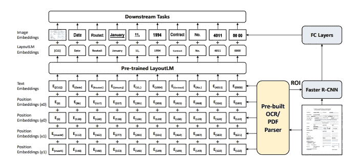
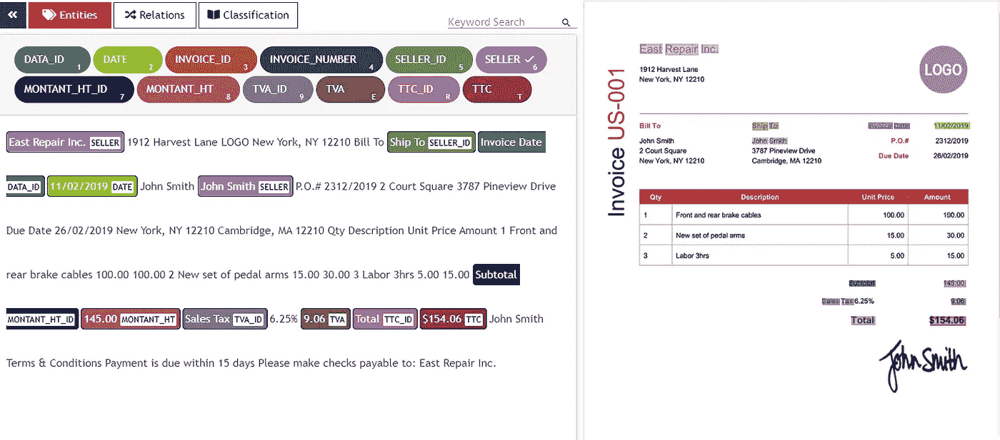
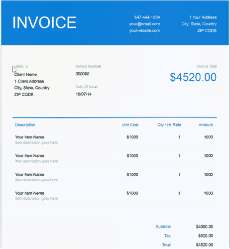
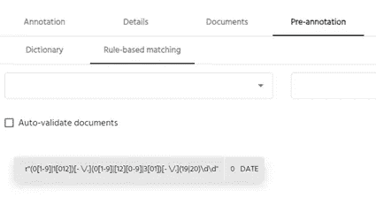
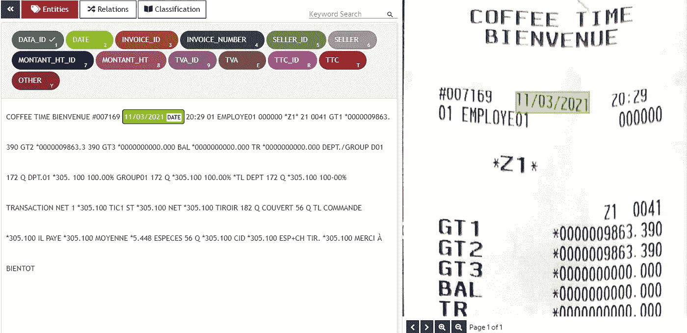
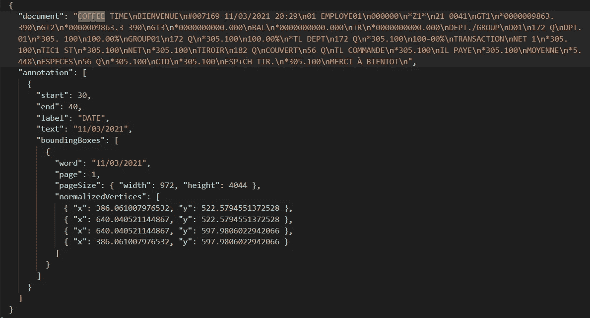

# 如何用 UBIAI 注释 pdf 和扫描图像

> 原文：<https://towardsdatascience.com/how-to-annotate-pdfs-and-scanned-images-for-nlp-applications-f7b7b1db5c4a?source=collection_archive---------20----------------------->

## 利用 OCR 技术


来自 [Pexels](https://www.pexels.com/photo/photo-of-person-taking-down-notes-7319070/?utm_content=attributionCopyText&utm_medium=referral&utm_source=pexels) 的 [cottonbro](https://www.pexels.com/@cottonbro?utm_content=attributionCopyText&utm_medium=referral&utm_source=pexels) 摄影

# 介绍

无论是收据、合同、财务文件还是发票等。自动化信息检索将帮助您以极小的成本提高业务效率和生产率。然而，如果没有**的文字注释**，这一惊人的壮举是不可能实现的。虽然诸如 NER 或关系提取等 NLP 任务已广泛用于非结构化文本中的信息检索，但分析诸如发票、收据和合同等结构化文档是一项更复杂的工作。

首先，我们想要提取的实体(如价格、卖家、税收等)没有太多的语义上下文。)可用于训练 NLP 模型。第二，从一张发票到另一张发票，文档布局经常改变；这将导致传统的自然语言处理任务，如 NER，在结构化文档中表现不佳。也就是说，结构化文本(如发票)包含丰富的实体空间信息。该空间信息可用于创建 2d 位置嵌入，其表示标记在文档内的相对位置。最近，微软发布了一个新的模型 [LayoutLM](https://arxiv.org/pdf/1912.13318.pdf) 来联合建模扫描文档图像中文本和布局信息之间的交互。他们在几个下游任务中取得了新的最先进的结果，包括表单理解(从 70.72 到 79.27)、收据理解(从 94.02 到 95.24)和文档图像分类(从 93.07 到 94.42)。



LayoutLM 位置嵌入架构

# 扫描图像和 PDF 注释

为了对定制发票的 layoutLM 模型进行微调，我们需要为模型提供带注释的数据，这些数据包含每个标记的边界框坐标以及标记之间的链接(请参见教程[这里的](https://colab.research.google.com/github/NielsRogge/Transformers-Tutorials/blob/master/LayoutLM/Fine_tuning_LayoutLMForTokenClassification_on_FUNSD.ipynb#scrollTo=DTFnEZagQm4v)以对 FUNSD 数据进行微调):

```
{
"box": [76,129,118,139],"text": "Brand:","label": "question","words": [{"box": [76,129,118,139],"text": "Brand:"}],"linking": [[0,2]],"id": 0}]}
```

因为大多数收据和发票都是扫描或 PDF 格式的，所以我们需要找到一种能够直接在原生 PDF 和图像上进行 OCR 解析和注释的注释工具。不幸的是，大多数支持 OCR 注释的注释工具要么过于昂贵，要么不完整，因为您必须在注释之前在外部执行 OCR 步骤。

这就是为什么在 [UBIAI](https://ubiai.tools) 上，我们开发了一个端到端的解决方案，可以直接在原生 pdf、扫描图像或来自您手机的图像上进行注释，而不会丢失任何文档布局信息。这对于文本序列和空间信息同等重要的发票提取非常有用。你所要做的就是直接上传你的 PDF、JPG 或 PNG 文件，然后开始注释。使用 AWS Textract 最先进的 OCR 技术，UBIAI 将解析您的文档，并提取所有标记及其边界框。只需突出显示原始文档(右侧面板)或已解析文本(左侧面板)上的标记，并分配一个标签。除了实体标注，还可以进行关系标注和文档分类标注。



UBIAI OCR 注释接口

注释多个单词也很容易。只需在你想要选择的单词周围创建一个框架，它们就会自动得到注释(见下文)。



带框架选择的 OCR 注释

# 发票预注释

此外，您可以使用字典、正则表达式(例如查找日期、电子邮件、姓名等)预先注释您的发票。)或者是预先训练好的 ML 模型。



正则表达式输入



使用正则表达式预先标注日期

# 注释导出

完成注释后，只需以 JSON 格式导出带注释的文档:



JSON 格式的注释导出

# 结论

UBIAI 的 OCR 标注，通过提供一个简单易用、准确的标注接口，让你训练 NLP 模型的摩擦更小。您不必担心使用外部 API 预处理图像或添加规则来预先注释文档。只需上传您的文档，添加注释，然后导出即可。在下一部分中，我们将展示如何在您自己的发票识别数据集上微调 layoutLM 模型，敬请关注！

如果你想为你的结构化文本训练一个自然语言处理模型，请访问[https://ubai . tools](https://ubiai.tools)或者发邮件给我们安排一个演示！

在推特上关注我们