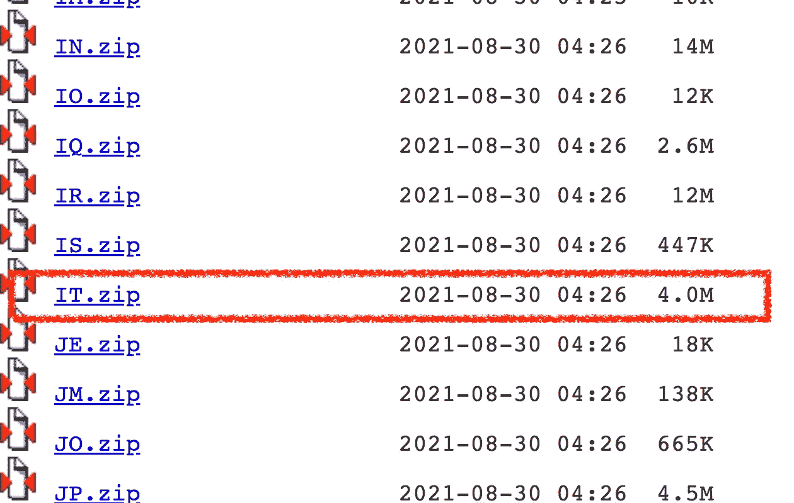
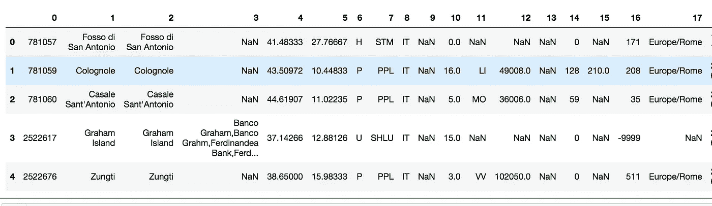

# 如何在 Python 中匿名化地点

> 原文：<https://towardsdatascience.com/how-to-anonymise-places-in-python-55597d0ded24?source=collection_archive---------39----------------------->

## 编码教程，文本分析

## 一个现成的代码，根据地名数据库识别和隐藏地点


Max 陈在 [Unsplash](https://unsplash.com?utm_source=medium&utm_medium=referral) 上的照片

在本文中，我将展示如何在不使用 NLP 技术(如命名实体识别)的情况下，在 Python，**中识别和匿名化地点。**

> 地名识别基于地名录，地名录由[地名数据库](http://www.geonames.org/)构建。

Geonames 是一个网络服务，包含了(几乎)世界上所有的地方。Geonames 数据库可通过[链接](https://download.geonames.org/export/dump/)免费下载。您可以下载完整的数据库，包括世界上所有国家，或只有一个特定的国家。

> 这篇文章背后的想法是从 Geonames 数据库中建立一个**地名录**，并利用它来识别句子中的地点。在实践中，**所实现的算法搜索句子中的每个单词是否包含在词典中**。为了搜索比一个单词更长的地方，考虑**n grams**。

文章组织如下:

*   导入 Geonames 数据库
*   识别句子中的位置
*   句子中的匿名位置
*   扩展匿名功能

# 导入 Geonames 数据库

第一步是导入 Geonames 数据库，可以从[此链接](https://download.geonames.org/export/dump/)下载。您可以选择是导入完整的数据库(AllCountries.zip)还是特定的国家(如意大利的 IT.zip)。每个国家都通过其识别码来识别。

> 完整的数据库更加完整，但比单一国家数据库需要更多的处理时间。

因此，您应该根据要处理的文本选择正确的数据库。在本教程中，我主要关注意大利数据库，但是同样的代码也可以被其他数据库所利用。

从 [Geonames 链接](https://download.geonames.org/export/dump/)，我下载 IT.zip 文件，解压后放入我的工作目录:



作者图片

然后我把它导入一个熊猫的数据框架:

```
import pandas as pddf = pd.read_csv('source/IT.txt', sep=' ', header=None)
```



作者图片

数据框架的第 1 列包含用于建立地名索引的地点列表:

```
gaz = df[1]
gaz = gaz.tolist()
```

实施的地名索引包含 119.539 个地方。

# 识别句子中的位置

现在我定义一个函数，它接收一个文本作为输入，然后返回文本中包含的所有位置。该函数执行以下操作:

*   删除文本中的所有标点符号
*   将句子分割成记号，用空格符隔开。这可以通过`split()`功能来完成
*   从识别出的记号开始，构建所有可能的 ngrams，n ≤ 5。我利用`nltk`库的`ngrams`函数将文本分割成 ngrams。例如在句子 *Oggi sono andata a Parigi* 中，n ≤ 5 的 ngrams 包括:

```
(‘Oggi’, ‘sono’, ‘andata’, ‘a’, ‘Parigi’)
(‘Oggi’, ‘sono’, ‘andata’, ‘a’)
(‘sono’, ‘andata’, ‘a’, ‘Parigi’)
(‘Oggi’, ‘sono’, ‘andata’)
(‘sono’, ‘andata’, ‘a’)
(‘andata’, ‘a’, ‘Parigi’)
(‘Oggi’, ‘sono’)
(‘sono’, ‘andata’)
(‘andata’, ‘a’)
(‘a’, ‘Parigi’)
(‘Oggi’,)
(‘sono’,)
(‘andata’,)
(‘a’,)
(‘Parigi’,)
```

*   从最大的 n 元语法开始(n = 5)，搜索每个 n 元语法是否包含在地名录中。如果是，则找到一个位置，并且可以将其添加到找到的位置的列表中，并且从原始文本中移除该位置，否则，继续。注意

该函数的完整代码如下:

```
from nltk import ngrams
import redef get_places(txt):
    # remove punctuation
    txt = re.sub(r"[^\w\d'\s]+",'',txt)
    n = 5
    places = []

    for i in range(n,0,-1):
        tokens = ngrams(txt.split(), i)
        for t in tokens:
            token = " ".join(t)
            try:
                res = gaz.index(token)
            except ValueError:
                continue
            if res:
                places.append(token)
                txt = txt.replace(token,"")
    return places
```

现在我可以用一个例子来测试这个函数:

```
txt = 'Oggi sono andata a Roma e a Milano.'
get_places(txt)
```

它给出了以下输出:

```
['Roma', 'Milano']
```

# 句子中的匿名位置

现在，我准备利用前面定义的函数来匿名化函数。简单地说，我可以用符号字符替换找到的位置，例如 x。所有的搜索操作都必须在原始文本的副本上进行，以便保留原始文本(即删除标点以便操作)。

这是匿名的完整功能:

```
def anonymise_places(txt):
    temp_txt = re.sub(r"[^\w\d'\s]+",'',txt)
    n = 5
    # remove punctuation
    for i in range(n,0,-1):
        tokens = ngrams(temp_txt.split(), i)
        for t in tokens:
            token = " ".join(t)
            try:
                res = gaz.index(token)
            except ValueError:
                continue
            if res:
                txt = txt.replace(token,"X")
                temp_txt = temp_txt.replace(token,"")
    return txt
```

# 扩展匿名功能

所实现的功能可以通过覆盖全世界的地名录来扩展。然而，全世界的地名数据库约为 1.5 GB，因此难以管理。因此，您可以下载它，加载到 Pandas 中，然后只选择感兴趣的列(对应于列 1 ),并将结果导出为一个新的 csv 文件，大约 274 MB:

```
df_all = pd.read_csv('source/allCountries.txt', sep=' ', header=None)
df_all[1].to_csv('source/places.csv')
```

前面的操作可能需要一段时间，因为文件非常大。然后，您可以将这个新文件用作地名词典，而不是 IT.txt。

# 摘要

在本文中，我描述了如何在不使用 NLP 技术的情况下匿名化 Python 中的位置。拟议的方法是基于使用地名录，地名录是根据地名数据库建立的。

本教程的完整代码可以从我的 [Github 库](https://github.com/alod83/data-science/blob/master/TextAnalysis/Anonymise%20Places.ipynb)下载。本教程还包含了一个在`gradio`中的函数测试，这是一个非常强大的用于 Web 应用的 Python 库。请继续关注关于`gradio`的教程

# 相关文章

[](https://medium.datadriveninvestor.com/how-to-restore-the-original-layout-of-a-text-document-after-a-manipulation-in-python-8f3de41e8e95) [## 如何在 Python 中操作后恢复文本文档的原始布局

### 少于 10 行的代码，用于在操作后保留文本文档的布局，例如文本…

medium.datadriveninvestor.com](https://medium.datadriveninvestor.com/how-to-restore-the-original-layout-of-a-text-document-after-a-manipulation-in-python-8f3de41e8e95) [](/how-to-extract-structured-information-from-a-text-through-python-spacy-749b311161e) [## 如何通过 Python 空间从文本中提取结构化信息

### 关于如何从文本构建结构化数据集的现成教程。

towardsdatascience.com](/how-to-extract-structured-information-from-a-text-through-python-spacy-749b311161e) [](https://medium.com/geekculture/the-top-25-python-libraries-for-data-science-71c0eb58723d) [## 面向数据科学的 25 大 Python 库

### 你一生中至少应该尝试一次的 Python 库列表。

medium.com](https://medium.com/geekculture/the-top-25-python-libraries-for-data-science-71c0eb58723d)