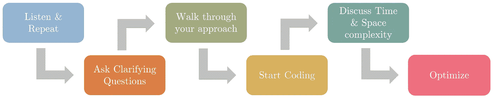

# 如何回答一个编码面试问题？

> 原文：<https://towardsdatascience.com/how-to-answer-a-coding-interview-question-1613776358e?source=collection_archive---------21----------------------->

[Jexo](https://unsplash.com/@jexo?utm_source=medium&utm_medium=referral) 在 [Unsplash](https://unsplash.com?utm_source=medium&utm_medium=referral) 上的照片

## 帮助您回答编码问题的分步指南。

C oding 面试是各种软件相关职位必不可少的一部分，比如软件工程师、机器学习工程师、数据科学家等。大多数公司使用编码进行技术筛选。这意味着如果你不能很好地编码，他们将不会继续你的面试过程。今年早些时候，当我申请各种 ML 工程师职位时，我最初的技术筛选面试中有近 85%是由编码轮组成的。

将编码作为日常工作的一部分并不能保证你会在这些编码面试中表现出色。在几次编程面试失败后，我艰难地学会了这一点。在面试中，用某种语言编写代码的能力只是冰山一角(下一节中的[F5])。时间管理，与类似的问题相关，打磨你的基础，练习是一些需要做的关键事情。在这篇文章中，我将分享我准备编码面试的有组织的方法。我将这篇文章分成两部分。

# 你在什么方面被评估？

首先要了解面试官感兴趣的是什么，这样我们才能相应地回答他们。面试官通常根据以下评估标准来评估你

**【EC1】**—理解问题的能力

**【EC2】**—需要时收集信息的能力

**【EC3】**—遇到问题时你的思考过程

**【EC4】**—以有组织/模块化的方式编码的能力

**【EC5】**—您的编码技能和评估运行时约束的能力

**【EC6】**—在工作中实现改进的能力

# 编码模板

我发现定义一个模板并在我的编码面试中使用它非常有用。该模板有助于以一种有组织的方式划分你的思维过程，以避免对一件事说得太多，而没有时间留给其他人。这也有助于瞄准面试官正在寻找的必要因素[EC1-EC6]。

如何回答一个编码问题？—模板(作者图片)

## **1。听问题:**

面试官会解释问题，并通过一个玩具例子来帮助你理解问题。当面试官解释的时候，在另一张纸上记下你认为关键的要点。

**目标:**【EC1】

## **2。谈谈你对问题的理解:**

***听完问题，不要跳进去开始编码(即使你确切知道问题是什么，如何解决)*** 。而是重复问题，确认自己的理解。询问澄清性问题，例如

1.  输入/输出数据类型限制是什么？
2.  输入大小/长度有限制吗？
3.  如果输入无效会发生什么？
4.  角落/特殊情况:特定问题的问题，例如当你在一个字符串中看到一个非数字字符，而两个数字字符串需要相乘时会发生什么？(你认为它是无效输入，还是忽略非数字字符？)

大多数时候面试官不会给你所有需要的信息。面试官在求职者身上寻找的东西之一是 ***能够问正确的问题来收集所有必要的信息***

**目标:**【EC1】，【EC2】

## **3。讨论你的方法:**

讨论你解决问题的方法，问面试官他/她是否同意。谈谈你更喜欢使用的数据结构及其背后的原因。和面试官讨论伪代码。

**目标:**【EC3】

## 4.开始编码:

在你真正开始编码之前，一定要问面试官。定义有用的函数，并在编写代码时进行解释。编码时最重要的事情是大声思考，这样面试官可以评估你的思考过程。在每一行代码中，大声说出你为什么使用它，以及这个选择将如何影响代码输出。例如，在编写 For 循环时，比方说

*“现在我们将定义一个 for 循环，一次迭代 xyz 列表中的一个元素，以便我们可以根据期望的输出[或特定于问题的原因]处理每个元素”*

万一你被困在某个地方，面试官会给你一些微妙的暗示。一定要注意那些暗示。

**目标:**【EC4】，【EC5】

## 5.讨论时间和空间的复杂性

根据你的方法的大 O 来讨论你的代码的时间和空间复杂度。这个有用的资源对初学者来说是一个很好的起点。试着把你的代码分解成块，讨论时间复杂度，然后再谈代码的整体时间复杂度。

**目标:**【EC5】

## 6.优化方法(如果可能或者面试官建议)

在讨论了你的代码的复杂性之后，如果你的方法还没有优化，面试官可以要求你改进它。面试官会通过提示来强调可以改进的代码块。一定要注意这一点。

**目标:**【EC5】，【EC6】

这个 6 步模板将帮助你分而治之解决面试问题。

# 总结:

编码面试不仅仅是关于你的编码技能。这也是关于你在压力下的工作能力。如果你有一个很好理解的模板可以遵循，它一定会帮助你管理你的时间。知道面试官在寻找什么将有助于你有条理地处理这些因素。本文研究了成功的编码面试的一些重要评估标准，并讨论了回答编码问题的模板。

您可能还会发现下面的文章很有用

 [## 编码面试的七(7)个基本数据结构和相关的常见问题

### 用动画可视化的重要数据结构

towardsdatascience.com](/seven-7-essential-data-structures-for-a-coding-interview-and-associated-common-questions-72ceb644290)  [## 机器学习面试主题的备忘单

### ML 面试的视觉备忘单(www.cheatsheets.aqeel-anwar.com)

medium.com](https://medium.com/swlh/cheat-sheets-for-machine-learning-interview-topics-51c2bc2bab4f) 

**如果这篇文章对你有帮助，或者你想了解更多关于机器学习和数据科学的知识，请关注我**[**Aqeel an war**](https://medium.com/u/a7cc4f201fb5?source=post_page-----1613776358e--------------------------------)**，或者联系我**[***LinkedIn***](https://www.linkedin.com/in/aqeelanwarmalik/)***或者***[***Twitter***](https://twitter.com/_aqeelanwar)***。***