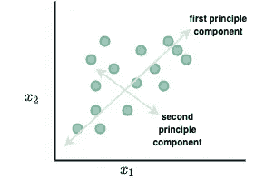
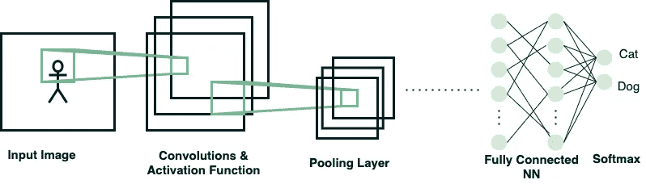

# 如何回答任何机器学习系统设计面试问题

> 原文：<https://towardsdatascience.com/how-to-answer-any-machine-learning-system-design-interview-question-a98656bb7ff0?source=collection_archive---------0----------------------->

## 下次面试时回答任何机器学习系统设计问题的模板。

这个模板将指导你解决几乎所有你在面试中遇到的 ML 系统设计问题。值得注意的是，该模板是有意通用的，以便当您发现新的系统设计问题时，可以很容易地填写每个部分。​

以下是您在进行 ML 系统设计面试时应该采取的步骤的概述:

当你在回答一个 [ML 设计面试问题](https://www.machinelearninginterviews.com/ml-design-template/)时，要关注的两个领域是数据和建模。这是因为 ML 设计面试的主旨是了解你面对(几乎)现实世界问题时的思维过程，数据收集/预处理以及你将选择的模型将是你将构建的核心组件。因此，你应该在面试中重点关注这些方面。​

# 澄清要求

[米米·蒂安](https://unsplash.com/@mimithian?utm_source=unsplash&utm_medium=referral&utm_content=creditCopyText)在 [Unsplash](https://unsplash.com/s/photos/talking?utm_source=unsplash&utm_medium=referral&utm_content=creditCopyText) 上的照片

当给你一个问题时，你应该做的第一件事是澄清要求。例如，您的提示可以是“设计一个向拥有个人资料的用户推荐我们产品的系统。”大多数 ML 系统设计问题都是有意模糊的，这样你会问更多的问题来理解范围和你应该关注的组件。​

在面试官给你提示后，用你自己的话重述一遍。这可以确保你和面试官在同一页上，你会回答正确的问题。​

为了理解范围，您应该问一些问题:

1.  我们能接触到多少数据？[对于较小的数据集，不太复杂的模型可能更合适，但对于较大的数据集，像深度神经网络这样的较大模型可能会起作用]
2.  硬件限制:我们有多少时间来完成任务？有多少计算能力可用？[如果我们受到硬件尺寸的限制，那么我们应该使用更简单的型号]
3.  我们是需要一个能快速响应请求的模型，还是需要一个极其精确的模型？[深度模型通常比传统的 ML 模型更慢但更准确，这个问题向面试官表明你正在考虑权衡取舍]
4.  我们需要考虑重新训练模型吗？

你应该把这些答案写在白板上(或者如果你是在网上面试的话，写在网上)。请注意，根据使用情形，有些问题可能不相关，因此您不需要询问所有问题。

# 韵律学

既然您已经对用例有了一个清晰的概念，并且问了一些澄清性的问题，那么您可以使用这些信息来确定建模时使用的最佳度量。您应该始终给出至少两个指标:一个用于离线，一个用于在线。

**离线指标**是我们在构建模型时用来给模型打分的指标。这是在投入生产并展示给用户之前。这是研究或教程中的典型场景，其中您将数据集分为三个集:训练集、评估集和测试集。这些离线指标的一些例子是 AUC、F1、R、MSE、联合交集等。

**在线指标**是一旦模型投入生产服务请求，我们从模型中得到的分数。在线指标可以是点击率或用户观看推荐视频的时长。这些指标是特定于用例的。你需要考虑一旦模型投入生产，公司将如何评估它对用户是否有用。

另一组有用的指标是非功能性指标。你可以向面试官提到这些，以表明你正在考虑所有可能的方法来衡量一个模型的好处。

**非职能指标:**

*   超大型数据集的训练速度和可扩展性
*   新技术的可扩展性
*   易于培训、调试、评估和部署的工具

# 体系结构

下一步是创建一个通用架构，有些公司要求你画出架构。您至少应该包括以下步骤:

# 数据

这一部分和下一部分将是你在面试中花费最多时间的地方，也是面试官关注你表现的地方。

1.  **首先，确定目标变量以及如何收集和标记它(如果需要)**

*   在推荐的例子中，目标变量是历史上用户是否喜欢公司的产品。通常有两种方法可以收集这个目标值:隐式或显式。显式目标收集的一个例子是，如果我们查看我们的日志并检查是否有人购买了某个产品，这意味着他们非常喜欢该产品并购买了它。另一方面，如果用户“保存以备后用”某个产品或者用户查看某个产品一定次数，则隐式目标集合将是。请注意，在大多数情况下，显式数据收集通常是收集目标变量的最佳方式。如果你认为你可以找到一种方法来隐含地收集目标变量，那么和你的面试官进行这样的讨论，然后谈论你的每个隐含建议的利弊。

**2。讨论功能和可能的功能交叉:**

*   推荐示例的一些可能的特征可以是用户位置、用户年龄、先前观看的视频、视频标题、视频新鲜度等。

**3。特色工程:**

*   列车测试分离。
*   处理缺失值或异常值:通常，我们可以丢弃异常值，如果有大量数据，那么我们可以丢弃缺失值，如果数据有限，那么我们可以通过平均值(或任何其他处理缺失值的方法)估算数据。和你的面试官谈论这个问题，记住这是一次讨论。
*   平衡正面和负面训练示例:如果您注意到可能会有非常大的不平衡，那么您应该讨论解决这个问题的方法:上采样、下采样以及其他技术，如 SMOTE。
*   规范化某些列。

**4。功能选择:**

*   如果我们使用深度神经网络，那么我们不需要特征选择。如果需要，基于树的估计器可以用来计算特征重要性。此外，我们可以使用 L1 范数进行正则化，使得一些特征系数为零。

**5。其他注意事项:**

*   偏见:我们是否从足够大的人口统计子集抽样，如果不是，也许我们可以将最大的分组，并将其他分组为 OOV 人口统计。
*   对隐私/法律有什么顾虑吗？出于隐私考虑，我们可能需要匿名或删除数据。

一旦我们完成了关于数据的讨论，你应该问面试官他们是否希望你解释如何生产这些数据步骤。根据经验，大多数面试官并不太关心机器学习(ML OPs)的可操作性，因为这是一个新领域，产品和最佳实践一直在变化，然而，表明你知道你需要将你的工作流程生产化将向面试官表明你不仅在 ML 的理论方面很强，而且在工程方面也很强。

**数据的 ML 操作:**

1.  **存储数据:**

*   如果有任何对象存储(图像、视频等。)需求:亚马逊 S3，GCP 云存储
*   元数据和结构化(表格)数据的数据库:MySQL、Postgres、Oracle
*   功能商店(存储和访问 ML 功能)(离线):FEAST、亚马逊 SageMaker 功能商店、Hopsworks 功能商店
*   数据版本化:DVC，厚皮动物

**2。数据摄取和转换:**

*   摄取:离线数据→可以查询您的数据库，在线数据→我们需要高吞吐量和低延迟，所以我们应该使用在线流媒体平台，如 Apache Kafka 和 Apache Flume
*   转换功能:Apache Spark、Tensorflow 转换

**3。编排平台:**

*   气流
*   库伯内特斯

# 模型

一旦您到达建模组件，您应该首先给出一个基线模型(如果可能的话)。通常你会有一个不需要机器学习的基线模型。例如，我们之前提示的一个好的基线是向用户推荐最受欢迎的产品。这个“模型”总是容易实现的，并且你现在有了一个基线，你所有的其他模型都应该超越它。​

然后，谈论传统的 ML 模型，这些模型可以快速训练，例如逻辑回归或决策树。一旦你讨论了这些，你就可以谈论更复杂的方法，比如深度学习。

注意:不要忘记给出你所说的每种方法的利弊。示例:

**型号 A:**

*   模型、超参数和损失函数的简要说明
*   模型 A 的优点
*   模型 A 的缺点

同样，你应该问面试官他们是否希望你解释一下如何生产这种组件。

**建模用 ML OPs:**

1.  实验的可重复性:

*   毫升流量
*   库贝弗洛

2.并行化超参数调优:Google Cloud、Azure、AWS

3.模型版本控制:

*   DVC
*   亚马逊 SageMaker
*   谷歌云人工智能平台

# 服务

照片由[弗洛里安·克拉姆](https://unsplash.com/@floriankrumm?utm_source=unsplash&utm_medium=referral&utm_content=creditCopyText)在 [Unsplash](https://unsplash.com/s/photos/server?utm_source=unsplash&utm_medium=referral&utm_content=creditCopyText) 上拍摄

现在你要把模型服务给用户，这是面试的最后一部分。

需要提及以下几点:

1.  在线 A/B 测试:讨论使用您之前提到的在线指标来执行 A/B 测试。
2.  在哪里运行推断:如果我们在用户的手机/电脑上运行模型，那么它将使用他们的内存/电池，但延迟会很快，另一方面，如果我们在自己的服务上存储模型，我们会增加延迟和隐私问题，但会消除占用用户设备内存和电池的负担。
3.  监控性能:我们应该记录的一些度量是错误率、返回查询的时间和度量分数。
4.  你的模型的偏见和误用:它从数据中传播了任何性别和种族偏见吗？
5.  我们应该提到我们多长时间重新训练一次模型。有些模型需要每天重新培训，有些需要每周重新培训，有些需要每月/每年重新培训。经常讨论你选择的再培训制度的利弊。

同样，你应该问面试官他们是否希望你解释一下如何生产这种服务成分。

**上菜 ML OPs:**

1.  将日志存储在数据库中，如 ElasticSearch、Logstash、GCP、AWS、Azure
2.  日志记录分析工具:Kibana、Splunk
3.  CI/CD: CircleCI，Travis CI
4.  在嵌入式和移动设备上部署

*   量化
*   缩小模型尺寸(移动网络)
*   知识蒸馏(酿酒厂等。)