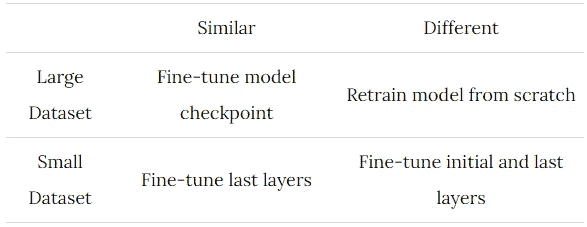
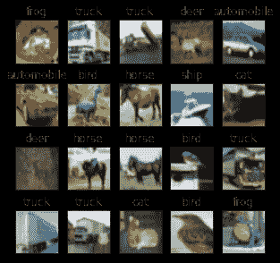
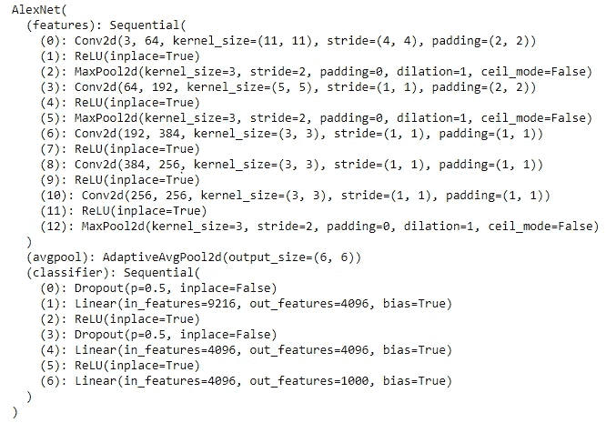
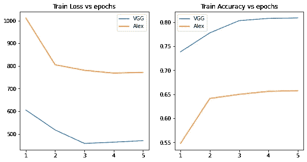
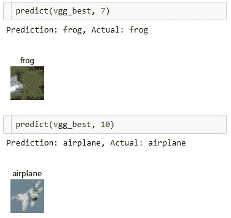

# 如何成功应用迁移学习

> 原文：<https://towardsdatascience.com/how-to-apply-transfer-learning-successfully-6b6f489d287d?source=collection_archive---------34----------------------->


[斯科特·格雷厄姆](https://unsplash.com/@homajob?utm_source=medium&utm_medium=referral)在 [Unsplash](https://unsplash.com?utm_source=medium&utm_medium=referral) 上拍照

在数千个计算小时上训练的高度准确的深度学习模型的可用性导致了迁移学习在生产中的采用。

*注:你也可以在这里* 找到这篇帖子<https://kanishkmair.com/ml/transfer-learning/>

*过去十年在深度学习研究领域取得了飞跃，自动化了几项艰巨的任务。然而，这些高度精确的模型需要在消耗大量计算资源的大型云集群/GPU 机器上进行数周的训练。但是，还有一线希望；AI 社区从一开始就是开源的，大部分模型架构和训练参数都很容易使用。*

*在 NLP 领域，人们可以使用[拥抱脸](https://huggingface.co/)库来训练和微调他们的语言模型。在本文中，我们将迁移学习应用于图像分类任务，使用预训练的模型权重并根据我们的情况进行微调。*

# *步骤 1:训练模型选择*

*这是研究中最重要的部分:确定最适合我们应用的场景。例如，为**敌对网络**训练的 CNN 模型可能无法以同样高的精度解决**图像分类**任务。因此，对训练所选模型的数据集类型以及与我们的问题的相似性进行彻底的研究是选择最佳候选对象所必需的。*

# *第二步:培训方法*

*在深度学习模型已经使用 CNN 架构的计算机视觉任务的情况下，如果数据相似，我们只修改某些层，因为模型已经学习了有用的图像特征。另一方面，如果我们想找到新的模式，我们训练所有的层。最后，该方法还可能会受到计算资源和可用时间的限制；因此，必须相应地做出谨慎的决定。
我通常会借助以下指南来帮助最终确定方法。*

**

***表 1。将基于数据集大小和相似性的学习指南转移到预训练模型的数据集***

*类似地，在 NLP 任务的情况下，我们可以利用预先训练的单词嵌入，并基于我们的模型架构训练其余的单词嵌入。在这里，我将使用 PyTorch，我们首先导入相关的库。*

# *迁移学习的用例*

*作为一个例子，让我们假设我们的任务是图像分类。为了模拟这个场景，让我们假设我们获得了 CIFAR-10 数据集来预测 10 个类别。*

***步骤 1:训练模型选择***

*首先，我们了解任务并查阅相关研究。常见深度学习任务的预训练模型的一个非常受欢迎的资源是 [ONNX 模型动物园](https://github.com/onnx/models)，它链接了各种论文和训练好的模型权重。接受图像分类训练的一些模型有 MobileNet、VGG、AlexNet 等。*

*在选择最高精度的模型之前，我们首先检查它与我们的数据集的训练数据的相似程度。对所有模型的描述表明，它们是在包含多个类的 ImageNet 数据上训练的。在分析我们的 [CIFAR-10 数据集](https://www.cs.toronto.edu/~kriz/cifar.html)时，我们发现它包含正常的图像(没有敌对的例子)。*

***第二步:培训方法***

*最后，我们可以得出结论，数据集与我们的相似。现在，我们必须确定数据集是否足够大或足够小。与来自 ImageNet 数据集的高质量图像相比，我们数据集的图像大小更小，但另一方面，任务更简单，因为我们只需预测 10 个类。作为实验，让我们考虑这两种情况。从表中，我们的方法可以是选择分别训练所有层或只训练最后几层。*

****注*** *:查看此* [*GitHub 链接*](https://github.com/kmair/blogs/blob/main/Transfer%20Learning/transfer_learning.ipynb) *获取源代码**

## *准备数据*

*更多的时候，我们试图在已经标记的数据上进行训练。虽然，如果需要的话，一个[定制数据集](https://pytorch.org/tutorials/beginner/data_loading_tutorial.html#dataset-class)也可以用于训练。因为我们使用 CIFAR-10 数据集作为输入，它也是由 PyTorch 提供的，所以我们可以加载所需的转换，如下所示。*

*原始的 [CIFAR10](https://www.cs.toronto.edu/~kriz/cifar.html) 数据集列出了使用 *categ_map* 变量的 10 个类别，我们可以验证正确的映射。注意，该数据集具有低分辨率(32×32 像素)的图像，使得预训练模型(在 224×244 像素上训练)难以直接预测，需要进一步训练。*

**

***图一。来自 CIFAR-10 数据集的样本图像|作者提供的图像***

# *模型选择和培训*

*根据初步分析，该数据集与 ImageNet 数据集非常相似，PyTorch 上的所有[预训练模型](https://pytorch.org/vision/0.8/models.html)都在 ImageNet 数据集上。如前所述，数据集的大小对于 10 个类来说足够大，但由于我们必须将图像调整到更高维度，我们不能确定数据集是否足够大以进行归纳。如前所述，为了进行试验，我将使用这两种方法，这些任务的相应模型是:*

1.  *AlexNet —微调模型检查点(即假设大数据集并训练整个模型)。*
2.  *VGG-仅训练最后几个图层(即假设数据集很小，仅训练分类图层)。*

```
*# Load the pretrained model from pytorch
Alexnet = models.alexnet(pretrained=True)
VGG = models.vgg13(pretrained=True)*
```

*以上预训练模型直接从 PyTorch 加载。然而，如果我们想要 PyTorch 上没有的特定 ONNX 模型，可以参考这里的[将这些模型加载到 PyTorch 中。](https://pytorch.org/docs/stable/onnx.html)*

*接下来，检查模型层，因此我提供了 ***alter_model*** 函数，它可以使模型的最终层或所有层可训练。*

**

***图二。AlexNet 架构将被修改|图片由作者提供***

*使用上面的函数，所需的层权重已经被激活用于训练。现在可以训练模型并使用度量标准，我们可以选择最佳模型。*

*训练指标有助于确定更大的 VGG 模型具有更高的模型准确性，即使 AlexNet 模型经过了微调。*

**

***图 3。损失和准确度图显示 VGG 模型优于 AlexNet 模型|图片由作者提供***

# *估价*

*报告 2 个模型的测试数据的关键指标。基于测试数据结果，可以进行进一步的模型训练和超参数优化。*

*最后，一旦模型被训练，我们可以使用下面的函数来查看它的运行。*

**

***图 4。使用训练模型预测|作者的图像***

# *结论*

*总之，如果我们的用例不是非常独特，我们必须尝试研究和利用预先训练的模型参数，并相应地进行微调。在这里，在没有任何超参数调整的情况下，我只训练了 20 分钟，就能够在测试数据(10，000 个样本)上实现 80%的最佳准确度。*

*最重要的是，对于迁移学习，我们必须知道模型的来龙去脉，以及如何修改它以适应我们的场景和数据集的差异。否则，我们可能从一个有前途的模型中得到非常差的结果。*