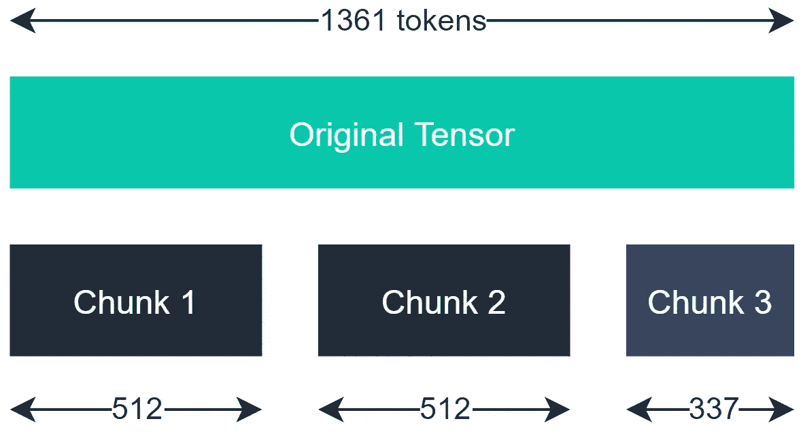

# 如何将变形器应用于任意长度的文本

> 原文：<https://towardsdatascience.com/how-to-apply-transformers-to-any-length-of-text-a5601410af7f?source=collection_archive---------0----------------------->

## [实践教程](https://towardsdatascience.com/tagged/hands-on-tutorials)

## 为长序列恢复 NLP 的能力


由[塞巴斯蒂安·斯坦尼斯](https://unsplash.com/@seabas?utm_source=medium&utm_medium=referral)在 [Unsplash](https://unsplash.com?utm_source=medium&utm_medium=referral) 上拍摄的照片

如今，许多自然语言处理(NLP)任务中事实上的标准是使用转换器。文本生成？*变压器*。问答？*变压器*。语言分类？*变压器*！

然而，这些模型的一个问题(这个问题不仅仅局限于 transformer 模型)是我们不能处理长文本。

我在 Medium 上写的几乎每篇文章都包含 1000 多个单词，当对像 BERT 这样的 transformer 模型进行标记化时，将产生 1000 多个标记。BERT(和许多其他变形金刚模型)将消耗最多 **512 个令牌——截断任何超过这个长度的东西。**

虽然我认为您可能很难在处理我的媒体文章中找到价值，但这同样适用于许多有用的数据源——如新闻文章或 Reddit 帖子。

我们将看看如何解决这个限制。在本文中，我们将从 */r/investing* 子编辑中找到对长文的看法。本文将涵盖:

```
**High-Level Approach****Getting Started**
- Data
- Initialization**Tokenization****Preparing The Chunks**
- Split
- CLS and SEP
- Padding
- Reshaping For BERT**Making Predictions**
```

如果你更喜欢视频，我在这里也涵盖一切:

# 高级方法

实际上，计算较长文本的情感背后的逻辑非常简单。

我们将获取我们的文本(比如 1361 个标记)并将其分成包含不超过 512 个标记的块。



包含 1361 个记号的张量可以分成三个更小的张量。前两个张量各包含 512 个记号，最后一个张量包含剩余的 337 个记号。

一旦我们有了我们的组块，并对它们进行了转换，以便它们可以被 BERT 使用(稍后会有更多内容)，我们就可以将它们传递给我们的模型，并检索每个组块的情感得分。

最后，对每个情感类别取平均值，为我们提供了对整篇文本(所有 1361 个标记)的总体情感预测。

现在，解释高层方法是一回事。写出来是另一回事。让我们从一个例子开始。

# 入门指南

## 数据

首先，我们需要一些数据来处理。我在/r/investing 上发现了这个相当长的帖子:

```
I would like to get your all  thoughts on the bond yield increase this week.  I am not worried about the market downturn but the sudden increase in yields. On 2/16 the 10 year bonds yields increased by almost  9 percent and on 2/19 the yield increased by almost 5 percent.

Key Points from the CNBC Article:

* **The “taper tantrum” in 2013 was a sudden spike in Treasury yields due to market panic after the Federal Reserve announced that it would begin tapering its quantitative easing program.**
* **Major central banks around the world have cut interest rates to historic lows and launched unprecedented quantities of asset purchases in a bid to shore up the economy throughout the pandemic.**
* **However, the recent rise in yields suggests that some investors are starting to anticipate a tightening of policy sooner than anticipated to accommodate a potential rise in inflation.**

The recent rise in bond yields and U.S. inflation expectations has some investors wary that a repeat of the 2013 “taper tantrum” could be on the horizon.

The benchmark U.S. 10-year Treasury note climbed above 1.3**% f**or the first time since February 2020 earlier this week, while the 30-year bond also hit its highest level for a year. Yields move inversely to bond prices.

Yields tend to rise in lockstep with inflation expectations, which have reached their highest levels in a decade in the U.S., powered by increased prospects of a large fiscal stimulus package, progress on vaccine rollouts and pent-up consumer demand.

The “taper tantrum” in 2013 was a sudden spike in Treasury yields due to market panic after the Federal Reserve announced that it would begin tapering its quantitative easing program.

Major central banks around the world have cut interest rates to historic lows and launched unprecedented quantities of asset purchases in a bid to shore up the economy throughout the pandemic. The Fed and others have maintained supportive tones in recent policy meetings, vowing to keep financial conditions loose as the global economy looks to emerge from the Covid-19 pandemic.

However, the recent rise in yields suggests that some investors are starting to anticipate a tightening of policy sooner than anticipated to accommodate a potential rise in inflation.

With central bank support removed, bonds usually fall in price which sends yields higher. This can also spill over into stock markets as higher interest rates means more debt servicing for firms, causing traders to reassess the investing environment.

“The supportive stance from policymakers will likely remain in place until the vaccines have paved a way to some return to normality,” said Shane Balkham, chief investment officer at Beaufort Investment, in a research note this week.

“However, there will be a risk of another ‘taper tantrum’ similar to the one we witnessed in 2013, and this is our main focus for 2021,” Balkham projected, should policymakers begin to unwind this stimulus.

Long-term bond yields in Japan and Europe followed U.S. Treasurys higher toward the end of the week as bondholders shifted their portfolios.

“The fear is that these assets are priced to perfection when the ECB and Fed might eventually taper,” said Sebastien Galy, senior macro strategist at Nordea Asset Management, in a research note entitled “Little taper tantrum.”

“The odds of tapering are helped in the United States by better retail sales after four months of disappointment and the expectation of large issuance from the $1.9 trillion fiscal package.”

Galy suggested the Fed would likely extend the duration on its asset purchases, moderating the upward momentum in inflation.

“Equity markets have reacted negatively to higher yield as it offers an alternative to the dividend yield and a higher discount to long-term cash flows, making them focus more on medium-term growth such as cyclicals” he said. Cyclicals are stocks whose performance tends to align with economic cycles.

Galy expects this process to be more marked in the second half of the year when economic growth picks up, increasing the potential for tapering.

## Tapering in the U.S., but not Europe

Allianz CEO Oliver Bäte told CNBC on Friday that there was a geographical divergence in how the German insurer is thinking about the prospect of interest rate hikes.

“One is Europe, where we continue to have financial repression, where the ECB continues to buy up to the max in order to minimize spreads between the north and the south — the strong balance sheets and the weak ones — and at some point somebody will have to pay the price for that, but in the short term I don’t see any spike in interest rates,” Bäte said, adding that the situation is different stateside.

“Because of the massive programs that have happened, the stimulus that is happening, the dollar being the world’s reserve currency, there is clearly a trend to stoke inflation and it is going to come. Again, I don’t know when and how, but the interest rates have been steepening and they should be steepening further.”

## Rising yields a ‘normal feature’

However, not all analysts are convinced that the rise in bond yields is material for markets. In a note Friday, Barclays Head of European Equity Strategy Emmanuel Cau suggested that rising bond yields were overdue, as they had been lagging the improving macroeconomic outlook for the second half of 2021, and said they were a “normal feature” of economic recovery.

“With the key drivers of inflation pointing up, the prospect of even more fiscal stimulus in the U.S. and pent up demand propelled by high excess savings, it seems right for bond yields to catch-up with other more advanced reflation trades,” Cau said, adding that central banks remain “firmly on hold” given the balance of risks.

He argued that the steepening yield curve is “typical at the early stages of the cycle,” and that so long as vaccine rollouts are successful, growth continues to tick upward and central banks remain cautious, reflationary moves across asset classes look “justified” and equities should be able to withstand higher rates.

“Of course, after the strong move of the last few weeks, equities could mark a pause as many sectors that have rallied with yields look overbought, like commodities and banks,” Cau said.

“But at this stage, we think rising yields are more a confirmation of the equity bull market than a threat, so dips should continue to be bought.”
```

我们将以此为例。

## 初始化

我们需要做的下一件事是初始化我们的模型和标记器。我们将使用 PyTorch 和变形金刚库做任何事情。

幸运的是，transformers 库的初始化非常简单。我们将使用一个用于序列分类的 BERT 模型和相应的 BERT 记号化器，所以我们写:

因为我们使用的是偏重金融的语言，所以我们加载了`ProsusAI/finbert`模型——一个更懂金融的 BERT [1]。你可以在这里找到车型详情[。](https://huggingface.co/ProsusAI/finbert)

# 标记化

标记化是将文本字符串转换为标记(单个单词/标点)和/或标记 id(将单词映射到嵌入数组中该单词的矢量表示的整数)列表的过程。

对于 transformers 库和 BERT，通常如下所示:

```
txt = "<this is the large post included above>"tokens = tokenizer.encode_plus(
    txt, add_special_tokens=True,
    max_length=512, truncation=True,
    padding="max_length"
)
```

这里我们使用 tokenizers `encode_plus`方法从`txt`字符串创建我们的令牌。

*   `add_special_tokens=True`为我们新的“标记化”编码增加了特殊的 BERT 标记，如*【CLS】**【SEP】*和*【PAD】*。
*   `max_length=512`告诉编码器我们编码的目标长度。
*   `truncation=True`确保我们剪切比指定的`max_length`更长的任何序列。
*   `padding="max_length"`告诉编码器用填充标记填充任何比`max_length`短的序列。

这些参数构成了标记化的典型方法。但是，正如你所看到的，当我们打算将一个较长的序列分割成多个较短的块时，它们是不兼容的。

为此，我们修改了`encode_plus`方法，不执行任何截断或填充。

此外，特殊记号*【CLS】*和*【SEP】*将分别出现在序列的开始和结尾。因为我们将分别创建这些序列，所以我们也必须分别添加这些令牌。

新的`encode_plus`方法如下所示:

这将返回一个包含三个键值对的字典，`input_ids`、`token_type_ids`和`attention_mask`。

我们还添加了*和*来从记号赋予器返回 PyTorch 张量(而不是 Python 列表)。

# 准备区块

现在我们有了记号化张量；我们需要把它分成不超过 510 个令牌的块。我们选择 510 而不是 512，以留出两个位置来添加我们的*【CLS】*和*【9】*代币。

## 裂开

我们将`split`方法应用于我们的输入 id 和注意力屏蔽张量(我们不需要标记类型 id，可以丢弃它们)。

现在每个张量集有三个块。注意，我们将需要在最后的块中添加填充，因为它不满足 BERT 要求的张量大小 512。

## CLS 和 SEP

接下来，我们添加序列的开始标记*【CLS】*和分隔符*【SEP】*。为此，我们可以使用`torch.cat`函数，该函数包含一个张量列表。

我们的令牌已经是令牌 ID 格式，因此我们可以参考上面的特殊令牌表来创建我们的*【CLS】*和*【SEP】*令牌的令牌 ID 版本。

因为我们是针对多个张量来做的，所以我们将`torch.cat`函数放入一个 for 循环中，并对我们的每个块分别执行连接。

此外，我们的注意力屏蔽块与 **1** s 连接，而不是与 **101** 和 **102** 连接。我们这样做是因为注意掩码不包含*令牌 id*，而是包含一组 **1** 和 **0**

注意掩码中的零表示填充标记的位置(我们接下来会添加)，由于*【CLS】*和*【SEP】*不是填充标记，所以用 **1** s 表示

## 填料

我们需要向张量块添加填充，以确保它们满足 BERT 要求的 512 张量长度。

我们的前两个块不需要任何填充，因为它们已经满足了这个长度要求，但是最后的块需要。

为了检查一个块是否需要填充，我们添加了一个 if 语句来检查张量长度。如果张量短于 512 个记号，我们使用`torch.cat`函数添加填充。

我们应该将这个语句添加到同一个 for 循环中，在这个循环中我们添加了*【CLS】*和*【SEP】*标记——如果您需要这方面的帮助，我已经在文章的末尾提供了完整的脚本。

## 为伯特重塑形象

我们有自己的块，但是现在我们需要将它们重新整形为单个张量，并将它们添加到 BERT 的输入字典中。

使用`torch.stack`函数将所有张量叠加在一起。

然后，我们将它们格式化成一个输入字典，并将输入 IDs 张量数据类型更改为`long`，将注意力屏蔽张量数据类型更改为`int`——这是 BERT 所要求的。

这就是我们准备传递给 BERT 的数据！

# 做预测

做出我们的预测是容易的部分。我们将我们的`input_dict`作为一个`**kwargs`参数传递给我们的`model` — ***kwargs* 允许模型将`input_ids`和`attention_mask`关键字匹配到模型中的变量。

从这里，我们可以看到，我们为每个块获取了一组三个激活值。这些激活值还不是我们的输出概率。为了将这些转换成输出概率，我们必须对输出张量应用 softmax 函数。

最后，我们取每个类(或列)中的值的`mean`来得到我们最终的正面、负面或中性情感概率。

如果你想提取获胜的类，我们可以添加一个`argmax`函数:

这就是我们对较长文本的情感预测！

我们选取了一段包含 1000 个标记的长文本，将其分解成块，手动添加特殊标记，并计算所有块的平均情绪。

通常情况下，阅读全文绝对有助于理解所讨论主题的观点。我们已经建立了一种方法来实现这一点，并允许我们解决典型的文本大小限制。

如果你想看完整的代码，你可以在下面的参考资料中找到(有两个笔记本，但是编号为**的两个**包含了这里使用的确切代码)。

我希望你喜欢这篇文章。如果您有任何问题或建议，请通过 [Twitter](https://twitter.com/jamescalam) 或在下面的评论中告诉我！如果你对更多类似的内容感兴趣，我也会在 YouTube 上发布。

感谢阅读！

# 参考

[1] D. Araci， [FinBERT:使用预先训练的语言模型进行金融情绪分析](https://arxiv.org/abs/1908.10063) (2019)

[Jupyter 笔记本 1](https://github.com/jamescalam/transformers/blob/main/course/language_classification/03_long_text_sentiment.ipynb)

[朱庇特笔记本 2](https://github.com/jamescalam/transformers/blob/main/course/language_classification/04_window_method_in_pytorch.ipynb)

[🤖带变压器的 NLP 课程](https://bit.ly/nlp-transformers)

如果你想了解更多关于使用变形金刚进行情感分析的知识(这次是使用 TensorFlow)，请点击这里查看我关于语言分类的文章:

<https://betterprogramming.pub/build-a-natural-language-classifier-with-bert-and-tensorflow-4770d4442d41> 