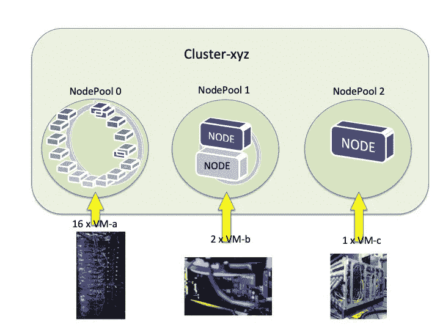
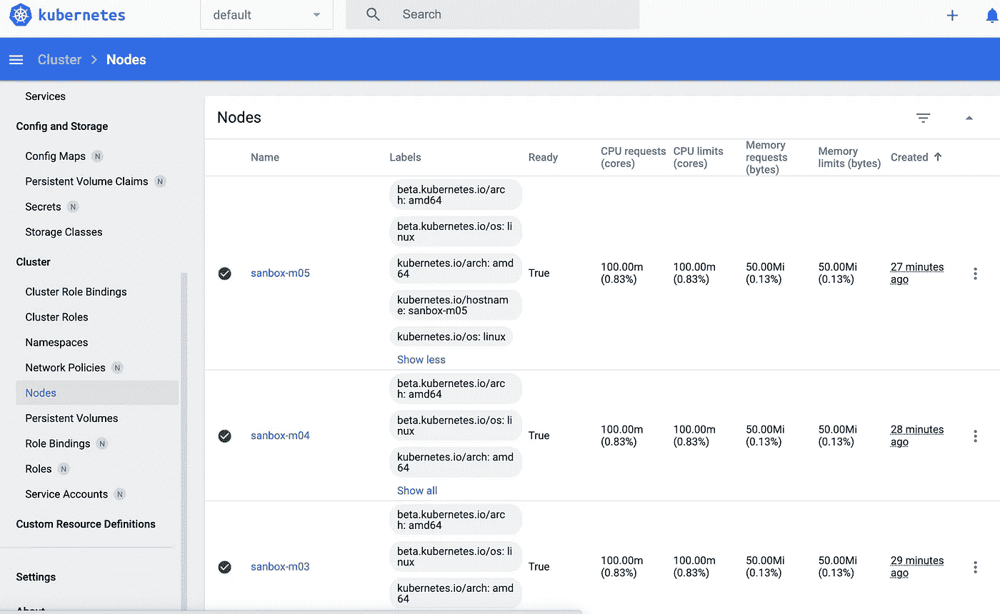
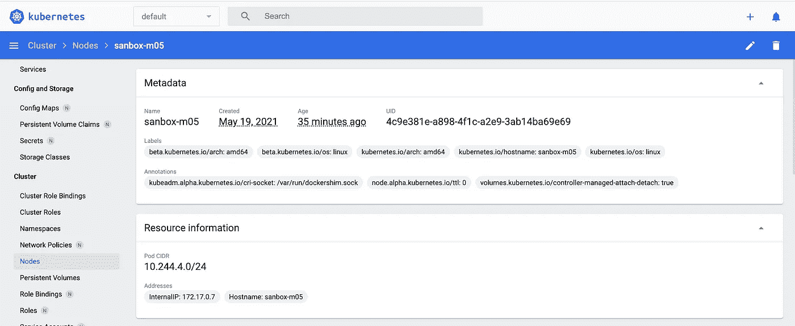
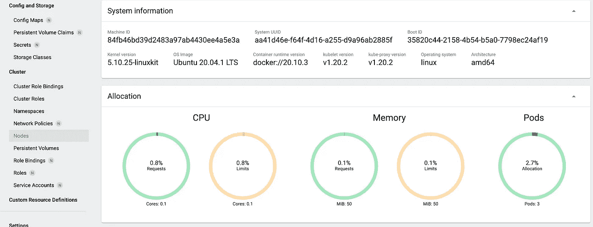
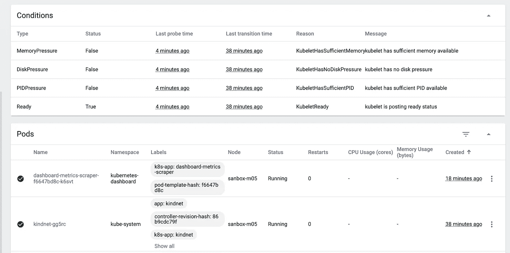

# 如何为四种不同的云 Kubernetes 服务分配计算资源:AKS、EKS、GKE 和 Minikube

> 原文：<https://towardsdatascience.com/how-to-assign-computing-resources-for-four-different-cloud-kubernetes-services-aks-eks-gke-and-b3f4deb722bc?source=collection_archive---------27----------------------->

## Kubernetes 架构不需要公开来分配云计算硬件。


计算商品云。马西莫·博图里在 [Unsplash](https://unsplash.com/collections/9766550/cloud-computing?utm_source=unsplash&utm_medium=referral&utm_content=creditCopyText) 上拍摄的照片

# 介绍

在本文中，我将向您展示如何为四种不同的云类型指定 Kubernetes 节点的计算资源:

1.  [Minikube](https://kubernetes.io/docs/setup/learning-environment/minikube/) ，一种在本地工作站(沙盒)上训练或测试 Kubernetes 的流行方法；
2.  用于亚马逊网络服务(AWS)云的弹性 Kubernetes 服务(EKS)；
3.  面向微软 Azure 云的 Azure Kubernetes 服务(AKS)；
4.  用于谷歌云平台(GCP)云的谷歌 Kubernetes 引擎(GKE)。

我们从云、Kubernetes、节点、节点池、集群和虚拟机的工作定义开始。

# 什么是云？

云是无数的异构硬件，每个都有自己的操作系统，托管您的应用程序，您希望复制这些应用程序(扩展)并在服务失败时重新启动(容错)。

***注*** *:我用“应用”作为一个微服务、服务、应用、包、网络资源、存储服务的通称，或者* [*应用即服务*](https://www.parallels.com/blogs/ras/aaas-application-as-a-service/)*(*[*AaaS*](https://www.parallels.com/blogs/ras/aaas-application-as-a-service/)*= = Saas)。*

云供应商意识到，计算引擎是作为通用资源指定的通用计算类型提供的商品。

云供应商联合起来…

*   网络计算引擎商品
*   应用程序

…让您能够为不同类型的应用租赁不同类型的计算引擎。

***注*** *:云厂商凭借开源许可、无价格许可、高带宽成为可行。想象一下管理许可费用的成本与云供应商对开源软件的维护成本的对比。*

# 什么是 Kubernetes？

假设有一个应用程序，您希望跨计算引擎复制(扩展)该应用程序，如果某个应用程序的计算引擎出现故障(容错)，则将该应用程序移动到另一个计算引擎。

因为需要可扩展、容错的分布式操作服务，谷歌在 2015 年开源了 Kubernetes。

Kubernetes 是独立于云的，因为:

1.  将物理机引擎转变为虚拟机。然后将虚拟机映射到 Kubernetes *节点*抽象*。*
2.  通过将应用程序放入[容器](https://www.cio.com/article/2924995/what-are-containers-and-why-do-you-need-them.html)，将应用程序转换为虚拟应用程序。然后将一个或多个容器映射到 Kubernetes *pods* 抽象*。*

Kubernetes 协调 pod，在*节点*上启动和初始化*pod*，如果它们变得不可达(容错)，则在不同的*节点*上重新启动*pod*，复制(扩展)pod，以及 pod 上的其他分布式操作系统协调操作。

我在这篇博客文章中详细介绍了云计算硬件如何映射到 Kubernetes 节点。云供应商的文档中指定了计算资源的供应。

您无法在 Kubernetes 文档中找到如何配置计算资源的方法，也不应该这样做。

# 什么是 Kubernetes 节点和节点池？

Kubernetes 的一个重要概念是独立于计算硬件的类型。Kubernetes 将计算引擎(硬件和操作)规范抽象为一个*节点*。

一个*节点*是主要云供应商的一组有限的虚拟机(VM)产品。每种供应类型指定计算资源和每单位时间租赁计算资源的价格。

虚拟机类型描述了 CPU、GPU 和 xPU 的混合；记忆的数量和类型(快速记忆)；磁盘的数量和类型(慢速内存)；以及免费的 Linux 变种操作系统(OS)。

每个云供应商还允许你用你想放入或替换的其他计算资源来构建定制的 VM 类型。

***注*** *:云厂商提供 MS Windows NT 等其他 OS 变种。在许可证供应商的许可下，您还可以将许可证移动到云虚拟机。*

您将一个 VM 类型分配给 Kubernetes 外部的一个节点。因此，Kubernetes 配置是独立于云的，因为它只知道哪些*节点*被分配给了*集群*，并且独立于该节点的实际虚拟机类型。

***注*** *:异构计算引擎造成的限制只允许将同构节点(相同 VM 类型)的节点池添加到 Kubernetes 集群。Kubernetes 编排服务(如故障转移和复制)使用不同虚拟机的节点池是一个尚未解决的问题。*

从现在开始，我使用更多的术语虚拟机(VM)来指代计算引擎。

***注*** *:如果你熟悉 DAG(有向无环图)，那么一条直线型 DAG 将云虚拟机连接到节点到节点池再到集群。*

# 什么是 Kubernetes 集群？

Kubernetes 是一个用于通过网络连接的节点(VM)的分布式操作系统。一个特定的节点网络(节点池)是一个 Kubernetes *集群*。

一个或多个节点池被分配给 Kubernetes 集群(节点)。节点池或节点被分配给一个群集，不能分配给两个或多个群集。

Kubernetes 通常在一个集群中编排几个节点(节点池)。

Kubernetes 可以命名和管理许多集群。

***注*** *:一个集群可以驻留在多个云上，称为多云或混合云。我不会在这篇博客文章中进一步讨论 hybris 云，因为这超出了我们的主要讨论点。*



图一。物理硬件被描述为云中的虚拟机(VM)。每个虚拟机都映射到一个节点。相同虚拟机类型的节点被分组到一个节点池中。一个或多个节点池被分配给一个群集。群集不能共享池，节点池也不能共享节点。结果是虚拟机被分配到一个集群。在此图中，我们看到 16 台虚拟机分配给节点池 0，两台不同类型的虚拟机分配给节点池 1，一台虚拟机分配给节点池 2。图片作者。

云计算硬件映射到 Kubernetes 节点组。一个节点组被分配给一个 Kubernetes 集群。

现在，我们研究四种不同的云文档，以确定虚拟机如何映射到节点组。

# 响亮的类型 1: Minikube

Minikube 就是你如何在本地计算机上运行外观和感觉都很像的 Kubernetes。

我认为 Minikube 是我安装在本地机器上的一个程序，用于培训或测试 Kubernetes。

因为它位于一个本地工作站上，所以 Minkube 实例代表工作站上的一个集群。

在将 Kubernetes 配置推送到云之前，我们在本地沙箱(工作站)上使用 Minikube。

和 Kubernetes 一样，Minikube 使用客户端命令行工具`kubectl`。但是，Minikube 还需要一个名为。`minikube.`

## Minikube 配置文件

Kubernetes 拥有被命名为集群的*上下文*。通过使用上下文名，`kubectl`指向哪个 Kubernetes 集群就对哪个集群进行操作。

Minikube *概要文件*是 Minikube 实例的*名称*，它是本地机器上的一个集群。另一种不同但等效的说法是:“*每个新集群都需要一个新的 Minikube 实例。”*

如果 Minicube *配置文件*与`kubectl` *上下文*同名(字符串)，则`kubectl`在 Minikube 实例(当前配置文件)(集群)上运行。

关于 Mimikube 上下文和`kubectl`简介的更详细讨论:

[](https://itnext.io/understanding-the-connection-between-minicubes-profile-and-kubectl-s-context-f9a30f89bc62) [## 理解 Minikube 的简介和 Kubectl 的背景之间的联系

### 我讨论了导致 Minicube 表现得像 Kubernetes 一样的稀疏记录的桥接概念。

itnext.io](https://itnext.io/understanding-the-connection-between-minicubes-profile-and-kubectl-s-context-f9a30f89bc62) 

## 用于指定本地虚拟机的 Minikube 启动选项。

您可以在本地工作站上使用以下命令启动一个 Minkube 虚拟机(VM)实例:

```
minikube start -p <profile-name> [options]
```

您的虚拟机默认使用下面列出的`[options]`:

```
minikube start -h
```

Minikube 实例的一些有用选项:

```
Options:--cpus=2: Number of local workstation CPUs allocated to Minikube VM instance.--disk-size='20000mb': The local workstation disk size allocated to the minikube VM (format: <number>[<unit>], where unit = b, k, m or g).--memory='': Amount of local workstation RAM to allocate to Kubernetes (format: <number>[<unit>], where unit = b, k, m or g).-n, --nodes=1: The number of nodes to spin up in the Kubernetes cluster. Defaults to 1.
```

例如:

```
start -p sanbox -cpus=10 -nodes=5. [log]
. [messages]
. [from starting profile(cluster) sandbox]minikube dashboard &  #startup kubernetes dashboard
```



图二。Kubernetes 仪表板显示 Minikube 配置文件(集群)sanbox 的 5 个节点。图片:作者工作站的桌面截图。



图 3。节点 sanbox-m05 元数据。图片:作者工作站的桌面截图。



图 3(续)).节点 sanbox-m05 元数据。图片:作者工作站的桌面截图。



图 3(续)).节点 sanbox-m05 元数据。图片:作者工作站的桌面截图。

我们看到，以下三家云供应商与 Minikube 在 Kubernetes 节点的虚拟机预约方面形成鲜明对比。

在 Minikube 中，Kubernetes 集群由一个虚拟机组成。云由一个或多个虚拟机组成。

每个 Minkube 实例都是一个 Kubernetes 集群，驻留在从您的工作站的计算资源创建的 VM 中。Minkube 实例节点是同构的，并对单个虚拟机进行分区。

相比之下，云定义节点池。Kubernetes 集群由节点池组成，其中每个节点池都是一种特定的虚拟机类型。

# 云类型 2:亚马逊 EKS 节点、节点组和集群

亚马逊为 EC2 提供的 Kubernetes 服务叫做[弹性 Kubernetes 服务(EKS](https://docs.aws.amazon.com/eks/latest/userguide/what-is-eks.html) )。

EKS 支持 Kubernetes API。`eksctl`是用于在 EKS 上创建和管理集群的命令行界面(CLI)工具。

如果您熟悉 Kubernetes `kuberctl`命令行界面(CLI ),则 EKS 的等效界面称为。`eksctl`。

## 分配虚拟机(VM)

有多种方法和选项可以将虚拟机分配给弹性 Kubernetes 服务(EKS)集群。

首先，创建一个名为`*<my-cluster>*`的 Kubernetes [集群](https://docs.aws.amazon.com/eks/latest/userguide/create-cluster.html):

```
# Example
eksctl create cluster \
 --name *<*zetaC*luster>* \ 
 --without-nodegroup
```

我们[手动分配](https://docs.aws.amazon.com/eks/latest/userguide/create-managed-node-group.html)节点组、节点和[虚拟机类型](https://docs.aws.amazon.com/pricing-calculator/latest/userguide/advanced-estimate.html#ec2-advanced-instance-type)给

1.  创建一个节点组名`*<my-ng>;*`
2.  把它分配给库伯内特集群`*<zetaCluster>;*`
3.  在[区域](https://docs.aws.amazon.com/eks/latest/userguide/local-zones.html)
4.  节点(虚拟机)类型的`*<VM-type>;*`
5.  起始节点计数为`*<<number-in-node-group>>;*`
6.  最小节点数为`*<minimum-number-in-node-group>;*`
7.  最大节点数为`*<maximum-number-in-node-group>;*`

```
eksctl create nodegroup \
   --cluster <zetaC*luster>* \
   --region *<region>* \
   --name *<nogroup-name>* \
   --node-type *<VM-type>* \
   --nodes *<number-in-node-group>* \
   --nodes-min *<minimum-number-in-node-group>* \
   --nodes-max *<maximum-number-in-node-group>*
```

***注*** *:节点池在 EKS 称为节点组。*

***注*** *:我并没有定义我使用的每一个云概念——比如，区域这个术语。*

您不能在 EKS 集群中添加或删除*节点*；您可以在 EKS 集群中添加或删除节点组。

[AWS 提供的 VM 类型(Amazon EC2 实例类型)。](https://aws.amazon.com/ec2/instance-types/)

# 云类型 3: Azure AKS 节点，ResourseGroup。和集群

在 Azure Kubernetes 服务(AKS)中，相同配置的节点被分组到*节点池*中。这些节点池包含运行应用程序的底层虚拟机。

您可以向节点池中添加节点。遵循独立于云的 Kubernetes 计算资源抽象规则，您可以向 AKS 集群添加一个或多个节点池。

如果您熟悉 Kubernetes `kuberctl`命令行界面(CLI ),那么 EKS 的对应界面叫做`az,`用于在 AKS 上创建和管理集群的 CLI。

在 Azure 中，首先，创建一个名为*的资源组*。

```
az group create — name <nameResourceGroupVM> — location <region>#### Exampleaz group create — name zetaResourceGroupVM — location westeurope
```

## 为什么需要创建 AKS 资源组？(可选阅读)

只有 AKS 的 Kubernetes 实现有资源组。AKS ResourceGroups 的目的似乎是指定从哪个 Azure 区域分配虚拟机，以及从哪个区域启动集群。

实质上，AKS 区域是在资源组中指定的，而不是在集群中。您可以通过引用不同的资源组来加速另一个 AKS 区域中的集群。

每个集群创建了两个资源组。一个名为，是显式的，伞对象实例链接该集群的所有内部 AKS 系统资源。

***注*** *: IMHO，ResorceGroups 可能是为了对 Kubernetes 内部系统虚拟机收费而引入的。可以想象 Kubernetes 群体如此之大，以至于消耗了大量的计算资源。我知道云供应商通过合同谈判管理大型 Kubernetes 群，而不使用名称。微软可能也会这么做。我不知道他们有没有。*

第二个 ResourceGroup 实例是未命名的，在创建集群时自动创建。伞状对象实例链接您可能分配给 AKS 集群的所有节点池。

```
# Create a resource group named sandboxResourceGroup
# in region(az group): East US
create --name sandboxResourceGroup --location eastus
```

## 创建一个 AKS 集群。

接下来，您需要创建一个名为`sandboxCluster`的 AKS 集群:

```
# Create a basic single-node AKS cluster 
az aks create \
     --resource-group sandboxResourceGroup \
     --name sandboxCluster \
     --node-count 3 \
```

创建 AKS 集群时，创建了一个默认的*节点池 1* ，节点计数为 3。

```
az aks nodepool list --resource-group sandboxResourceGroup \
     --cluster-name sandboxCluster
```

输出= >

```
 [
   { ...
     "count": 3,
     ...
     "name": "nodepool1",
     "orchestratorVersion": "1.15.7",
     ...
     "provisioningState": "Succeeded",
     ...
     "vmSize": "Standard_DS2_v2",
     ...
   }
 ]
```

## 向群集添加节点池。

我们可以通过以下方式向`sandboxClutser`添加第二个节点池:

```
az aks nodepool add \
     --resource-group sandboxResourceGroup \
     --cluster-name myAKSCluster \
     --name sb1nodepool \
     --node-count 7az aks nodepool list --resource-group sandboxResourceGroup \
     --cluster-name sandboxCluster
```

输出= >

```
[
   { ...
     "count": 3,
     ...
     "name": "nodepool1",
     "orchestratorVersion": "1.15.7",
     ...
     "provisioningState": "Succeeded",
     ...
     "vmSize": "Standard_DS2_v2",
     ...
   },
   { ...
     "count": 7,
     ...
     "name": "sb1nodepool",
     "orchestratorVersion": "1.15.7",
     ...
     "provisioningState": "Succeeded",
     ...
     "vmSize": "Standard_DS2_v2",
     ...
   } ]
```

> *如果在添加节点池时未指定 VmSize，则默认大小为 Windows 节点池的 Standard_D2s_v3 和 Linux 节点池的 Standard_DS2_v2。—* [*微软 Azure 文档。*](https://docs.microsoft.com/en-us/azure/aks/use-multiple-node-pools)

所有虚拟机规格和其他选项都交给`[ak aks nodepool add](https://docs.microsoft.com/en-us/cli/azure/aks/nodepool?view=azure-cli-latest#az_aks_nodepool_add).`

## 从群集中删除节点池。

如果不再需要某个池，可以将其删除并移除底层虚拟机节点。要删除节点池，使用 [az aks 节点池删除](https://docs.microsoft.com/en-us/cli/azure/aks/nodepool?view=azure-cli-latest&preserve-view=true#az_aks_nodepool_delete)命令并指定节点池名称。

```
az aks nodepool delete -g sandboxResourceGroup /
        --cluster-name sandboxCluster /
       --name nodepool1 --no-wait
```

输出= >

```
[
   { ...
     "count": 7,
     ...
     "name": "sb1nodepool",
     "orchestratorVersion": "1.15.7",
     ...
     "provisioningState": "Succeeded",
     ...
     "vmSize": "Standard_DS2_v2",
     ...
   }
]
```

## 你可能会发现有用的杂项 Azure 链接。

虚拟机配置中的批处理池支持几乎所有的[虚拟机大小](https://docs.microsoft.com/en-us/azure/virtual-machines/sizes)。

[Azure 支持的 Linux 发行版和版本。](https://docs.microsoft.com/en-US/troubleshoot/azure/cloud-services/support-linux-open-source-technology)

[各种虚拟机包及其性能指标评测。](https://docs.microsoft.com/en-us/azure/virtual-machines/linux/compute-benchmark-scores)

[虚拟机设置—哪个虚拟机最适合您在 Azure 中的工作负载？](https://www.youtube.com/watch?v=zOSvnJFd3ZM)

# 云类型 4:护目镜 GKE

要使用以下命令签名创建 GKE 集群:

```
gcloud container clusters create <CLUSTER_NAME> [options]
```

所有的`gcloud ontainer clusters create`选项都在这里[详细说明。](https://cloud.google.com/sdk/gcloud/reference/container/clusters/create)

## 创建 GKE 节点池。

与其他云类似，Goggle Kubernetes 引擎(GKE)将虚拟机抽象为一个节点。

节点池而不是节点被添加到 GKE 群集中。

要创建节点池，请运行`[gcloud container node-pools create](https://cloud.google.com/sdk/gcloud/reference/container/node-pools/create)`命令:

```
gcloud container node-pools create <POOL_NAME> --cluster <CLUSTER_NAME> [options]
```

使用以下任一选项指定节点池中的虚拟机类型:

来自 [GKE 文件](https://cloud.google.com/sdk/gcloud/reference/container/node-pools/create):

> `--machine-type`:节点池中实例使用的计算引擎[机器类型](https://cloud.google.com/compute/docs/machine-types)。如果未指定，默认机器类型为`e2-medium`。关于指定机器类型的信息，请参考`[gcloud container node-pools create --machine-type](https://cloud.google.com/sdk/gcloud/reference/container/node-pools/create#--machine-type)`。
> 
> `--num-nodes`:指定要在节点池中创建的节点数。默认值为 3。您的项目必须有足够的[配额](https://cloud.google.com/compute/docs/resource-quotas)用于节点数。
> 
> `--disk-size`:节点虚拟机引导磁盘的大小，以 GB 为单位。默认为 100GB。
> 
> `--image-type`:用于节点池的[图像类型](https://cloud.google.com/kubernetes-engine/docs/concepts/node-images)。映像类型指定要在节点池中的节点上运行的基本操作系统。如果未指定，服务器将选择默认图像类型。

其他`gcloud container node-pools create`选项的[在此详述。](https://cloud.google.com/sdk/gcloud/reference/container/node-pools/create)

## 你可能会发现有用的杂项 GKE 链接。

[其他节点池管理命令。](https://cloud.google.com/kubernetes-engine/docs/how-to/node-pools)

可用的有效[虚拟机类型](https://cloud.google.com/compute/docs/machine-types)列表。

# 摘要

有人提醒我们，Kubernetes 与机器类型(VM)无关，因此也与云类型无关。

Kubernetes 将计算资源抽象为节点，节点映射到云供应商提供的虚拟机。

由于 Kubernetes 编排服务的异构性(如故障转移和复制)造成的限制，云类型实施只允许将同构节点(相同虚拟机类型)的节点池添加到 Kubernetes 集群。

我向您展示了如何针对四种不同的云类型将 VM 映射到 Kubernetes 节点:

1.  [Minikube](https://kubernetes.io/docs/setup/learning-environment/minikube/) 在本地工作站上使用 Kubernetes 进行培训或测试的流行方法；
2.  用于亚马逊网络服务(AWS)的弹性 Kubernetes 服务(EKS)；
3.  面向微软 Azure 的 Azure Kubernetes 服务(AKS)；
4.  用于谷歌云平台(GCP)的谷歌 Kubernetes 引擎(GKE)。

未来的博客文章将讨论 Kubernetes 在生产中为您的机器学习管道提供的机会。

编码快乐！

# 附录 a .定价

所有云供应商都有相同的基本价格模型，这并不奇怪，因为计算资源现在是商品。根据云供应商及其卓越的产品，在基本定价模型中添加了定制附加服务。

下面我展示了 Goggle[价格模型](https://cloud.google.com/compute/all-pricing)的一部分。

> 您需要为虚拟机实例使用的资源付费。创建虚拟机实例时，您需要为实例选择一种机器类型，并按照虚拟机实例定价页面中的描述进行计费。具体来说，您需要按照基于资源的计费模型中所述，为每个 vCPU 和 GB 内存单独计费。适用折扣，如持续使用折扣和承诺使用折扣。

所有云供应商都提供合同、批量和/或专用计算资源定价。