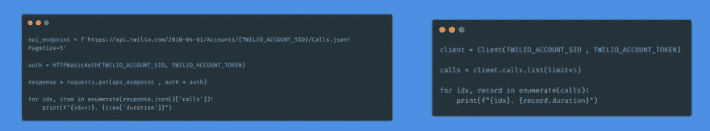
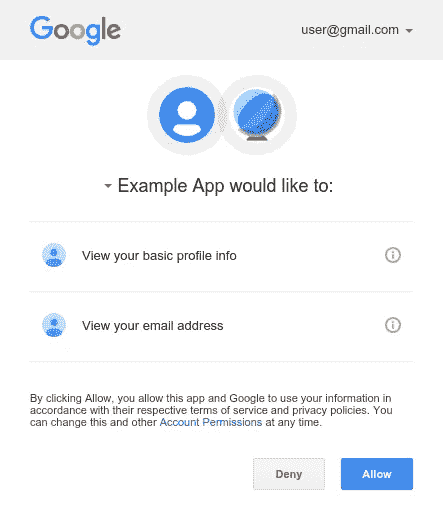
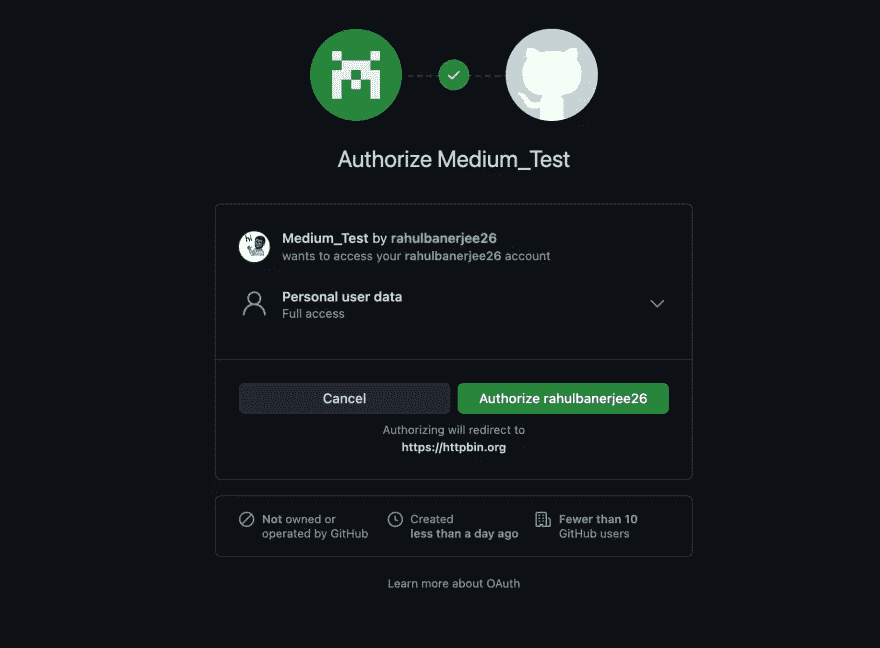

# 如何在 Python 中使用 Keys、BasicAuth、OAuth2 进行认证

> 原文：<https://towardsdatascience.com/how-to-authenticate-using-keys-basicauth-oauth2-in-python-94fddec609cc?source=collection_archive---------30----------------------->

## 在本文中，我们将使用 5 种不同的 API，它们使用不同类型的认证。我们将使用 Python 来消费 API。


照片由[弗兰克](https://unsplash.com/@franckinjapan?utm_source=unsplash&utm_medium=referral&utm_content=creditCopyText)在 [Unsplash](https://unsplash.com/s/photos/security?utm_source=unsplash&utm_medium=referral&utm_content=creditCopyText) 上拍摄

并不是所有的 API 都像 Twilio 一样有完整的文档。本指南将帮助您使用使用 Keys、BasicAuth 或 OAuth2 保护的 API。

我们将使用以下 API

*   [猫的事实](https://alexwohlbruck.github.io/cat-facts/)
*   [卡特彼勒即服务(CAAS)](https://thecatapi.com/)
*   [Twilio API](https://www.twilio.com/docs/usage/api)
*   [GitHub API](https://docs.github.com/en/rest)
*   [Genius API](https://docs.genius.com/)

你可以在这里找到[源代码](https://github.com/rahulbanerjee26/python_apis)

# 目录

*   不安全的 API
*   从. env 文件中读取值
*   带键的 API
*   具有基本身份验证的 API
*   API 包装
*   会话对象
*   通过 OAuth2 保护的 API
*   使用 GitHub API (OAuth2)
*   使用 Genius API (OAuth2)

希望对请求库有所了解。如果需要复习，可以参考我之前的[文章。](https://www.realpythonproject.com/day21-how-to-use-requests-to-interact-with-apis-in-python/)

# 不安全的 API

[卡特彼勒事实](https://alexwohlbruck.github.io/cat-facts/) API 不需要任何认证，使用起来相当简单。让我们向以下端点发出请求

```
[https://cat-fact.herokuapp.com/facts](https://cat-fact.herokuapp.com/facts)
```

上面的 API 返回随机的 Cat 事实

```
import requests
api_endpoint = "https://cat-fact.herokuapp.com/facts"
response = requests.get(
    api_endpoint
)
for idx, item in enumerate(response.json()):
    print(f"{idx+1}. {item['text']}")
```

# 阅读来自。环境文件

在进入下一节之前，让我们看看如何从. env 文件中读取变量。强烈建议将您的凭据存储在. env 文件中，以避免向他人公开。

我们将需要安装 **python-dotenv** 库。

```
pip install python-dotenv
```

假设有一个带有随机 API 标记的. env 文件

```
API_TOKEN = "SOME API TOKEN"
```

让我们试着用 Python 读取 API 令牌。

```
from dotenv import load_dotenv
import os load_dotenv()
API_TOKEN = os.environ.get("API_TOKEN")
```

**get** 函数接受存储在。env 文件作为参数。

# 带键的 API

这是使用 API 时最常见的身份验证形式。在发出请求时，API 密钥/令牌作为标头传入。我们将使用[卡特彼勒即服务(CAAS)](https://thecatapi.com/) API。你可以在这里得到一把[钥匙](https://thecatapi.com/signup)

```
from dotenv import load_dotenv
import os 
import requestsapi_endpoint = "https://api.thecatapi.com/v1/breeds"load_dotenv()
CAT_API_KEY = os.environ.get("CAT_API_KEY")headers = {
    "x-api-key" : CAT_API_KEY
}
response = requests.get(
    api_endpoint,
    headers = headers
)for idx, item in enumerate(response.json()):
    print(f"{idx+1}. {item['name']} : {item['description']}")
```

我们创建了一个名为**头**的字典来存储 API 密匙。字典中的键是“x-api-key”。但是，这可能会因您使用的 API 而异。有些 API 要求将密钥命名为“授权”、“授权”、“令牌”。最好参考 API 文档的认证部分。

载体认证非常常见，它要求单词“载体”(注意空格)出现在 API 令牌/密钥的开头。

```
headers = {
    "authorization": f"Bearer {access_token}"
}
```

我们将在后面的示例中使用载体认证。

# 具有基本身份验证的 API

使用基本身份验证保护的 API 需要用户名和密码。通常，用户名是客户端 ID，密码是 API 的客户端机密。在某些情况下，用户名可以留空。这应该在 API 文档中提及。

使用基本认证来保护 Twilio API 。你可以在 Twilio 网站上注册并获得 API 证书。

```
from requests.auth import HTTPBasicAuth
from dotenv import load_dotenv
import os 
import requestsload_dotenv()
TWILIO_ACCOUNT_SID = os.environ.get("TWILIO_ACCOUNT_SID")
TWILIO_ACCOUNT_TOKEN = os.environ.get("TWILIO_ACCOUNT_TOKEN")api_endpoint = f'https://api.twilio.com/2010-04-01/Accounts/{TWILIO_ACCOUNT_SID}/Calls.json?PageSize=5'auth = HTTPBasicAuth(TWILIO_ACCOUNT_SID, TWILIO_ACCOUNT_TOKEN)response = requests.get(api_endpoint , auth = auth)for idx, item in enumerate(response.json()['calls']):
    print(f"{idx+1}. {item['duration']}")
```

我们创建了一个 **HTTPBasicAuth** 的实例。它分别接受用户名和密码作为参数。发出请求时，此实例作为参数传递。对于 twilio，用户名是您的帐户 sid，密码是您的帐户令牌。如前所述，对于不同的 API，它可以是不同的。如果您使用的 API 使用基本身份验证来保护其端点，请参考文档以获取用户名和密码。

# API 包装

关于 Python，API 包装器本质上是可以使用 pip 安装的库/包。这些库有助于以语法上更简洁的方式与 API 进行通信。在幕后，库仍然利用请求和头来发出请求。然而，包装器让你的代码看起来更干净。

我们之前讨论的 Twilio API 有一个包装器。它可以使用 pip 安装

```
pip install twilio
```

让我们试着做和上一节中对 Twilio 做的一样的事情

```
from twilio.rest import Client
from dotenv import load_dotenv
import os load_dotenv()
TWILIO_ACCOUNT_SID = os.environ.get("TWILIO_ACCOUNT_SID")
TWILIO_ACCOUNT_TOKEN = os.environ.get("TWILIO_ACCOUNT_TOKEN")
client = Client(TWILIO_ACCOUNT_SID , TWILIO_ACCOUNT_TOKEN)calls = client.calls.list(limit=5)for idx, record in enumerate(calls):
    print(f"{idx}. {record.duration}")
```

正如您所看到的，代码缩短了几行，看起来更加整洁。



API 与包装器的比较

不幸的是，不是所有的 API 都有包装器。然而，他们中的许多人确实如此。在消费者直接使用 API 之前，尝试寻找一个包装器。这将大大简化 API 的使用。

# 会话对象

您可以创建一个会话对象，而不是每次向安全的 API 端点发出请求时都传递 API 键或 HTTPBasicAuth 实例。您只需认证一次，就可以发出请求，而不需要传递密钥或 auth 实例。

我们将使用 GitHub API，它是使用 BasicAuth 保护的。用户名将是您的 GitHub 用户名，密码是您的个人访问令牌。按照[这个教程](https://docs.github.com/en/github/authenticating-to-github/keeping-your-account-and-data-secure/creating-a-personal-access-token)就可以得到一个。

```
from requests.auth import HTTPBasicAuth
from dotenv import load_dotenv
import os 
import requestsload_dotenv()
GITHUB_API_TOKEN = os.environ.get("GITHUB_API_TOKEN")base_api_endpoint = "https://api.github.com/user"auth = HTTPBasicAuth("rahulbanerjee26", GITHUB_API_TOKEN)session = requests.Session()
session.auth = authresponse = session.get(base_api_endpoint + '/repos')for idx, item in enumerate(response.json()):
    print(f"{idx+1}. {item['name']}")response = session.get(base_api_endpoint + '/emails')
for idx, item in enumerate(response.json()):
    print(f"{idx+1}. {item['email']}")
```

在我将会话的 auth 值设置为 HTTPBasicAuth 实例之后，我可以简单地发出请求，而不用每次都通过身份验证。我们的请求仍然在被认证，但是会话对象会处理它。

# 通过 OAuth2 保护的 API

当你需要一个“使用谷歌注册”、“使用脸书注册”选项时，使用 OAuth2 web flow 进行认证通常在 Flask/Django 应用中使用。然而，一些 API 需要 OAuth2 用于它们的所有端点。GitHub API 也支持 OAuth2 认证。我们还将讨论[天才 API](https://docs.genius.com/) 。尽管它支持基于密钥的身份验证，但其端点需要 OAuth2，通过在 headers 对象中传递密钥，可以获得一个令牌并对自己进行身份验证。但是，我们将使用 OAuth2 web 流来验证我们自己。

关于 OAuth2 是如何工作的，我不会说得太详细，因为这超出了本文的范围。下面是一个高层次的概述。如果没有意义，跳到 Github 或 Genius API 部分，它应该更有意义。

*   我们必须在 API 的网站上创建一个客户端应用程序
*   客户端应用程序将有一个客户端 ID 和客户端密码
*   我们必须向 API 的认证端点发出请求。客户端 ID 和客户端密码将作为查询参数传递。
*   身份验证端点将请求许可，并且必须被授权



谷歌认证截图

*   一旦授权，它将返回一个代码
*   该代码必须被提供给另一个端点，该端点将其交换为接入令牌。
*   这个访问令牌现在可以用作密钥，并在向端点发出请求时作为 header 对象传递。

让我们来看几个例子。

# 使用 GitHub API (OAuth2)

如上所述，OAuth2 主要用于 Flask/Django 应用程序。使用 OAuth2 时，您将需要一个 web 应用程序 URL 和一个 URL，以便在用户授权/授予权限后将用户重定向到该 URL。由于我们没有网络应用程序，我们没有任何网址。但是，我们可以使用 [HTTPBin](https://httpbin.org/) 。每当我们需要一个 URL 时，我们可以使用下面的 URL

```
[https://httpbin.org/anything](https://httpbin.org/anything)
```

首先，你必须[创建一个 GitHub 应用](https://docs.github.com/en/developers/apps/building-github-apps/creating-a-github-app)。当询问 web 应用程序 URL 或重定向 URL 时，使用上面讨论的 URL。创建应用程序后，将客户端 ID 和客户端密码存储在。环境文件。

```
import requests
import os
from dotenv import load_dotenv
from urllib.parse import urlencode
import webbrowserload_dotenv()
CLIENT_ID = os.environ.get("GITHUB_CLIENT_ID")
CLIENT_SECRET = os.environ.get("GITHUB_CLIENT_SECRET")
REDIRECT_URI = "https://httpbin.org/anything"params = {
    "client_id": CLIENT_ID,
    "redirect_uri": REDIRECT_URI,
    "scope": "user"
}endpoint = "https://github.com/login/oauth/authorize"
endpoint = endpoint + '?' + urlencode(params)
webbrowser.open(endpoint)code = input("Enter the Code: ")
```

前几行是导入库并从。环境文件。参数字典包含客户机 ID、重定向 URL(我们前面讨论过的 HTTPBin URL)和作用域。范围的值决定了可以访问的端点和可以执行的 HTTP 谓词操作。

我们创建一个 URL 和查询参数，并使用 **webbrowser** 库在浏览器中打开它。Pythons 脚本等待使用输入我们的代码，



GitHub API 认证截图

单击 authorize 后，您应该被重定向到 HTTPBin URL，并且应该显示一个 JSON 对象。查看键“code”的值。这个值将被交换成一个 API 令牌。输入代码。

```
print("Got Code")params = {
    "client_id": CLIENT_ID,
    "client_secret": CLIENT_SECRET,
    "redirect_uri": REDIRECT_URI,
    "code": code,
}
endpoint = "https://github.com/login/oauth/access_token"
response = requests.post(endpoint, params=params, headers = {"Accept": "application/json"}).json()
access_token = response['access_token']
print("Got Access Token")
```

一旦我们获得代码，我们向端点发出另一个请求以获得访问令牌。这一次，我们将代码和客户机秘密作为参数传递。在 GitHub 验证了凭证和代码之后，它将返回一个访问令牌。这个访问令牌可以用作 API 密钥。

```
session = requests.session()
session.headers = {"Authorization": f"token {access_token}"}base_api_endpoint = "https://api.github.com/user"response = session.get(base_api_endpoint)
print(response)response = session.get(base_api_endpoint + '/repos')
print(response)response = session.get(base_api_endpoint + '/emails')
print(response)
```

# 使用 Genius API (OAuth2)

让我们看另一个例子。我将跳过导入库和加载凭证的部分。

```
parameters = {
    'client_id': GENIUS_CLIENT_ID,
    'redirect_uri': 'https://httpbin.org/anything',
    'response_type': 'code',
    'scope': 'me'
}
endpoint = "https://api.genius.com/oauth/authorize"
endpoint = endpoint + '?' + urlencode(parameters)
webbrowser.open(endpoint)
code = input("Enter the Code: ")
```

“响应类型”对于某些 API 是强制性的，其值应该始终为“代码”


Genius API 认证的屏幕截图

在我们授权之后，我们将看到一个 JSON 对象，类似于我们在使用 GitHub API 时看到的对象。输入代码。

```
print(code)
parameters = {
    "code": code,
    "client_id": GENIUS_CLIENT_ID,
    "client_secret": GENIUS_CLIENT_SECRET,
    "redirect_uri": 'https://httpbin.org/anything',
    "response_type": "code",
    "grant_type": "authorization_code"
}response = requests.post("https://api.genius.com/oauth/token", params = parameters).json()
print(response)
access_token = response["access_token"]
```

“grant_type”也是某些 API 所必需的。该值始终为“授权 _ 代码”。在我们的代码被验证之后，我们得到一个访问令牌。这个令牌可以用作 API 密钥。

```
session = requests.session()
session.headers = {"authorization": f"Bearer {access_token}"}base_api_endpoint = "https://api.genius.com/account"response = session.get(base_api_endpoint)
print(response)
```

# 结论

我希望这篇文章能成为使用 Python 中的 API 的好指南。在直接使用 API 之前，总是要寻找一个包装器。你花 5 分钟寻找一个包装可能会节省你几个小时的头痛。

在 [LinkedIn](https://www.linkedin.com/in/rahulbanerjee2699/) 、 [Twitter](https://twitter.com/rahulbanerjee99) 上与我联系

# 资源

Github 回购

<https://github.com/rahulbanerjee26/python_apis>  

*原载于 2021 年 5 月 24 日 https://www.realpythonproject.com**的* [*。*](https://www.realpythonproject.com/how-to-authenticate-using-keys-basicauth-oauth-in-python/)