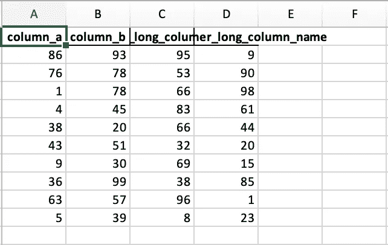
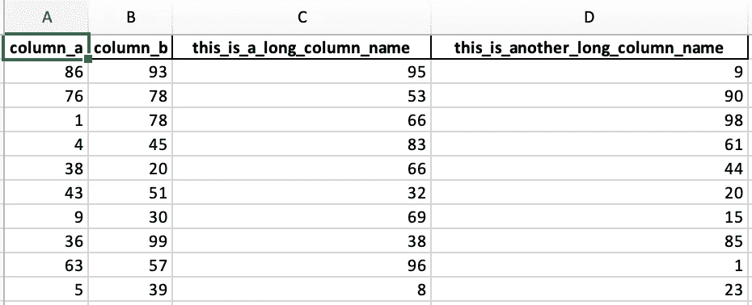
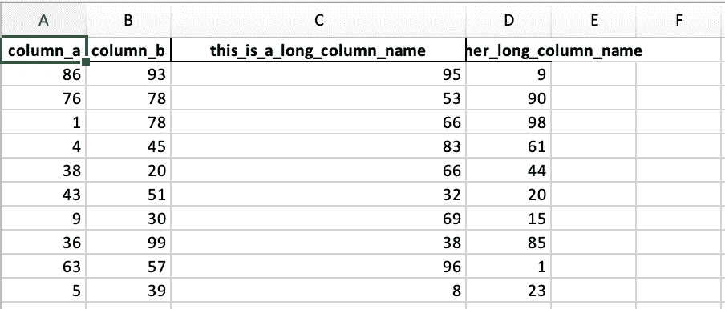
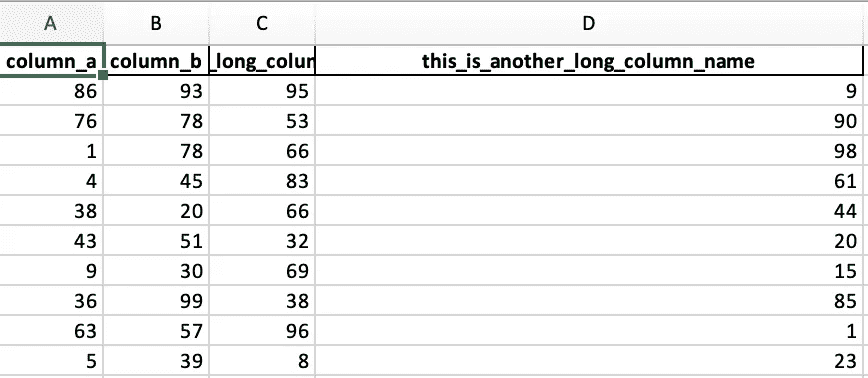

# 如何用 Pandas ExcelWriter 自动调整 Excel 列的宽度

> 原文：<https://towardsdatascience.com/how-to-auto-adjust-the-width-of-excel-columns-with-pandas-excelwriter-60cee36e175e?source=collection_archive---------3----------------------->

## 使用 pandas 时动态调整 Excel 列名的宽度。ExcelWriter 和 Python


照片由[米卡·鲍梅斯特](https://unsplash.com/@mbaumi)在 [Unsplash](https://unsplash.com/photos/Wpnoqo2plFA) 上拍摄

您可能需要处理的最令人沮丧的事情之一是使用 Python 生成 Excel 文件时，该文件包含许多列，由于列的宽度较短，您无法读取这些列。理想情况下，您应该交付可读的电子表格，其中所有的列都经过适当的格式化，以便它们是可读的。

在这篇文章中，我们将探索快速和简单的方法可以用来

*   **动态** **根据列名的长度调整**所有列宽
*   通过使用其名称**调整特定列**
*   使用特定列的**索引**调整该列

最后，我们还将讨论如何修复调用`set_column`方法(`AttributeError: 'Worksheet' object has no attribute 'set_column'`)时可能出现的一个常见问题。

首先，让我们创建一个 pandas 数据框架，它将在我们的示例中引用，以便演示我们打算在本文中讨论的操作。

现在让我们尝试使用`ExcelWriter`将我们刚刚创建的熊猫数据帧写入到一个`csv`文件中，如下所示(注意，如果下面的代码片段因`ModuleNotFoundError: No module named openpyxl`失败，您需要做的就是通过运行`pip install openpyxl`来安装库):

将熊猫数据框架写入 Excel 电子表格

输出的电子表格应该类似于下图所示。正如您所看到的，名称较长的列被裁剪掉了，整个表格看起来很糟糕。如果您必须处理许多这样的列，问题会更大。



将熊猫数据帧输出到 Excel 电子表格

在接下来的几节中，我们将探索一些可以用来自动调整列宽的方法，以便电子表格中的输出表格更具可读性。

## 动态调整所有列的宽度

为了根据列的长度自动调整列的宽度，我们只需要遍历列并相应地设置列宽，如下所示:

**注意:如果下面的代码片段与下面的** `**AttributeError**` **不匹配，请阅读文章末尾，看看如何快速解决这个问题。**

```
AttributeError: 'Worksheet' object has no attribute 'set_column'
```

现在 Excel 电子表格中输出的熊猫数据框架可读性更好，看起来也更好。所有列都调整到相应的宽度，这将使它们适合空间而不会被裁剪。



将熊猫数据帧输出到 Excel 电子表格中，并自动调整列宽

## 通过使用列名来调整列的宽度

现在，您可能希望只手动调整特定列(或列的子集)的宽度。您可以通过引用列名来做到这一点，如下面的代码片段所示。为了这个例子，让我们假设我们想要将列`this_is_a_long_column_name`的宽度调整为`30`:

通过引用特定列的名称来手动调整其宽度

上面代码片段的输出如下所示。正如我们所看到的，列`this_is_a_long_column_name`的宽度被调整为`20`，而其余列的宽度被调整为默认值，这使得宽度较长的列(如最后一列)被裁剪。



输出此 _is_a_long_column_name 的列宽已手动调整的电子表格

## 使用列的索引来调整列的宽度

或者，您可能希望通过直接引用特定列的索引来手动调整该列的宽度。在下面的示例中，我们通过调整最后一列的宽度来演示这一点。

通过引用特定列的索引来手动调整其宽度

同样，我们可以看到，在这种情况下，最后一列已经被调整为`width=40`，因此它足够宽以适应列名。



输出最后一列具有手动调整列宽的电子表格

## 如何修复`AttributeError: 'Worksheet' object has no attribute 'set_column'`

如果上述任何操作失败，并显示以下错误

```
AttributeError: 'Worksheet' object has no attribute 'set_column'
```

你需要做的就是安装`xlswriter`

```
pip install xlsxwriter
```

## 结论

在这篇文章中，我们探讨了在将 pandas 数据框架写入 Excel 电子表格时自动调整列宽的几种可能方法。我们通常会创建电子表格，这样我们就可以生成看起来漂亮、易读的信息。因此，创建不需要读者手动操作的电子表格以使它们可读是很重要的。你可以用我之前分享的最少的代码来实现这一点，当你试图用熊猫数据框创建 excel 文件时，这些代码肯定会帮助你创建高质量的 excel 文件。