# 如何使用 Python 实现 3D 点云分割和聚类的自动化

> 原文：<https://towardsdatascience.com/how-to-automate-3d-point-cloud-segmentation-and-clustering-with-python-343c9039e4f5?source=collection_archive---------0----------------------->

## [实践教程](https://towardsdatascience.com/tagged/hands-on-tutorials)，3D Python

## 使用多阶 RANSAC 和无监督聚类(DBSCAN)实现点云分割和 3D 形状检测自动化的完整 python 教程。

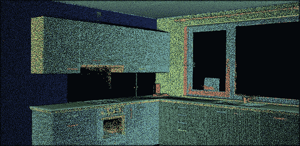

在本 python 实践指南中学习的 3D 点云分割步骤。首先，我们搜索平面形状(RANSAC)，然后我们通过欧几里德聚类(DBSCAN)自动细化。F. Poux

如果你过去曾经处理过点云(或者，就这件事而言，处理过数据)，你就会知道在你的观察之间找到模式是多么重要📈。事实上，我们经常需要提取一些更高层次的知识，这些知识严重依赖于确定由共享一个模式的数据点形成的“对象”。

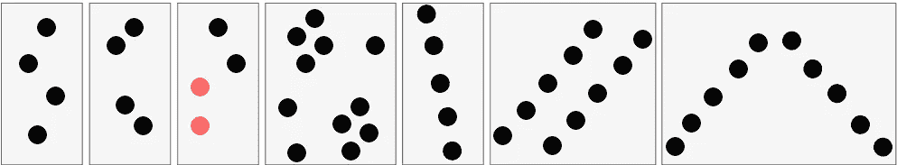

点上的视觉模式从左到右:不分组；接近标准；相似性标准；公共集群区域；线性标准；平行判据:对称判据。资料来源: [(Poux 等人，2019 年)](https://www.mdpi.com/2220-9964/8/5/213/htm)

这是一项由我们的视觉认知系统轻松完成的任务。然而，通过计算方法模仿人类的这种能力是一个极具挑战性的问题🤯。基本上，我们希望利用人类视觉系统的倾向性来**分组元素集合**。

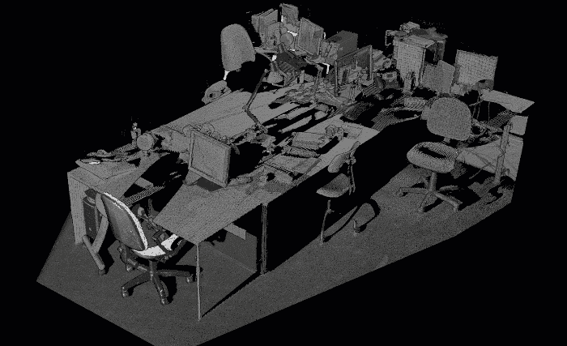

“传感器看到的”与模拟人类视觉系统的潜在“对象分组”(黄色的椅子，蓝色的地面，杂乱的实例)。F. Poux

## 但是为什么有用呢？

问得好！实际上，点云分割的主要动机有三个:

*   首先，它为最终用户提供了通过更高层次的概括(细分)有效访问和操作个人内容的灵活性。
*   其次，它创建了数据的紧凑表示，其中所有后续处理可以在区域级别而不是单个点级别完成，从而潜在地显著提高了计算效率。
*   最后，它提供了提取邻域、图形和拓扑之间的关系的能力，这在基于点的原始数据集中是不存在的。

由于这些原因，分割主要用作预处理步骤，以从点云数据中注释、增强、分析、分类、归类、提取和抽象信息。但现在真正的问题是。我们怎么做呢？

啊…让我们打开盒子👐！

# 包含两个关键概念的快速 3D 分割理论

在本教程中，我已经为您选择了两个最好的、更健壮的方法，您将在最后掌握它们。我们将依靠两种集中有效的方法: **RANSAC** 和通过 **DBSCAN** 的欧几里德聚类。但是在使用它们之前，我想是的😀，重要的是理解主旨，简单来说。

## 兰萨克

RANSAC 代表随机样本共识，这是一个非常简单但非常有效的算法，如果你的数据受到异常值的影响，你可以使用，这就是我们的情况😊。事实上，无论何时使用真实世界的传感器，您的数据都不会完美。通常，您的传感器数据会受到异常值的影响。RANSAC 是一种试错法，它会将您的数据点分成两个部分:内部数据集和外部数据集。然后，您可以忘记离群值并使用您的内联者。

所以让我用一个小而简单的例子来说明 RANSAC 是如何工作的。假设我们想通过下面的点云拟合一个平面。我们如何做到这一点？

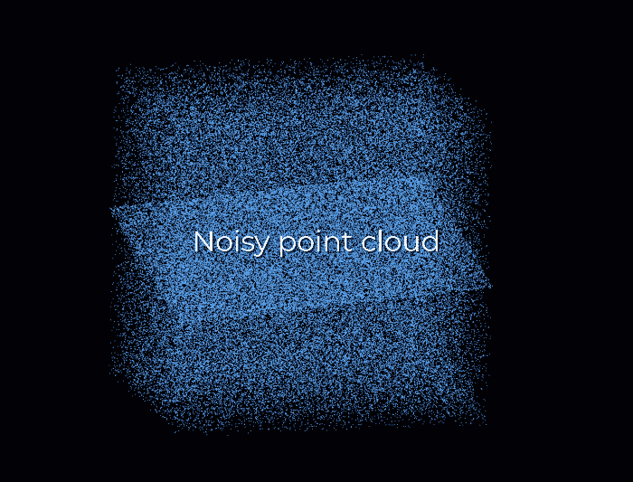

随机点云中的 RANSAC 平面检测模拟。F. Poux

首先，我们从数据中创建一个平面，为此，我们从点云中随机选择 3 个点来建立一个平面。然后，我们简单地检查有多少剩余的点落在该平面上(达到某个阈值)，这将为该提议打分。

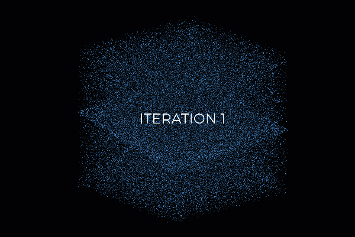

RANSAC 评分系统图解。您可以看到，每次迭代都会随机抽取 3 个点作为样本，并从中创建一个计划，然后选择将落在该计划上的点。这里，迭代 159 将是最好的候选。F. Poux

然后，我们用 3 个新的随机点重复这个过程，看看我们做得怎么样。好点了吗？更糟吗？同样，我们一遍又一遍地重复这个过程，比如说 10 次、100 次、1000 次，然后我们选择具有最高分数的平面模型(即，其具有剩余数据点的最佳“支持”)。这就是我们的解决方案:支持点加上我们采样的三个点构成了我们的**内部点集**，剩下的就是我们的**外部点集**。很简单，匈奴😁？

哈哈，但是对于怀疑论者来说，你没有一个上升的问题吗？我们实际上如何确定我们应该重复这个过程多少次呢？我们应该多久尝试一次？嗯，这实际上是我们可以计算的东西，但现在让我们把它放在一边，专注于手头的事情:点云分割😉。

## 欧氏聚类(DBSCAN)

对于点云数据集，我们通常需要对空间上连续的点集进行分组，如下图所示。但是我们如何有效地做到这一点呢？

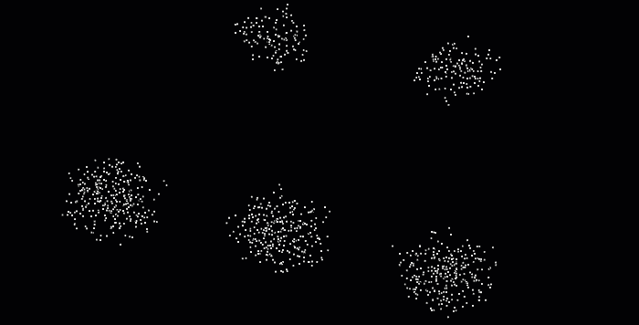

在这个图像中，很明显我们想要将彼此靠近的点分组，找到 5 组点。F. Poux

DBSCAN(带噪声的应用程序的基于密度的空间聚类)算法是在 1996 年为此目的而引入的。这种算法被广泛使用，这也是它在 2014 年被授予经受住时间考验的科学贡献奖的原因。

DBSCAN 对数据集中的点进行迭代。对于它分析的每个点，它都构建了从该点按密度可达的点集:它计算该点的邻域，如果该邻域包含超过一定数量的点，它就被包含在该区域中。每个相邻点经历相同的过程，直到它不能再扩展集群。如果考虑的点不是内部点，即它没有足够的邻居，它将被标记为噪声。这使得 DBSCAN 对于异常值是健壮的，因为这种机制隔离了它们。多酷啊😆？

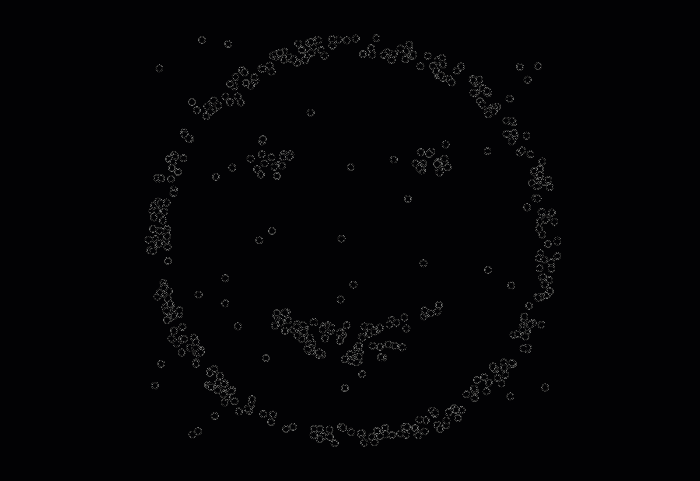

DBSCAN 算法过程以及两个参数ϵ和最小点数对结果的影响的图示。可以看到，值越大，构成的集群越少。F. Poux

啊，我差点忘了。参数的选择(邻域的ϵ和最小点数的 n_min)也很棘手:在设置参数以创建足够的内部点时必须非常小心(如果 n_min 太大或ϵ太小，这将不会发生)。特别是，这意味着 DBSCAN 将很难找到不同密度的集群。但是，与 Kmeans 不同，DBSCAN 具有计算效率高的巨大优势，不需要预先定义聚类数。最后，它允许找到任意形状的集群。

现在，让我们通过 5 个步骤把所有这些晦涩难懂的东西变成一个超级有用的“软件”💻！

# 步骤 1 :(点云)数据，总是数据😁

在之前的教程中，我展示了通过使用[摄影测量](https://learngeodata.eu/)和来自[开阔地形](https://www.opentopography.org/)的航空激光雷达获得的 3D 数据集上的点云处理和网格划分。这一次，我们将使用我用地面激光扫描仪收集的数据集！

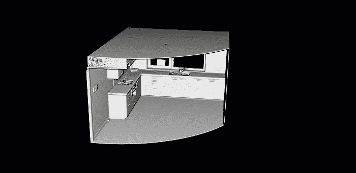

这是本实践指南提供的点云。这是一个简单的厨房，数据来自地面激光扫描仪。F. Poux

我将跳过关于 I/O 操作和文件格式的细节，但是我知道，如果你想弄清楚或者建立一个成熟的专家🧐.，下面的文章中会涉及到它们今天，我们将直接使用众所周知的。ply 文件格式。

</how-to-automate-lidar-point-cloud-processing-with-python-a027454a536c>  </5-step-guide-to-generate-3d-meshes-from-point-clouds-with-python-36bad397d8ba>  

🤓 ***注意*** *:* 对于这个操作指南，你可以使用[这个库](https://drive.google.com/file/d/1CJrH9eqzOte3PHJ_g8iLifJFE_cBGg6b/view?usp=sharing)中的点云，我已经过滤和转换过了，这样你就处于最佳状态了。如果你想在不安装任何东西的情况下预先可视化并使用它，你可以查看一下 [webGL 版本](https://www.flyvast.com/flyvast/app/page-snapshot-viewer.html#/388/ae65f30d-01d4-5faf-0472-4b9962e8d2cb)。

# 步骤 2:设置您的 Python 环境。

在下面的前一篇文章中，我们看到了如何使用 Anaconda 轻松地设置环境，以及如何使用 IDE Spyder 管理您的代码。如果你想成为一名成熟的 python 应用程序开发人员，我建议你继续这样做😆。

</discover-3d-point-cloud-processing-with-python-6112d9ee38e7>  

但是，嘿，如果你喜欢在接下来的 5 分钟内从头开始，我也给你一个 Google Colab 笔记本，你会在文章的结尾找到它。没有要安装的内容；你可以把它保存到你的 google drive，然后开始使用它，也可以使用来自 1☝️.步骤的免费数据集

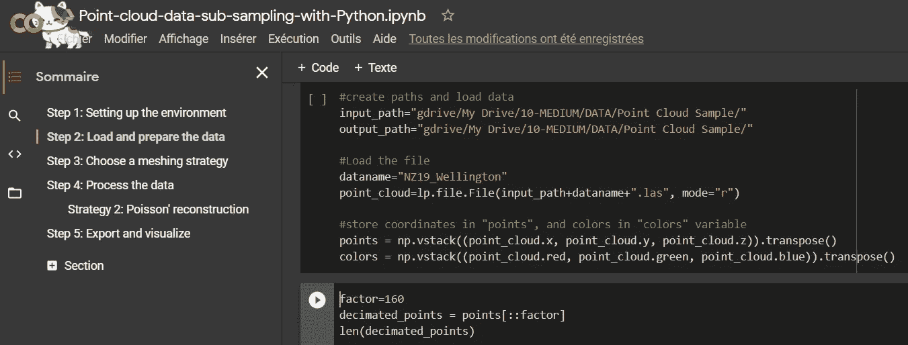

在 Google Colab 文件中，您可以一个单元格一个单元格地运行脚本，并从 web 上的直接编码体验中受益。开始尝试 Python 的好方法。(是的，猫在橱窗里走😺).F. Poux

🤓

# **第三步:第一轮细分**

**嗯，为了尽快得到结果，我要吃“parti-pris”。事实上，我们将通过遵循最小化的编码方法来完成一个很好的分段💻。这意味着对底层库非常挑剔！我们将使用三个非常健壮的，即`numpy`、`matplotlib`和`open3d`。**

**好了，要在您的环境中安装上面的库包，我建议您从终端运行以下命令(另外，请注意`open3d-admin`通道):**

```
conda install numpy
conda install matplotlib
conda install -c open3d-admin open3d
```

**🤓 ***免责声明注*** *:* 我们选择的是 Python，而不是 C++或者 Julia，所以表演就是表演😄。希望这对您的应用程序来说足够了😉，我们称之为“离线”过程(非实时)。**

**现在是期待已久的看到第一个结果的时候了！**

## **如何在 3D 点云上实现 RANSAC？**

**让我们首先用下面一行导入`pcd`变量中的数据:**

```
pcd = o3d.io.read_point_cloud("your_path/kitchen.ply")
```

**你想快速创造奇迹吗？嗯，我有一个好消息，`open3d`配备了一个 RANSAC 实现，用于点云中的平面形状检测。唯一要写的一行是:**

```
plane_model, inliers = pcd.segment_plane(distance_threshold=0.01, ransac_n=3, num_iterations=1000)
```

**🤓 ***注意*** *:* 正如你所看到的，`segment_plane()`方法持有 3 个参数。这些是距离平面的距离阈值(`distance_threshold`)以考虑点的内侧或外侧，所绘制的采样点的数量(这里是 3 个，因为我们想要一个平面)以估计每个候选平面(`ransac_n`)和迭代次数(`num_iterations`)。这些是标准值，但是要注意，根据手头的数据集，`distance_threshold`应该被仔细检查。**

**上一行的结果是`plane_model`中捕获的最佳平面候选参数 a、b、c 和 d，以及`inliers`中捕获的被认为是内点的点的**索引**。**

**现在让我们想象一下结果，好吗？为此，我们实际上必须基于在`inliers`中捕获的索引来选择点，并且可选地选择所有其他的点作为异常值。我们如何做到这一点？嗯，像这样:**

```
inlier_cloud = pcd.select_by_index(inliers)
outlier_cloud = pcd.select_by_index(inliers, invert=True)
```

**🤓 ***注意*** *:* 参数`invert=True`允许选择第一个参数的反义词，这意味着`inliers` *中没有的所有指标。***

**好了，现在你的变量保存了这些点，但是在可视化结果之前，我建议我们把内嵌器涂成红色，其余的涂成灰色。为此，您可以像这样传递一个 R，G，B 值列表:**

```
inlier_cloud.paint_uniform_color([1, 0, 0])
outlier_cloud.paint_uniform_color([0.6, 0.6, 0.6])
```

**现在，让我们用下面一行来想象结果:**

```
o3d.visualization.draw_geometries([inlier_cloud, outlier_cloud])
```

**🤓 ***注意*** *:* 如果你想更好地掌握被颜色冲刷过的几何体，你可以事先使用下面的命令计算法线:`pcd.estimate_normals(search_param=o3d.geometry.KDTreeSearchParamHybrid(radius=0.1, max_nn=16), fast_normal_computation=True)`。这将确保你得到一个更好的渲染，如下😉。**

**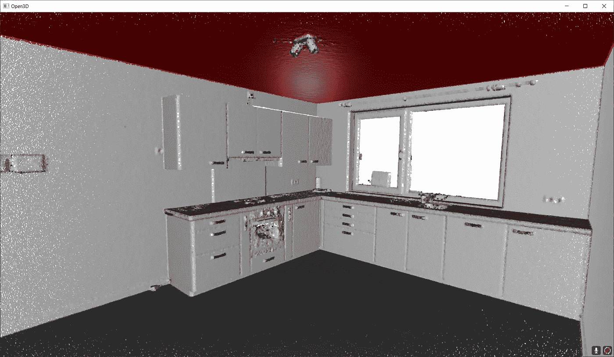**

**这显示了上面详述的 RANSAC 脚本的结果。红色的是内点，灰色的是外点。F. Poux**

**太好了！你知道如何分割你的点云在一个内点集合和一个外点集合🥳！现在，让我们研究如何找到一些彼此靠近的星团。因此，让我们想象一下，一旦我们检测到大的平面部分，我们就有了一些我们想要描绘的“浮动”对象。如何做到这一点？(是的，这是一个伪问题，我有答案给你😀)**

## **如何在点云上使用 DBSCAN？**

**首先，我们选择一个样本，在这里我们假设我们去掉了所有的平面区域(这个样本可以在这里找到:[访问数据样本](https://drive.google.com/file/d/1QNIEjEN2S1CNGrCQQYJTIkO1U8ioB8ry/view?usp=sharing))，如下所示。**

**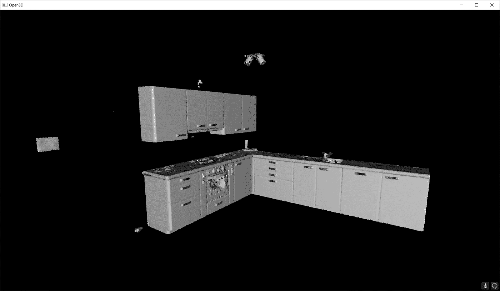**

**我们想要通过欧几里德聚类分割的剩余元素。使用上面的链接可以访问数据集。F. Poux**

**好了，现在，让我们写一些 DBSCAN 集群。同样，为了简化一切，我们将使用`open3d` 包的 DBSCAN 方法部分，但是要知道，如果您需要更大的灵活性，在`scikit-learn`中实现可能是更长远的选择。就时间而言，这几乎是一样的。方法`cluster_dbscan`直接作用于`pcd`点云实体，并在点云初始索引后返回标签列表。**

```
labels = np.array(pcd.cluster_dbscan(eps=0.05, min_points=10))
```

**🤓 ***注*** *:* 标签在`-1`和`n`之间变化，其中`-1`表示它是一个“噪声”点，值`0`到`n`则是给对应点的聚类标签。请注意，我们希望以 NumPy 数组的形式获得标签，并且我们使用 5 cm 的半径来“生长”集群，并且只有在这一步之后我们至少有 10 个点时才考虑一个。请随意尝试😀。**

**很好，现在我们有了用每个点一个标签定义的点组，让我们给结果着色。这是可选的，但是对于迭代过程来说，搜索正确的参数值是很方便的。为此，我建议使用 Matplotlib 库来获取特定的[颜色范围](https://matplotlib.org/stable/tutorials/colors/colormaps.html)，例如 tab20:**

```
max_label = labels.max()
colors = plt.get_cmap("tab20")(labels / (max_label 
if max_label > 0 else 1))colors[labels < 0] = 0
pcd.colors = o3d.utility.Vector3dVector(colors[:, :3])o3d.visualization.draw_geometries([pcd])
```

**🤓 ***注意****:*`max_label`应该是直观的:它存储标签列表中的最大值。这允许使用它作为配色方案的分母，同时用“`if`”语句处理特殊情况，其中聚类是偏斜的，并且仅传递噪声+一个聚类。之后，我们确保将这些带有标签`-1`的噪声点设置为黑色(`0`)。然后，我们给点云`pcd`的属性`colors`3 个“列”的 2D 数组，代表 R，G，b**

**瞧啊！下面是我们的聚类结果。**

**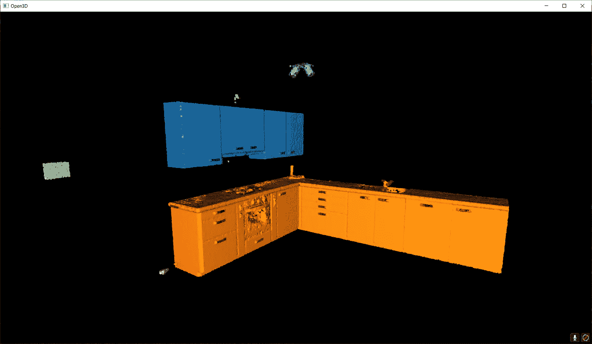**

**参数 eps=0.05 和 min_points=10 的点云 DBSCAN 聚类方案的结果。我们可以清楚地将顶层橱柜与底层橱柜区分开来，还有加热控制器(绿色)和灯(紫色)。F. Poux**

**太好了，它运行得很好，现在，我们如何实际上以自动化的方式将所有这一切规模化呢？**

# **步骤 4:扩展和自动化**

**我们的理念将非常简单。我们将首先运行 RANSAC 多次(比如说`n`次)来提取构成场景的不同平面区域。然后我们将通过欧几里德聚类(DBSCAN)来处理“浮动元素”。这意味着我们必须确保我们有一种方法来存储迭代期间的结果。准备好了吗？**

## **为多个平面形状检测创建 RANSAC 循环**

**好了，让我们实例化一个空字典，它将保存迭代的结果(`segment_models`中的平面参数，以及`segments`中来自点云的平面区域):**

```
segment_models={}
segments={}
```

**然后，我们要确保我们可以影响我们想要迭代检测平面的次数。为此，让我们创建一个保存迭代次数的变量`max_plane_idx`:**

```
max_plane_idx=20
```

**🤓 ***注*** *:* 在这里，我们说要迭代 20 次才能找到 20 个平面，但是有更聪明的方法来定义这样一个参数。它实际上扩展了文章的范围，但如果你想了解更多，可以查看 [3D 地理数据学院](https://learngeodata.eu)。**

**现在让我们进入一个工作循环😁我将首先快速说明。在第一遍(循环`i=0`)中，我们从离群值中分离出内嵌值。我们将内联体存储在`segments`中，然后我们希望只处理存储在`rest`中的剩余点，这成为循环 n+1(循环`i=1`)的主题。这意味着我们希望将上一步中的异常值视为基点云，直到达到迭代阈值以上(不要与 RANSAC 迭代混淆)。这转化为以下内容:**

```
rest=pcd
for i in range(max_plane_idx):
    colors = plt.get_cmap("tab20")(i) segment_models[i], inliers = rest.segment_plane(
    distance_threshold=0.01,ransac_n=3,num_iterations=1000)
    segments[i]=rest.select_by_index(inliers) segments[i].paint_uniform_color(list(colors[:3])) rest = rest.select_by_index(inliers, invert=True) print("pass",i,"/",max_plane_idx,"done.")
```

**差不多就是这样了！现在，为了形象化整体，当我们用从`tab20`到循环的第一行(`colors = plt.get_cmap(“tab20”)(i)`)的颜色来描绘每个检测到的片段时，你只需要写下:**

```
o3d.visualization.draw_geometries([segments[i] for i in range(max_plane_idx)]+[rest])
```

**🤓 ***注*** *:* 我们传递给函数`o3d.visualization.draw_geometries()`的列表`[segments[i] for i in range(max_plane_idx)]`实际上是一个“列表理解”🤔。这相当于编写一个`for`循环，将第一个元素`segments[i]`追加到一个列表中。方便的是，我们可以将`[rest]`添加到这个列表中，然后`draw.geometries()`方法会理解我们想要绘制一个点云。多酷啊。**

**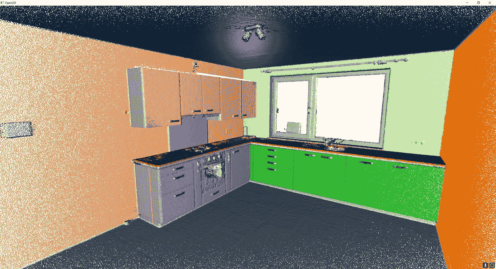**

**RANSAC 点云分割的多次迭代过程的结果。F. Poux**

**哈！我们认为我们完成了…但是我们做到了吗？你注意到这里有些奇怪吗？如果你仔细观察，会发现一些奇怪的人工制品，比如实际切割一些平面元素的“线条”。为什么？🧐**

**事实上，因为我们独立于点密度连续性将所有点拟合到 RANSAC 平面候选(其在欧几里得空间中没有限制范围),所以我们具有取决于平面被检测的顺序的这些“线”假象。所以下一步是防止这种行为！为此，我建议在迭代过程中包含一个基于欧几里得聚类的条件，以在连续的聚类中提炼内层点集。准备好了吗？**

## **使用 DBSCAN 对多 RANSAC 循环进行明智的细化**

**为此，我们将依赖于 DBSCAN 算法。让我详细说明一下逻辑过程，但不要这么简单(激活野兽模式👹).在前面定义的 for 循环中，我们将在内联程序(`segments[i]=rest.select_by_index(inliers)`)赋值后运行 DBSCAN，方法是在其后添加以下代码行:**

```
labels = np.array(segments[i].cluster_dbscan(eps=d_threshold*10, min_points=10))
```

**🤓 ***注*** *:* 我其实是在 RANSAC 平面搜索的初始阈值函数中设置了ε，有 10 倍的量级高。这不是深奥的科学，这是一个纯粹的经验选择，但它通常工作得很好，并通过参数使事情变得更容易😀。**

**然后，在这个循环中，我们将使用一种奇怪的符号来计算我们发现的每个聚类包含多少个点，这种符号利用了列表理解。然后将结果存储在变量`candidates`中:**

```
candidates=[len(np.where(labels==j)[0]) for j in np.unique(labels)]
```

**现在呢？我们必须找到“最佳候选”，通常是拥有更多点的集群！对于这一点，下面是这条线:**

```
best_candidate=int(np.unique(labels)[np.where(candidates== np.max(candidates))[0]])
```

**好吧，这里有很多技巧，但本质上，我们使用 Numpy 熟练度来搜索并返回属于最大聚类的点的索引。从这里开始，就是下坡滑雪，我们只需要确保在考虑后续 RANSAC 迭代时，每次迭代都添加最终剩余的集群(🔥句子要读 5 遍才能消化):**

```
rest = rest.select_by_index(inliers, invert=True) + segments[i].select_by_index(list(np.where(labels!=best_candidate)[0]))
segments[i]=segments[i].select_by_index(list(np.where(labels== best_candidate)[0]))
```

**🤓 ***注意****:*`rest`变量现在确保保存来自 RANSAC 和 DBSCAN 的两个剩余点。当然，现在内联器被过滤为原始 RANSAC 内联器集中存在的最大集群。**

**当循环结束时，您会得到一组清晰的线段，这些线段包含遵循平面形状的空间连续点集，如下所示。**

**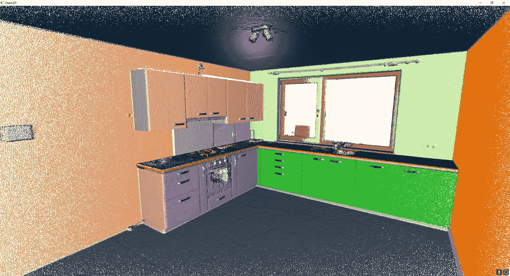**

**注意，我们已经解决了“线”的问题，但是我们仍然有一些灰色的元素，它们还没有被赋值。F. Poux**

**但这就结束了吗？不，从来没有😄！最后一步！**

## **使用 DBSCAN 聚类剩余的 3D 点**

**最后，我们走出循环，处理 rest 中存储的尚未归属于任何段的剩余元素。为此，一个简单的欧几里德聚类(DBSCAN)应该可以做到这一点:**

```
labels = np.array(rest.cluster_dbscan(eps=0.05, min_points=5))
max_label = labels.max()
print(f"point cloud has {max_label + 1} clusters")colors = plt.get_cmap("tab10")(labels / (max_label if max_label > 0 else 1))
colors[labels < 0] = 0
rest.colors = o3d.utility.Vector3dVector(colors[:, :3])
```

**我使用和以前一样的方法，没有魔法！我只是确保使用连贯的参数有一个完善的聚类，以获得美丽的彩虹厨房你一直梦想在🥳！**

**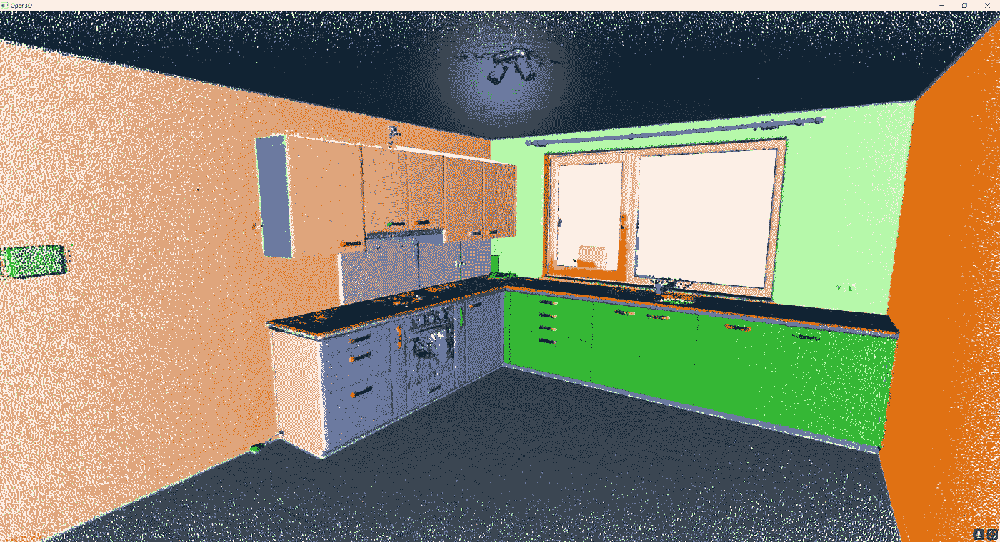**

**这是当前方法的最终聚类结果！祝贺您实现了基于平面的顶级元素检测，您现在可以将其作为更高视觉过程的基础进行操作！F. Poux**

**如果你想让它直接工作，我还创建了一个 Google Colab 脚本，你可以在这里访问:[到 Python Google Colab 脚本](https://colab.research.google.com/drive/1Aygn6FxLsxYC0zOV_Rwk0CIMGOCdRw32?usp=sharing)。**

# **结论**

**热烈祝贺🎉！您刚刚学习了如何使用不同的策略，为由数百万个点组成的 3D 点云导入和开发自动分割和可视化程序！真心的，干得好！但是，这条道路当然不会就此结束，因为您刚刚释放了智能过程的巨大潜力，这些智能过程可以在段级别进行推理！**

**未来的帖子将深入探讨点云空间分析、文件格式、数据结构、对象检测、分割、分类、可视化、动画和网格划分。我们将特别关注如何管理大点云数据，如下文所述:**

**</the-future-of-3d-point-clouds-a-new-perspective-125b35b558b9>  

我的贡献旨在浓缩可操作的信息，以便您可以从零开始为您的项目构建 3D 自动化系统。您可以从今天开始，在[地理数据学院](https://learngeodata.eu/)开始。

<https://learngeodata.eu/point-cloud-processor-formation/>  

# 更进一步

存在用于点云的其他高级分割方法。这实际上是我深入参与的一个研究领域，你已经可以在文章[1–6]中找到一些设计良好的方法。对于更高级的 3D 深度学习架构，一些综合教程即将推出！

1.  **福克斯**、&比伦(2019)。基于体素的三维点云语义分割:无监督的几何和关系特征与深度学习方法。 *ISPRS 国际地理信息杂志*。8(5), 213;[https://doi.org/10.3390/ijgi8050213](https://doi.org/10.3390/ijgi8050213)—杰克·丹格蒙德奖([链接到新闻报道](https://www.geographie.uliege.be/cms/c_5724437/en/florent-poux-and-roland-billen-winners-of-the-2019-jack-dangermond-award))
2.  **Poux，F.** ，纽维尔，r .，纽约州，g .-a .&比伦，R. (2018)。三维点云语义建模:室内空间和家具的集成框架。*遥感*、 *10* (9)、1412。[https://doi.org/10.3390/rs10091412](https://doi.org/10.3390/rs10091412)
3.  **Poux，F.** ，Neuville，r .，Van Wersch，l .，Nys，g .-a .&Billen，R. (2017)。考古学中的 3D 点云:应用于准平面物体的获取、处理和知识集成的进展。*地学*， *7* (4)，96。[https://doi.org/10.3390/GEOSCIENCES7040096](https://doi.org/10.3390/GEOSCIENCES7040096)
4.  Poux，F. ，Mattes，c .，Kobbelt，l .，2020 年。室内三维点云的无监督分割:应用于基于对象的分类，摄影测量、遥感和空间信息科学国际档案。第 111-118 页。[https://doi:10.5194/ISPRS-archives-XLIV-4-W1-2020-111-2020](https://doi:10.5194/isprs-archives-XLIV-4-W1-2020-111-2020)
5.  Poux，F. ，Ponciano，J.J .，2020。用于 3d 室内点云实例分割的自学习本体，ISPRS 摄影测量、遥感和空间信息科学国际档案。第 309-316 页。[https://doi:10.5194/ISPRS-archives-XLIII-B2-2020-309-2020](https://doi:10.5194/isprs-archives-XLIII-B2-2020-309-2020)
6.  巴西耶，男，维高温，男，**普克斯，女，**，(2020)。用于建筑物内部分类的点云和网格特征。*遥感*。12, 2224.[https://doi:10.3390/RS 12142224](https://doi:10.3390/rs12142224)**