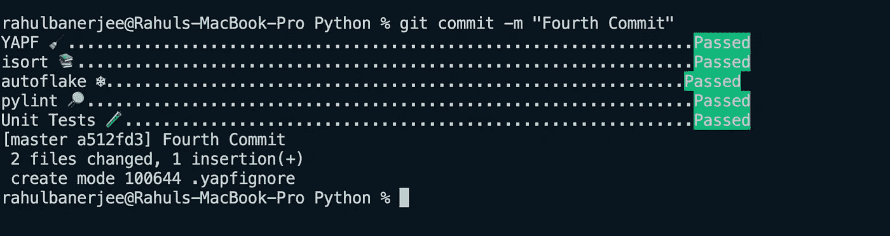

# 如何在 Python 中自动化格式化和林挺

> 原文：<https://towardsdatascience.com/how-to-automate-formatting-and-linting-in-python-ce99d2db9c37?source=collection_archive---------25----------------------->

## 永远不要再犯错误的代码


照片由 [Fotis Fotopoulos](https://unsplash.com/@ffstop?utm_source=unsplash&utm_medium=referral&utm_content=creditCopyText) 在 [Unsplash](https://unsplash.com/s/photos/script?utm_source=unsplash&utm_medium=referral&utm_content=creditCopyText) 上拍摄

我们将查看一些包来格式化、lint、测试我们的代码，然后创建一个预提交钩子来自动化这个过程。[这篇由](/an-overview-of-the-pep-8-style-guide-5672459c7682)[丹·鲁特](https://medium.com/u/9f5a1cb77de?source=post_page-----ce99d2db9c37--------------------------------)撰写的文章是对 PEP 8 风格指南的一个很好的概述。

在我们讨论将要使用的包之前，让我们先来看看将要使用的 python 文件

我们有一个函数叫做 helpers.py

帮助者. py

它有简单的算术功能。所有函数都接受两个参数，并对它们执行算术运算。

我们有另一个名为 tester_helpers.py 的文件

tester_helpers.py

这个文件只是测试我们之前定义的函数。它使用 assert 进行简单的相等检查。

现在让我们看看我们将使用的包。

# 测试🧪

# 7.7k+ ⭐️

这个包帮助我们运行单元测试。需要记住的一个要求是，包含单元测试的 python 文件应该以“test_”开头。

仅支持 assert 语句。要安装软件包

```
pip install pytest
```

若要运行单元测试，请键入以下命令

```
pytest test_helpers.py
```

如果您的所有测试都通过了，您应该会看到类似的输出

```
test_helpers.py ....             [100%]========= 4 passed in 0.01s ===========
```

如果您得到一个与多个相对导入相关的错误

```
astroid.exceptions.TooManyLevelsError:
```

这可能是 pytest 的一个依赖项的问题。你必须卸载 astroid，然后重新安装。这确保安装了最新的 astroid 版本。

```
pip uninstall astroid
pip install astroid
```

在这之后，我们必须卸载 pytest 并安装 pytest

```
pip uninstall pytest
pip install pytest
```

# 格式化✍️

# YAPF 12k+ ⭐️

这是由 google 开发的，支持就地格式化。要安装软件包

```
pip install yapf
```

要格式化文件，请键入以下内容

```
yapf --in-place *.py
```

这将格式化您所有的顶级 python 文件，如果您还想包含文件夹，您可以使用以下命令

```
yapf --in-place **/*.py
```

但是，这也包括我们的虚拟环境文件夹。要忽略 venv 文件夹，只需创建一个文件。yapfignore 然后加上 venv。

注意:此命令可能需要一些时间来运行。您可以使用文件夹的特定名称来代替' ** '。

# [isort](https://github.com/PyCQA/isort) 4.1k+ ⭐️

这个包对您的 import 语句进行排序，以确保它们遵循 pep8 规则。

进口应按以下顺序分组:

*   标准库导入。
*   相关第三方进口。
*   特定于本地应用程序/库的导入。

isort 对 import 语句进行重新排序，以确保遵循上述规则。
安装软件包

```
pip install isort
```

运行 isort

```
isort .
```

# [自动对焦](https://github.com/myint/autoflake) 400+⭐️

它有助于消除未使用的导入、变量和对象键。

要安装软件包

```
pip install autoflake
```

运行自动折叠

```
autoflake --in-place --remove-unused-variables --remove-all-unused-imports *.py
```

# 一些其他格式化程序

*   [autopep8](https://github.com/hhatto/autopep8) 3.9k+ ⭐️
*   [黑色](https://github.com/psf/black) 22.1k+ ⭐️

# 林挺🔎

# 皮林特 3.5k+ ⭐️

pylint 确保您的代码遵循 pep8 规则和标准。它给每个 python 文件打满分(也可以给你一个负分)

要安装软件包

```
pip install pylint
```

运行棉绒机

```
pylint --fail-under=7 *.py
```

参数`--fail-under`是下限，如果任何文件的分数低于下限，将返回一个错误。

# 提交前挂钩🪝

# 什么是 Git 挂钩？

Git 挂钩基本上是在重要操作发生之前触发的脚本，例如，在提交之前，在提交之后将代码推送到 repo 之前，等等。你可以在[这里](https://git-scm.com/book/en/v2/Customizing-Git-Git-Hooks)了解更多关于 Git 钩子和不同种类钩子的知识。

[Enrique lópez-Maas](https://medium.com/google-developer-experts/using-git-hooks-to-improve-your-development-workflow-8f5a1fb81ec7)的这篇文章也是了解更多关于 git 钩子的好文章。

我们将重点关注预提交挂钩。预提交挂钩是在提交之前运行的挂钩。

首先，让我们安装软件包

```
pip install pre-commit
```

现在，我们将生成一个示例预提交钩子 YAML 文件，稍后我们将编辑它。

```
pre-commit sample-config
```

现在让我们添加我们的钩子

```
pre-commit install
```

现在，在每次提交之前，我们的 YAML 文件中定义的预提交钩子将被执行。

现在让我们更新我们的 YAML 文件。
删除所有内容，仅保留以下内容

```
repos:
    - repo: local
      hooks:
```

我们将在 YAML 文件的`hooks:`下添加我们的插件(包)。下面是插件的一般语法

```
- id: (unique id of hook)
     name: (name to be displayed in terminal)
     entry: (command to excute)
     language: system (for our case, always system) 
     always_run: true (if true, it will always run)
     pass_filenames: true (if true, hook will have access to the file name)
```

让我们为 YAPF 定义一个示例插件

```
- id: YAPF 
     name: YAPF 🧹
     entry: zsh -c 'yapf --in-place *.py'
     language: system
     always_run: true
     pass_filenames: true
```

如果您使用的是 bash 或 windows，请用 bash 替换“entry”中的 zsh。

所有其他插件都非常相似，下面是整个 YAML 文件和所有插件

Git 预提交钩子来自动化 Python 中的林挺和格式化

> *每当您更新您的 YAML 文件时，您必须使用 git add 将该文件添加到临时区域。或者 git add。预提交配置. yaml*

下面是一个成功的提交



行动中的预提交

# 结论

设置预提交挂钩将确保您的代码遵循 pep8 标准并且格式正确。我希望这篇文章对你有用。在 [LinkedIn](https://www.linkedin.com/in/rahulbanerjee2699/) ， [Twitter](https://twitter.com/rahulbanerjee99) 上加我

> 最初发布于[realpythonproject.com](https://www.realpythonproject.com/how-to-automate-formatting-and-linting-in-python/)