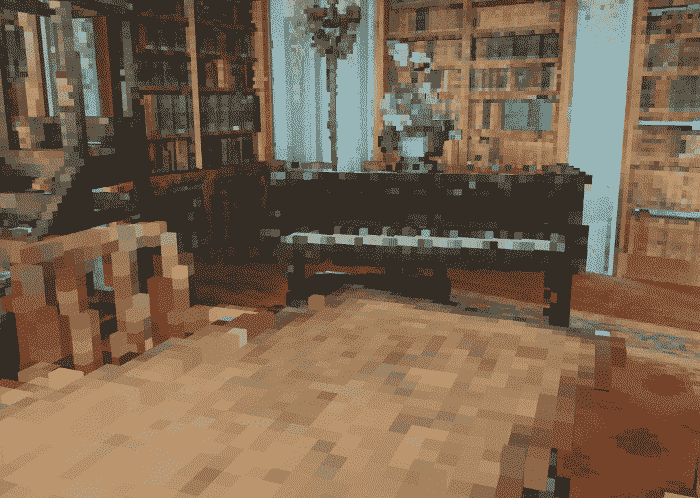

# 如何用 Python 实现三维点云体素建模的自动化

> 原文：<https://towardsdatascience.com/how-to-automate-voxel-modelling-of-3d-point-cloud-with-python-459f4d43a227?source=collection_archive---------2----------------------->

## [实践教程](https://towardsdatascience.com/tagged/hands-on-tutorials)，3D Python

## 使用 Python 和 open3D 将大型点云转化为 3d 体素🧊的实践教程。解锁自动化工作流程，实现高效的 3D 体素化


体素 3D 模型，当前开源 python 教程的成果。它是从文章中可访问的大点云中自动提取的。F. Poux

如果我们有一种快速的方法将从现实中捕捉到的点云转换成 3D 网格会怎么样？如果这些 3D 网格是一个基于体素的集合会怎么样呢？这是有道理的吗？这对你的创作或专业目的有什么帮助？🤔

在探索 python 自动化技巧和窍门之前，让我们先从一个小小的乐高故事开始吧😎。

# 一个快速的乐高、体素和点云故事

好吧，如果你的童年是在乐高(现在的《我的世界》)的摇篮中度过的，那么腐蚀你应该不会太难😊。你还记得把这些小块组装成 3D 模型有多有趣吗？我们可以用它来创作新的故事或者模拟我们最喜欢的电影。

不，我的目标不是要你买一大堆乐高，而是要吸引这些简单的实体积木的酷感。以及我们能用它们做多少事。


Guillermo Momplet 制作的乐高模型动画示例。

但是与当前的体素谈话有什么实际联系呢？简单地说，体素是 2D 像素的 3D 模拟(有人说是 3D 像素，但这听起来很奇怪)。这是一种构造最初无序的 3D 数据集(如点云)的简单方法。然后你得到这个原始积木的组合，它可以很容易地与乐高组合连接起来。除了物理和数字属性之外，主要区别是😊—体素只能玩一种类型的基础元素(立方体🧊)，而 Legos 允许您玩不同维度的各种块。但是如果我们从理论上采用多尺度的观点和推理，正如达索系统公司所说，空间公司在[来源](https://blog.spatial.com/the-main-benefits-and-disadvantages-of-voxel-modeling):

> 体素是复制现实的完美建模技术，可以远远超出我们的想象。


示出多尺度视图允许用适应的细化来表示捕捉世界几何图形的基础数据。F. Poux

事实上，我们的 3D 世界是由超微小体素可以大量逼近的物质组成的。因此，如果你有足够高的密度和适当的渲染技术:

> 您可以使用体素来复制现实世界中无法从外观和行为上与真实事物区分开来的对象。

与原始点云相比，这是一个显著的优势:你可以模拟现实世界的物理现象，而这在其他建模方法中是不可能的，或者是脱发技术😆。


体素可以存储真实的“物质”体积。因此，它们可以方便地开启新的模拟技术，而用其他方法可能会很棘手。F. Poux

💡**提示** : I *如果你想更好地理解如何表示 3D 数据以及每种方法之间的技术差异，我鼓励你阅读下面的文章。*

[](/how-to-represent-3d-data-66a0f6376afb) [## 如何表示 3D 数据？

### 帮助在 3D 点云、网格、参数模型、深度图、RGB-D……

towardsdatascience.com](/how-to-represent-3d-data-66a0f6376afb) 

Dassault Systèmes，Spatial Corp. [所见的体素作为 3D 表示的主要优势来源](https://blog.spatial.com/the-main-benefits-and-disadvantages-of-voxel-modeling)

现在你是一个真正的被破坏的体素🥑，是时候动手学习如何以自动化的方式将 3D 点云快速转化为体素集合了。准备好了吗？

[](https://learngeodata.eu/point-cloud-processor-formation/) [## 点云处理在线课程- 3D 地理数据学院

### 编队学习先进的点云处理和三维自动化。开发新的 python 地理数据技能和开源…

learngeodata.eu](https://learngeodata.eu/point-cloud-processor-formation/) 

# 步骤 1:编码选择

免责声明:当编码解决一个确定的问题时，没有一个唯一的方向。我给你的解决方案依赖于一些聪明的技巧，使用`open3d`和可用的函数栈。但是，如果您希望依赖最少数量的库，您也可以遵循下面的文章，将体素采样策略调整为体素创建策略。

[](/how-to-automate-lidar-point-cloud-processing-with-python-a027454a536c) [## 如何使用 Python 自动处理激光雷达点云

### 使用 Python 从头开始点云子采样的终极指南。它涵盖了激光雷达输入/输出，三维体素网格处理…

towardsdatascience.com](/how-to-automate-lidar-point-cloud-processing-with-python-a027454a536c) 

在本教程中，我们将只依赖于三个函数库:`laspy` ( `pip install laspy`)、`open3d` ( `conda install -c open3d-admin open3d`)和`numpy` ( `conda install numpy`)，python 版本为 3.8。为此，这三行简单的代码:

```
import laspy as lp
import numpy as np
import open3d as o3d
```

🤓 ***注*** *:* 当前实验运行使用 Python 3.8.12，`laspy`版本:2.0.3，`numpy`版本 1.21.2，`open3d`版本 0.11.2。这样，如果需要调试，您就可以先做一些检查:)。

很好，现在剩下的就是确定一个我们想要体素化的点云。幸运的是，我为您创建了一个非常好的文件，您可以从我的驱动器文件夹中检索到它:[下载数据集(。las)](https://drive.google.com/file/d/1Zr1y8BSYRHBKxvs_nUXo2LSQr2i5ulgj/view?usp=sharing) ，或使用 Flyvast 在您的[网络浏览器中可视化。](https://www.flyvast.com/flyvast/app/page-snapshot-viewer.html#/416/9cd9ef26-564b-668a-617c-6fefb013c003)


提供的点云进行 python 教程。F. Poux

设置完成后，我们就可以开始在我们的环境中加载数据了。

💡**提示** : I *如果您是从零开始，并且想要按照一个食谱在 5 分钟内启动并运行 Python，我建议您遵循下面这篇文章，它给出了设置您的环境的所有细节。如果您不想安装任何东西，您也可以使用我在文章结尾提供的 Google Colab 笔记本在云上运行它。*

[](/discover-3d-point-cloud-processing-with-python-6112d9ee38e7) [## 使用 Python 探索 3D 点云处理

### 教程简单地设置 python 环境，开始处理和可视化 3D 点云数据。

towardsdatascience.com](/discover-3d-point-cloud-processing-with-python-6112d9ee38e7) 

# 步骤 2:加载数据

首先，我们创建两个变量来处理输入路径(您应该适应您的情况)和数据名称，如下所示:

```
input_path=”C:/DATA/”
dataname=”heerlen_table.las”
```

现在，是时候在我们的程序中加载数据了。我们首先将点云作为一个`laspy.lasdata.LasData`存储在一个`point_cloud`变量中。

```
point_cloud=lp.read(input_path+dataname)
```

然后，为了使用存储在`point_cloud`变量中的数据，我们将把它转换成`open3d`点云格式。如果你还记得以前的教程，我们从空间坐标(X，Y 和 Z)中分离出什么是颜色。

```
pcd = o3d.geometry.PointCloud()
pcd.points = o3d.utility.Vector3dVector(np.vstack((point_cloud.x, point_cloud.y, point_cloud.z)).transpose())
pcd.colors = o3d.utility.Vector3dVector(np.vstack((point_cloud.red, point_cloud.green, point_cloud.blue)).transpose()/65535)
```

🤓**注** : *仔细看，可以看到一个怪异的* `*65535*` *。这是因为，在* `*laspy*` *格式中，颜色是以 16 位无符号方式编码的整数，这意味着数字范围从* `*0*` *到* `*+65535*` *，我们希望缩放到一个* `*[0,1]*` *区间。这些数学猎人有多疯狂*😆*？*

# 步骤 3:创建体素网格

我们有一个点云，我们想要拟合一个体素立方体的集合来近似它。为此，我们实际上只在已建立的 3D 网格上有点的部分生成体素。


为了获得体素单元，我们首先需要计算点云的边界框，它界定了数据集的空间范围。只有到那时，我们才能将边界框离散化成一个由小的 3D 立方体组成的集合:体素。

在我们的例子中，如果切换输入点云，我们将简单地通过给出与初始边界框相关的相对值来计算体素大小，以“概括”该方法。为此，您可以在下面看到，我们提取点云的边界框，我们取最大的边，我们决定将体素大小设置为其值的 0.5%(这是绝对任意的)。最后，我们将获得的值向上舍入到 4 位数，而不会遭受此后不精确的计算。

```
v_size=round(max(pcd.get_max_bound()-pcd.get_min_bound())*0.005,4)
voxel_grid=o3d.geometry.VoxelGrid.create_from_point_cloud(pcd,voxel_size=v_size)
```

🤓**注意** : *这可能是我写的最不明确的代码行之一，但是它给出了一个很好的例子，说明快速的经验陈述可以实现什么。这方面有很多可以改进的地方，特别是在舍入误差和任意阈值方面。*😉


使用建议值和将改变细节层次的其他值在数据集上获得的结果示例。F. Poux

现在我们已经定义了我们的体素单元，我们将实际上切换到一个与空间信息相关的更有效的“表示”，但是更有效:一个二进制表(`False`或`True`、`0`或`1`)。为此，使用`open3d`的第一个技巧是使用以下命令行生成体素网格:

```
voxel_grid=o3d.geometry.VoxelGrid.create_from_point_cloud(pcd,voxel_size=v_size)
```

太棒了，你现在是你的点云的体素表示的所有者，你可以可视化(如果在 jupyter 环境之外)与:

```
o3d.visualization.draw_geometries([voxel_grid])
```



我们的 voxel_grid 变量在`open3d`中可视化。每个非空的体素保存从基础点平均的颜色信息。F. Poux

这太棒了！但是，如果我们就此止步，我们将陷入最小的利用范围。实际上，在那里你将被限制使用`open3d`库来处理体素结构，使用有限数量的函数，这取决于你的需要，是否适合你的应用。因此，让我们深入研究从这个数据结构创建 3D 网格的过程😆，我们可以以开放格式导出它。ply 或者。obj)并加载到其他软件中，包括 MeshLab、Blender、CloudCompare、MagickaVoxels、Unity、Unreal Engine 等等。

# 步骤 4:生成体素立方体(3D 网格)

现在我们有了`voxel_grid`，我们将提取填充的体素，以便有可能在以后将它们用作独立的实体。

```
voxels=voxel_grid.get_voxels()
```

如果我们检查新的`voxels`变量看起来像什么；我们得到一个包含保存体素信息的`open3d.cpu.pybind.geometry.Voxel`类型的列表:`Voxel with grid_index: (19, 81, 57), color: (0.330083, 0.277348, 0.22266)`。

好的，我们将把它转换成一个 3D 立方体网格的集合(8 个顶点和 12 个三角形描述了 6 个面)。看到我们试图达到的目的了吗🙃？首先，让我们初始化我们的三角形网格实体，它将包含这个立方体组件:

```
vox_mesh=o3d.geometry.TriangleMesh()
```

现在，我们将使用`for v in voxels`迭代所有体素，对于每个体素，我们将生成一个大小为 1 的立方体，存储在变量`cube`中。然后我们用手边的体素颜色对它进行着色，最后我们使用方法`grid_index`提供的索引将体素定位在网格上。最后，我们用`vox_mesh+=cube`将我们新着色和定位的立方体添加到网格实体中。

```
for v in voxels:
   cube=o3d.geometry.TriangleMesh.create_box(width=1, height=1,
   depth=1)
   cube.paint_uniform_color(v.color)
   cube.translate(v.grid_index, relative=False)
   vox_mesh+=cube
```

🤓**注意:** *翻译方法将是否应该相对于给定的第一个参数(位置)进行翻译作为一个参数。在我们的例子中，因为我们将其设置为 False，所以第一个参数* `*v.grid_index*` *充当我们系统中的绝对坐标。*


以预定义的体素尺寸点云体素化的 Z 级数的图示。F. Poux

# 步骤 5:导出网格对象。ply 或者。obj)

我们现在有了一个 3D 网格对象，可以进行 I/O 操作了…或者差不多了。事实上，我们仍然处在一个任意整数单位的任意系统中。为了将我们自己定位在由输入点云强加的初始参考框架中，我们必须应用刚性变换(平移、旋转和缩放)来回到原始位置。为了清楚起见，我将这个目标分解成三行代码。🤓

首先，我们将 3D 网格(体素组件)相对平移半个体素单位。这是因为当我们创建初始体素网格时，参考点是体素的最低左点，而不是重心(相对位于单位立方体中的`[0.5,0.5,0.5]`)。

```
vox_mesh.translate([0.5,0.5,0.5], relative=True)
```

然后，我们通过体素大小来缩放我们的模型，以将每个立方体单元转换成它的真实大小。这使用了带有两个参数的 scale 方法。第一个是缩放因子，第二个是缩放时使用的中心。

```
vox_mesh.scale(voxel_size, [0,0,0])
```

最后，我们需要通过使用体素网格原点相对平移来将体素集合平移到其真实的原始位置。

```
vox_mesh.translate(voxel_grid.origin, relative=True)
```


3D 网格来自上面的一组技巧，即基于体素的装配。F. Poux

很好，现在我们有了正确定位的最终立方体组合。一个可选命令是合并闭合顶点。每当我们生成一个立方体时，我们可以处于这样一种配置中，其中一个角顶点与另一个立方角顶点重叠。因此，最好在保留拓扑结构的同时清除这些错误。

```
vox_mesh.merge_close_vertices(0.0000001)
```

最后，🥁，我们管道中的最后一个元素是简单地将我们的`.ply`(或`.obj`取决于你喜欢的扩展名)文件导出到你的操作系统浏览器中选择的文件夹。

```
o3d.io.write_triangle_mesh(input_path+”voxel_mesh_h.ply”, vox_mesh)
```

从那里，您可以自由地在您选择的软件中使用输出文件。如果在导入时，您得到一个旋转的文件，您也可以在 python 代码中添加以下行，并将导出的变量更改为`vox_mesh.transform(T)`:

```
T=np.array([[1, 0, 0, 0],[0, 0, 1, 0],[0, -1, 0, 0],[0, 0, 0, 1]])
o3d.io.write_triangle_mesh(input_path+”4_vox_mesh_r.ply”, vox_mesh.transform(T))
```

这只是简单地创建一个变换矩阵`T`，它定义了绕 Y 轴的逆时针旋转，这通常在一些软件中显示反转的 Z 轴和 Y 轴。这样，如果这种情况发生在你身上，你会有另一个锦囊妙计。

你可以用[这款 Google Colab 笔记本](https://colab.research.google.com/drive/1IKzn--AoTBPhH60Y5A7ldcZuyQB21Eqc?usp=sharing)直接在你的浏览器中访问代码。

# 一些遗言

还记得我们在文章开头称赞过体素的多功能性和简单性吗？嗯，我也想给你们一些视觉上的背景。你将在下面看到在他们的表现上演奏能达到什么。体素的有趣之处在于，你可以得到一个有序的结构，你可以更好地处理它。


点云的体素表示。场景表现为立方体、模具、球体、乐高积木、圆柱体或怪人的组合。F. Poux

当然，这只是您很快就能做的事情的预演。😉

# 结论

您刚刚学习了如何导入点云，将它们转换为体素网格，欺骗系统使它们成为 3D 网格，然后完全自动地导出它们！干得好！有趣的是，能够在 Python 中使用体素也将允许更好地掌握任何点云场景的关系和拓扑，如[2]所示。为了扩展学习之旅的成果，未来的文章将深入探讨体素处理、点云文件格式、3D 数据结构、语义和实例分割[2–4]、动画以及深度学习[1]。我们将研究如何管理大点云数据，如下文所述。

[](/the-future-of-3d-point-clouds-a-new-perspective-125b35b558b9) [## 三维点云的未来:一个新的视角

### 被称为点云的离散空间数据集通常为决策应用奠定基础。但是他们能不能…

towardsdatascience.com](/the-future-of-3d-point-clouds-a-new-perspective-125b35b558b9) 

我的贡献旨在浓缩可操作的信息，以便您可以从零开始为您的项目构建 3D 自动化系统。您可以从今天开始，在[地理数据学院](https://learngeodata.eu/)开始。

[](https://learngeodata.eu/point-cloud-processor-formation/) [## 点云处理在线课程- 3D 地理数据学院

### 编队学习先进的点云处理和三维自动化。开发新的 python 地理数据技能和开源…

learngeodata.eu](https://learngeodata.eu/point-cloud-processor-formation/) 

# 参考

1. **Poux，F.** ，& J.-J Ponciano。(2020).三维室内点云实例分割的自学习本体。*国际摄影测量与遥感学会。拱门。Pho 的。&雷姆。第四十三任——B2，309–316 年；[https://doi . org/10.5194/ISPRS-archives-XLIII-B2–2020–309–2020](http://dx.doi.org/10.5194/isprs-archives-XLIII-B2-2020-309-2020)*

2. **Poux，F.** ，& Billen，R. (2019)。基于体素的三维点云语义分割:无监督的几何和关系特征与深度学习方法。 *ISPRS 国际地理信息杂志*。8(5), 213;[https://doi.org/10.3390/ijgi8050213](https://doi.org/10.3390/ijgi8050213)

3. **Poux，F.** ，纽维尔，r .，纽约，g .-a .&比伦，R. (2018)。三维点云语义建模:室内空间和家具的集成框架。*遥感*、 *10* (9)、1412。[https://doi.org/10.3390/rs10091412](https://doi.org/10.3390/rs10091412)

4. **Poux，F.** ，Neuville，r .，Van Wersch，l .，Nys，g .-a .&Billen，R. (2017)。考古学中的 3D 点云:应用于准平面物体的获取、处理和知识集成的进展。*地学*， *7* (4)，96。[https://doi.org/10.3390/GEOSCIENCES7040096](https://doi.org/10.3390/GEOSCIENCES7040096)