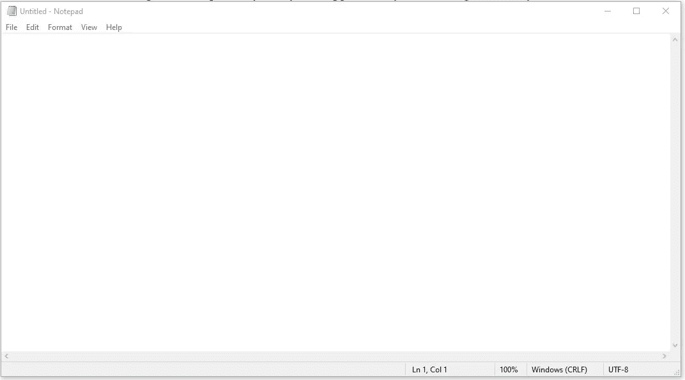
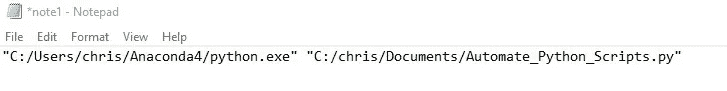
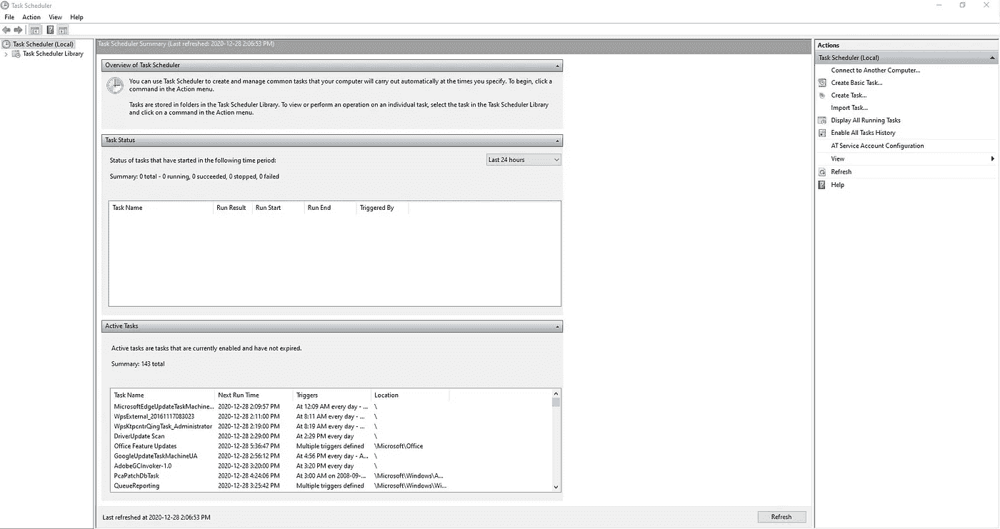
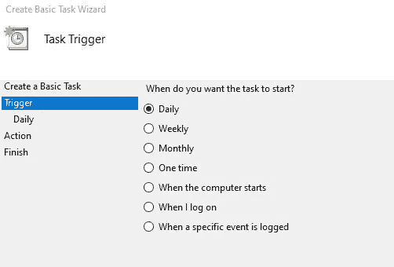
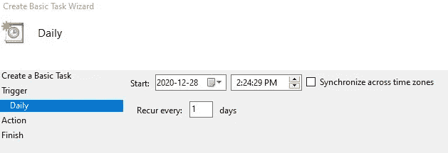
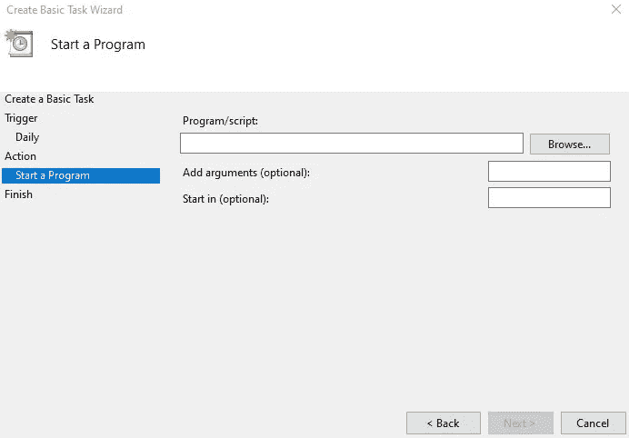

# 如何免费自动化你的 Python 脚本(2021)

> 原文：<https://towardsdatascience.com/how-to-automate-your-python-scripts-for-free-2021-98ac71b0c360?source=collection_archive---------14----------------------->

## 我将向您展示如何将 Python 脚本设置为在每天的特定时间、每周或每月运行

詹姆斯·哈里森从 Unsplash 拍摄的照片

在这篇文章中，我将向你展示如何为**免费自动化你的 Python 脚本。****我之所以强调免费，是因为有很多程序和网站可以在网上为你做这件事，但几乎所有的程序和网站都要求你支付一定的费用来使用它们的应用程序。**

**因为我知道大多数人不想花这种钱，所以我找到了一种免费的独特方法，这样你就可以自动运行你的 Python 脚本，在每天的某个时间，或者每周，或者每月运行。**

**这种独特的方式只涉及 2 个简单的步骤。**

# **1.为 Python 脚本创建批处理文件**

**批处理文件是按顺序处理的命令列表，通常不需要用户输入或干预。要为想要自动化的 Python 脚本创建批处理文件，您需要两条信息。**

1.  **Python 应用程序的文件路径**
2.  **Python 脚本的文件路径**

**我们需要这两条信息，因为批处理文件首先转到我们的 Python 应用程序和启动 Python 的文件路径。然后，它将转到我们的 Python 脚本的文件路径，并在启动的 Python 应用程序中运行该 Python 程序。**

**要获取 Python 应用程序的文件路径，您需要从最初安装 Python 时开始，转到 Python 在文件中的保存位置。您应该在寻找类似这样的文件。**

****

**它还应该有扩展名 python.exe。为了举例说明文件路径应该是什么样子，这是我的 Python 应用程序的文件路径。**

*   **c:\ Users \ Chris \ Anaconda4 \ python . exe**

**获得该文件路径后，您需要获得想要自动化的 Python 脚本的文件路径。这应该更容易找到，我将向您展示一个我的文件路径的例子。**

*   **c:\ Chris \ Documents \ Automate _ Python _ script . py**

**当你有了这两条信息后，你就需要打开你的记事本，通过你的搜索栏就可以进入。它看起来会像这样..**

****

**然后你所要做的就是复制你的两个文件路径，并把它们粘贴到记事本的同一行，中间留有空格。然后，您必须在两个文件路径周围加上引号(“这些是引号”)，如果斜线还没有从\改为/的话，请确保将它们更改为。最后，这是你的第一行在记事本中的样子…**

****

**在这一行被输入到记事本后，保存记事本，但是你必须改变它给你的扩展名。txt 到**。bat** 创建一个批处理文件。假设我想把这个记事本保存为 note1，你可以把它保存为..**

*   **注 1 .蝙蝠**

**如果你做的一切都是正确的，你的记事本现在应该以 Windows 批处理文件的形式出现，如下…**

****

# **2.在任务计划程序中设置任务**

**为 Python 脚本正式创建批处理文件后，现在需要在任务调度器中创建一个任务。**

**任务计划程序是一个应用程序，你的电脑应该有你的电脑每天运行的所有任务。要访问它，它类似于记事本，因为它应该可以通过您的搜索栏访问。如果你打开了正确的应用程序，它应该是这样的...**

****

**要创建新任务，只需在页面右上角的操作选项卡中单击创建基本任务。然后它会要求你为这个任务取一个名字，你可以写任何东西。**

**要完成创建任务，您需要选择这个新任务的触发器和动作。触发器就是您希望任务开始的时间。**

****

**如上图所示，你可以选择每天、每周、每月、电脑启动时触发任务。如果您选择每日、每周或每月，您将转到这些选项设置，在那里您可以设置任务运行的特定时间。**

****

**在这里，您可以选择希望任务运行的具体时间**

**设置好时间后，你可以按下 next，进入 action，它会问你“你希望任务执行什么操作”。选择启动程序，然后单击下一步按钮。你现在应该在一个像这样的窗口上...**

****

**这是最后一步，您将选择任务应该运行的程序。同样，我们要运行的程序是我们创建的批处理文件，因此单击 browse 按钮并选择该文件。完成后，您就完成了，可以按“完成”按钮。**

****恭喜你！如果你做的一切都正确，你的 Python 程序应该会在你设置的日期和时间自动运行。****

# **迷茫？想看这篇文章的视频吗**

**如果你在阅读这篇文章的时候有一些困惑，你应该看看我在 YouTube 频道上发布的**一步一步的**教程。**

# **克里斯多夫·唐小蓝**

*   ***如果你喜欢这个，* [*跟我上 Medium*](https://christopherzita.medium.com/) *了解更多***
*   ***订阅我的 Youtube 频道:* [*克里斯多夫·唐小蓝*](https://www.youtube.com/channel/UCYmlPeN_h-eD_Ot59rUXViw) *获取各种数据科学主题的每周内容***
*   ***让我们连线上*[*LinkedIn*](https://www.linkedin.com/in/christopher-zita/)**