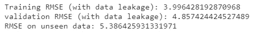
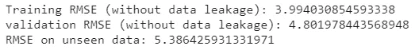

# 在评估机器学习模型的性能时如何防止数据泄漏

> 原文：<https://towardsdatascience.com/how-to-avoid-data-leakage-while-evaluating-the-performance-of-a-machine-learning-model-ac30f2bb8586?source=collection_archive---------25----------------------->

## 本文讨论了在评估模型性能时的数据泄漏问题以及避免数据泄漏的方法。

图片由[克里斯里德](https://unsplash.com/@cdr6934?utm_source=medium&utm_medium=referral)在 [Unsplash](https://unsplash.com/?utm_source=medium&utm_medium=referral) 上拍摄

当来自训练集的数据传递到验证/测试集时，模型评估期间会发生数据泄漏。这导致模型对验证/测试集的性能估计有偏差。让我们通过一个使用 Scikit-Learn 的“波士顿房价”数据集的例子来理解它。数据集没有缺失值，因此，为了更好地演示数据泄漏，随机引入了 100 个缺失值。

作者图片

在上面的代码中，“X_train”是训练集(用于 k-fold 交叉验证),而“X_test”用于对看不见的数据进行模型评估。上述代码是一个带有数据泄漏的模型评估示例，其中，用于估算缺失值的模式(strategy = ' most _ frequent ')是在“X_train”上计算的。同样，用于缩放数据的平均值和标准偏差也是使用“X_train”计算的。在 k 倍交叉验证之前，对 X_train 的缺失值进行估算，并对“X_train”进行缩放。

在 k 折叠交叉验证中，“X_train”被分成“k”个折叠。在 k 折叠交叉验证的每次迭代中，其中一个折叠用于验证(姑且称之为验证部分)，其余折叠用于训练(姑且称之为训练部分)。每次迭代中的训练和验证部分已经使用“X_train”上计算的模式估算了缺失值。同样，它们已经使用“X_train”上计算的平均值和标准偏差进行了缩放。这种插补和缩放操作导致来自“X_train”的信息泄漏到 k 倍交叉验证的训练和验证部分。这种信息泄漏可能导致验证部分的模型的有偏差的性能估计。下面的代码显示了一种通过使用管道来防止它的方法。

作者图片

在上面的代码中，我们在管道中包含了估算器、缩放器和回归器。在这种情况下,“X_train”被分成五份，在每次迭代中，管道使用训练部分来计算用于估算训练和验证部分中缺失值的模式。类似地，用于缩放训练和验证部分的平均值和标准偏差也在训练部分上计算。这一过程消除了数据泄漏，因为在 k 倍交叉验证的每次迭代中，在训练部分计算插补模式和缩放的均值和标准差。这些值用于估算和缩放 k 重交叉验证的每次迭代中的训练和验证部分。

我们可以看到在有和没有数据泄漏的情况下计算的训练和验证 RMSEs 的差异。由于数据集很小，我们只能看到它们之间的细微差别。对于较大的数据集，这种差异可能会很大。验证 RMSE(有数据泄漏)在看不见的数据上更接近 RMSE 只是偶然的。

因此，使用管道进行 k-fold 交叉验证可以防止数据泄漏，并对模型在看不见的数据上的性能提供更好的估计。