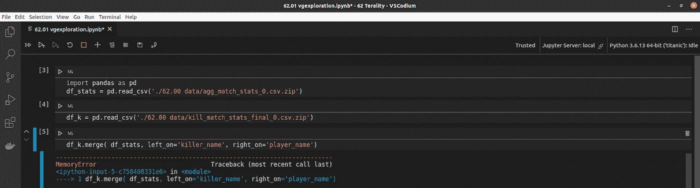
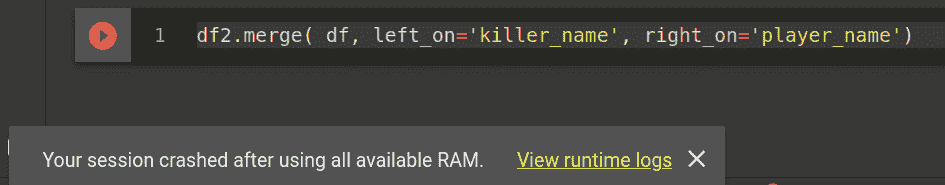
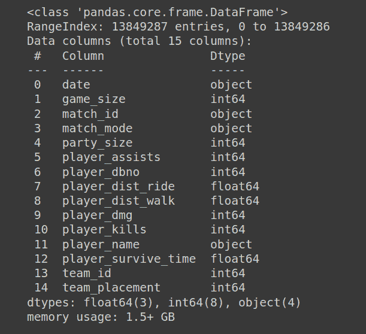
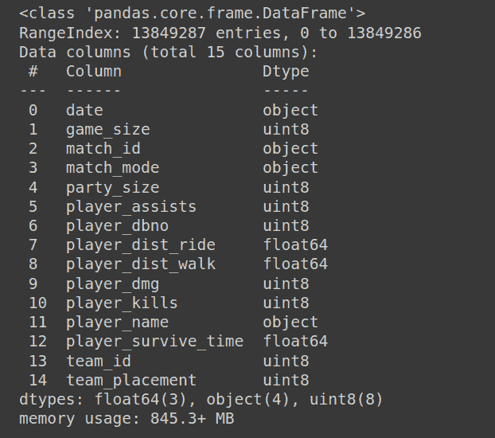
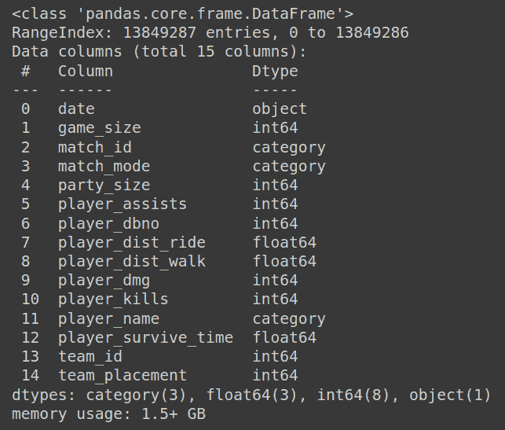
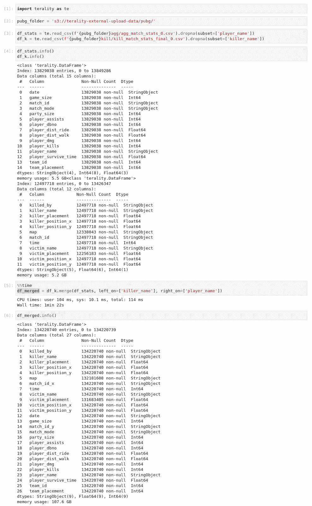

# 如何避免熊猫的记忆错误

> 原文：<https://towardsdatascience.com/how-to-avoid-memory-errors-with-pandas-22366e1371b1?source=collection_archive---------0----------------------->

## 使用中型和大型数据集时缩放熊猫的一些策略

斯蒂芬妮·克莱帕奇在 [Unsplash](https://unsplash.com?utm_source=medium&utm_medium=referral) 上拍摄的照片

**TL；如果你经常用熊猫耗尽内存或者有代码执行缓慢的问题，你可以通过测试手动方法来自娱自乐，或者你可以使用 [Terality](https://www.terality.com/) 在 5 分钟之内解决它。我不得不艰难地发现这一点。**

# 上下文:探索未知数据集

最近，我打算从一个流行的视频游戏中探索一个包含 720，000 行和 72 列的数据集:这个想法是为了发现玩家的策略中是否有任何一致的模式。但是由于内存错误，我花了更多的时间试图加载数据，而不是实际探索数据。我很清楚数据分析的 80/20 [法则](https://www.ibm.com/cloud/blog/ibm-data-catalog-data-scientists-productivity)，你的大部分时间都花在探索数据上——我对此没意见。我一直认为，一个新的数据集就像探索一个新的国家，有它自己的背景和习俗，你必须破译，以便解释或发现一些模式；但是在这种情况下，我甚至不能开始工作。

作者图片

当我的数据准备好被处理时，我开始遇到一些问题，因为一些熊猫功能需要比我的机器可用的内存更多的内存来运行。例如，当我想对一列进行排序时，内存不足。鉴于这不是我第一次遇到这种情况，我应用了常用的技术来解决这个问题。首先，我将解释在我发现 Terality 之前我试图做什么来解决这个问题。

# 策略 1:加载较少的数据(子采样)

解决这类问题的一个策略是通过减少数据集中的行数或列数来减少数据量。然而，在我的例子中，我只加载了 20%的可用数据，所以这不是一个选项，因为我会在我的数据集中排除太多重要的元素。

# 策略 2:垂直扩展

如果您不能或不应该使用更少的数据，并且您有缺乏资源的问题，您有两个选择:纵向扩展，这意味着向您的环境添加更多的物理资源(在这种情况下是更多的 RAM )(即在一台更大的计算机上工作),或者横向扩展，这意味着将问题分配到几个更小的、协调的实例中。垂直缩放更容易，因为你只需将 [*插入*新硬件*并以与之前相同的方式玩*](https://www.urbandictionary.com/define.php?term=plug%20and%20pray) ，只是更快更好。

我以前使用 Google Colab 作为我的默认选项来垂直扩展我的资源。它提供了一个类似 Jupyter 的环境，免费提供 12GB 的 RAM，对时间和 GPU 的使用有一些限制。由于我还不需要执行任何建模任务，只需要一个简单的 *Pandas* 探索和一些转换，这看起来是完美的解决方案。但是不行，熊猫在第一次操作时就耗尽了内存。

作者图片

策略 3:修改数据类型

鉴于垂直扩展还不够，我决定使用一些辅助技术。第一个是通过修改用于映射一些列的数据类型来减小数据集的大小。给定某种数据类型，例如 int64，python 会分配足够的内存空间来存储-9223372036854775808 到 9223372036854775807 范围内的整数。在阅读了数据的描述之后，我将数据类型更改到最小，从而将数据集的大小减少了 35%以上:

作者图片

作者图片

应用这种技术时要小心选择:有些数据类型不会增加内存大小，事实上，它甚至会使情况变得更糟。一个常见的建议是将对象类型改为分类，但是，在我的例子中，它抵消了我以前的收获:

作者图片

# 策略 4:横向扩展

水平扩展，基本上意味着添加更多的机器，将需要我将代码分发到多个服务器上。这是一个棘手的问题，通常由 map-reduce 或 Spark 解决；但是我不知道有什么解决方案可以轻松地为熊猫的代码做到这一点。一些开源解决方案可能会有所帮助，但是它们没有一些 Pandas 的方法，不提供相同的语法，并且它们的范围有限。

当我在谷歌上搜索新的技巧时，我发现了真实度。看起来他们是*街区的新成员*为这类问题提供了一个有趣的替代方案:管理*熊猫*的水平伸缩。换句话说，似乎 Terality 在幕后产生了一个机器集群，将该集群与环境连接起来，并在新的集群中运行代码。这是完美的，因为从分析师的角度来看它是隐藏的，并且不需要用新的硬件升级本地环境来修改数据或代码。或许你可以在这篇中型文章中更好地了解他们的报价。

在一个简单的入职流程之后，我准备测试这种方法。令我惊讶的是，以前在我的本地和 Google Colab 环境中失败的加载和合并操作运行得更快，并且没有任何 Terality 问题。此外，鉴于他们目前处于私人测试阶段，我不需要支付任何费用。Terality 团队对其产品的其他一些大胆声明包括:

*   执行 *Pandas* 代码的速度提高了 100 倍，即使是在大型数据集上
*   全面支持熊猫 API(方法、集成、错误等)。)
*   节省基础设施成本

我的用例不够大，不足以测试所有这些功能，我也不打算在同一领域用其他工具建立一个基准。但是，使用私人测试帐户，我通过 Terality 完美地处理了数据集。您可以在下面的屏幕截图中查看记录的加载和合并时间:

作者图片

除了惊人的速度(超过 100GB 的合并输出需要 1 分 22 秒)之外，唯一的区别是 dataframe 是一个 terality.DataFrame。集成和设置花费了不到五(5)分钟，我只需要从 pypypy 安装他们的客户端库，然后用 import terality as pd 替换 import pandas as pd，其余的代码根本不需要任何更改。最后，使用 Terality 给了我几个好处:

*   超级简单的设置
*   没有学习曲线—不需要更改任何代码
*   即时和无限的可扩展性
*   没有需要管理的基础设施
*   更快的 pandas 执行速度(但是，我需要对此进行基准测试)

我很想通过处理大于几个 GB 的数据集来测试这个工具的局限性，比如像新冠肺炎开放研究数据集这样的大型公共数据集。我的下一步将是测试对 *pandas* 代码执行的 100 倍改进是否是合理的。最后，在没有设置和管理负担的水平集群中运行*熊猫*的想法不仅对独立数据科学家有吸引力，对更复杂的或企业用例也有吸引力。

# 结论

有许多用例有足够的数据要处理，可以打破熊猫的本地或云环境。像许多其他数据科学家一样，我尝试了几种编码技术和工具，然后尝试了一种外部解决方案，获得了更好的结果。你现在应该试试 Terality，看看它是否也是解决你的*熊猫*记忆错误的合适工具。你只需要在他们的网站上联系他们的团队[，他们会指导你完成整个过程。](http://terality.com)