# 如何在 Python 中平衡数据集

> 原文：<https://towardsdatascience.com/how-to-balance-a-dataset-in-python-36dff9d12704?source=collection_archive---------0----------------------->

## 性能改进

## 不平衡学习 Python 包的快速教程

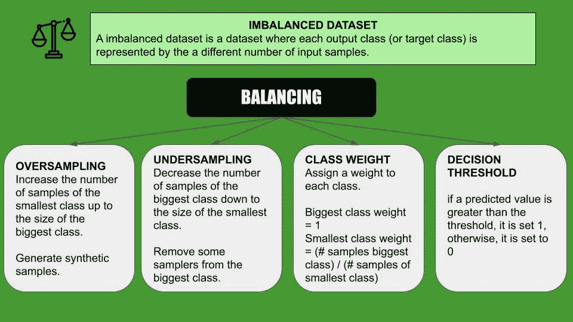

作者图片

本教程属于系列[如何提高一个机器学习算法的性能](/how-to-improve-the-performance-of-a-supervised-machine-learning-algorithm-c9f9f2705a5c)。在本教程中，我处理平衡。平衡数据集是指每个输出类(或目标类)由相同数量的输入样本表示的数据集。可以通过利用以下技术之一来执行平衡:

*   采样过密
*   欠采样
*   类别权重
*   门槛。

在本教程中，我使用了`imbalanced-learn`库，它是`scikit-learn`的 contrib 包的一部分。更多详情请点击[此链接](https://github.com/scikit-learn-contrib/imbalanced-learn)。

所有代码都可以在我的 [Github 库](https://github.com/alod83/data-science/tree/master/Preprocessing/Balancing)上找到。

# 数据导入

在本教程中，我使用的是[这个数据集](https://colab.research.google.com/github/littlecolumns/ds4j-notebooks/blob/master/classification/notebooks/Correcting%20for%20imbalanced%20datasets.ipynb#scrollTo=Hmk1qYDOo-t6)，它包含了一些食谱和它们的原产国。

首先，我通过`pandas`库的`read_csv()`函数读取数据集。然后，我通过指定菜肴是否是印度菜来构建目标类。

```
import pandas as pddf = pd.read_csv('[https://nyc3.digitaloceanspaces.com/ml-files-distro/v1/classification/data/recipes.csv'](https://nyc3.digitaloceanspaces.com/ml-files-distro/v1/classification/data/recipes.csv'))
df['is_indian'] = (df.cuisine == "indian").astype(int)
df.head()
```

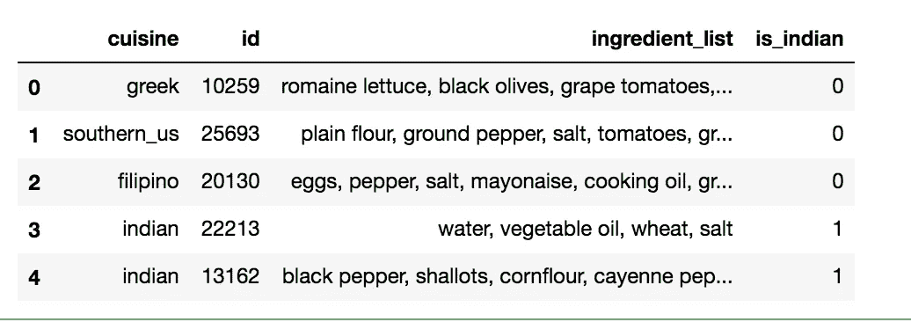

作者图片

我通过`value_counts()`计算每个目标类的记录数。我注意到数据集是不平衡的。

```
df['is_indian'].value_counts()
```

它给出了以下输出:

```
0    36771
1     3003
Name: is_indian, dtype: int64
```

作为输入特征，我使用由配料列表给出的 [TFIDF 值](/tf-idf-explained-and-python-sklearn-implementation-b020c5e83275)的矩阵。

```
from sklearn.feature_extraction.text import TfidfVectorizer
vectorizer = TfidfVectorizer()
matrix = vectorizer.fit_transform(df.ingredient_list)X = matrix
y = df['is_indian']
```

现在，我将数据集分为训练集和测试集。我将测试集的大小设置为整个数据集的 30%。然后，我通过使用`Counter()`函数打印包含在`collections`包中的每组样本的数量。

```
from sklearn.model_selection import train_test_split
from collections import CounterX_train, X_test, y_train, y_test = train_test_split(X, y, test_size=0.3, random_state=100)
print(f"Training target statistics: {Counter(y_train)}")
print(f"Testing target statistics: {Counter(y_test)}")
```

它给出了以下输出:

```
Training target statistics: Counter({0: 25727, 1: 2114})
Testing target statistics: Counter({0: 11044, 1: 889})
```

# 模型结构

现在，我将使用不同的平衡技术来训练和测试决策树算法。我定义了一个名为`build_and_test()`的函数，每个平衡技术都会调用这个函数。该函数接收训练输入`X_tr`、测试输入`X_te`、训练输出`y_tr`、测试输出`y_te`、将由类权重技术使用的`class_weight`参数和将由阈值技术使用的`threshold`参数作为输入。
此外，`build_and_test()`功能执行以下操作:

*   建立并绘制主成分分析( [PCA](https://scikit-learn.org/stable/modules/generated/sklearn.decomposition.PCA.html) )，显示类别分布
*   构建并拟合模型
*   通过计算评估指标来测试模型
*   计算最佳阈值，在阈值的情况下，技术
*   使用`scikit-plot`库绘制指标。
*   打印分类报告
*   返回最终组合图的指标。

绘制的指标包括精度/召回率、[累积增益](http://mlwiki.org/index.php/Cumulative_Gain_Chart)和提升曲线。

```
from sklearn.tree import DecisionTreeClassifier
from sklearn.metrics import precision_score
from sklearn.metrics import recall_score
from sklearn.metrics import f1_score
from sklearn.metrics import accuracy_score
from sklearn.metrics import roc_curve, auc, roc_auc_score
import matplotlib.pyplot as plt
from sklearn.decomposition import PCA
from sklearn.metrics import classification_reportfrom scikitplot.metrics import plot_roc
from scikitplot.metrics import plot_precision_recall
from scikitplot.metrics import plot_cumulative_gain
from scikitplot.metrics import plot_lift_curvefrom numpy import argmax
import numpy as npdef build_and_test(X_tr, X_te, y_tr, y_te, class_weight=None, threshold=False):

    # Build and Plot PCA
    pca = PCA(n_components=2)
    pca.fit(X_tr.toarray())
    X_pca = pca.transform(X_tr.toarray())plt.scatter(X_pca[:, 0], X_pca[:, 1], c=y_tr, cmap=plt.cm.prism, edgecolor='k', alpha=0.7)
    plt.show()

    # Build and fit the model
    if class_weight:
        model = DecisionTreeClassifier(class_weight=class_weight)
    else:
        model = DecisionTreeClassifier()
    model.fit(X_tr, y_tr)

    # Test the model
    y_pred = model.predict(X_te)
    print('Precision score %s' % precision_score(y_te, y_pred))
    print('Recall score %s' % recall_score(y_te, y_pred))
    print('F1-score score %s' % f1_score(y_te, y_pred))
    print('Accuracy score %s' % accuracy_score(y_te, y_pred))

    y_score = model.predict_proba(X_te)
    fpr0, tpr0, thresholds = roc_curve(y_te, y_score[:, 1])
    roc_auc0 = auc(fpr0, tpr0)

    # Calculate the best threshold
    best_threshold = None
    if threshold:
        J = tpr0 - fpr0
        ix = argmax(J) # take the value which maximizes the J variable
        best_threshold = thresholds[ix]
        # adjust score according to threshold.
        y_score = np.array([[1, y[1]] if y[0] >= best_threshold else [0, y[1]] for y in y_score])

    # Plot metrics 
    plot_roc(y_te, y_score)
    plt.show()

    plot_precision_recall(y_te, y_score)
    plt.show()

    plot_cumulative_gain(y_te, y_score)
    plt.show()

    plot_lift_curve(y_te, y_score)
    plt.show()

    # Print a classification report
    print(classification_report(y_te,y_pred))
    return roc_auc0,fpr0,tpr0, best_threshold
```

# 不平衡数据集

首先，我计算不平衡数据集的性能。从主成分分析图中，我注意到红色类是主要代表的。

```
roc_auc_imb,fpr_imb,tpr_imb, _ = build_and_test(X_train, X_test, y_train, y_test)
```

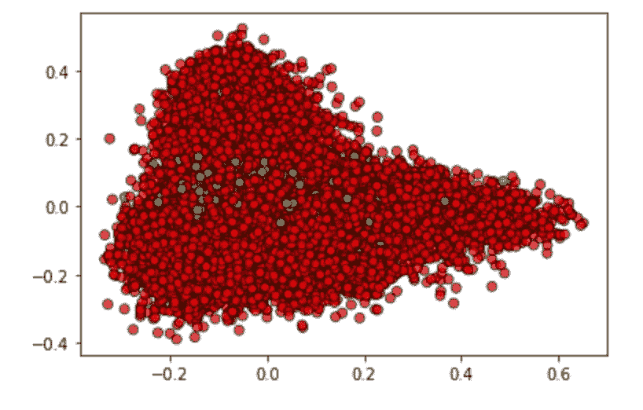

作者图片

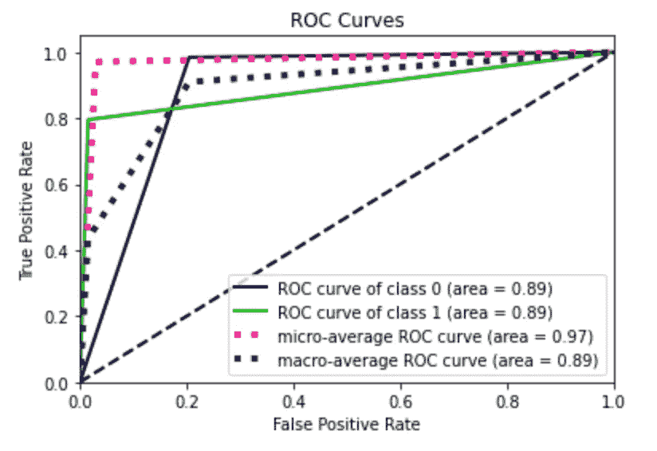

作者图片

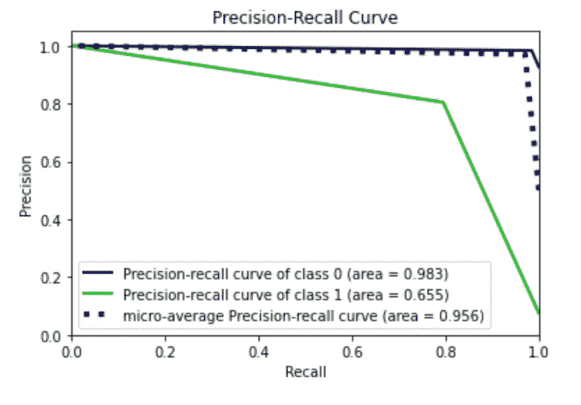

作者图片

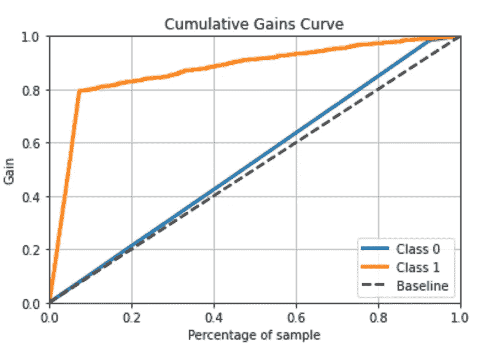

作者图片

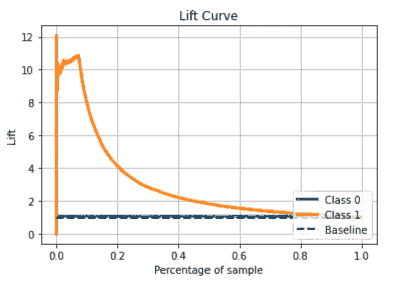

作者图片

另外，`build_and_test()`函数返回分类报告:

```
precision    recall  f1-score   support

           0       0.98      0.98      0.98     11044
           1       0.80      0.80      0.80       889

    accuracy                           0.97     11933
   macro avg       0.89      0.89      0.89     11933
weighted avg       0.97      0.97      0.97     11933
```

# 对最小的类进行过采样

过采样是一种将最小类别的样本数量增加到最大类别的技术。这是通过生成合成样本来完成的。可以应用不同的技术来对类进行过采样。在本教程中，我将使用`RandomOverSampler`和`SMOTE`。`imbalanced-learn`包还提供了其他技术，比如 ADASYN 和 Rose。所有的过采样器都提供了一个名为`fit_resample()`的函数，该函数接收`X_train`输入变量和`y_train`输出变量，并分别返回过采样的输入和输出变量`X_res`和`y_res`。

```
from imblearn.over_sampling import RandomOverSampler
over_sampler = RandomOverSampler(random_state=42)
X_res, y_res = over_sampler.fit_resample(X_train, y_train)
print(f"Training target statistics: {Counter(y_res)}")
print(f"Testing target statistics: {Counter(y_test)}")
```

它给出了以下输出:

```
Training target statistics: Counter({0: 25727, 1: 25727})
Testing target statistics: Counter({0: 11044, 1: 889})
```

`X_res`和`y_res`可以作为`build_and_test()`功能的参数提供。从主成分分析图中，我注意到绿点的数量惊人地增加了。

```
roc_auc_ros,fpr_ros,tpr_ros, _ = build_and_test(X_res, X_test, y_res, y_test)
```

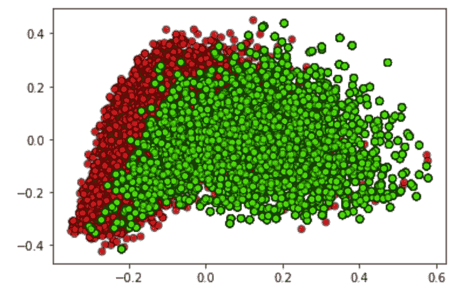

作者图片

所有其他的情节都可以在 Github 的代码中找到。

下表显示了由`build_and_test()`功能产生的分类报告:

```
precision    recall  f1-score   support

           0       0.98      0.98      0.98     11044
           1       0.75      0.76      0.76       889

    accuracy                           0.96     11933
   macro avg       0.87      0.87      0.87     11933
weighted avg       0.96      0.96      0.96     11933
```

同样的分析也可以用在`SMOTE`技术上。

```
from imblearn.over_sampling import SMOTE
over_sampler = SMOTE(k_neighbors=2)
X_res, y_res = over_sampler.fit_resample(X_train, y_train)
print(f"Training target statistics: {Counter(y_res)}")
print(f"Testing target statistics: {Counter(y_test)}")
```

它给出了以下输出:

```
Training target statistics: Counter({0: 25727, 1: 25727})
Testing target statistics: Counter({0: 11044, 1: 889})
```

与`RandomOverSampler`类似，从 PCA 图中，我注意到绿色点的大小。关于`RandomOverSampler`，绿点的分布有很大不同。

```
roc_auc_smote,fpr_smote,tpr_smote, _  = build_and_test(X_res, X_test, y_res, y_test)
```

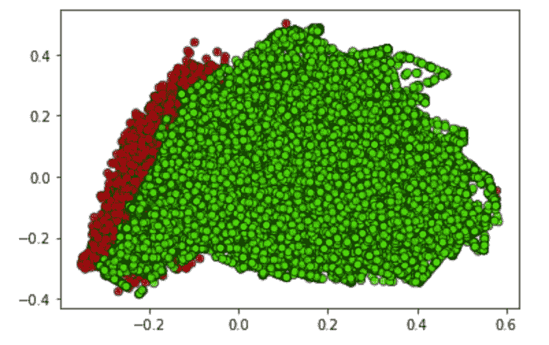

作者图片

使用 SMOTE 技术会产生以下分类报告:

```
precision    recall  f1-score   support

           0       0.99      0.98      0.98     11044
           1       0.75      0.82      0.78       889

    accuracy                           0.97     11933
   macro avg       0.87      0.90      0.88     11933
weighted avg       0.97      0.97      0.97     11933
```

# 欠采样最大的数据集

欠采样是一种将最大类的样本数量减少到最小类的技术。这是通过从最大的类中移除一些采样器来实现的。可以应用不同的技术对类进行欠采样。在本教程中，我将使用`RandomUnderSampler`和`NearMiss`。`imbalanced-learn`包还提供了其他技术，比如压缩最近邻。与过采样器类似，所有欠采样器都提供一个名为`fit_resemple()`的函数，该函数接收`X_train`输入变量和`y_train`输出变量，并分别返回欠采样输入和输出变量`X_res`和`y_res`。

```
from imblearn.under_sampling import RandomUnderSamplerunder_sampler = RandomUnderSampler(random_state=42)
X_res, y_res = under_sampler.fit_resample(X_train, y_train)
print(f"Training target statistics: {Counter(y_res)}")
print(f"Testing target statistics: {Counter(y_test)}")
```

它产生以下输出:

```
Training target statistics: Counter({0: 2114, 1: 2114})
Testing target statistics: Counter({0: 11044, 1: 889})
```

一旦对数据集进行了欠采样，我就调用`build_and_test()`函数。从 PCA 图中，我注意到红点的数量减少了。

```
roc_auc_rus,fpr_rus,tpr_rus , _ = build_and_test(X_res, X_test, y_res, y_test)
```

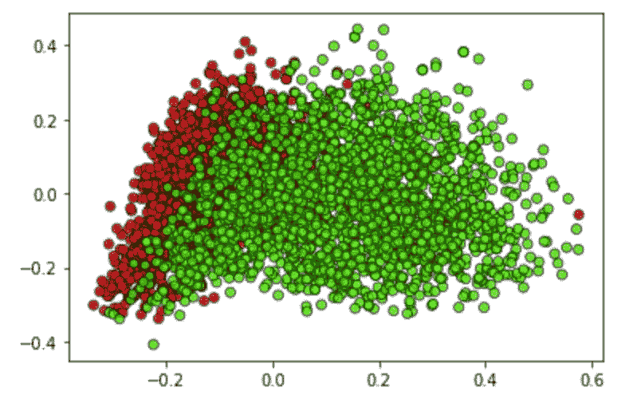

作者图片

生成的分类报告如下:

```
precision    recall  f1-score   support

           0       0.99      0.92      0.95     11044
           1       0.48      0.92      0.63       889

    accuracy                           0.92     11933
   macro avg       0.73      0.92      0.79     11933
weighted avg       0.95      0.92      0.93     11933
```

对于`NearMiss`下采样器也可以进行同样的分析。

```
from imblearn.under_sampling import NearMissunder_sampler = NearMiss()
X_res, y_res = under_sampler.fit_resample(X_train, y_train)
print(f"Training target statistics: {Counter(y_res)}")
print(f"Testing target statistics: {Counter(y_test)}")
```

输出如下:

```
Training target statistics: Counter({0: 2114, 1: 2114})
Testing target statistics: Counter({0: 11044, 1: 889})
```

现在我可以运行算法了:

```
roc_auc_nm,fpr_nm,tpr_nm, _  = build_and_test(X_res, X_test, y_res, y_test)
```


作者图片

带有以下分类报告:

```
precision    recall  f1-score   support

           0       0.99      0.91      0.95     11044
           1       0.44      0.85      0.58       889

    accuracy                           0.91     11933
   macro avg       0.71      0.88      0.76     11933
weighted avg       0.95      0.91      0.92     11933
```

# 类别权重

设置类权重是另一种有效的平衡方法。每个`scikit-learn`分类模型都可以配置一个名为`class_weight`的参数，它以 Python 字典的形式接收每个类的权重。为了计算每个类的权重，我可以将最大类的权重设置为 1，将最小类的权重设置为最大类的样本数与最小类的样本数之比。

```
n= Counter(y_train)
ratio = int(n[0]/n[1])
ratio, n
```

输出如下:

```
(12, Counter({0: 25727, 1: 2114}))
```

我通过设置`class_weight`参数来调用`build_and_test()`函数。

```
roc_auc_cw,fpr_cw,tpr_cw, _  = build_and_test(X_train, X_test, y_train, y_test, class_weight={0:1, 1:ratio})
```

带有以下分类报告:

```
precision    recall  f1-score   support

           0       0.98      0.98      0.98     11044
           1       0.73      0.76      0.75       889

    accuracy                           0.96     11933
   macro avg       0.86      0.87      0.86     11933
weighted avg       0.96      0.96      0.96     11933
```

# 阈值

调整阈值是平衡数据集的手动技术。从概念上讲，如果预测值大于阈值，则设置为 1，否则设置为 0。关于阈值的更多细节可在[此链接](https://machinelearningmastery.com/threshold-moving-for-imbalanced-classification/)中找到。在本教程中，我将阈值设置为最大化[尤登 J 统计](https://en.wikipedia.org/wiki/Youden%27s_J_statistic)的值。此外，我将从`roc_curve()`中提取候选阈值列表。

```
roc_auc_thr,fpr_thr,tpr_thr, threshold = build_and_test(X_train, X_test, y_train, y_test, threshold=True)
print(f"Best Treshold: {threshold}")
```

输出如下:

```
precision    recall  f1-score   support

           0       0.98      0.98      0.98     11044
           1       0.81      0.79      0.80       889

    accuracy                           0.97     11933
   macro avg       0.89      0.89      0.89     11933
weighted avg       0.97      0.97      0.97     11933

Best Treshold: 1.0
```

在这种情况下，最佳阈值是 1，因此阈值技术表现为不平衡的情况。

# 一起绘制

最后，我将所有的 ROC 曲线绘制在一起。我注意到在我的情况下，最好的技术是随机下采样，具有最大的 AUC 值。

```
plt.plot(fpr_imb, tpr_imb, lw=3, label='Imbalanced $AUC_0$ = %.3f' % (roc_auc_imb))
plt.plot(fpr_ros, tpr_ros, lw=3, label='ROS $AUC_0$ = %.3f' % (roc_auc_ros))
plt.plot(fpr_smote, tpr_smote, lw=3, label='SMOTE $AUC_0$ = %.3f' % (roc_auc_smote))
plt.plot(fpr_rus, tpr_rus, lw=3, label='RUS $AUC_0$ = %.3f' % (roc_auc_rus))
plt.plot(fpr_nm, tpr_nm, lw=3, label='NM $AUC_0$ = %.3f' % (roc_auc_nm))
plt.plot(fpr_cw, tpr_cw, lw=3, label='CW $AUC_0$ = %.3f' % (roc_auc_cw))
plt.plot(fpr_thr, tpr_thr, lw=3, label='NM $AUC_0$ = %.3f' % (roc_auc_thr))
plt.plot([0, 1], [0, 1], color='navy', lw=2, linestyle='--')
plt.xlim([0.0, 1.0])
plt.ylim([0.0, 1.05])
plt.xlabel('False Positive Rate', fontsize=16)
plt.ylabel('True Positive Rate', fontsize=16)
plt.title('ROC curve', fontsize=16)
plt.legend(loc="lower right", fontsize=14, frameon=False)
plt.tick_params(axis='both', which='major', labelsize=16)
plt.show()
```

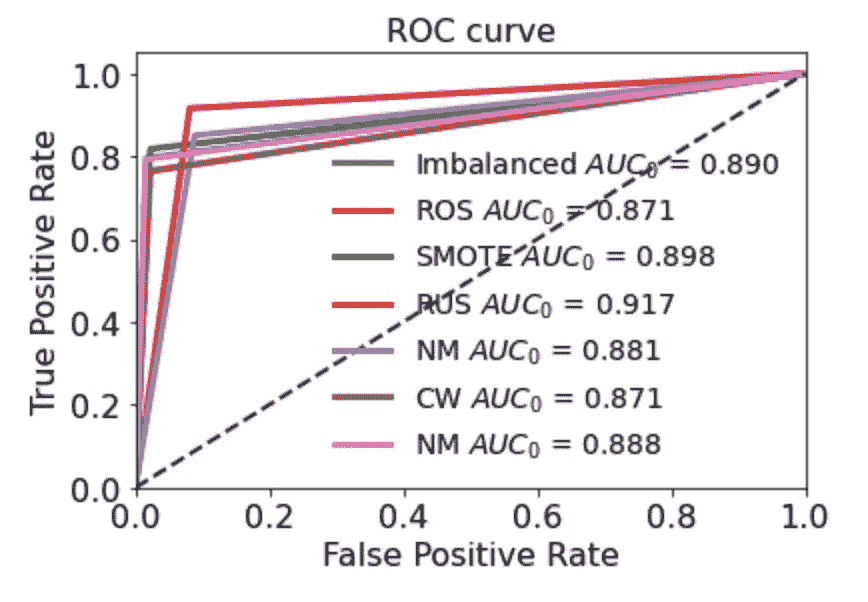

作者图片

# 摘要

在本教程中，我演示了如何平衡不平衡的数据集。可以使用不同的技术:欠采样、过采样、阈值和类别权重。没有最佳选择，要看数据。在某些情况下，不平衡数据集可能比平衡数据集表现得更好。

如果你想了解我的研究和其他活动的最新情况，你可以在 [Twitter](https://twitter.com/alod83) 、 [Youtube](https://www.youtube.com/channel/UC4O8-FtQqGIsgDW_ytXIWOg?view_as=subscriber) 和 [Github](https://github.com/alod83) 上关注我。

# 相关文章

[](/how-to-deal-with-imbalanced-multiclass-datasets-in-python-fe0bb3f2b669) [## 如何在 Python 中处理不平衡的多类数据集

towardsdatascience.com](/how-to-deal-with-imbalanced-multiclass-datasets-in-python-fe0bb3f2b669) [](/how-to-check-if-a-classification-model-is-overfitted-using-scikit-learn-148b6b19af8b) [## 如何使用 scikit-learn 检查分类模型是否过度拟合

towardsdatascience.com](/how-to-check-if-a-classification-model-is-overfitted-using-scikit-learn-148b6b19af8b) [](/data-preprocessing-in-python-pandas-part-6-dropping-duplicates-e35e46bcc9d6) [## Python Pandas 中的数据预处理—第 6 部分删除重复项

### 使用 Python 熊猫库删除重复项的快速教程。

towardsdatascience.com](/data-preprocessing-in-python-pandas-part-6-dropping-duplicates-e35e46bcc9d6) 

# 新到中？您可以每月订阅几美元，并解锁无限的文章— [点击此处](https://alod83.medium.com/membership)。