# 如何使用约束优化在 Python 中平衡化学方程式(PuLP)

> 原文：<https://towardsdatascience.com/how-to-balance-chemical-equations-in-python-using-constraint-optimization-pulp-1d7409fbe52b?source=collection_archive---------32----------------------->

## 我们将使用纸浆和化学分析库来平衡化学方程式

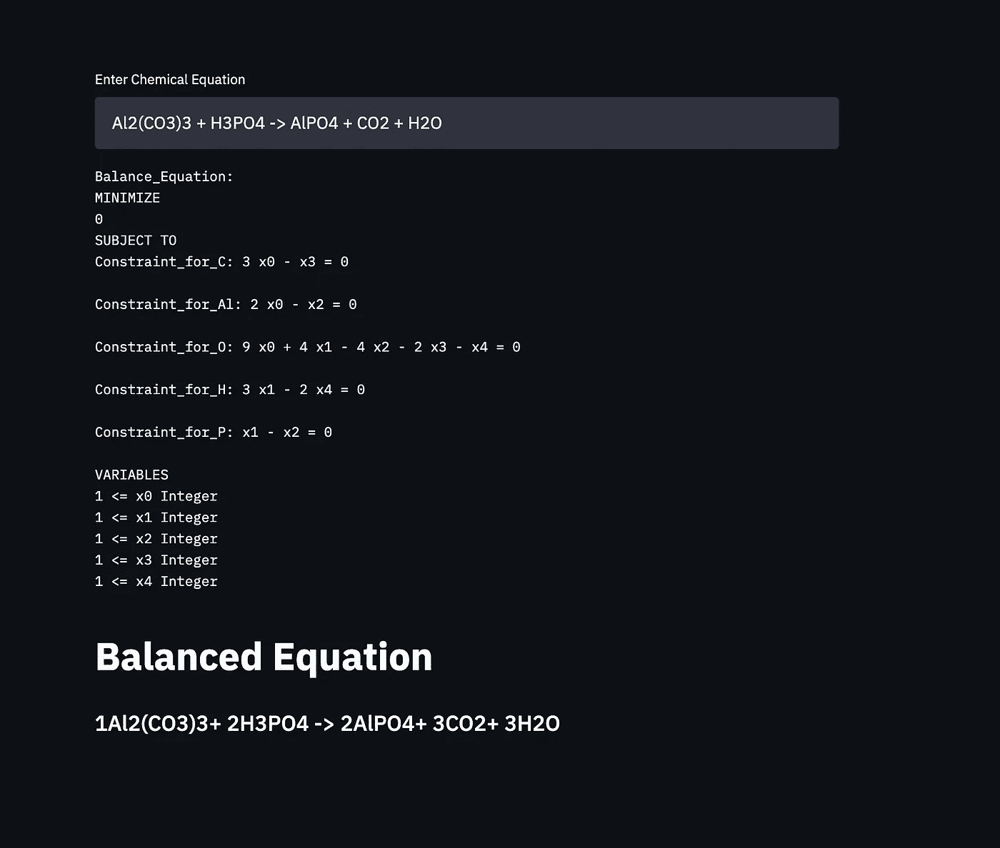

App 截图

*原贴于*[*【realpythonproject.com】*](https://www.realpythonproject.com/how-to-balance-chemical-equations-in-python-using-constraint-optimization-pulp/)

*你可以在这里* 找到源代码[](https://github.com/rahulbanerjee26/Chemical-Equation-Balancer)

# *先决条件*

*   *熟悉约束优化。查看我以前的文章，了解关于[约束优化和纸浆](/basic-linear-programming-in-python-with-pulp-d398d144802b)的介绍*
*   *熟悉化学方程式配平。*
*   *对 Streamlit 有所了解是有好处的。[Shail Deliwala](/streamlit-101-an-in-depth-introduction-fc8aad9492f2)的这篇文章很好地介绍了 Streamlit。*

# *如何使用约束优化来平衡化学方程式？*

*平衡一个化学方程式本质上意味着尊重质量守恒，并确保一种元素的左边(反应物)和右边(产物)有相同数量的原子。基本上，如果你将 X 克元素作为反应物，产物中也会有 X 克该元素(理想状态)。*

**

*作者图片*

*在上图中，您可以注意到以下内容*

*   *在非平衡方程式中，产物中有两个氢原子和氯原子。然而，反应物中只有一个氢和氯原子。这不尊重质量守恒定律*
*   *在平衡方程式中，我们在反应物中使用 2 个氢原子和氯原子。产物中的原子数保持不变。结果，方程平衡了，不再违反质量守恒定律。*

*上面的方程很容易求解，可以手动完成。然而，随着元素数量的增加和反应物/产物数量的增加，事情变得复杂了。下面的等式虽然可以手动完成，但需要大量的反复试验。*

*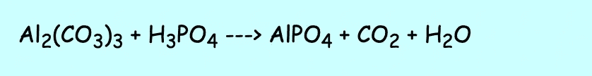*

*不平衡等式的示例*

*那么如何才能使用约束优化呢？*

*让我们考虑一下我们已经看过的第一个方程*

**

*不平衡等式的示例*

*每种反应物/产物的系数可以被认为是一个变量。*

*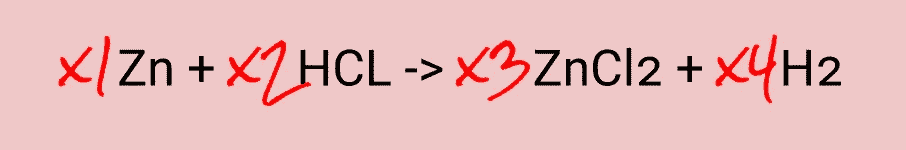*

*变系数方程*

*X1、X2、X3 和 X4 是可变系数。每个变量必须是大于或等于 1 的整数。*

*每个元素添加一个约束，即*

*   *对于锌:反应物中的锌原子数必须等于产物中的锌原子数*

*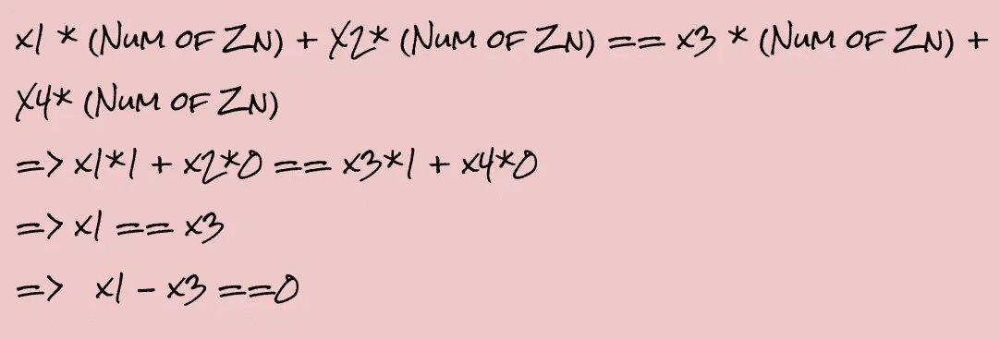*

*锌造成的限制*

*   *对于 Cl:反应物中的氯原子数必须等于产物中的氯原子数*

*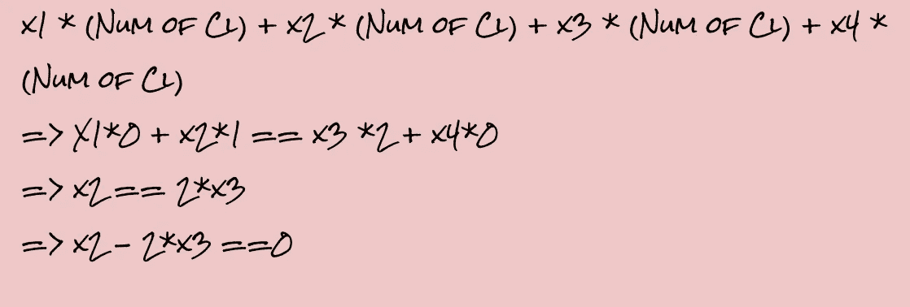*

*Cl 导致的约束*

*   *对于 H:反应物中氢原子的数目必须等于产物中氢原子的数目*

*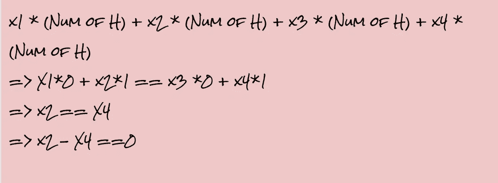*

*H 引起的约束*

*这个问题可以被认为是一个最小化问题，因为我们需要找到最小的系数来平衡方程。*

*该问题除了最小化系数之外没有其他目标，这意味着目标基本上是 0(无)。*

*总结一下，这就是我们的问题是如何设置的*

*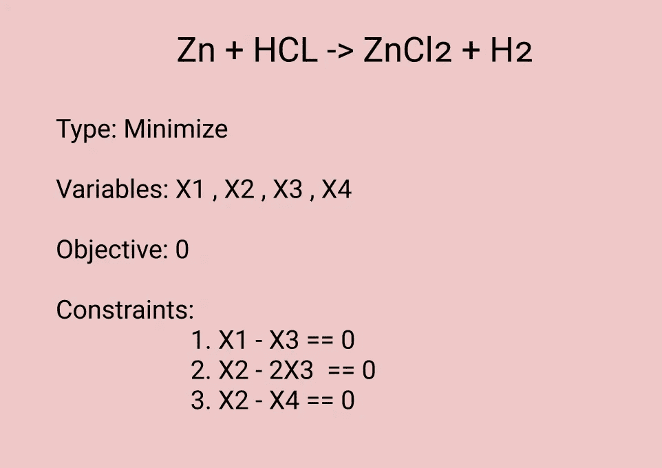*

*问题设置*

*该问题可以使用 PuLP 和使用 PuLP 默认解算器的解算器来设置。*

*现在，我们可以继续推广它来支持其他方程。*

# *解析化学方程式*

*我们将使用 chemparse 库来解析反应物和产物。*

```
*pip3 install chemparse*
```

*下面是 chemparse 返回内容的几个例子。它们取自图书馆的文献*

```
*“CH4” returns {“C”:1.0, “H”:4.0}
“C1.5O3” returns {“C”:1.5, “O”:3.0}
"(CH3)2(CH2)4" returns {"C":6.0, "H":14.0}*
```

*让我们创建一个函数来解析这些方程。该函数将期待类似于下面的输入*

```
*Zn + HCL -> ZnCl2 + H2*
```

*我们可以用'--> '来分开，得到左手边和右手边]*

*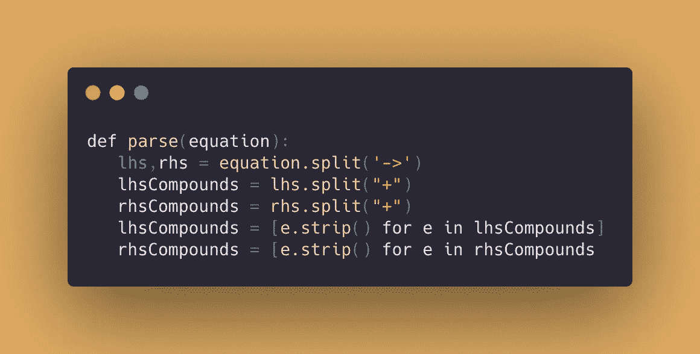*

*代码片段*

*为了得到复合词，我们可以用“+”号分开，去掉后面的空格。*

*我们需要存储唯一的元素，这样我们就可以为每个元素形成约束，并将每个反应物和产物转换成由 chemparse 生成的字典。*

*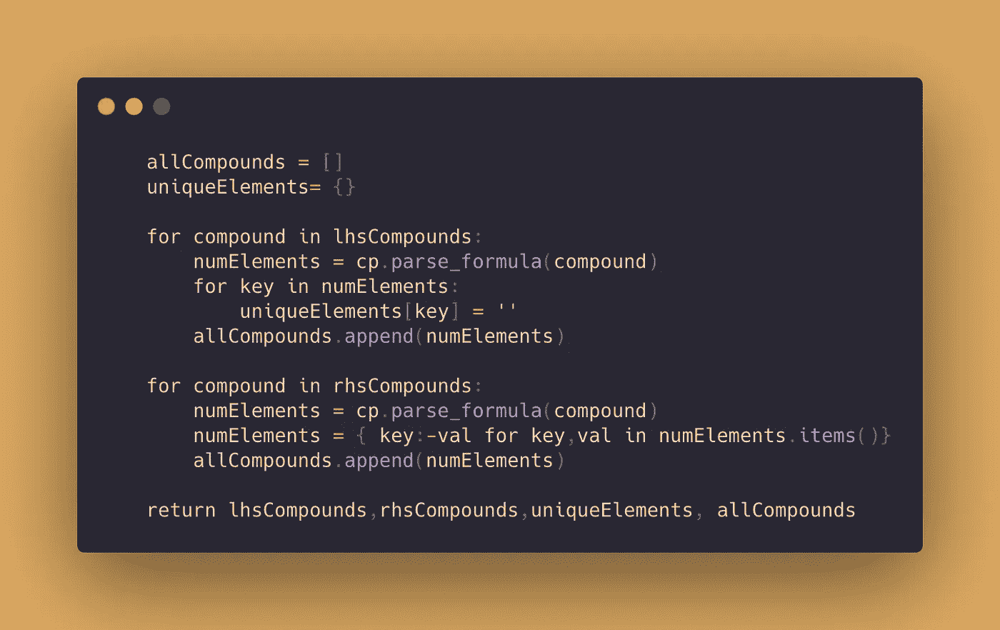*

*代码片段*

*首先，我们遍历 lhsCompounds 并存储来自 chemparse 的结果以及唯一元素。*

*之后，我们迭代 rhsCompounds，我们不需要再次存储唯一的元素。但是，我们将系数存储为负数，因为这样在设置约束时会更容易。*

# *函数来建立和解决约束优化问题*

*现在，我们可以继续解决问题了。*

*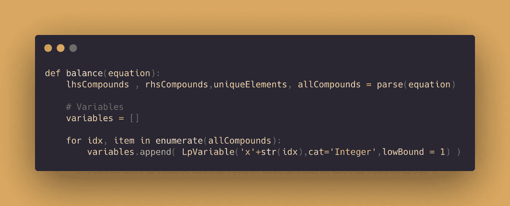*

*代码片段*

*我们将调用之前编写的解析函数并存储返回值。*

*每个反应物/产物都有一个系数，因此我们可以简单地循环变量 allCompounds(它包含每个反应物/产物的 chemparse 输出),并在每次迭代中创建一个变量。*

*变量的类别为整数，下限值为 0*

*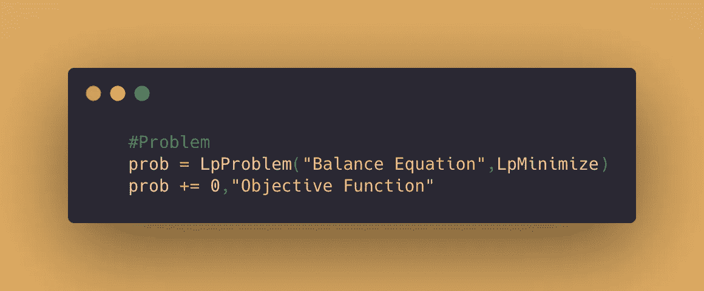*

*代码片段*

*如前所述，这个问题是一个没有目标的最小化问题。*

*现在，让我们设置约束*

*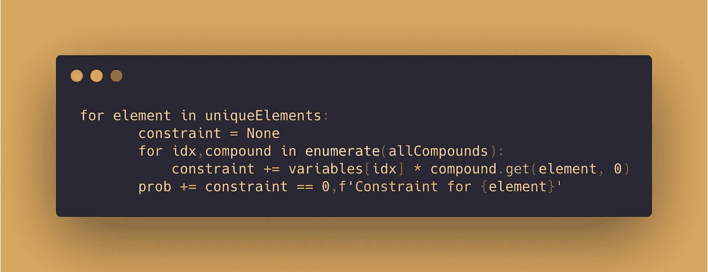*

*代码片段*

*如前所述，每个元素都会添加一个与之相关的约束。*

*   *我们遍历唯一元素*
*   *获得每种反应物/产物中该元素的原子数*
*   *对系数求和(记住所有乘积系数都存储为负值)*
*   *添加总和应为 0 的约束*

*现在，我们准备解决这个问题，并创建平衡方程*

*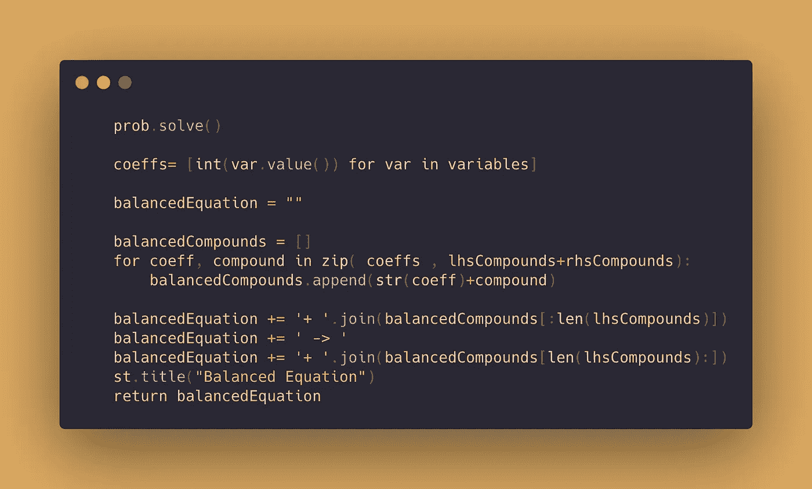*

*代码片段*

# *简化 WebApp*

*安装细流*

```
*pip install streamlit*
```

*这将是一个非常简约的应用程序。*

*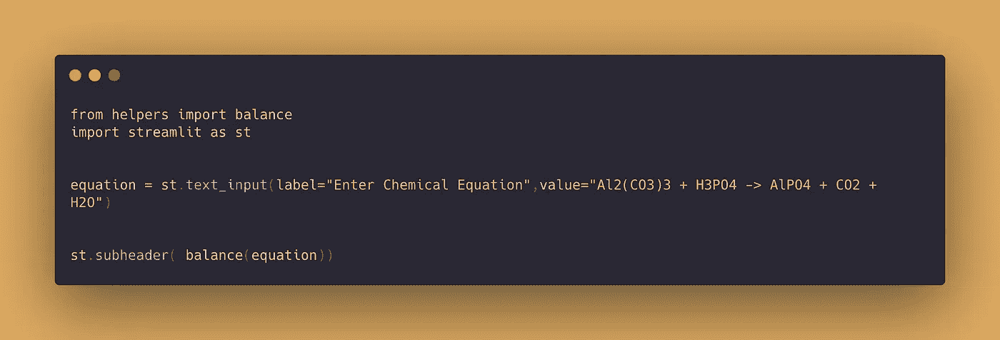*

*代码片段*

*我们创建一个 text_input 组件，并将默认值设置为一个不平衡的等式。balance()函数被导入，我们将 text_input 的值作为参数传递。*

*此外，我们还可以在解决问题之前显示问题。这应该在 balance()函数内部*

```
*st.text(prob)*
```

*如果您对部署您的应用程序感兴趣，请查看由 [Aniket Wattamwar](https://medium.com/u/e046ad804cad?source=post_page-----1d7409fbe52b--------------------------------) 撰写的[这篇文章](https://medium.com/swlh/how-to-deploy-your-streamlit-app-on-streamlit-sharing-4705958ee944)。*

> **联系我上*[*LinkedIn*](https://www.linkedin.com/in/rahulbanerjee2699/)*，* [*Twitter*](https://twitter.com/rahulbanerjee99)*