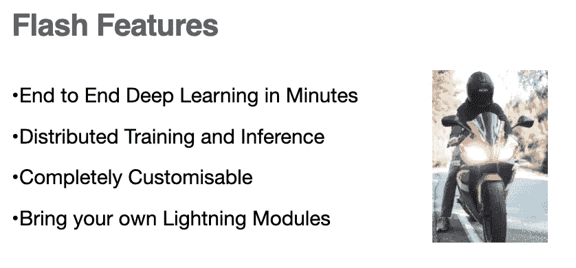
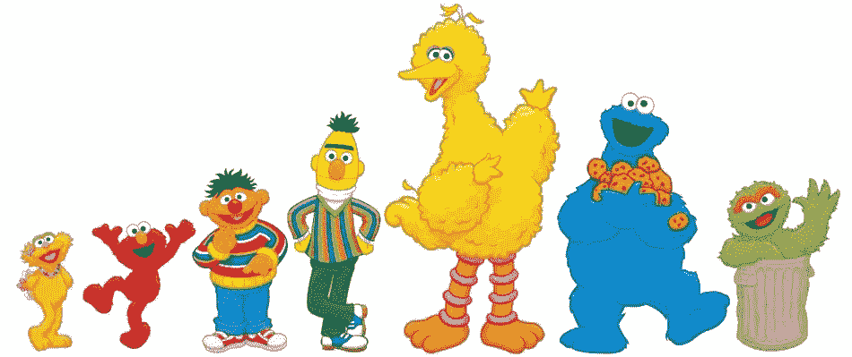
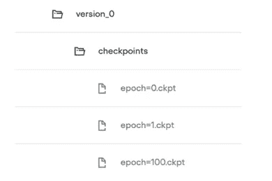
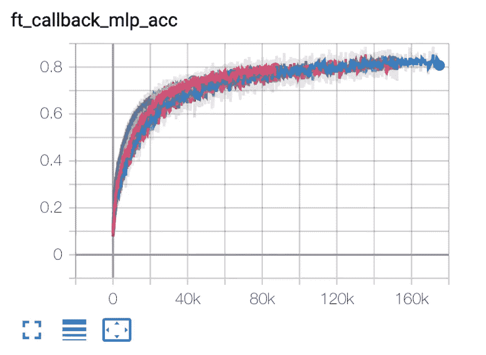

# 如何在一瞬间确定深度学习任务的基线

> 原文：<https://towardsdatascience.com/how-to-baseline-deep-learning-tasks-in-a-flash-b9b7ff4ef482?source=collection_archive---------39----------------------->

## 本教程介绍了如何开始使用 [PyTorch Lightning Flash](https://github.com/PyTorchLightning/lightning-flash) 构建深度学习的基线


照片由 Dmitry Zvolskiy 从 [Pexels](https://www.pexels.com/photo/purple-lightning-at-night-1576369/) 拍摄

# PyTorch 闪电是什么？

PyTorch Lightning Flash 是 PyTorch Lightning 的创作者提供的一个新库，可以在几分钟内对新数据集的最新深度学习任务进行快速基线化。

[](https://github.com/PyTorchLightning/lightning-flash) [## 手电筒光/闪电

### 阅读我们的发布博客 Pip/conda Pip install lightning-flash-U Pip from source Pip install…

github.com](https://github.com/PyTorchLightning/lightning-flash) 

与 PyTorch Lightning 摆脱样板文件的目标一致，Flash 旨在使其易于训练、推理和微调深度学习模型。

Flash 构建于 PyTorch Lightning 之上，用于为常见的深度学习任务提取不必要的样板文件，非常适合:

*   数据科学
*   卡格尔比赛
*   工业人工智能
*   应用研究

因此，Flash 为深度学习模型的分布式训练和推理提供了无缝支持。

由于 Flash 是建立在 PyTorch Lightning 之上的，随着您了解得越来越多，您可以用 Lightning 和 PyTorch 无缝地覆盖您的任务代码，为您的场景找到[正确的抽象级别。](/setting-a-strong-deep-learning-baseline-in-minutes-with-pytorch-c0dfe41f7d7)



Nikolai Ulltang 从 [Pexels](https://www.pexels.com/photo/person-riding-red-sports-bike-529782/) 拍摄的摩托车照片

在这篇文章的剩余部分，我将通过一个内联 Flash 任务代码示例带您完成构建深度学习应用程序的 5 个步骤。

# 使用 Flash 创建您的第一个深度学习基准


照片来自 [Pexels](https://www.pexels.com/photo/timelapse-photography-of-road-with-white-and-red-lights-169976/)

以下教程的所有代码可以在笔记本下的 Flash Repo [中找到。](https://github.com/PyTorchLightning/lightning-flash/tree/master/flash_notebooks)

我将介绍五个可重复的步骤，您可以将它们应用于自己数据的任何闪存任务。

1.  选择深度学习任务
2.  加载数据
3.  选择一个最先进的模型
4.  微调任务
5.  预测

现在让我们开始吧！！！

# 第一步:选择深度学习任务


照片由[像素](https://www.pexels.com/photo/yellow-cube-on-brown-pavement-208147/)的[皮克斯拜](https://www.pexels.com/@pixabay?utm_content=attributionCopyText&utm_medium=referral&utm_source=pexels)拍摄

应用深度学习过程的第一步是选择我们想要解决的任务。开箱即用，Flash 为常见的深度学习任务提供支持，如[图像](https://github.com/PyTorchLightning/lightning-flash/blob/master/flash_notebooks/finetuning/image_classification.ipynb)、[文本](https://github.com/PyTorchLightning/lightning-flash/blob/master/flash_notebooks/finetuning/text_classification.ipynb)、表格分类，以及更复杂的场景，如图像嵌入、对象检测、文档摘要和文本翻译。新任务一直在增加。

在本教程中，我们将使用 Flash 构建一个文本分类模型，用于对电影评论进行情感分析。该模型将能够告诉我们，诸如“*这是电影史上最差的电影”的评论*是负面的，例如“*这位导演在这部电影上做得很好！*“正。

首先，让我们安装 Flash 并导入文本分类任务所需的 Python 库。

从 PyPy 安装 Flash

用于文本数据加载和分类的导入任务功能

# 步骤 2:加载数据

现在，我们已经安装了闪存并加载了我们的依赖项，让我们来谈谈数据。为了构建我们的第一个模型，我们将使用以 CSV 文件格式存储的 IMDB 电影评论数据集。查看数据集中的一些示例评论。

```
review, sentiment"I saw this film for the very first time several years ago - and was hooked up in an instant. It is great and much better than J. F. K. cause you always have to think 'Can it happen to me? Can I become a murderer?' You cannot turn of the TV or your VCR without thinking about the plot and the end, which you should'nt miss under any circumstances.", positive"Winchester 73 gets credit from many critics for bringing back the western after WWII. Director Anthony Mann must get a lot of credit for his excellent direction. Jimmy Stewart does an excellent job, but I think Stephen McNalley and John McIntire steal the movie with their portrayal of two bad guys involved in a high stakes poker game with the treasured Winchester 73 going to the winner. This is a good script with several stories going on at the same time. Look for the first appearance of Rock Hudson as Young Bull. Thank God, with in a few years, we would begin to let Indians play themselves in western films. The film is in black and white and was shot in Tucson Arizona. I would not put Winchester 73 in the category of Stagecoach, High Noon or Shane, but it gets an above average recommendation from me.<br /><br />.", positive
```

我们需要做的第一件事是使用下面的代码下载数据集。

一旦我们下载了 IMDB 数据集，Flash 就会提供一个方便的 TextClassificationData 模块，该模块可以处理加载以 CSV 格式存储的文本分类数据并将其转换为深度学习模型需要训练的表示形式的复杂性。

我们所需要做的就是向 TextClassificationData 对象提供我们的 IMBDb 数据的文件路径，并告诉它我们的数据中的哪一列是我们想要预测的*输入*和哪一列是我们想要预测的*标签*。

# 3.为我们的任务选择一个最先进的模型



在过去几年的自然语言处理中，许多最先进的模型都是以芝麻街角色命名的。根据来自 [pixy](https://pixy.org/4508354/) 的 CC BY-NC-ND 4.0 许可证使用的照片

一旦我们加载了数据集，我们需要选择一个模型来训练。每个 Flash 任务都预加载了对最先进的模型主干的支持，供您立即体验。

默认情况下，TextClassifier 任务使用 [tiny-bert](https://huggingface.co/prajjwal1/bert-tiny) 模型，在大多数文本分类任务上实现强大的性能。尽管如此，你仍然可以使用来自拥抱脸[变形金刚——文本分类](https://huggingface.co/models?filter=text-classification,pytorch)模型库的任何模型，甚至可以自带模型。在 Flash 中，你只需要一行代码来加载主干。

# 4.微调任务


照片由来自 [Pixy](https://pixy.org/4795948/) 的雪伊·卡尔金斯拍摄

现在，我们已经选择了模型并加载了数据，接下来是使用下面两行代码在分类任务中训练模型的时候了:

由于 Flash Trainer 构建在 PyTorch Lightning 之上，因此可以无缝地将培训分发到多个 GPU、集群节点甚至 TPU。

此外，您还可以获得大量其他难以实现的功能，例如自动化模型检查点和与 Tensorboard、Neptune.ai 和 MLFlow 等平台的日志集成，没有任何麻烦。



作者生成的照片。

任务自带对所有标准任务指标的本地支持。在我们的案例中，Flash Trainer 将自动为您在所有分类标准任务指标上对您的模型进行基准测试，例如精度、召回率、F1 和 [more](https://pytorch-lightning.readthedocs.io/en/stable/extensions/metrics.html?highlight=metrics) 只需一行代码。

使用 Flash Trainer 可以无缝地检查和共享任务模型，如下所示。

# 5.预测


照片由来自 [Pexels](https://www.pexels.com/photo/crystal-ball-on-person-s-hand-879718/?utm_content=attributionCopyText&utm_medium=referral&utm_source=pexels) 的[sin dre strm](https://www.pexels.com/@blitzboy?utm_content=attributionCopyText&utm_medium=referral&utm_source=pexels)拍摄

一旦我们完成了模型的训练，我们就可以用它来预测我们的数据。只用一行代码:

此外，我们可以使用 Flash Trainer 为生产扩展和分发模型推理。

对于在 32 个 GPU 上进行推理的缩放，它就像一行代码一样简单。

您甚至可以将模型导出到 Onnx 或 Torch 脚本，用于边缘设备推断。

# 把所有的放在一起

那多有趣啊！上面的 5 个步骤被浓缩成下面的简单代码片段，可以应用于任何 Flash 深度学习任务。

# 后续步骤

现在，您已经拥有了开始构建快速深度学习基线的工具，我迫不及待地想让您向我们展示您可以构建什么。如果你喜欢这个教程，请在下面鼓掌，并在 GitHub 上给我们一颗星。

我们正在不知疲倦地添加更多的 Flash 任务，所以如果你有任何必须的任务，请在下面评论或通过 Twitter [@pytorchlightnin](https://twitter.com/PyTorchLightnin) 或我们的 [Slack 频道](https://pytorch-lightning.slack.com/)联系我们。

# 关于作者

[**亚伦(阿里)【博恩施泰因】**](https://www.linkedin.com/in/aaron-ari-bornstein-22aa7a77/) 是一名人工智能研究员，对历史充满热情，致力于新技术和计算医学。作为 Grid.ai 的开发者宣传负责人，他与机器学习社区合作，用改变游戏规则的技术解决现实世界的问题，然后将这些技术记录在案，开源，并与世界其他地方共享。