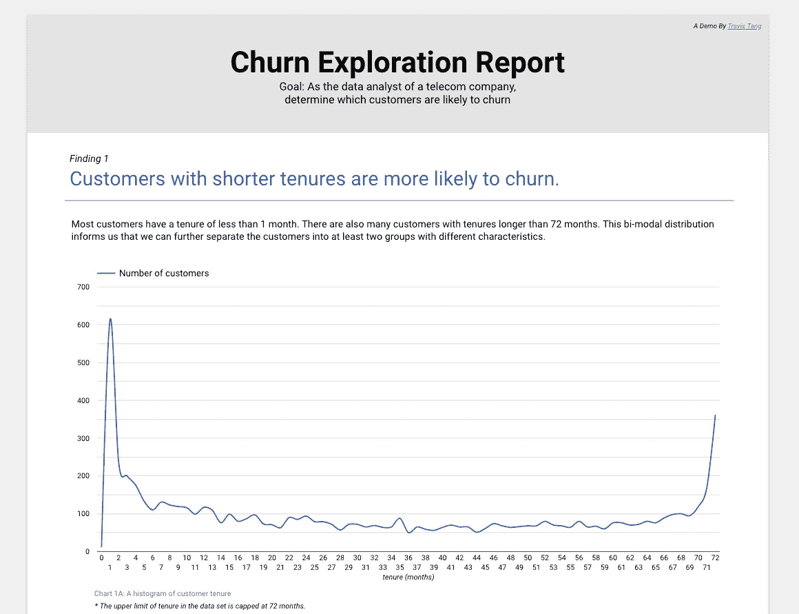
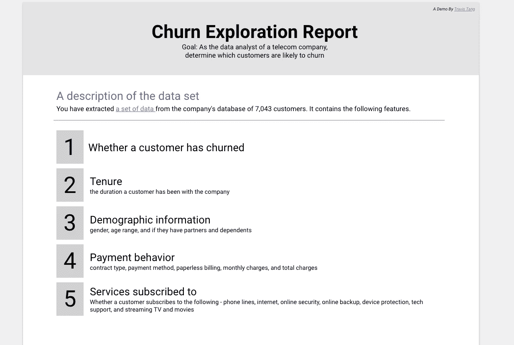
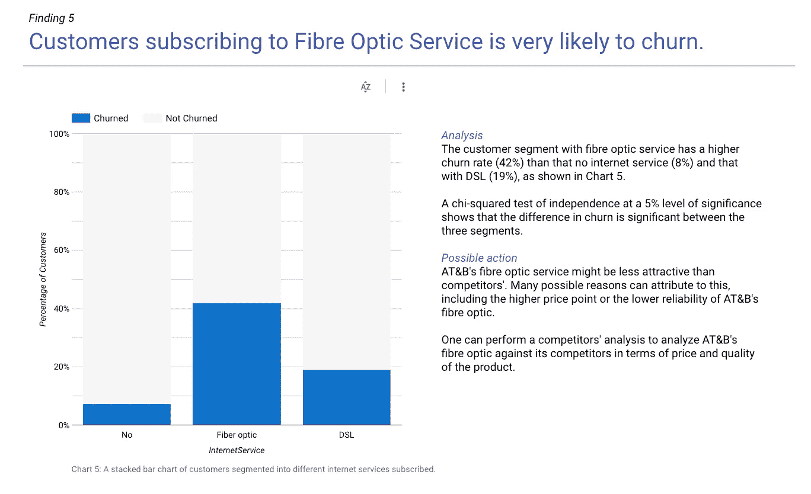
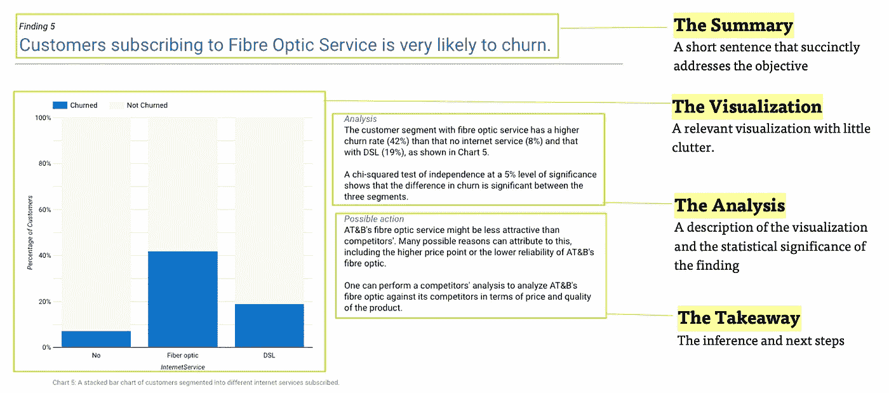

# 如何成为一名数据分析师——谷歌数据工作室的数据 Viz

> 原文：<https://towardsdatascience.com/how-to-be-a-data-analyst-data-viz-with-google-data-studio-5cda4ad475f2?source=collection_archive---------35----------------------->

## 数据分析师关于客户流失的演示报告

你是一个有抱负的数据分析师或数据科学家，希望建立自己的投资组合和可视化技能吗？

或者你是一名数据分析师，想提高自己的可视化技能和商业智能能力？

或者你对 Tableau 的高成本感到沮丧，正在寻找一个免费的替代品？

今天，我将向您展示我使用(免费！)Google Data Studio，以及如何为您的投资组合创建自己的报告——所有这些都不需要编码。

# 我们将讨论…

1.  什么是谷歌数据工作室
2.  作为一名分析师，你为什么需要了解数据和报告
3.  如何实施分析过程
4.  你应该在一份有效的报告中包括什么

我将[使用我创建的关于分析客户流失的演示报告](https://datastudio.google.com/reporting/056bfc95-2bd1-45f6-8f47-0504b9a4113a)来运行这个流程。

作者演示流失探索报告([链接](https://datastudio.google.com/reporting/056bfc95-2bd1-45f6-8f47-0504b9a4113a)

# 关于谷歌数据工作室

谷歌数据工作室让你用数据讲述你的故事。特别是，它是一个方便的工具，可以让你—

*   通过高度可配置的图表和表格可视化您的数据。
*   轻松连接到各种数据源。
*   与您的团队或全世界分享您的见解。
*   与您的团队协作完成报告。
*   使用内置的示例报告加快您的报告创建过程。

不仅如此，它还有以下令人敬畏的功能。

*   **强大的可视化能力。** Data Studio 提供了丰富的可视化选项，包括折线图、条形图、饼图、地理地图、面积图、气泡图、数据表、数据透视表等。
*   **很强的互动性。**报告可以与查看器过滤器和日期范围控件交互。这允许观众探索数据。
*   **可定制性高。你不仅可以包含文本，还可以包含**图片**，改变你的报告的外观和感觉。**
*   **令人印象深刻的连接性。**人们可以将来自许多不同数据源的数据连接到 Google Data Studio，包括 Google Sheets(是的！)和 CSV 文件。人们还可以将实时数据连接到谷歌数据工作室，包括谷歌广告、分析、YouTube、BigQuery、MySQL，甚至像脸书、Reddit 和 Twitter 这样的社交媒体平台。

人们可以探索各种各样的数据可视化或商业智能软件。这些软件包括 Tableau、Qlikview、FusionCharts、Highcharts、Datawrapper、Plotly 和 Sisense。

这些都有自己的优点，但一般都很贵。如果你想尝试使用免费软件，那么谷歌数据工作室正适合你。

但是，请注意，您在工作中使用的软件将取决于可用的工具。

注意，谷歌数据工作室提供牛逼(免费！)教程，通过其[分析学院。](https://analytics.google.com/analytics/academy/course/10?utm_source=ahc_promo&utm_medium=referral&utm_campaign=hc_article&utm_content=button)

# 为什么数据分析师需要了解数据，即

由[卢克·切瑟](https://unsplash.com/@lukechesser?utm_source=medium&utm_medium=referral)在 [Unsplash](https://unsplash.com?utm_source=medium&utm_medium=referral) 上拍摄的照片

作为一家科技公司的分析师，我的职责是执行不同类型的分析并交流见解。四种类型的分析包括—

*   描述性分析报告过去发生的事情。
*   **诊断分析**通过比较描述性数据集来识别模式，从而揭示过去事件的原因
*   [**预测分析**](https://www.northeastern.edu/graduate/blog/predictive-analytics/) 旨在通过检测描述性和诊断性分析中的趋势来预测未来的结果。
*   **规定性分析**试图根据上述三种类型确定要采取的业务行动。

可以说，所有这些类型的分析都涉及某种形式的数据可视化。特别是，有效的描述性和诊断性分析被数据驱动型公司中的几乎所有利益相关者使用，并涉及数据可视化中的一些繁重工作。

这两种形式的分析可以在商业智能或数据可视化软件上轻松执行，这使得分析师可以创建可视化效果，利益相关者可以访问它们。

因此，如果数据分析师精通此类软件，并且能够高效地创建传达见解的可视化效果，这将非常有帮助。

# (诊断)分析的过程

克莱顿·罗宾斯在 [Unsplash](https://unsplash.com?utm_source=medium&utm_medium=referral) 上的照片

我今天要分享的报告是一份诊断分析报告。

**1。理解问题。**

理解业务问题非常重要，因为它允许数据分析师提供符合业务需求的分析。在不了解问题的情况下执行请求充其量是徒劳的。

该报告是为以下模拟场景创建的。

> 你是 B 电信公司的数据分析师。最近，业务团队发现了客户流失的高峰。但是，它不确定这些客户的特征。你的角色是告知业务团队哪些客户可能流失。

**2。计划报告。**

计划，计划计划。照片由[哈尔·盖特伍德](https://unsplash.com/@halacious?utm_source=medium&utm_medium=referral)在 [Unsplash](https://unsplash.com?utm_source=medium&utm_medium=referral) 拍摄

创建您将要创建的报告的模型可以极大地加快分析过程。有一个计划会减少分心，帮助你专注于手头的任务。

在这一步中，您可能想问自己的一些问题包括:

*   *解决问题的重要指标是什么？*
*   能够解决问题的假设有哪些？

将此应用于我们手头的案例，我们知道我们必须探索的最重要的指标是**“客户流失”。**

可以解释客户流失的一些假设包括:

*   *任期较短的客户流失率较高*
*   *特定人群的客户流失率更高*
*   *价格越高的客户流失率越高*
*   *订购特定服务的客户流失率更高*

**3。创建实体模型**

回答完这些问题后，我们可以继续创建一个模拟报告。这将有助于分析师可视化步骤 4 中所需的数据。

在这种情况下，我创建了以下模型。正如你可能注意到的，这不是最整洁的，也不是最有美感的——这完全没问题！毕竟只是个草稿。

**4。提取和清理数据**

既然我们已经有了假设，我们可以提取我们想要探索的相关数据。在典型情况下，可以使用 SQL 提取相关数据。

仪表板中使用的数据集可在 [Kaggle](https://www.kaggle.com/blastchar/telco-customer-churn) 上获得。这是一家拥有 7043 名客户的电信公司的数据集。它包含以下功能:

1.  客户是否有流失
2.  客户任期
3.  客户人口统计信息(*性别、年龄范围、是否有伴侣或家属*)
4.  客户支付行为(*合同类型、支付方式、无纸化账单、每月费用和总费用*)
5.  客户服务订购(*客户是否订购了特定的服务*

在这种情况下，数据集是干净的。我们现在可以开始实施我们的计划了——使用 Google Data Studio！

# 有效报告的剖析

## 行动纲要

报告应该包括你正在解决的问题陈述和发现。报告第 1 页对此进行了概述。

数据报告的执行摘要([报告](https://datastudio.google.com/reporting/056bfc95-2bd1-45f6-8f47-0504b9a4113a)和作者图片)

## 数据文档

为了帮助利益相关者理解报告，应该包括关于数据来源和数据解释的适当文档。这在报告的第二页。

数据报告的数据文档([报告](https://datastudio.google.com/reporting/056bfc95-2bd1-45f6-8f47-0504b9a4113a)和作者图片)

## 调查结果

调查结果是报告最重要的部分。*发现部分*包含标题、可视化、分析和可能的行动。这在样本报告的第 3 页到第 8 页，可以看到如下:

数据报告的结果部分([报告](https://datastudio.google.com/reporting/056bfc95-2bd1-45f6-8f47-0504b9a4113a)和作者提供的图像)

要打开的东西太多了。让我们将*调查结果部分*分解成它的结构。

调查结果的分类([报告](https://datastudio.google.com/reporting/056bfc95-2bd1-45f6-8f47-0504b9a4113a)和作者提供的图片)

**摘要**

不是所有的利益相关者都有时间去消化所有的可视化。因此，每个调查结果的标题应该是描述性的，并从图表中总结调查结果。

**可视化**

应该进行适当的可视化以支持该发现。视觉效果也应该是整洁的，以免分散读者对信息的注意力。

**分析**

有时，描述图表有助于引导读者理解图表。只要有可能和合适，分析员还应该确定发现的统计显著性，以增加对发现的信心。

**外卖**

分析师也可以尝试对发现和可能的进一步探索做出进一步的假设。这一部分可以引发与相关涉众的有趣讨论，并提出解决当前问题的倡议。

# 现在轮到你了！

我故意没有触及一些分析，这样你就有机会练习了。请务必在下面留下您将在此报告中包含的分析类型的评论。

如果你想了解更多，

# 关闭

数据可视化和报告是数据分析师和数据科学家的一项基本技能。

如果你想找一份分析师或数据科学家的工作，你可以建立一份自己的报告，并将它放在简历中，这将是一个加分项。

喜欢这篇文章吗？你可能会喜欢这个—

 [## 成为优秀数据分析师的 4 个步骤

### TLDR；不要做一只查询猴。

towardsdatascience.com](/data-science-reflections-lessons-from-5-months-as-an-analyst-c9843132ecf)  [## 2021 年如何自学数据科学

### 第 1 部分— SQL、Python、R 和数据可视化

towardsdatascience.com](/how-to-teach-yourself-data-science-in-2020-f674ec036965) 

你也可以在 LinkedIn 上和我联系。我将很高兴收到反馈，回答问题或只是与志同道合的人联系。

 [## Travis Tang -数据分析师

www.linkedin.com](https://www.linkedin.com/in/travistang/)