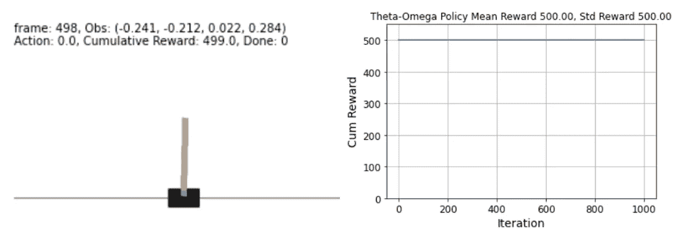
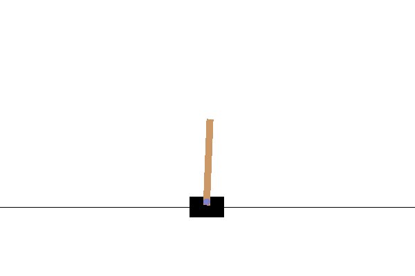
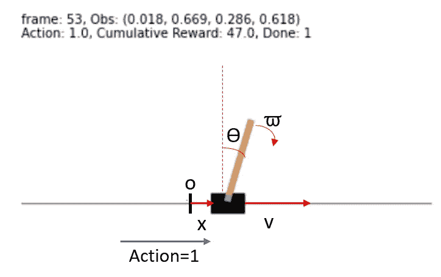
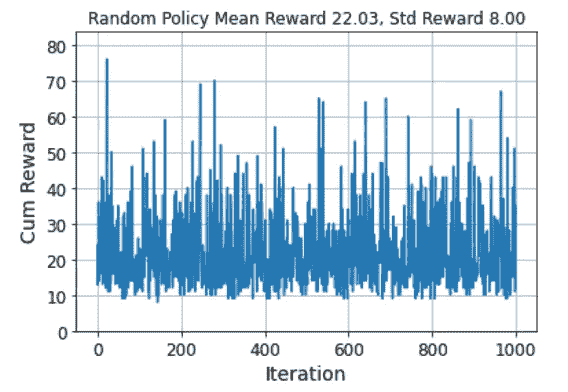
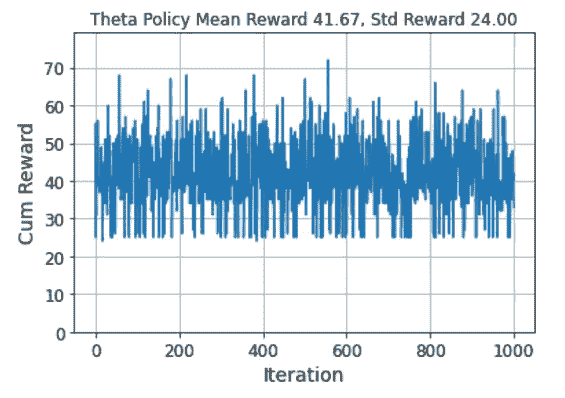
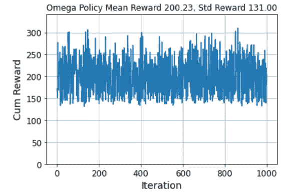
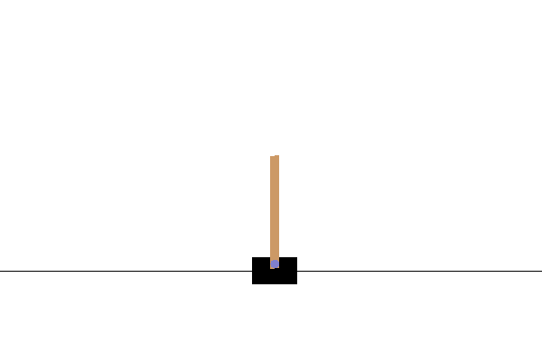
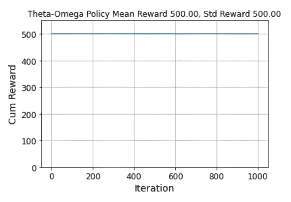
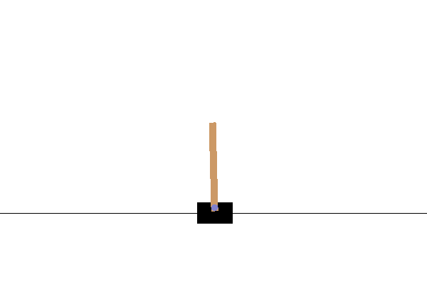

# 如何在 5 条线内打败侧手翻游戏

> 原文：<https://towardsdatascience.com/how-to-beat-the-cartpole-game-in-5-lines-5ab4e738c93f?source=collection_archive---------8----------------------->

## 没有人工智能的简单解决方案



CartPole 是一款在开放式人工智能健身房强化学习环境中的游戏。它在许多教科书和文章中被广泛用于说明机器学习的力量。然而，所有这些机器学习方法都需要大量的编码和大量的计算能力来训练。有没有更简单的解决方法？

答案是肯定的。在本文中，我将展示一个极其简单的解决方案。虽然它只有 5 行长，但它的性能优于任何常见的机器学习方法，并完全击败了 CartPole 游戏。现在我们开始吧！

# 目录

1.  车杆问题综述
2.  对一些简单政策的分析
3.  得出 5 行解决方案
4.  结论

# 横竿问题综述

翻转问题也称为“[倒立摆](https://en.wikipedia.org/wiki/Inverted_pendulum#:~:text=An%20inverted%20pendulum%20is%20a,additional%20help%20will%20fall%20over.)问题。它有一根连着手推车的杆子。由于极点的质量中心高于其支点，这是一个不稳定的系统。官方的完整描述可以在 Open-AI 网站的[这里](https://gym.openai.com/envs/CartPole-v1/)找到。

磁极以一个小扰动开始于一个直立的位置。目标是左右移动手推车，以防止杆子倒下。

以下是该系统的图解(如果你想知道如何设置 OpenAI Gym 环境并渲染这个图解，[这篇文章](/how-to-render-openai-gym-on-windows-65767ab52ae2)可以提供帮助)。



图片由作者提供，由 OpenAI Gym CartPole-v1 环境渲染

在 OpenAI CartPole 环境中，系统的状态由四个参数(x，v，θ，ω)的“**观察值**指定，其中

*   x:购物车的水平位置(正表示向右)
*   v:小车的水平速度(正意味着向右移动)
*   θ:极点和垂直位置之间的角度(正表示顺时针方向)
*   ω:极点的角速度(正表示顺时针旋转)

给定一个观察，玩家可以执行以下两个可能的**动作**中的一个:

*   0:向左推购物车
*   1:将推车推到右边

当杆偏离垂直超过 15 度(|θ| ≥ π/12 ≈0.26)时，游戏“**完成**”。在每个时间步中，如果游戏没有“完成”，那么累计“**奖励”**增加 1。游戏的目标是获得尽可能高的累积奖励。

让我们详细看看下面的例子:



观察结果:

*   x=0.018:小车在原点 O 的右侧
*   v=0.669:手推车向右移动
*   θ=0.286:极点位于垂直方向顺时针方向(0.286/2π*360≈16.4 度)
*   ω=0.618:磁极正向旋转

Action=1:玩家正在向右推车

累积奖励=47:玩家在这场游戏中成功维持了 47 个时间步

Done=1:这个游戏已经“完成”(因为|θ| > 15 度)

现在我们明白了这个设置。让我们看看如何玩这个游戏来获得高额奖励。

# 对一些简单政策的分析

在强化学习的上下文中，“策略”本质上意味着一个函数，它接受一个观察(或一系列观察)并输出一个动作。

## 随机策略

在我们尝试变聪明之前，让我们首先想象一只猴子随机地左右推动手推车，看看它的表现如何。这可以帮助我们建立一个基线。当然，它的实现非常简单:

```
def rand_policy(obs):
    return random.randint(0, 1)
```

我们将这种“随机策略”玩了 1000 次，并绘制出每次游戏的累积奖励。我们可以看到平均回报是 22.03，标准差是 8.00。



## Theta 策略

当然，我们可以做得比猴子更好。在 Géron，Aurélien 的书中:*用 Scikit-Learn、Keras 和 TensorFlow 进行机器学习(第 18 章)，*有一个非常简单的策略，只取决于极点的角度θ:

```
def theta_policy(obs):
    theta = obs[2]
    return 0 if theta < 0 else 1
```

用简单的语言来说，它说如果极点向左倾斜(θ <0), then push the cart to the left, and vice versa. Very intuitive, isn’t it? It’s indeed better than the random policy, with the mean reward almost doubled to 41.67.



And the following is one iteration to show how it performs. It indeed shows some intention to prevent the pole from falling.


One game played by the Theta Policy

## Analysis of the Theta Policy

Although better a monkey, the Theta Policy is far from satisfactory. For those with some physics backgrounds, this policy is obviously flawed. Because when the cart is pushed to the left, the pole gets a clockwise **角加速度，**而不是顺时针方向的**角速度**。这个动作的结果是磁极可以顺时针旋转，也可以逆时针旋转。此外，当极点已经向中心移动时，比如θ > 0 和ω < 0，这个动作(向右推)仍然会加速角速度向中心移动，而不是减慢角速度。因此，极点超过了中心。

基于上述力学分析，一个更合理的命题是，当杆远离垂直位置(ω<0)时，向左推动小车(action = 0)。反之亦然。由于它只取决于角速度ω，我们姑且称之为“欧米伽策略”。它的实现就像 Theta 策略一样简单:

```
def omega_policy(obs):
    w = obs[3]
    return 0 if w < 0 else 1
```

惊喜！基于一个简单的物理定律，一行字的改变就把可怜的 Theta 政策变成了赢家！这项欧米茄政策平均获得约 200 英镑的奖励！



为了欣赏这 200 个平均奖励，我们来比较一些常见的机器学习策略的平均奖励。请记住，这些机器学习策略要复杂得多，难以解释，并且需要长时间的训练才能达到这些结果:

*   时序神经网络(在盖伦的书中):大约 46
*   深度 Q 学习(在[第一篇](https://gsurma.medium.com/cartpole-introduction-to-reinforcement-learning-ed0eb5b58288#c876) ): ~130
*   深度 Q 学习(在[第二篇](https://medium.com/@siddharthkale/solving-cartpole-v1-4be909b7c2c6) ): ~200

你可以看到，我们的两行 Omega 策略的性能已经与人工智能驱动的深度 Q 学习策略不相上下，甚至更好。

[官方钢管舞网页](https://gym.openai.com/envs/CartPole-v0/)定义，如果连续 100 次测试的平均奖励>为 195，问题就“解决”了。**因此，我们的双线欧米茄政策已经解决了侧翻问题！**

# 得出 5 行解决方案

虽然简单的欧米茄政策已经解决了翻筋斗的问题，但我仍然不满意。快速可视化揭示了原因:



欧米茄政策的一次迭代

我们可以看到游戏结束不是因为杆子倒了而是因为大车偏离原点太远了。这表明该策略成功地“稳定”了极点(保持角速度ω ≈ 0)，但处于“平铺”位置(角度θ ≠ 0)。所以手推车一直朝一个方向移动。这并不奇怪，因为欧米伽策略对角度θ没有任何影响。

发现问题后，很容易提出改进的策略:

*   当角度θ“小”时，我们要*稳定* θ。这与欧米茄政策相同。
*   当角度θ“大”时，我们要*修正* θ，即给一个朝向中心的角加速度。这与 Theta 策略相同。

至于“小”和“大”的标准，还没有很好的定义。但合理的起点是 15 度“完成”阈值的 10%，即~0.026。实际上，结果对这个值并不十分敏感。从 0.02 到 0.04 的任何值都可以产生惊人的结果。以下是一个使用 0.03 作为阈值的示例:

```
def theta_omega_policy(obs):
    theta, w = obs[2:4]
    if abs(theta) < 0.03:
        return 0 if w < 0 else 1
    else:
        return 0 if theta < 0 else 1
```

这种简单的 5 线政策有多好？



答对了！杆子根本**不能**倒！一次也没有！累积奖励上限为 500 的原因只是由于 CartPol-v1 环境本身的限制——当游戏进行到 500 个时间步时，它会自动停止。换句话说，我们的θ-ω策略不仅“解决”了问题，还“打破”了游戏！

下面是这个简单的五行策略在实际行动中的表现:



θ-ω策略的一次迭代

系统设置、分析和 GIF 生成的完整记录可从 GitHub 的[这里](https://github.com/jianxu305/openai-gym-docker/blob/main/example/Solving_CartPole_in_5_Lines.ipynb)获得。

# 结论

显然，这不是人工智能练习。但是通过展示如何在 5 行中打破掷球游戏，我希望你能体会到物理定律是多么的简洁。本质上，我们利用了几千年来 ***人类*** 学习的结果，来代替 ***机器*** 学习代码，得到了一个好得多、简单得多的结果。

因此，下次我们应用任何机器学习算法时，最好先检查现有的知识。