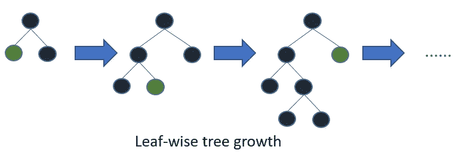
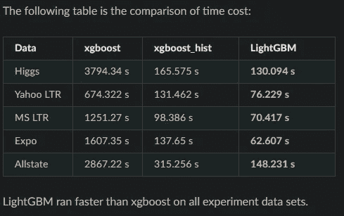
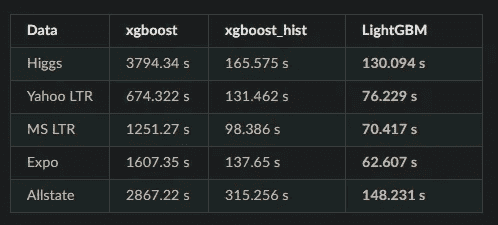
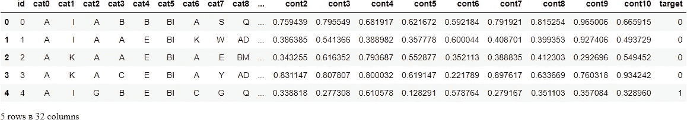
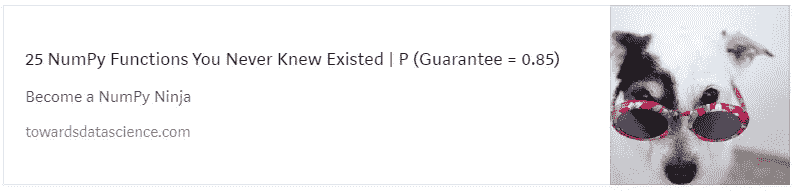
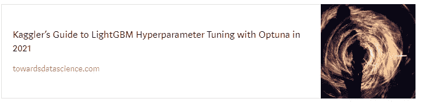

# 你错过了 LightGBM。它在各个方面都击败了 XGBoost

> 原文：<https://towardsdatascience.com/how-to-beat-the-heck-out-of-xgboost-with-lightgbm-comprehensive-tutorial-5eba52195997?source=collection_archive---------1----------------------->

## 再也不会了，XGBoost，再也不会了

在这个全面的 LightGBM 教程中学习如何碾压 XGBoost。


**照片由** [**GR 股票**](https://unsplash.com/@grstocks?utm_source=unsplash&utm_medium=referral&utm_content=creditCopyText) **上** [**Unsplash。**](https://unsplash.com/s/photos/win?utm_source=unsplash&utm_medium=referral&utm_content=creditCopyText) **除特别注明外，所有图片均为作者所有。**

我很困惑。

如此多的人被 XGBoost 吸引，就像飞蛾扑火一样。是的，它在著名的比赛中经历了一些辉煌的日子，并且它仍然是最广泛使用的 ML 库。

但是，就性能而言，XGBoost 已经 4 年没有占据头把交椅了。2017 年，微软开源了 LightGBM(光梯度增强机器)，它以 2-10 倍的训练速度提供了同样高的精度。

考虑到大规模百万行数据集的普遍存在，这是一个改变游戏规则的优势。还有其他一些区别使天平向 LightGBM 倾斜，使它比 XGBoost 更有优势。

在本文结束时，您将了解到这些优势，包括:

*   如何为分类和回归任务开发 LightGBM 模型
*   XGBoost 和 LGBM 之间的结构差异
*   如何使用提前停止和评估集
*   支持强大的分类功能，速度提升高达 8 倍
*   使用 LGBM 实现成功的交叉验证
*   使用 Optuna 进行超参数调谐(第二部分)

[](https://ibexorigin.medium.com/membership) [## 通过我的推荐链接加入 Medium-BEXGBoost

### 获得独家访问我的所有⚡premium⚡内容和所有媒体没有限制。支持我的工作，给我买一个…

ibexorigin.medium.com](https://ibexorigin.medium.com/membership) 

获得由强大的 AI-Alpha 信号选择和总结的最佳和最新的 ML 和 AI 论文:

[](https://alphasignal.ai/?referrer=Bex) [## 阿尔法信号|机器学习的极品。艾总结的。

### 留在循环中，不用花无数时间浏览下一个突破；我们的算法识别…

alphasignal.ai](https://alphasignal.ai/?referrer=Bex) 

# XGBoost 与 LightGBM

当 LGBM 发布时，它在生成决策树的方式上有了突破性的改变。

> XGBoost 和 LightGBM 都是 ensebmle 算法。他们使用一种特殊类型的决策树，也称为弱学习器，来捕捉复杂的非线性模式。

在 XGBoost(和许多其他库)中，决策树是一次构建一层的:


图片来自 LGBM 文档

这种类型的结构往往会导致不必要的节点和叶子，因为树会继续构建，直到到达`max_depth`。这导致了更高的模型复杂性和运行时培训成本。

相比之下，LightGBM 采用了一种基于叶子的方法:



图片来自 LGBM 文档

该结构随着最有希望的分支和叶子(具有最大 delta 损失的节点)继续增长，保持决策叶子的数量不变。(如果这对你来说没有意义，不要多心。这不会妨碍你有效使用 LGBM)。

这也是 LGBM 刚出来的时候在速度上碾压 XGBoost 的主要原因之一。



图片来自 LGBM 文档

上面是 XGBoost 与传统决策树和 LGBM 与叶式结构(第一列和最后一列)在大约 500k-13M 样本数据集上的基准比较。说明 LGBM 比 XGB 快几个数量级。

LGBM 还使用连续特征的 h [istogram 宁滨](https://lightgbm.readthedocs.io/en/latest/Features.html#optimization-in-speed-and-memory-usage)，这比传统的梯度提升提供了更高的速度。宁滨数值大大减少了决策树中需要考虑的分裂点的数量，并且它们消除了使用排序算法的需要，排序算法总是计算量很大。

受 LGBM 的启发，XGBoost 还引入了直方图宁滨，这带来了巨大的加速，但仍不足以与 LGBM 相媲美:



来自 LGBM 文档的图像**直方图-宁滨比较-第二列和第三列。**

我们将在接下来的章节中继续探讨这些差异。

# 模型初始化和目标

和 XGBoost 一样，LGBM 也有两个 API——核心学习 API 和 Sklearn 兼容 API。你知道我是 Sklearn 的忠实粉丝，所以本教程将重点介绍那个版本。

> XGBoost 和 LGBM 的 Sklearn 兼容 API 允许您将它们的模型集成到 Sklearn 生态系统中，以便您可以在管道中结合其他变压器使用它们。

Sklearn API 使用熟悉的`fit/predict/predict_proba`模式公开`LGBMRegressor`和`LGBMClassifier`:

`objective`指定学习任务的类型。除了常见的`binary`、`multiclass`、`regression`任务，还有其他的`poisson`、`tweedie`回归。完整的目标列表请参见文档的本节。

```
>>> reg.fit(X, y)LGBMRegressor()
```

# 控制决策树的数量

集成中决策树的数量会显著影响结果。您可以在分类器和回归器中使用`n_estimators`参数来控制它。下面，我们将在具有 1000 个决策树的 Kaggle TPS March 数据集上拟合 LGBM 二元分类器:



添加更多的树会导致更高的精度，但会增加过度拟合的风险。为了解决这个问题，你可以创建许多树(+2000)并选择一个更小的`learning_rate`(稍后会详细介绍)。

像在 XGBoost 中一样，将单个决策树与数据相匹配被称为**提升回合**。

# 提前停止

集合中的每一棵树都建立在最后一棵树的预测上，即每一轮提升都是上一轮的改进。

如果预测在一系列回合后没有改善，那么停止集合的训练是明智的，即使我们没有在`n_estimators`中硬停下来。

为此，LGBM 在`fit`函数中提供了`early_stopping_rounds`参数。例如，将其设置为 100 意味着如果预测在最后 100 轮中没有改善，我们就停止训练。

在查看代码示例之前，我们应该学习一些与早期停止相关的概念。

# 评估集和指标

只有当您将一组评估集传递给`fit`方法的`eval_set`参数时，才能启用提前停止。这些评估集用于跟踪从一轮提升到下一轮提升的预测质量:

在每一轮`n_estimators`中，单个决策树被拟合到(`X_train`，`y_train`)，并且在通过的评估集上进行预测(`X_eval`，`y_eval`)。预测的质量通过`eval_metric`中的合格指标来衡量。

训练在第 738 次迭代时停止，因为自第 638 次迭代以来验证分数没有提高——提前停止 100 轮。现在，我们可以随心所欲地创建任意多的树，并且可以丢弃不必要的树。

# 建立基线

让我们用目前已知的信息建立一个基准分数。我们将对 XGBoost 进行同样的操作，以便我们可以比较结果:

LGBM 在大约 4 倍的运行时间内实现了较小的损失。在我们继续交叉验证之前，让我们看看最后一个 LGBM 技巧。

# 分类和缺失值支持

LGBM 中的直方图宁滨内置了对缺失值和分类特征的处理支持。TPS March 数据集包含 19 个类别，到目前为止，我们一直在使用一次性编码。

这一次，我们将让 LGBM 处理类别，并再次将结果与 XGBoost 进行比较:

要指定分类特性，请将它们的索引列表传递给`fit`方法中的`categorical_feature`参数:

> 如果在使用 LGBM 时使用`pandas.Categorical`数据类型，可以实现高达 8 倍的速度提升。


该表显示了两个模型的最终得分和运行时间。如您所见，使用默认分类处理的版本在准确性和速度上都胜过了其他版本。干杯！

# 使用 LightGBM 进行交叉验证

用 LGBM 做 CV 最常见的方法是使用 Sklearn CV 分割器。

我不是在谈论像`cross_validate`或`cross_val_score`这样的效用函数，而是像`KFold`或`StratifiedKFold`这样的分裂器和它们的`split`方法。这样做 CV，让你对整个过程有更多的掌控。

> 我已经多次谈到交叉验证的重要性。你可以阅读[这篇文章](/6-sklearn-mistakes-that-silently-tell-you-are-a-rookie-84fa55f2b9dd?source=your_stories_page-------------------------------------)了解更多详情。

此外，它使您能够在交叉验证期间以一种轻松的方式使用早期停止。下面是 TPS 三月份数据的样子:

首先，创建一个 CV 分解器——我们选择`StratifiedKFold`,因为这是一个分类问题。然后，使用`split`循环每个训练/测试组。在每一次折叠中，初始化并训练一个新的 LGBM 模型，并可选地报告分数和运行时间。就是这样！大多数人都是这样做 CV 的，包括在 Kaggle 上。

# 结论

在这篇文章中，我们学习了 LightGBM 的纯建模技术。接下来，我们将探索如何使用 Optuna 充分利用 LGBM 模型的性能。

具体来说，本文的第二部分将包括最重要的 LGBM 超参数的详细概述，并介绍一个经过良好测试的超参数调优工作流程。它已经出来了—在这里阅读它[。](/kagglers-guide-to-lightgbm-hyperparameter-tuning-with-optuna-in-2021-ed048d9838b5?source=your_stories_page-------------------------------------)


# 您可能也会感兴趣…

[](https://towardsdatascience.com/25-numpy-functions-you-never-knew-existed-p-guarantee-0-85-64616ba92fa8)[](https://towardsdatascience.com/kagglers-guide-to-lightgbm-hyperparameter-tuning-with-optuna-in-2021-ed048d9838b5?source=your_stories_page-------------------------------------)[](/tired-of-cliché-datasets-here-are-18-awesome-alternatives-from-all-domains-196913161ec9) [## 厌倦了陈词滥调的数据集？以下是来自所有领域的 18 个令人敬畏的选择

### 编辑描述

towardsdatascience.com](/tired-of-cliché-datasets-here-are-18-awesome-alternatives-from-all-domains-196913161ec9) [](/love-3blue1brown-animations-learn-how-to-create-your-own-in-python-in-10-minutes-8e0430cf3a6d) [## 喜欢 3Blue1Brown 动画？了解如何在 10 分钟内用 Python 创建自己的

### 编辑描述

towardsdatascience.com](/love-3blue1brown-animations-learn-how-to-create-your-own-in-python-in-10-minutes-8e0430cf3a6d) [](/7-cool-python-packages-kagglers-are-using-without-telling-you-e83298781cf4) [## Kagglers 正在使用的 7 个很酷的 Python 包

### 编辑描述

towardsdatascience.com](/7-cool-python-packages-kagglers-are-using-without-telling-you-e83298781cf4)