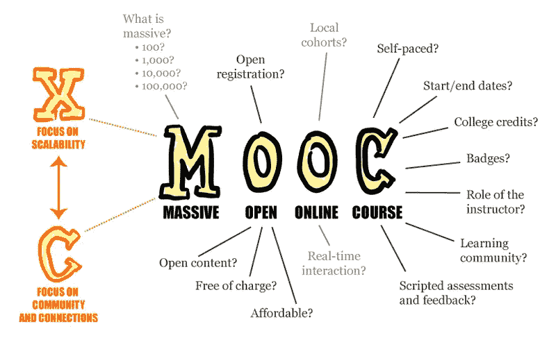
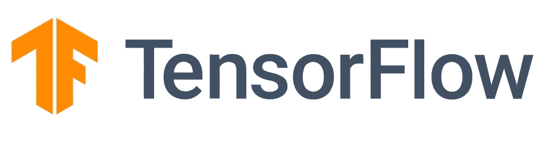
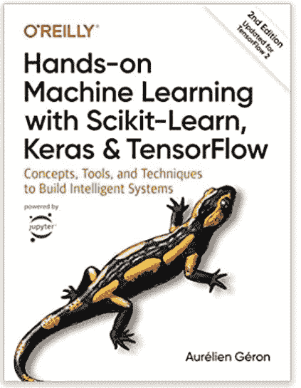

# 2021 年如何成为计算机视觉工程师

> 原文：<https://towardsdatascience.com/how-to-become-a-computer-vision-engineer-in-2021-c563545d4c9a?source=collection_archive---------3----------------------->

## 意见和建议

## 排名第一的大规模开放式在线课程(MOOCs)

图多尔·巴休在 [Unsplash](https://unsplash.com/s/photos/coding?utm_source=unsplash&utm_medium=referral&utm_content=creditCopyText) 上的照片

我在 2020 年才成为一名专业的计算机视觉工程师，但我用来进入机器学习行业的步骤和策略在短时间内发生了剧烈的变化。

> 人工智能以创新的速度前进

你可能不会对人工智能行业的不断变化感到惊讶，因为你很清楚人工智能以创新的速度前进。

我的观点是，在 2020 年对大多数 ML 从业者有效的获得角色的方法，在 2021 年可能不一定有效。我们都需要适应。

这篇文章将介绍八种方法，你今天可以探索和使用，以开始你成为计算机视觉工程师的道路。

# 1.大规模开放在线课程(MOOCs)

[MOOC 海报 2013 年 4 月 4 日，作者 Mathieu Plourde，在 Flickr 上获得 CC-BY 许可，探索了“大规模开放在线课程”即 MOOC](https://commons.wikimedia.org/wiki/File:MOOC_poster_mathplourde.png#/media/File:MOOC_poster_mathplourde.png)的含义

MOOCs 是 2008 年推出的一种现代学习工具，目前是数据科学家和机器学习从业者获得领域专业知识的首选方法，通常伴随着公认的认证和证书。

在大多数情况下，MOOCs 比通过学术机构和大学学习的传统方法要便宜得多。通过折扣和支付计划为学生提供资金支持的 MOOCs 并不少见。

与学术机构相比，MOOCs 的另一个优势是在适合你的时间灵活地参加课程、在线课程和考试，而不是严格的时间表和考试时间分配。

> “教育不是减少群体数量。教育就是要帮助每个学生成功。”
> 
> —吴恩达

互联网上有大量与计算机视觉相关的 MOOCs 你可能面临的主要障碍是选择满足你需求的合适的在线课程。

我建议，首先观察求职者对技能和技术的要求，然后反向选择合适的在线课程。

**以下是一些 MOOCs 的链接:**

*   [*成为计算机视觉专家*](https://www.udacity.com/course/computer-vision-nanodegree--nd891)
*   [*深度学习专精*](https://www.coursera.org/specializations/deep-learning)
*   [*带 TensorFlow 的高级计算机视觉*](https://www.coursera.org/learn/advanced-computer-vision-with-tensorflow)
*   [*深度学习 TensorFlow 简介*](https://www.udacity.com/course/intro-to-tensorflow-for-deep-learning--ud187)
*   [*deep learning AI tensor flow 开发者职业证书*](https://www.coursera.org/professional-certificates/tensorflow-in-practice)
*   [*计算机视觉简介*](https://www.udacity.com/course/introduction-to-computer-vision--ud810)
*   [*计算机视觉基础知识*](https://www.coursera.org/learn/computer-vision-basics)
*   [*程序员实用深度学习*](https://course.fast.ai/)

有很多 MOOCs，但在搜索时，要考虑以下因素:工作相关性、技术需求、时间长度、课程回顾和成本。

mooc 不仅仅是为初学者设计的，经验丰富的 ML 从业者和深度学习工程师参加特定计算机视觉相关主题的中级和高级 mooc，以提高技能或获得领域专业知识。

在 2021 年，速度、适用性和实用性是 ML 从业者的主要关注点。为了从机器学习的学生过渡到专业人士，选修 MOOCs 以专注于 ML 的实践方面，而不是大学教授的理论内容，可能是一个节省时间和成本的决定。

> 请注意，在大学获得高级学位是有好处的，你应该在做出职业决定之前进行自己的深入研究。

# 2.机器学习库和框架

作为一个领域，计算机视觉包含许多方法和技术来解决常见的 CV 问题，如对象检测、人脸识别、姿态估计等。

通常不指望你重新发明轮子或开发新算法来解决琐碎的计算机视觉任务(*除非你在研究*中工作)。你在学习和职业生涯中会用到的许多工具都可以通过 ML 库和框架获得。

ML 库和框架为 ML 从业者提供了一套工具来实现、培训、测试和部署计算机视觉解决方案。有流行的工具和库，如 [TensorFlow](https://www.tensorflow.org/) 和 [PyTorch](https://pytorch.org/) ，还有其他的如 [FastAI](https://www.fast.ai/) ， [Caffe2](https://caffe2.ai/) ， [Keras](https://keras.io/) ， [Scikit-Learn，](https://scikit-learn.org/) [MXnet](https://mxnet.apache.org/versions/1.7.0/) ， [Darknet](https://pjreddie.com/darknet/) 等。

左: [TensorFlow Logo](https://www.tensorflow.org/) 右: [PyTorch Logo](https://pytorch.org/)

ML 行业似乎已经决定将 TensorFlow(Keras)和 PyTorch 作为行业标准。作为一名计算机视觉工程师，我广泛使用 TensorFlow 平台为不同的环境开发 ML 模型。

**这里有一个典型的清单，当你学习一个 ML 库的时候，你可以用它作为指导:**

*   *为训练构建和加载数据集*
*   *预处理各种形式的数据集(文本、图像、数值)*
*   *执行数据扩充*
*   *从头开始实现一个神经网络*
*   *从零开始实现深度神经网络*
*   *实现网络定制培训流程*
*   *利用各种网络架构进行图像分类*
*   *用于迁移学习的负载模型*
*   *从头开始实现神经网络中的自定义层、删除层和公共层*
*   *训练深度学习模型*
*   *用 TensorBoard 监控训练过程*
*   *保存并加载一个训练好的模型。*

> 注意:上面的列表并没有包含你需要知道的所有内容，事实上，我怀疑我已经触及了你应该涵盖的 20%，以确保你为一个专业的简历工程师角色做好准备。尽管如此，上面的列表只是一个指南，你可以随意添加和修改。

# 3.读书

要在 2021 年及以后成为一名计算机视觉工程师，你必须参考实用的机器学习和计算机视觉书籍作为学习资源。

一个计算机视觉工程师从来不会停止学习，主要是因为人工智能领域每天都在进步。

在保持职业生涯的同时，与学生在同一水平学习的 ML 从业者很常见。我知道这一点，因为我是那些仍然必须阅读书籍、博客、研究论文和文章的 ML 从业者之一，以确保我不会落后于 ML 行业。

向 CV 工程师强烈推荐的书籍之一是 Aurélien Géron 的[用 Scikit-Learn、Keras、& TensorFlow](https://www.amazon.co.uk/Hands-Machine-Learning-Scikit-Learn-TensorFlow/dp/1492032646/ref=asc_df_1492032646/?tag=googshopuk-21&linkCode=df0&hvadid=375498709181&hvpos=&hvnetw=g&hvrand=1143386579022559631&hvpone=&hvptwo=&hvqmt=&hvdev=c&hvdvcmdl=&hvlocint=&hvlocphy=9045885&hvtargid=pla-523968811896&psc=1&th=1&psc=1&tag=&ref=&adgrpid=76471991426&hvpone=&hvptwo=&hvadid=375498709181&hvpos=&hvnetw=g&hvrand=1143386579022559631&hvqmt=&hvdev=c&hvdvcmdl=&hvlocint=&hvlocphy=9045885&hvtargid=pla-523968811896) 进行机器实践学习。这本书适用于所有 ML 实践者，从数据科学家到 NLP 工程师

[用 Scikit-Learn、Keras、& TensorFlow](https://www.amazon.co.uk/Hands-Machine-Learning-Scikit-Learn-TensorFlow/dp/1492032646/ref=asc_df_1492032646/) 进行动手机器学习

我明确地试图让你明白，阅读实用书籍应该是你正在进行的个人学习策略的一部分。

假设你在你选择的领域中发现了你可能缺乏专业知识的特定领域，无论是数学、统计、编程还是算法。在这种情况下，有大量的实用书籍，易于遵循，对所有不同水平的 ML 从业者都有效。

# 4.云服务

*计算机视觉工程师应该了解云服务吗？*

是的，但你不需要成为专家，云计算和数据工程师的唯一职责就是专注于云计算解决方案和服务。

尽管如此，CV 工程师了解如何在云服务上运行机器学习模型是必不可少的，例如 [GCP](https://cloud.google.com/) 、[微软 Azure](https://azure.microsoft.com/en-gb/) 和 [AWS](https://aws.amazon.com/) 。

**以下是 CV 工程师应该了解和利用云服务的一些原因:**

1.  **计算资源可用性。**训练深度学习模型可能会很昂贵，尤其是如果你必须购买价值数千美元的工作站和机器。云服务提供不同计算规格的 GPU 来运行特定的作业。这些计算机资源按小时收费。
2.  **远程访问共享工作区。**大多数团队利用在线开发环境的云服务产品来确保每个团队成员都能访问远程工作区和资源。
3.  **现成的解决方案和训练有素的模型**。
4.  **通过 API 等为机器学习模型服务的平台。**

使用云服务可能会令人望而生畏，有时会出乎意料地昂贵— *尤其是如果您忘记关闭实例*。就技能组合而言，拥有云服务知识确实会让你在行业内的简历工程师中名列前茅。

# 5.证书

我不是指参加在线课程时获得的证书或认证。有给 ML 从业者的认证，可以显示在某些库、云服务和框架方面的专业知识。

TensorFlow、AWS 和 GCP 都是我在本文中提到的工具和资源。另一个信息是，提供这些工具和服务的公司和组织也颁发认可的证书。

几年前，拥有一个拥有高级学位的投资组合就足以获得 ML 职位。随着越来越多的 ML 从业者涌入，招聘人员和雇主使用认证来筛选候选人似乎是合理的。

**以下是与洗钱从业者相关的认证清单:**

*   [*TensorFlow 开发者证书*](https://www.tensorflow.org/certificate)
*   [*谷歌云 ML 工程师证书*](https://cloud.google.com/certification/machine-learning-engineer)
*   [*AWS 认证机器学习专业*](https://aws.amazon.com/certification/certified-machine-learning-specialty/)
*   [*谷歌云专业数据工程师*](https://cloud.google.com/certification/data-engineer)
*   [*谷歌云协理云工程师*](https://cloud.google.com/certification/cloud-engineer)
*   [*深度学习。AI TensorFlow 开发者职业证书*](https://www.coursera.org/professional-certificates/tensorflow-in-practice)

***从这一点开始，成为一名计算机视觉工程师的章节包含了显而易见的信息。不过，有些内容你会觉得很有价值。***

# 6.深度学习

深度学习是一个与利用深度人工神经网络来检测数据中的模式有关的领域。

计算机视觉工程师通常利用深度学习模型来解决 CV 任务。说 CV 工程师必须理解 DL 领域内的基本概念和思想是轻描淡写的。

2021 年，深度学习将从主要利用卷积神经网络作为模型的构建模块，转向最近推出的 Transformer 架构。

这很可能不是一项工作要求，即 ML 从业者了解如何实现和利用计算机视觉任务的变压器— *主要是因为这仍然是一个研究领域。*

一些积极主动的 ML 实践者现在正在探索变压器，并了解它们是如何实现和应用的。

# 7.移动和边缘设备

Instagram、抖音、YouTube、脸书……这些都是拥有移动应用的公司，你会发现它们以某种形式或方式利用了 ML 模型。

2021 年，计算机视觉工程师必须了解能够在移动环境中开发和集成模型的工具和框架。

**CV 工程师应该了解几个平台、工具和框架，下面是几个:**

*   [tensor flow Lite](https://www.tensorflow.org/lite)
*   [*CoreML*](https://developer.apple.com/documentation/coreml)
*   [*苹果愿景框架*](https://developer.apple.com/documentation/vision)
*   [*张量流-反应*](https://blog.tensorflow.org/2020/02/tensorflowjs-for-react-native-is-here.html)
*   [*CreateML*](https://developer.apple.com/machine-learning/create-ml/)

了解计算机视觉和深度学习在移动环境中的应用的一个有用的学习资源是《云的实用深度学习[、移动&边缘](https://www.amazon.co.uk/Practical-Learning-Cloud-Mobile-Hands/dp/149203486X) 这本书。

# 8.编程语言

任何形式的软件工程职业都需要了解至少一种编程语言。

通常，计算机视觉工程师精通 Python。你很可能会发现，在大多数机器学习相关的工作岗位中，Python 是最受欢迎的编程语言。

2021 年，CV 工程师将需要至少掌握一门语言的专业知识，并在另外两到三门语言方面处于中级水平。

这是因为深度学习模型在不同的平台和环境中使用。这些环境中的每一个都利用其他核心编程语言来执行功能和操作。

我目前正在移动环境中集成深度学习模型，这要求我精通 Python、JavaScript 和 Swift。2021 年，我将扩展我的编程语言技能，包括 Kotlin 和 Java。

这里的诀窍是不要把一种语言中所有可用的语法都塞进去，然后继续学习下一种语言。相反，更重要的是理解面向对象编程的基本原则和大多数编程语言中使用的编码模式。

# 结论

对计算机视觉/深度学习工程师的需求很可能会随着更多面向相机的人工智能应用的采用而增加。

为了成为 CV 工程师，ML 从业者需要学习的内容可能非常多，但是一旦你开始学习，完成一些 MOOCs，并获得核心 ML 库，你会发现学习变得越来越容易。

在这篇文章中，我提出了八种方法，你可以在 2021 年成为一名 CV 工程师。概括地说，下面是一个总结列表:

*1。参加在线课程，以获得专业知识或提高知识。*

*2。使用机器库和框架。*

*3。阅读实用的 ML/DL 书籍*

*4。了解云服务，如 GCP、AWS 等*

*5。考虑获得某些工具和库的认证*

*6。了解深度学习基础知识*

*7。选择能够在移动环境中集成深度学习模型的工具、库和框架。*

*8。理解编程模式和原则，比如面向对象的编程。*

# 愿意更进一步吗？

随着生产中机器学习模型的数量增加，开发可靠、安全和可靠的基础设施的需求也在增加。机器学习操作(MLOps)是将软件开发和部署实践采用到机器学习工作流中的原则，以便于再现性、可追溯性和部署。

Neptune.ai 是一个平台，它将自己作为 MLOps 和开发一个强大的机器学习应用程序所涉及的许多过程中的一个过程的解决方案。更具体地说，Neptune.ai 帮助注册从机器学习管道和工作流中产生的元数据。有关该系统如何应用于计算机视觉的更多信息，请访问以下链接:

 [## 为计算机视觉构建 MLOps 流水线:图像分类任务[教程] - neptune.ai

### Vaswani 及其团队在 2018 年推出的变形金刚带来了研究领域的重大变革…

海王星. ai](https://neptune.ai/blog/mlops-pipeline-for-computer-vision-image-classification) 

**感谢阅读 **

# 想要更多吗？

1.  [**成为推荐媒介会员，支持我的写作**](https://richmondalake.medium.com/membership)
2.  [**订阅**](https://richmondalake.medium.com/subscribe) 在我发布文章时得到通知
3.  通过 [**LinkedIn**](https://www.linkedin.com/in/richmondalake/) 联系我
4.  跟我学学 [**奥赖利**](https://www.oreilly.com/live-events/practical-introduction-to-the-world-of-computer-vision-and-deep-learning-with-tensorflow-keras/0636920060577/0636920060576/)